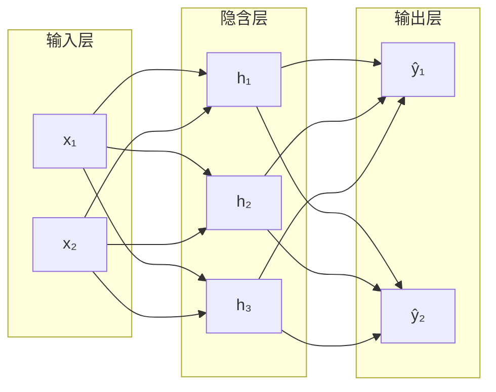
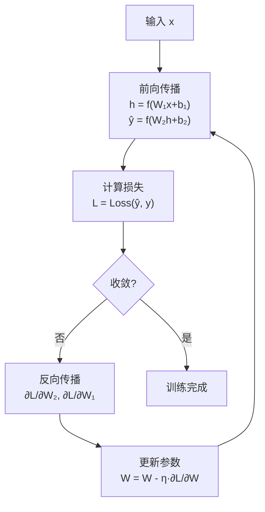
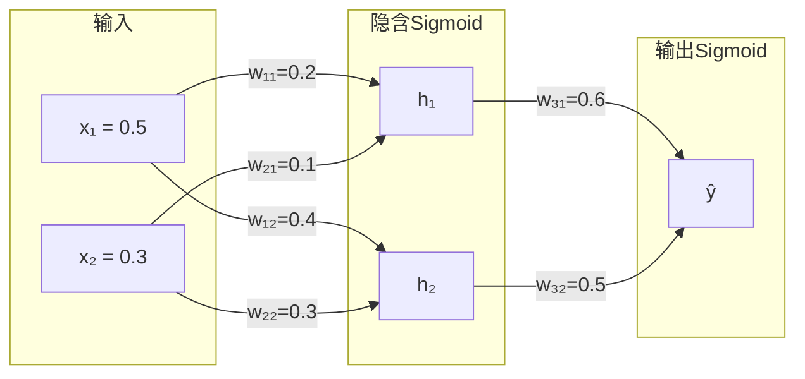
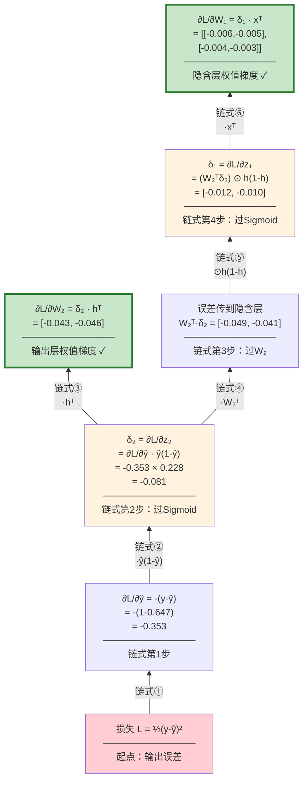
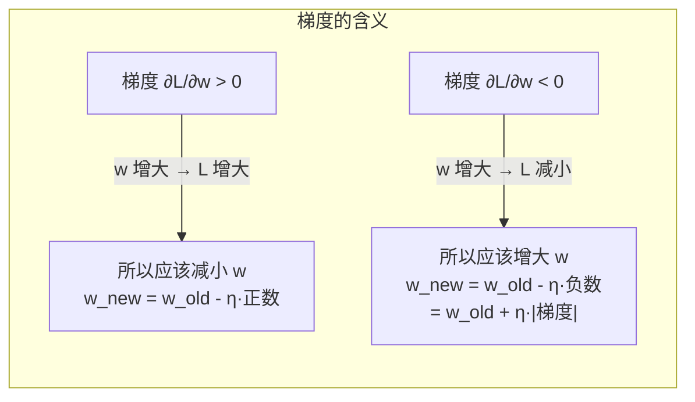

# BP 神经网络与反向传播

## 定义

**BP（Back Propagation，误差反向传播）** 不是一种网络结构，而是一种**训练多层神经网络的算法**。它由两个对称过程组成：前向传播（输入→输出，计算预测）和反向传播（输出→输入，传播误差梯度并更新参数）。Rumelhart、Hinton 和 Williams 于 1986 年系统提出，是神经网络发展的里程碑。

> 现代绝大多数深度网络（CNN、RNN、Transformer）都使用 BP 或其变体进行训练。

## 为什么需要 BP？

在 BP 之前，多层网络的训练是一个难题。感知机只能训练单层，多层网络的中间层参数无法直接获得"正确答案"——我们只知道最终输出对不对，不知道中间层应该输出什么。

**BP 解决的核心问题**：如何将输出层的误差"分配"给网络中的每一个参数？答案：用链式法则沿网络反向传播梯度。

## 核心原理

### 1. BP 网络拓扑

标准三层结构（可扩展为多层）：



- **层间全连接**，无层内连接，无跨层连接
- 信号单向前向流动（前馈网络）

### 2. 前向传播（Forward Propagation）

输入数据逐层前传，每层做"线性变换 + 非线性激活"：

$$\begin{aligned} h &= f(W_1 x + b_1) \\ \hat{y} &= f(W_2 h + b_2) \end{aligned}$$

整个网络本质上是一个复合函数：$\hat{y} = f(W_2 \cdot f(W_1 x + b_1) + b_2)$

### 3. 损失函数

损失函数度量"预测值 $\hat{y}$ 和真实值 $y$ 差多远"。训练的目标就是**最小化损失**。

| 损失函数 | 公式 | 适用场景 |
|---------|------|---------|
| 均方误差 (MSE) | $L = \frac{1}{2}(y - \hat{y})^2$ | 回归（预测连续值） |
| 交叉熵 | $L = -[y\log\hat{y} + (1-y)\log(1-\hat{y})]$ | 二分类（预测 0/1） |

> 💡 **MSE 为什么有个 $\frac{1}{2}$？** 纯为了方便。求导时 $\frac{d}{d\hat{y}}[\frac{1}{2}(y-\hat{y})^2] = -(y-\hat{y})$，系数 $\frac{1}{2}$ 刚好消掉了平方展开后出来的 2，让梯度表达式更干净。去掉也不影响优化方向，只是步长变化。详见下方数值实例中的推导。

### 4. 梯度下降

沿**负梯度方向**更新参数，逐步减小损失：

$$w_{\text{new}} = w_{\text{old}} - \eta \cdot \frac{\partial L}{\partial w}$$

> 完整解释（梯度的几何含义、为什么是"减"、BGD/SGD/Mini-batch 变体、学习率策略）→ 详见 [梯度下降](/articles/ai-ml/deep-learning/concepts/梯度下降/)

### 5. 链式法则

若 $L = L(\hat{y})$, $\hat{y} = f(z)$, $z = W \cdot h$，则：

$$\frac{\partial L}{\partial W} = \frac{\partial L}{\partial \hat{y}} \cdot \frac{\partial \hat{y}}{\partial z} \cdot \frac{\partial z}{\partial W}$$

> 完整解释（简单例子手算、多元函数推广、在 NN 中的依赖链图示、与反向传播的关系）→ 详见 [链式法则](/articles/ai-ml/deep-learning/concepts/链式法则/)

### 6. 反向传播完整推导

以 MSE 损失 + Sigmoid 激活的三层网络为例（$x \to h \to \hat{y}$）：

**输出层梯度**：

$$\delta_2 = \frac{\partial L}{\partial z_2} = -(y - \hat{y}) \cdot \hat{y}(1 - \hat{y})$$

$$\frac{\partial L}{\partial W_2} = \delta_2 \cdot h^T$$

**隐含层梯度**：

$$\delta_1 = (W_2^T \delta_2) \odot h(1-h)$$

$$\frac{\partial L}{\partial W_1} = \delta_1 \cdot x^T$$

**参数更新**：

$$W_2 \leftarrow W_2 - \eta \cdot \frac{\partial L}{\partial W_2}, \quad W_1 \leftarrow W_1 - \eta \cdot \frac{\partial L}{\partial W_1}$$

> ⚠️ **易错点**：反向传播流经网络的是**误差梯度**，不是输入数据。每一层计算自己的局部梯度 $\delta$，用它更新该层参数。

## 完整训练流程



## 数值实例：手算一遍完整的 BP 训练

下面用一个人造的简单网络，从**前向传播**到**反向传播**到**参数更新**，每一步都拆开讲清楚。读完这个例子，你对"偏导数怎么求""负梯度为什么减""参数往哪更新"就不再有疑问。

### 网络结构

```
输入层 (2)      隐含层 (2)       输出层 (1)
                                 
  x₁=0.5 ── w₁₁=0.2 ──→ h₁ ── w₃₁=0.6 ──→ ŷ
     │                 ↗  │               
     │   w₁₂=0.4      ╱   │              
     └──────────────→    ╱    w₃₂=0.5     
     │              h₂ ←┘                
     │   w₂₁=0.1   ↗                     
     │            ╱                      
  x₂=0.3 ── w₂₂=0.3                     
```



**已知条件**：

| 项目 | 值 |
|------|-----|
| 输入 | $x = [0.5,\; 0.3]$ |
| 真实标签 | $y = 1$ |
| 损失函数 | MSE：$L = \frac{1}{2}(y - \hat{y})^2$ |
| 激活函数 | Sigmoid：$\sigma(x) = \frac{1}{1+e^{-x}}$ |
| 学习率 | $\eta = 0.5$ |
| 偏置 | 全部简化为 $0$（让注意力集中在权重上） |

**初始权值矩阵**：

$$W_1 = \begin{bmatrix} 0.2 & 0.4 \\ 0.1 & 0.3 \end{bmatrix} \quad\text{(2×2，连接输入层→隐含层)}$$

$$W_2 = \begin{bmatrix} 0.6 & 0.5 \end{bmatrix} \quad\text{(1×2，连接隐含层→输出层)}$$

> 💡 $W_1$ 的读法：行 = 隐含层节点编号，列 = 输入节点编号。如 $w_{21}=0.1$ 表示输入 $x_1$ 连到隐含节点 $h_2$ 的权值。

---

### 第一步：前向传播（算出预测值）

#### 隐含层净输入 $z_1$

每个隐含节点的净输入 = 所有输入 × 对应权值之和：

$$\begin{aligned} z_1^{(1)} &= w_{11} \cdot x_1 + w_{21} \cdot x_2 = 0.2 \times 0.5 + 0.1 \times 0.3 = 0.10 + 0.03 = \mathbf{0.13} \\ z_1^{(2)} &= w_{12} \cdot x_1 + w_{22} \cdot x_2 = 0.4 \times 0.5 + 0.3 \times 0.3 = 0.20 + 0.09 = \mathbf{0.29} \end{aligned}$$

> 矩阵形式：$z_1 = W_1 x = [0.13,\; 0.29]^T$

#### 隐含层输出 $h$（过 Sigmoid）

$$h_1 = \sigma(0.13) = \frac{1}{1+e^{-0.13}} \approx \mathbf{0.532}$$

$$h_2 = \sigma(0.29) = \frac{1}{1+e^{-0.29}} \approx \mathbf{0.572}$$

> 记下来备用：$h_1(1-h_1) = 0.532 \times 0.468 \approx 0.249$，$h_2(1-h_2) = 0.572 \times 0.428 \approx 0.245$

#### 输出层净输入 $z_2$

$$z_2 = w_{31}h_1 + w_{32}h_2 = 0.6 \times 0.532 + 0.5 \times 0.572 = 0.319 + 0.286 = \mathbf{0.605}$$

#### 最终预测 $\hat{y}$

$$\hat{y} = \sigma(0.605) = \frac{1}{1+e^{-0.605}} \approx \mathbf{0.647}$$

> 记下来备用：$\hat{y}(1-\hat{y}) = 0.647 \times 0.353 \approx 0.228$

#### 损失 $L$ — 均方误差 (MSE)

##### MSE 是什么？

均方误差（Mean Squared Error）是最直观的损失函数：**把预测值和真实值的差距平方，再取平均**。完整形式是：

$$L_{\text{MSE}} = \frac{1}{n}\sum_{i=1}^{n}(y_i - \hat{y}_i)^2$$

本例中只有 1 个样本（$n=1$），所以简化为 $(y - \hat{y})^2$。

##### 为什么要平方？

| 不平方会怎样            | 平方之后                       |
| ----------------- | -------------------------- |
| 误差有正有负，加起来会互相抵消   | 所有误差都变成正数，不会抵消             |
| 大误差和小误差的"惩罚"只差线性倍 | 大误差被**放大**（平方），模型被迫优先修正大偏差 |

##### 那个 $\frac{1}{2}$ 是怎么回事？

本例的 MSE 写作 $\frac{1}{2}(y-\hat{y})^2$ 而不是 $(y-\hat{y})^2$。**这个 $\frac{1}{2}$ 是人为加进去的，目的只有一个——求导时消掉平方的 2**：

$$\frac{\partial}{\partial \hat{y}}\left[\frac{1}{2}(y - \hat{y})^2\right] = \frac{1}{2} \cdot 2(y - \hat{y}) \cdot (-1) = -(y - \hat{y})$$

$$\frac{\partial}{\partial \hat{y}}\left[(y - \hat{y})^2\right] = 2(y - \hat{y}) \cdot (-1) = -2(y - \hat{y})$$

> 两者的梯度**方向相同**（都是 $-(y-\hat{y})$ 的倍数），只是幅度差了 2 倍——这可以通过调节学习率 $\eta$ 来补偿。所以加不加 $\frac{1}{2}$ 对优化**没有本质影响**，纯粹是为了让公式好看。

##### 实质：损失 = 误差的几何距离

MSE 的几何含义：**预测值到真实值的欧氏距离的平方**。

```
   预测值 ŷ=0.647          真实值 y=1
      ↓                      ↓
0 ————————————————|——————————|——→
                  ←— 0.353 —→
                  
          L = ½ × (0.353)² = 0.062
```

这是一个正数，越小表示预测越准。0.062 本身没有绝对含义——你只需要知道 **0.062 → 往 0 的方向优化**。

##### 带入数值

$$L = \frac{1}{2}(1 - 0.647)^2 = \frac{1}{2} \times 0.353^2 = \frac{1}{2} \times 0.125 \approx \mathbf{0.062}$$

**此时网络的状态**：预测值 0.647，离真实值 1 还差 0.353。损失 0.062 是目前"错误程度"的度量。下面用反向传播来计算如何调整每个权值，让损失变小。

##### MSE 的导数（为反向传播做准备）

这是反向传播的起点——损失对预测值的偏导数：

$$\frac{\partial L}{\partial \hat{y}} = -(y - \hat{y}) = -(1 - 0.647) = \mathbf{-0.353}$$

> 🎯 **这个值的物理意义**：$\hat{y}$ 目前是 0.647，而真实值是 1。梯度 $-0.353$ 是负数，意味着"把 $\hat{y}$ 调大，损失会减小"——这和我们直觉完全一致。**梯度指向损失增大的方向，所以要往反方向（负梯度）走。**

---

### 第二步：反向传播（逐层计算梯度）

#### 预备知识：梯度与链式法则

反向传播的目标是为每个参数算出一个**梯度** $\frac{\partial L}{\partial w}$——"如果我只调这个参数一点点，损失会怎么变？"

> ⛰️ 梯度是函数曲线的切线斜率。斜率 > 0 → 减小参数；斜率 < 0 → 增大参数。详见 [梯度下降](/articles/ai-ml/deep-learning/concepts/梯度下降/)

但 $L$ 和 $w_{31}$ 之间隔着好几层函数，不能直接求导——需要**链式法则**把它们串起来：

$$\frac{\partial L}{\partial w_{31}} = \frac{\partial L}{\partial \hat{y}} \cdot \frac{\partial \hat{y}}{\partial z_2} \cdot \frac{\partial z_2}{\partial w_{31}}$$

> 详细推导（含简单例子 $L=(t-5)^2, t=3x+2$ 的手算 + NN 依赖链图）→ 详见 [链式法则](/articles/ai-ml/deep-learning/concepts/链式法则/)

---

#### 回到直觉

现在可以更准确地表述：

> **梯度告诉每个参数一件事**："如果我把你调大一点点，损失会变大还是变小？变多少？"
>
> - 梯度 > 0 → 调大参数 → 损失增大（所以应该**减小**参数）
> - 梯度 < 0 → 调大参数 → 损失减小（所以应该**增大**参数）

下面的计算图把链式法则在 BP 网络中的每一步梯度流动画了出来：



> 🟢 绿色节点（加粗边框）= **最终要用的梯度**，直接用于更新 $W_2$ 和 $W_1$
> 🟠 橙色节点 = **中间传递的局部梯度**（$\delta$），是链式法则的中间乘积
>
> 顺着红色箭头从下往上读，每一步都是一次链式法则的应用。下面逐条拆解。

---

#### 2.1 输出层梯度

**① 损失对预测值的偏导**：

$$\frac{\partial L}{\partial \hat{y}} = \frac{\partial}{\partial \hat{y}}\left[\frac{1}{2}(y - \hat{y})^2\right] = -(y - \hat{y}) = -(1 - 0.647) = \mathbf{-0.353}$$

> 📖 这个值叫**残差**（residual）。负号表示："预测值 0.647 比真实值 1 小了，应该往大调。"

**② 输出层的 $\delta_2$**（损失对输出层净输入的偏导）：

$$\delta_2 = \frac{\partial L}{\partial z_2} = \frac{\partial L}{\partial \hat{y}} \cdot \frac{\partial \hat{y}}{\partial z_2}$$

这步用了**链式法则**：损失 → 预测值 → 净输入。Sigmoid 的导数 $\frac{\partial \hat{y}}{\partial z_2} = \hat{y}(1-\hat{y})$：

$$\delta_2 = -(y - \hat{y}) \cdot \hat{y}(1 - \hat{y}) = -0.353 \times 0.228 \approx \mathbf{-0.081}$$

> 💡 **$\delta_2$ 的含义**：把 $z_2$ 调大 1，损失大约减小 0.081。因为 $\delta_2 < 0$，所以要**增大** $z_2$ → 也就是增大 $W_2$ 的各个分量。

**③ 输出层权值的梯度**：

每个输出层权值 $w_{3j}$ 的梯度 = $\delta_2$ × 该权值对应的隐含层输出：

$$\frac{\partial L}{\partial z_2} \cdot \frac{\partial z_2}{\partial w_{3j}} = \delta_2 \cdot h_j$$

$$\begin{aligned} \frac{\partial L}{\partial w_{31}} &= -0.081 \times 0.532 \approx \mathbf{-0.043} \\ \frac{\partial L}{\partial w_{32}} &= -0.081 \times 0.572 \approx \mathbf{-0.046} \end{aligned}$$

> 🔑 **为什么是 $\delta_2 \times h_j$？** 因为 $z_2 = w_{31}h_1 + w_{32}h_2$，所以 $\frac{\partial z_2}{\partial w_{31}} = h_1$。链式法则：$\frac{\partial L}{\partial w_{31}} = \frac{\partial L}{\partial z_2} \cdot \frac{\partial z_2}{\partial w_{31}} = \delta_2 \cdot h_1$。

**④ 损失对隐含层输出的偏导**（为了继续向隐含层传播）：

$$\frac{\partial L}{\partial h} = W_2^T \cdot \delta_2 = \begin{bmatrix} 0.6 \\ 0.5 \end{bmatrix} \times (-0.081) = \begin{bmatrix} \mathbf{-0.049} \\ \mathbf{-0.041} \end{bmatrix}$$

> 🔑 $W_2^T \delta_2$ 就是"把输出层的误差按连接权重比例分回给每个隐含节点"。$h_1$ 通过权值 0.6 影响输出，所以分到 $-0.081 \times 0.6 = -0.049$ 的"责任"。

---

#### 2.2 隐含层梯度

**⑤ 隐含层的 $\delta_1$**：

$$\delta_1 = \frac{\partial L}{\partial h} \odot h(1-h) = (W_2^T \delta_2) \odot h(1-h)$$

$\odot$ 是**逐元素乘法**（Hadamard 积），不是矩阵乘法。把两个向量的对应位置相乘：

$$\begin{aligned} \delta_1^{(1)} &= -0.049 \times 0.249 \approx \mathbf{-0.012} \\ \delta_1^{(2)} &= -0.041 \times 0.245 \approx \mathbf{-0.010} \end{aligned}$$

> 💡 $h(1-h)$ 来自 Sigmoid 导数 $\frac{\partial h}{\partial z_1} = h(1-h)$。链式法则：$\frac{\partial L}{\partial z_1} = \frac{\partial L}{\partial h} \cdot \frac{\partial h}{\partial z_1}$

**⑥ 隐含层权值的梯度**：

每个隐含层权值的梯度 = 对应 $\delta_1$ × 对应的输入值：

$$\frac{\partial L}{\partial W_1} = \delta_1 \cdot x^T = \begin{bmatrix} -0.012 \\ -0.010 \end{bmatrix} \begin{bmatrix} 0.5 & 0.3 \end{bmatrix} = \begin{bmatrix} -0.006 & -0.004 \\ -0.005 & -0.003 \end{bmatrix}$$

逐个来看：

| 权值 | 梯度公式 | 计算 | 结果 |
|------|---------|------|------|
| $\frac{\partial L}{\partial w_{11}}$ | $\delta_1^{(1)} \cdot x_1$ | $-0.012 \times 0.5$ | **-0.006** |
| $\frac{\partial L}{\partial w_{12}}$ | $\delta_1^{(2)} \cdot x_1$ | $-0.010 \times 0.5$ | **-0.005** |
| $\frac{\partial L}{\partial w_{21}}$ | $\delta_1^{(1)} \cdot x_2$ | $-0.012 \times 0.3$ | **-0.004** |
| $\frac{\partial L}{\partial w_{22}}$ | $\delta_1^{(2)} \cdot x_2$ | $-0.010 \times 0.3$ | **-0.003** |

---

### 第三步：参数更新（负梯度方向）

梯度下降的更新公式（核心中的核心）：

$$w_{\text{new}} = w_{\text{old}} \;-\; \eta \cdot \frac{\partial L}{\partial w}$$

**为什么要"减"？** 因为梯度指向损失**增大**的方向，我们要让损失**减小**，所以沿着**负梯度**方向走。



**输出层权值更新**：

$$\begin{aligned} w_{31}^{\text{new}} &= 0.6 - 0.5 \times (-0.043) = 0.6 + 0.022 = \mathbf{0.622} \\ w_{32}^{\text{new}} &= 0.5 - 0.5 \times (-0.046) = 0.5 + 0.023 = \mathbf{0.523} \end{aligned}$$

**隐含层权值更新**：

| 权值 | 旧值 | 梯度 | $- \eta \cdot$梯度 | 新值 |
|------|------|------|-------------------|------|
| $w_{11}$ | 0.2 | -0.006 | +0.003 | **0.203** |
| $w_{12}$ | 0.4 | -0.005 | +0.003 | **0.403** |
| $w_{21}$ | 0.1 | -0.004 | +0.002 | **0.102** |
| $w_{22}$ | 0.3 | -0.003 | +0.002 | **0.302** |

---

### 结果验证：为什么这样更新是对的？

所有梯度都是**负数** → 所有权值都在**增大** → $z_2$ 增大 → $\hat{y}$ 增大 → 向 $y=1$ 靠拢。

来验证一下：用更新后的权值再做一次前向传播：

$$\begin{aligned} h_1^{\text{new}} &= \sigma(0.203 \times 0.5 + 0.102 \times 0.3) = \sigma(0.132) \approx 0.533 \\ h_2^{\text{new}} &= \sigma(0.403 \times 0.5 + 0.302 \times 0.3) = \sigma(0.292) \approx 0.572 \\ z_2^{\text{new}} &= 0.622 \times 0.533 + 0.523 \times 0.572 \approx 0.631 \\ \hat{y}^{\text{new}} &= \sigma(0.631) \approx \mathbf{0.653} \end{aligned}$$

$$\text{旧预测 } 0.647 \;\longrightarrow\; \text{新预测 } 0.653 \;\longrightarrow\; \text{离目标 } 1 \text{ 更近了一点！}$$

---

### 完整计算汇总

| 阶段 | 步骤 | 公式 | 计算结果 |
|------|------|------|---------|
| **前向** | 隐含层净输入 | $z_1 = W_1 x$ | $[0.13,\; 0.29]$ |
| **前向** | 隐含层输出 | $h = \sigma(z_1)$ | $[0.532,\; 0.572]$ |
| **前向** | 输出层净输入 | $z_2 = W_2 h$ | $0.605$ |
| **前向** | 预测值 | $\hat{y} = \sigma(z_2)$ | $0.647$ |
| **前向** | 损失 | $L = \frac{1}{2}(y-\hat{y})^2$ | $0.062$ |
| **反向** | 输出 $\delta_2$ | $-(y-\hat{y})\hat{y}(1-\hat{y})$ | $-0.081$ |
| **反向** | $W_2$ 梯度 | $\delta_2 \cdot h^T$ | $[-0.043,\; -0.046]$ |
| **反向** | 隐含 $\delta_1$ | $(W_2^T\delta_2) \odot h(1-h)$ | $[-0.012,\; -0.010]$ |
| **反向** | $W_1$ 梯度 | $\delta_1 \cdot x^T$ | $\begin{bmatrix}-0.006 & -0.004 \\ -0.005 & -0.003\end{bmatrix}$ |
| **更新** | 新 $W_2$ | $W_2 - \eta \cdot \nabla_{W_2}$ | $[0.622,\; 0.523]$ |
| **更新** | 新 $W_1$ | $W_1 - \eta \cdot \nabla_{W_1}$ | $\begin{bmatrix}0.203 & 0.102 \\ 0.403 & 0.302\end{bmatrix}$ |

---

### 三步口诀

> 1. **前向**：输入 → 权值求和 → 激活 → 下一层 → … → 预测值 → 算损失
> 2. **反向**：损失对输出求偏导 → 链式法则逐层往回传 → 每个参数得到一个梯度
> 3. **更新**：$w \leftarrow w - \eta \cdot \text{梯度}$（减号 = 沿着损失**下降**的方向走）

⚠️ **最常见误解**：反向传播不是把输入数据倒过来传，传的是**误差梯度**。每一层用自己这层的 $\delta$ 来计算本层权值的梯度并更新。

## 训练关键要素

| 要素 | 经验指南 |
|------|---------|
| **层数** | 3层可逼近任意连续函数（万能逼近定理）；深层网络表示效率更高但更难训练 |
| **隐含节点数** | $\sqrt{n+l} + \alpha$（$n$ 输入, $l$ 输出, $\alpha \in [1,10]$），实际用交叉验证确定 |
| **权值初始化** | $w \sim U[-\frac{2.4}{n}, \frac{2.4}{n}]$（Sigmoid）；ReLU 用 He 初始化 $w \sim \mathcal{N}(0, \sqrt{2/n})$ |
| **学习率** | Sigmoid 网络：0.1~0.8；现代深度网络 SGD：0.001~0.01；建议使用学习率衰减策略 |
| **防过拟合** | 早停法（核心）、Dropout、权重衰减（L2 正则化） |

## BP 固有缺陷与演进

| 缺陷 | 原因 | 现代对策 |
|------|------|---------|
| 局部最优 | 损失函数非凸 | SGD 随机噪声 + Momentum |
| 梯度消失 | Sigmoid 饱和区梯度≈0 | **ReLU** + Batch Normalization |
| 收敛慢 | 固定学习率 | Adam / RMSprop 自适应优化器 |
| 梯度爆炸 | 深层网络梯度连乘 | 梯度裁剪 (Gradient Clipping) |
| 初始化敏感 | 不同起点不同结果 | Xavier / He 初始化 + 多次实验 |

## 相关概念

- [神经网络](/articles/ai-ml/deep-learning/concepts/神经网络/)
- [神经网络训练](/articles/ai-ml/deep-learning/concepts/神经网络训练/)
- [激活函数](/articles/ai-ml/deep-learning/concepts/激活函数/)
- [链式法则](/articles/ai-ml/deep-learning/concepts/链式法则/)
- [梯度下降](/articles/ai-ml/deep-learning/concepts/梯度下降/)
- [深度学习](/articles/ai-ml/deep-learning/concepts/深度学习/)
