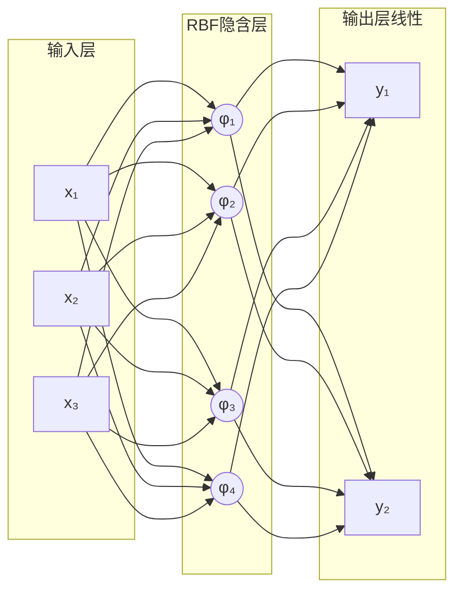
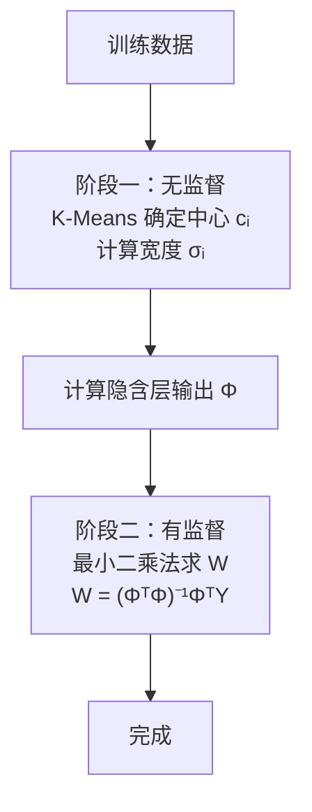

# RBF 神经网络

## 定义

**RBF（Radial Basis Function，径向基函数）神经网络**是一种以径向基函数（如高斯函数）作为隐含层激活函数的三层前馈网络。与 BP 网络用超平面划分空间不同，RBF 网络用**球形基函数覆盖空间**——每个隐含节点对靠近其"中心"的输入产生最强响应。

## 为什么需要 RBF？

BP 网络有两个固有缺陷：① 容易陷入局部最优；② 训练收敛慢。RBF 通过**局部激活 + 线性输出层**的设计来应对：

- 输出层的损失函数对权重是**凸函数** → 闭式解保证全局最优
- 两段式训练（K-Means 聚类 → 最小二乘）比 BP 的迭代训练快得多

> 🎯 **类比**：想象几个热源分布在一个房间中。任意一点的温度取决于它到每个热源的距离——越近越热，越远越凉。RBF 网络就是这个直觉的数学实现：每个隐含节点是一个"热源中心"，高斯函数度量"热力"随距离的衰减。

## 核心原理

### 径向基函数

函数值仅依赖样本到中心点的**距离**，与方向无关：

$$\phi(x) = \phi(\|x - c\|)$$

| 函数 | 公式 | 特点 |
|------|------|------|
| **高斯函数** ⭐ | $\phi(r) = e^{-r^2/(2\sigma^2)}$ | 最常用：光滑、局部性好 |
| 反常 S 型 | $\phi(r) = \frac{1}{1+e^{r^2/\sigma^2}}$ | Sigmoid 关联 |
| 逆多元二次 | $\phi(r) = \frac{1}{(r^2 + \sigma^2)^\alpha}$ | 长程影响 |

### 网络结构



| 层 | 计算 | 作用 |
|----|------|------|
| 输入层 | 仅传递 | 传递信号 |
| 隐含层 | $\phi_i = \exp\!\left(-\frac{\|x-c_i\|^2}{2\sigma_i^2}\right)$ 或 $\phi_i = \exp\!\left(-\sum_d\frac{(x_d-c_{id})^2}{2\sigma_{id}^2}\right)$ | 高维非线性映射 |
| 输出层 | $y_k = \sum_i w_{ki}\phi_i$（可加偏置 $b_k$） | 线性加权求和 |

### RBF 网络的三种参数

RBF 网络需要训练的参数共三类，分布在不同层：

#### 参数一：中心向量 $c_i$（隐含层）

每个隐含层神经元 $i$ 有一个**中心向量**，维度 = 输入维度 $n_{\text{in}}$：

| 属性 | 说明 |
|------|------|
| **数量** | 每隐含节点一个：$n_{\text{hidden}}$ 个 |
| **形状** | 每个 $c_i \in \mathbb{R}^{n_{\text{in}}}$，即 $n_{\text{in}}$ 维向量 |
| **作用** | 定义该隐含节点的"位置"——输入 $x$ 离 $c_i$ 越近，$\phi_i$ 响应越强 |
| **训练方式** | 阶段一：K-Means 聚类（无监督），也可随机选取或正交最小二乘 |

```
输入维度=10，隐含节点=20 → 共 20×10 = 200 个标量参数
```

> 🎯 **几何直觉**：$c_i$ 就是那个"热源的中心坐标"。20 个隐含节点 = 20 个热源，分布在 10 维空间中。

#### 参数二：宽度 $\sigma_i$（隐含层）

每个隐含层神经元 $i$ 有一个**宽度参数**（标量），控制激活函数随距离衰减的速度：

| 属性 | 说明 |
|------|------|
| **数量** | 每隐含节点一个：$n_{\text{hidden}}$ 个 |
| **形状** | 标量 $\sigma_i > 0$ |
| **作用** | $\sigma_i$ 越大 → 高斯函数越"宽" → 影响范围越大、泛化越强 |
| **训练方式** | 阶段一：常取 $\sigma_i = \frac{d_{\text{max}}}{\sqrt{2K}}$（各中心间最大距离 ÷ 常数） |

```
输入维度=10，隐含节点=20 → 共 20×1 = 20 个标量参数（各向同性）
```

> $\sigma$ 太小 → 过度局部化，泛化差。$\sigma$ 太大 → 所有节点响应相近，失去"局部"的意义。

> **⚠️ 注意**：以上假设每个隐含节点共享一个标量 $\sigma$（**各向同性**）。在许多教材和考试中，宽度参数按**每个输入维度独立**建模——即使用对角协方差矩阵 $\Sigma_i = \text{diag}(\sigma_{i1}^2, \dots, \sigma_{iD}^2)$，此时激活函数为：
>
> $$\phi_i(x) = \exp\!\left(-\sum_{d=1}^{D}\frac{(x_d-c_{id})^2}{2\sigma_{id}^2}\right)$$
>
> 这时每个隐含节点的宽度参数有 $n_{\text{in}}$ 个，而非 1 个：$20 \times 10 = 200$ 个宽度参数。这是参数总量从 ~320 变为 **500** 的原因。

#### 参数三：输出权重 $w_{ki}$ + 偏置 $b_k$（输出层）

输出层是**纯线性**的，每个输出神经元对隐含层所有输出加权求和：

| 属性 | 说明 |
|------|------|
| **权重数量** | $n_{\text{hidden}} \times n_{\text{out}}$ 个 |
| **偏置数量** | $n_{\text{out}}$ 个 |
| **训练方式** | 阶段二：最小二乘法求闭式解 $W = (\Phi^T\Phi)^{-1}\Phi^T Y$，**保证全局最优** |
| **为什么能保证** | 隐含层输出 $\Phi$ 固定后，损失函数对 $W$ 是**凸函数** |

```
隐含节点=20，输出维度=5 → 权重 20×5 + 偏置 5 = 105 个参数
```

> 这是 RBF 相比 BP 的最大优势：输出层是线性的，可以**一步求解**而非迭代训练。

#### 参数总计

设输入维度 $n_{\text{in}}$，隐含节点 $n_h$，输出维度 $n_{\text{out}}$：

**情况一：各向同性（标量宽度 $\sigma_i$）**

$$N_{\text{total}} = n_h \cdot n_{\text{in}} + n_h + (n_h \cdot n_{\text{out}} + n_{\text{out}})$$

| $n_{\text{in}}=10,\ n_h=20,\ n_{\text{out}}=5$ | 数量 |
|:-----------------------------------------------|:-----|
| 中心向量 $c_i$ | $20 \times 10 = 200$ |
| 宽度 $\sigma_i$（标量） | $20 \times 1 = 20$ |
| 权重 $w_{ki}$ + 偏置 $b_k$ | $20 \times 5 + 5 = 105$ |
| **总计** | **325** |

**情况二：对角协方差（每维度独立宽度 $\sigma_{id}$）**

$$\phi_i(x) = \exp\!\left(-\sum_{d=1}^{n_{\text{in}}}\frac{(x_d-c_{id})^2}{2\sigma_{id}^2}\right)$$

$$N_{\text{total}} = n_h \cdot n_{\text{in}} + n_h \cdot n_{\text{in}} + n_h \cdot n_{\text{out}}$$

（通常不含输出偏置）

| $n_{\text{in}}=10,\ n_h=20,\ n_{\text{out}}=5$ | 数量 |
|:-----------------------------------------------|:-----|
| 中心向量 $c_i$ | $20 \times 10 = 200$ |
| 宽度 $\sigma_{id}$（每维独立） | $20 \times 10 = 200$ |
| 输出权重 $w_{ki}$ | $20 \times 5 = 100$ |
| **总计** | **500** |

> 虽然参数总数和同结构 BP 网络相同（情况一）或更多（情况二），但 RBF 的隐含层参数（中心+宽度）通过无监督聚类确定，实际监督训练只需求解输出层线性参数——有闭式解，一遍算完。

### 两段式训练



**阶段一**：用 K-Means 聚类确定 RBF 中心，宽度 $\sigma_i = \frac{d_{\text{max}}}{\sqrt{2K}}$

**阶段二**：输出层是线性的 → 可用最小二乘法直接求闭式解 $W = (\Phi^T\Phi)^{-1}\Phi^T Y$，保证全局最优。

## RBF vs BP 对比

| 维度 | BP 网络 | RBF 网络 |
|------|---------|----------|
| **隐含层激活** | 内积 → Sigmoid/ReLU | 距离 → 高斯函数 |
| **几何解释** | 超平面划分 | 球形基函数覆盖 |
| **输出层** | 非线性（Sigmoid/Softmax） | **线性** |
| **训练** | 纯监督迭代 | 两段式：无监督 + 有监督 |
| **激活范围** | 全局（输入影响所有节点） | 局部（只响应中心附近的输入） |
| **局部最优** | 容易陷入 | ✅ 全局最优（线性输出层保障） |
| **训练速度** | 慢 | 快 |

## 局限性

当输入维度很高时（如图像，可能数百到数百万维），RBF 需要的隐含节点数会**指数增长**——这就是"维度灾难"（Curse of Dimensionality）。这也是 RBF 主要应用于低维函数逼近和插值问题，而在图像/语音等现代深度学习领域被 BP 网络取代的根本原因。

## 应用场景

- **函数逼近与插值**：已知离散点，重建光滑曲面
- **时间序列预测**：低维金融/气象数据的短期预测
- **模式识别**：小规模分类问题

## 相关概念

- [BP 神经网络与反向传播](/articles/ai-ml/deep-learning/concepts/BP神经网络与反向传播/)
- [神经网络](/articles/ai-ml/deep-learning/concepts/神经网络/)
- [梯度下降](/articles/ai-ml/deep-learning/concepts/梯度下降/)
- K-Means 聚类
