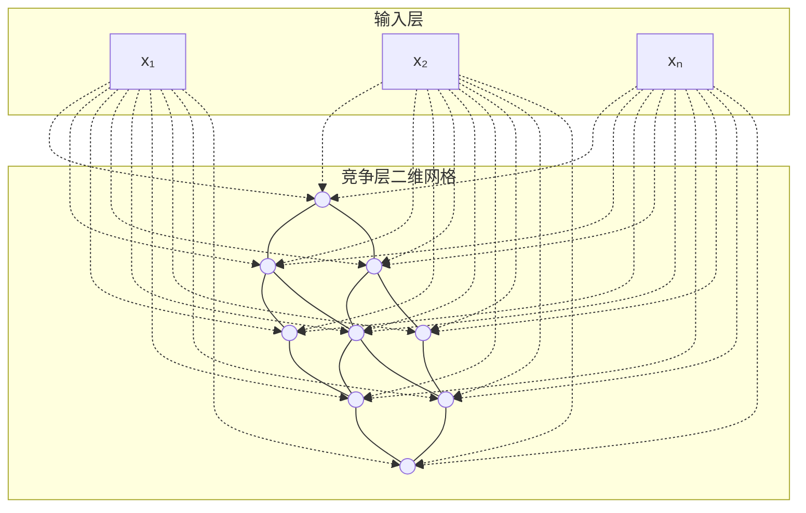
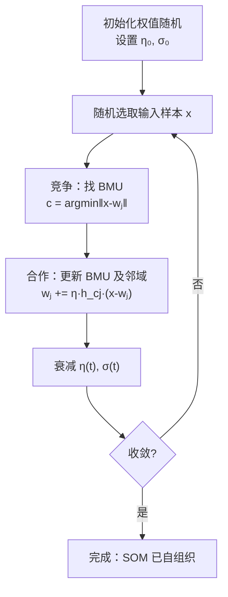

# SOM 自组织映射网络

## 定义

**SOM（Self-Organizing Map，自组织映射）** 由芬兰学者 Teuvo Kohonen 于 1982 年提出，是一种**无监督学习**神经网络。它不需要标签，通过**竞争学习**机制将高维输入数据映射到低维（通常是二维）网格上，同时**保留原始数据的拓扑结构**——输入空间中相近的点会映射到网格上相邻的位置。

## 为什么需要 SOM？

前两种网络（BP 和 RBF）都需要标签进行监督训练。但现实中大量数据没有标签——我们不知道"正确答案"，只知道数据本身的分布。

SOM 回答的问题是：**如何让网络在没有老师的情况下，自主发现数据的内在结构和聚类？**

## 核心原理

### 生物启发——侧抑制与胜者通吃

大脑皮层中，相邻神经元之间存在**侧抑制**：当一个神经元被激活后，它会抑制周围神经元的活性，最终只有最强的那个神经元"胜出"。SOM 模拟了这一机制。

> 🎯 **类比**：想象一个交响乐团，每个乐手擅长不同的音高。当听到一个特定音符，最擅长这个音的乐手（获胜者）会起立演奏，邻居也会微微调整自己的乐器。反复练习后，不同乐手的音域自然形成有序排列——这就是自组织。

### 网络结构

- **输入层**：仅传递信号，不做计算
- **竞争层（输出层）**：二维网格，每个节点与所有输入全连接
- 竞争层内部有侧抑制连接，实现 WTA 机制

### 竞争学习：三步循环

**第一步 —— 竞争**：对于输入 $x$，计算每个神经元 $j$ 到 $x$ 的距离：

$$d_j = \|x - w_j\|$$

距离最小者获胜，称为 **BMU（Best Matching Unit）**：

$$c = \arg\min_j \|x - w_j\|$$

**第二步 —— 合作**：BMU 及其**邻域**内的神经元都更新权值。邻域函数控制"谁受 BMU 的影响、影响多大"：

$$h_{cj}(t) = \exp\left(-\frac{\|r_c - r_j\|^2}{2\sigma(t)^2}\right)$$

- $r_c, r_j$ 是 BMU 和神经元 $j$ 在**二维网格上**的位置
- $\sigma(t)$ 是邻域半径，随训练逐渐缩小

**第三步 —— 权值更新**：

$$w_j(t+1) = w_j(t) + \eta(t) \cdot h_{cj}(t) \cdot [x - w_j(t)]$$

- 获胜者把自己的权值**拉向输入向量** $x$
- 邻域神经元也适度调整，幅度随距离衰减

### 为什么 $\eta$ 和 $\sigma$ 必须衰减？

| 不衰减的话... | 后果 |
|-------------|------|
| $\eta$ 不变 | 权值永远在震荡，无法收敛到稳定状态 |
| $\sigma$ 不变 | 整个网格一起移动，无法形成有序的地图 |

训练早期：大 $\eta$ + 大 $\sigma$ → 全局粗调，快速形成拓扑结构
训练后期：小 $\eta$ + 小 $\sigma$ → 局部精调，每个神经元收敛到各自"擅长"的模式

### 完整训练流程

## 应用场景

| 应用 | 说明 |
|------|------|
| **高维数据可视化** | 将复杂数据映射到二维彩色地图，直观发现聚类和趋势 |
| **降维** | 保留拓扑结构的降维，与 PCA 互补 |
| **推荐系统** | 用户映射到网格，邻近用户口味相似 |
| **异常检测** | 远离所有 BMU 的新样本可能为异常 |
| **图像压缩** | 少量神经元权值代表大量像素模式 |

## SOM vs 其他降维方法

| 方法 | 监督 | 拓扑保持 | 可视化 | 速度 |
|------|------|---------|--------|------|
| **SOM** | 无监督 | ✅ 强 | ✅ 好（二维网格） | 中等 |
| PCA | 无监督 | ❌ 弱 | ❌ 不直观 | 快 |
| t-SNE | 无监督 | 中等 | ✅ 很好 | 慢 |
| UMAP | 无监督 | 中等 | ✅ 很好 | 快 |

## 相关概念

- [BP 神经网络与反向传播](/articles/ai-ml/deep-learning/concepts/BP神经网络与反向传播/)
- [RBF 神经网络](/articles/ai-ml/deep-learning/concepts/RBF神经网络/)
- [神经网络](/articles/ai-ml/deep-learning/concepts/神经网络/)
- 无监督学习
- 聚类
