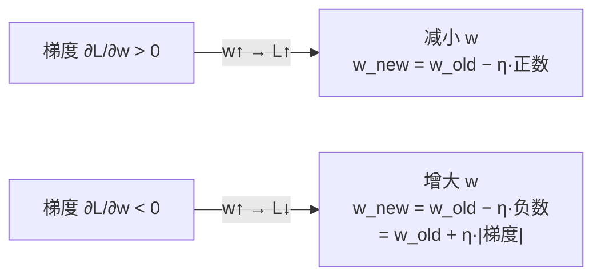

# 梯度下降

## 定义

**梯度下降（Gradient Descent）** 是一种迭代优化算法，通过沿**负梯度方向**逐步调整参数，使损失函数最小化。

$$w_{\text{new}} = w_{\text{old}} - \eta \cdot \frac{\partial L}{\partial w}$$

- $\frac{\partial L}{\partial w}$（梯度）：损失函数在该参数上的"坡度"
- $\eta$（学习率）：每一步移动的步长

> ⛰️ **直觉类比**：你蒙着眼站在山坡上，脚底感受到的坡度就是梯度。"往最陡的下坡方向迈一小步" = 沿负梯度方向更新参数。重复这个过程，最终到达山谷（损失最小区）。

## 为什么需要梯度下降？

神经网络的损失函数通常有成千上万个参数，无法用解析方法（如令导数为 0 解方程）直接求全局最小值。梯度下降提供了一种**数值迭代**的方案：不需要一步到位，而是一步一步往更低处走。

## 梯度到底是什么？

### 几何含义

假设损失 $L$ 只依赖于**一个**参数 $w$：

```
  L ↑
    │    ╲
    │     ╲___  ← 切线斜率 = 梯度 ∂L/∂w
    │         ╲___
    │            ╲___
    │                ╲___
    └──────────────────────→ w
```

**梯度（单变量时就是导数）就是函数曲线在某一点的切线斜率：**

| 斜率 | 含义 | 怎么做 |
|------|------|--------|
| **> 0** | 曲线向上 → 增大 $w$ 会使 $L$ 增大 | **减小** $w$ |
| **< 0** | 曲线向下 → 增大 $w$ 会使 $L$ 减小 | **增大** $w$ |
| **= 0** | 到达极值点（谷底或山顶） | 停止更新 |

### 偏导数

当参数不止一个时，**偏导数** $\frac{\partial L}{\partial w_i}$ 回答："在当前位置，**只**调这一个参数一点点，损失会怎么变？"——其他参数暂时固定不变。

神经网络训练中，对**每一个**权值和偏置求偏导数，得到一个**梯度向量**，然后沿该向量的反方向更新所有参数。

## 梯度下降更新公式

### 核心公式

$$w \leftarrow w - \eta \cdot \frac{\partial L}{\partial w}$$

**为什么是"减"？** 梯度指向损失**增大**的方向。我们要让损失**减小**，所以沿着**负梯度**方向走。



### 学习率 $\eta$

| 学习率 | 效果 |
|--------|------|
| 太小 | 收敛极慢，训练时间过长 |
| 太大 | 在最优解附近震荡，甚至发散 |
| 适中 | 高效收敛到最优解附近 |

## 三种梯度下降变体

| 类型 | 每步用多少数据 | 特点 |
|------|--------------|------|
| **BGD (批量)** | 全部训练集 | 梯度最准确但速度最慢，内存开销大 |
| **SGD (随机)** | 1 个样本 | 速度最快但噪声大，震荡严重 |
| **Mini-batch SGD** | 小批量（如 32/64/128） | **最佳折中**，现代训练的标准做法 |

> 💡 SGD 的随机噪声实际上是一个**优点**而非缺陷：噪声帮助跳出较差的局部最优解，让模型有机会找到更好的参数空间区域。

## 常见学习率策略

| 策略 | 描述 | 适用场景 |
|------|------|---------|
| 固定学习率 | 全程不变 | 简单任务、快速原型 |
| 阶梯衰减 | 每 N 个 epoch 除以因子（如 10） | 传统 CNN 训练 |
| 指数衰减 | $\eta_t = \eta_0 \cdot e^{-kt}$ | 一般性衰减 |
| 余弦退火 | 按余弦曲线周期性升降 | 现代 SOTA 训练常用 |

## 实际计算示例

参见 [BP 反向传播数值实例](/articles/ai-ml/deep-learning/concepts/BP神经网络与反向传播/)，其中用 $2 \to 2 \to 1$ 网络手算了完整的梯度下降过程：

- 输出层权值：$w_{31}: 0.6 \xrightarrow{\eta=0.5,\;\text{grad}=-0.043} 0.622$
- 隐含层权值：$w_{11}: 0.2 \xrightarrow{\eta=0.5,\;\text{grad}=-0.006} 0.203$

所有梯度为负数 → 所有权值增大 → 预测值从 $0.647 \to 0.653$，向真实值 $1$ 靠近。

## 相关概念

- [链式法则](/articles/ai-ml/deep-learning/concepts/链式法则/) — 计算梯度的数学工具
- [BP 神经网络与反向传播](/articles/ai-ml/deep-learning/concepts/BP神经网络与反向传播/) — 梯度下降在神经网络训练中的完整应用
- [神经网络训练](/articles/ai-ml/deep-learning/concepts/神经网络训练/) — 训练循环概览
