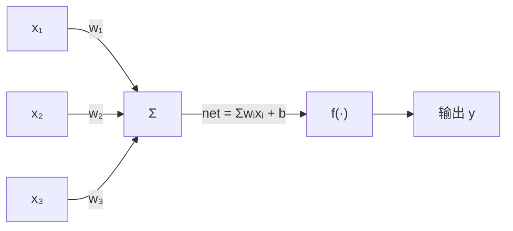

# 神经网络

## 定义

**人工神经网络**（Artificial Neural Network，简称 ANN）是一种受生物神经系统启发的计算模型。它由大量相互连接的**神经元**（或称节点）组成，通过调整连接权重来学习和存储知识，是深度学习的核心构件。

## 生物启发：从神经元到 M-P 模型

人工神经网络的灵感直接来自生物神经系统：

| 生物结构              | 功能                  | 数学抽象                  |
| ----------------- | ------------------- | --------------------- |
| **树突 (Dendrite)** | 接收其他神经元的信号          | 输入 $x_i$              |
| **突触 (Synapse)**  | 连接强度可调节（可塑性 = 学习基础） | 权值 $w_i$（训练中调整）       |
| **细胞体 (Soma)**    | 整合所有输入信号            | 加权求和 $\sum w_i x_i$   |
| **阈值电位**          | 超过阈值才产生脉冲           | 偏置 $b$（$b = -\theta$） |
| **轴突 (Axon)**     | 输出电脉冲给下一级           | 激活函数输出 $f(\cdot)$     |

> 🧠 **关键洞察**：突触的**可塑性**（连接强度可变）是学习的生物学基础。"Neurons that fire together, wire together."（一起放电的神经元会连接在一起）——这是 Hebbian 学习规则的核心。

## 基本单元：人工神经元（M-P 模型）

1943 年，McCulloch 和 Pitts 提出第一个人工神经元数学模型——**M-P 模型**：

$$o = f\left(\sum_{i=1}^n w_i x_i - \theta\right) \quad \text{或等价的} \quad o = f\left(\sum_{i=1}^n w_i x_i + b\right)$$

其中偏置 $b = -\theta$。箭头变体展示：



**向量形式**（简洁版）：$\text{net} = \mathbf{w}^T \mathbf{x} + b$

一个神经元做的事情本质上就是：**点积 + 加偏置 + 非线性映射**。这是所有深度网络的最小计算单元。

- **输入（x₁, x₂, x₃）**：来自上一层或原始数据
- **权重（w₁, w₂, w₃）**：每个输入的重要性，是训练过程中调整的核心参数
- **偏置（b）**：一个额外的可调参数，使模型更灵活
- **激活函数 f(·)**：引入非线性，使网络能拟合复杂关系（常用：ReLU、Sigmoid、Tanh）

## 网络结构

### 前馈神经网络（最基本形式）

```
输入层          隐藏层                输出层
 ○             ○      ○
         ╱   ╱  ╲   ╱  ╲
 ○ ─── ○ ─── ○ ─── ○ ─── ○
         ╲   ╲  ╱   ╲  ╱
 ○             ○      ○
```

- **输入层**：接收原始数据，不进行计算
- **隐藏层**：执行特征提取和变换，可以有多层——层数越多，"深度"越大
- **输出层**：产生最终预测（分类概率 / 回归值）

### 全连接层与参数规模

相邻两层之间每个神经元都相互连接，称为**全连接层**（Fully Connected Layer）。一个简单的三层网络（输入 784 个像素 + 两个隐藏层各 128 个神经元 + 输出 10 类）就包含约 12 万个参数。现代大模型（如 GPT-4）的参数规模可达万亿级别。

## 为何神经网络有效？

神经网络的威力来自两个理论保证：

- **万能逼近定理**：只要隐藏层神经元足够多，一个单隐藏层网络就能以任意精度逼近任何连续函数。实际中多用深层网络是因为**同样表达能力下深层比浅层所需神经元更少**
- **非线性激活函数**：没有激活函数，无论多少层都等价于一个线性变换；激活函数使网络能拟合任意复杂边界

## 相关概念

- [深度学习](/articles/ai-ml/deep-learning/concepts/深度学习/)
- [神经网络训练](/articles/ai-ml/deep-learning/concepts/神经网络训练/)
- [激活函数](/articles/ai-ml/deep-learning/concepts/激活函数/)
- [BP 神经网络与反向传播](/articles/ai-ml/deep-learning/concepts/BP神经网络与反向传播/)
- [RBF 神经网络](/articles/ai-ml/deep-learning/concepts/RBF神经网络/)
- [SOM 自组织映射](/articles/ai-ml/deep-learning/concepts/SOM自组织网络/)
- [深度学习应用领域](/articles/ai-ml/deep-learning/concepts/深度学习应用领域/)
