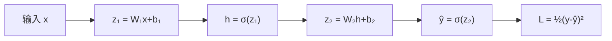

# 链式法则

## 定义

**链式法则（Chain Rule）** 是微积分中计算复合函数导数的基本法则。若 $L$ 是 $y$ 的函数，$y$ 是 $x$ 的函数，则 $L$ 对 $x$ 的导数为：

$$\frac{dL}{dx} = \frac{dL}{dy} \cdot \frac{dy}{dx}$$

> 把"长距离"的依赖关系拆成每一步的局部导数连乘。

## 为什么重要？

链式法则是**反向传播的数学引擎**。神经网络就是一个巨大的复合函数（几十到几百层嵌套），要计算损失对第一层参数的梯度，必须用链式法则从输出层一层一层往回"穿透"。

## 核心原理

### 直觉理解

如果 $L$ 依赖于 $y$，$y$ 依赖于 $x$：

$$L \xrightarrow{\text{依赖于}} y \xrightarrow{\text{依赖于}} x$$

那么 $x$ 的变化会先影响 $y$，再通过 $y$ 影响 $L$。链式法则把这两个影响**乘起来**。

### 简单例子

假设 $L = (t - 5)^2,\; t = 3x + 2$，求 $\frac{dL}{dx}$。

**方法一：直接代进去展开**

$$L = (3x + 2 - 5)^2 = (3x - 3)^2$$
$$\frac{dL}{dx} = 2(3x-3) \cdot 3 = 18x - 18$$

**方法二：链式法则分步求**

$$\frac{dL}{dx} = \frac{dL}{dt} \cdot \frac{dt}{dx} = \underbrace{2(t-5)}_{\partial L/\partial t} \cdot \underbrace{3}_{\partial t/\partial x}$$

代入 $t = 3x+2$：
$$= 2(3x+2-5) \cdot 3 = 2(3x-3) \cdot 3 = 18x - 18$$

**结果完全一样**。但链式法则的核心优势在于：当嵌套很深时，不需要把整个复合函数展开——只需逐层求导再相乘。

### 多元函数的链式法则

若 $L = L(\hat{y})$，$\hat{y} = \sigma(z)$，$z = W \cdot h$，则 $L$ 对 $W$ 的偏导数为：

$$\frac{\partial L}{\partial W} = \frac{\partial L}{\partial \hat{y}} \cdot \frac{\partial \hat{y}}{\partial z} \cdot \frac{\partial z}{\partial W}$$

每一项都只涉及**一步**简单的局部求导，乘起来就得到最终梯度。

## 在神经网络中的应用

整个网络就是一层套一层的复合函数：



求 $\frac{\partial L}{\partial W_2}$ 的路径：$L \to \hat{y} \to z_2 \to W_2$

```
每一步的局部导数：
  L → ŷ:    -(y-ŷ)
  ŷ → z₂:   ŷ(1-ŷ)
  z₂ → W₂:  h

链式乘法：
  ∂L/∂W₂ = [-(y-ŷ)] · [ŷ(1-ŷ)] · [h]
```

求 $\frac{\partial L}{\partial W_1}$ 的路径更长：$L \to \hat{y} \to z_2 \to h \to z_1 \to W_1$，但原理完全一样——逐层求导再连乘。

> 🔑 **核心要点**：链式法则让你把"求损失对第 1 层参数的梯度"这个看起来很复杂的问题，分解成"从输出层一层一层往回求局部导数然后乘起来"。**这就是反向传播。**

## 与反向传播的关系

| 概念 | 角色 |
|------|------|
| 链式法则 | **数学工具**：计算复合函数偏导数的通用方法 |
| 反向传播 | **算法**：利用链式法则沿网络反向逐层计算梯度，并更新参数 |

> 反向传播就是链式法则在神经网络训练中的具体实现。

## 相关概念

- [BP 神经网络与反向传播](/articles/ai-ml/deep-learning/concepts/BP神经网络与反向传播/) — 链式法则在 BP 中的完整应用（含手算数值实例）
- [梯度下降](/articles/ai-ml/deep-learning/concepts/梯度下降/) — 算出梯度后如何用梯度更新参数
- [神经网络训练](/articles/ai-ml/deep-learning/concepts/神经网络训练/) — 训练循环的高层概览
