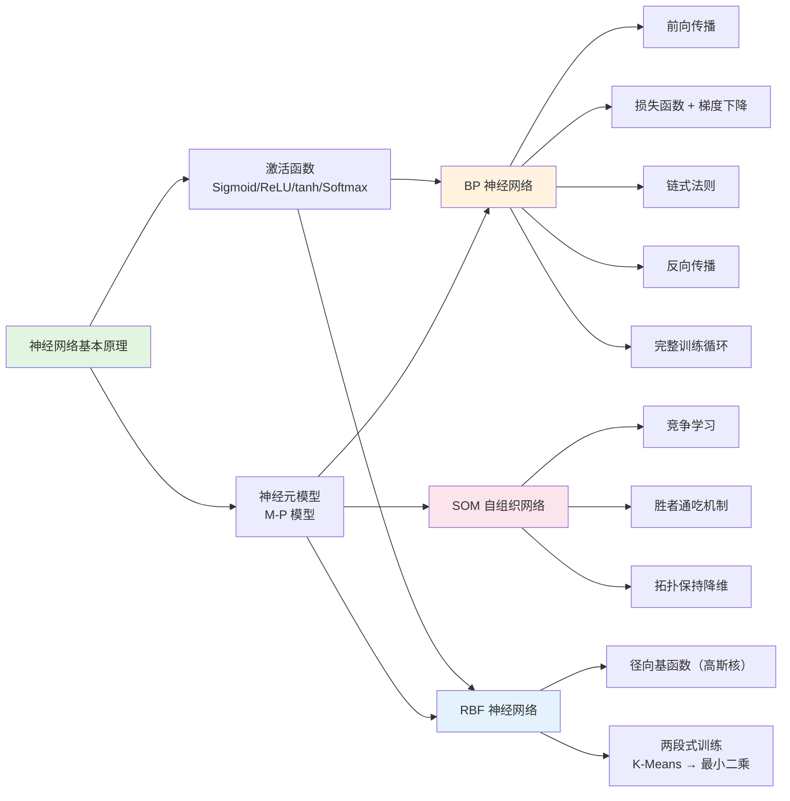

# 第2章：神经网络

## 本章概要

本章从生物神经元出发，建立人工神经网络的数学模型，系统讲解三种经典神经网络架构：**BP 网络**（误差反向传播，最重要）、**RBF 网络**（径向基函数逼近）、**SOM 网络**（自组织无监督学习）。本章是后续 CNN、RNN、Transformer 等现代深度网络的必要基础。

## 知识结构

## 知识点

### Part 1：神经网络基本原理

- **生物神经元 → M-P 模型**：树突（输入）→ 突触（权值）→ 细胞体（加权求和）→ 轴突（输出）。数学形式：$o = f(\sum w_i x_i + b)$
  → [神经网络](/articles/ai-ml/deep-learning/concepts/神经网络/)
- **激活函数**：神经网络的灵魂。Sigmoid 和 tanh 是早期主力（梯度消失是致命弱点），ReLU 是现代默认选择（缓解梯度消失 + 计算快）。Softmax 用于多分类输出。
  → [激活函数](/articles/ai-ml/deep-learning/concepts/激活函数/)

### Part 2：BP 神经网络（本章核心）

- **链式法则**：反向传播的数学基石。$\frac{\partial L}{\partial W_1} = \frac{\partial L}{\partial \hat{y}} \cdot \frac{\partial \hat{y}}{\partial z_2} \cdot \frac{\partial z_2}{\partial h} \cdot \frac{\partial h}{\partial z_1} \cdot \frac{\partial z_1}{\partial W_1}$
- **前向传播**：$h = f(W_1x + b_1)$, $\hat{y} = f(W_2h + b_2)$，逐层计算预测值
- **反向传播**：误差沿网络反向流动，用链式法则分配梯度 $\to$ 更新每个参数
- **完整训练**：前向 → 算损失 → 反向传梯度 → 更新参数 → 重复
  → [BP 神经网络与反向传播](/articles/ai-ml/deep-learning/concepts/BP神经网络与反向传播/)

### Part 3：RBF 神经网络

- 用 **径向基函数（高斯核）** 代替 Sigmoid 作为隐含层激活
- 几何直觉：球形基函数覆盖空间（vs BP 的超平面划分）
- 训练分两段：K-Means 确定中心/宽度 → 最小二乘求输出权重（全局最优！）
  → [RBF 神经网络](/articles/ai-ml/deep-learning/concepts/RBF神经网络/)

### Part 4：SOM 自组织竞争网络

- **无监督学习**——不需要标签，自主发现数据结构
- 生物启发：侧抑制 + 胜者通吃（Winner-Take-All）
- 将高维数据映射到二维网格，保留拓扑结构
  → [SOM 自组织映射](/articles/ai-ml/deep-learning/concepts/SOM自组织网络/)

## 三种网络对比

| 维度 | BP 网络 | RBF 网络 | SOM 网络 |
|------|---------|----------|----------|
| **学习方式** | 监督学习 | 两段式（无监督+监督） | 纯无监督 |
| **隐含层激活** | 内积 → Sigmoid/ReLU | 距离 → 高斯函数 | 距离最小者获胜 |
| **输出层** | 非线性 | 线性 | 网格坐标 |
| **主要用途** | **分类、回归（通用）** | 函数逼近、插值 | **聚类、降维、可视化** |
| **核心优势** | 通用性最强 | 全局最优、训练快 | 无需标签、拓扑保持 |
| **核心弱点** | 局部最优、梯度消失 | 维度灾难 | 无预测能力 |

## 关键公式速查

| 公式 | 说明 |
|------|------|
| $o = f(\sum w_i x_i + b)$ | 单神经元计算 |
| $f'(x) = f(x)(1-f(x))$ | Sigmoid 导数（BP 计算关键） |
| $\delta_2 = -(y - \hat{y}) \cdot \hat{y}(1-\hat{y})$ | 输出层 $\delta$（MSE+Sigmoid） |
| $\delta_1 = (W_2^T\delta_2) \odot h(1-h)$ | 隐含层 $\delta$ |
| $w \leftarrow w - \eta \cdot \frac{\partial L}{\partial w}$ | 梯度下降更新 |
| $\phi(x) = e^{-\frac{\|x-c\|^2}{2\sigma^2}}$ | 高斯径向基函数 |
| $w_j \leftarrow w_j + \eta \cdot h_{cj} \cdot (x - w_j)$ | SOM 权值更新 |

## 疑问

- [ ] BP 反向传播的梯度计算中，如果隐含层用 ReLU 而不是 Sigmoid，$\delta_1$ 的公式怎么变化？
- [ ] RBF 网络中，中心数量和位置的选择除了 K-Means 还有什么方法？（如正交最小二乘 OLS）
- [ ] SOM 的收敛性如何证明？邻域函数为什么选高斯而不是别的形式？

## 关联笔记

- [神经网络](/articles/ai-ml/deep-learning/concepts/神经网络/) — 生物启发的 M-P 模型
- [激活函数](/articles/ai-ml/deep-learning/concepts/激活函数/) — 完整对比与选择指南
- [BP 神经网络与反向传播](/articles/ai-ml/deep-learning/concepts/BP神经网络与反向传播/) — ⭐ 核心章节，含完整推导和数值实例
- [神经网络训练](/articles/ai-ml/deep-learning/concepts/神经网络训练/) — 训练流程的高层概览
- [RBF 神经网络](/articles/ai-ml/deep-learning/concepts/RBF神经网络/) — 径向基函数网络
- [SOM 自组织映射](/articles/ai-ml/deep-learning/concepts/SOM自组织网络/) — 无监督竞争学习
- [深度学习](/articles/ai-ml/deep-learning/concepts/深度学习/) — 全领域概览
- [梯度下降](/articles/ai-ml/deep-learning/concepts/梯度下降/) — 优化算法详解
