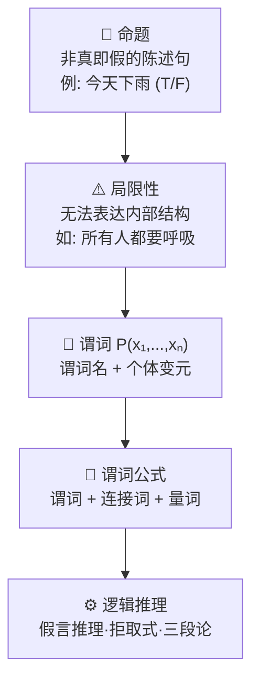

# 一阶谓词逻辑

## 定义

**一阶谓词逻辑**（First-Order Predicate Logic）是知识表示中最精确、最严密的方法。它用**谓词 + 个体 + 量词 + 连接词**将知识形式化为数学命题，支持严密的逻辑推导。

> "一阶"意味着量词只能约束**个体变元**，不能约束谓词本身。这是与高阶逻辑的关键区别。

## 从命题到谓词

## 核心概念

| 概念 | 定义 | 示例 |
|------|------|------|
| **命题** | 非真即假的陈述句 | "雪是白色的"（真 T） |
| **谓词** | 描述个体性质或关系的函数 | `Teacher(Zhang)`；`Greater(x, 5)` |
| **个体** | 独立事物或抽象概念 | 常量（Zhang）、变元（x）、函数（`father(Li)`） |
| **连接词** | 组合谓词形成复杂公式 | `¬` `∧` `∨` `→` `↔` |
| **量词** | 约束变元范围 | `∀x` 全称、`∃x` 存在 |

### 五大逻辑连接词（优先级从高到低）

| 连接词 | 符号 | 含义 | 真值条件 | 优先级 |
|--------|:----:|------|----------|:------:|
| 否定 | `¬` | 非 | `¬P` 为真 ⇔ P 为假 | ① |
| 合取 | `∧` | 且 | `P∧Q` 为真 ⇔ 两者同时为真 | ② |
| 析取 | `∨` | 或 | `P∨Q` 为真 ⇔ 至少一个为真 | ③ |
| 蕴含 | `→` | 如果…则… | P 假时恒真（"善意推定"） | ④ |
| 等价 | `↔` | 当且仅当 | 双方真值相同才为真 | ⑤ |

> 口诀：**非 > 与 > 或 > 蕴含 > 等价**

### 两类量词

| 量词 | 读法 | 真值条件 |
|:----:|------|------|
| `∀x` | "对所有 x" | 全部满足才为真 |
| `∃x` | "存在 x" | 找到一个即为真 |

> ⚠️ **量词顺序影响语义**：`∀x∃y Loves(x,y)` = "每个人都有爱的人"，`∃y∀x Loves(x,y)` = "存在一个人被所有人爱"——顺序一换，含义截然不同。

## ∀ 配 →、∃ 配 ∧ 的铁律

| 模式 | 含义 | 反例（用错会怎样） |
|:----:|------|------|
| `∀x (P(x) → Q(x))` | "所有 P 都是 Q" | 若用 `∧`：非 P 对象（如房间）会使公式为假 |
| `∃x (P(x) ∧ Q(x))` | "存在 P 是 Q" | 若用 `→`：只要存在非 P 对象，蕴含就为真，公式退化 |

## 三种推理规则

| 规则 | 形式 | 白话 |
|------|------|------|
| **假言推理** | `P→Q, P ⊢ Q` | "下雨地湿，下雨了→地湿" |
| **拒取式** | `P→Q, ¬Q ⊢ ¬P` | "下雨地湿，地没湿→没下雨" |
| **假言三段论** | `P→Q, Q→R ⊢ P→R` | "下雨→地湿→路滑" |

## 谓词公式 ↔ 子句集

**核心定理**：谓词公式不可满足 ⇔ 其子句集不可满足。因此，证明公式永真 = 将取反后的公式化为子句集，用[归结原理](/articles/ai-ml/introduction-to-ai/concepts/归结原理/)推导出矛盾。

子句集转换的 9 步流程、Skolem 化、合一等详见：
- [归结原理 · 子句集标准化](/articles/ai-ml/introduction-to-ai/concepts/归结原理/#%E4%B9%9D%E6%AD%A5%E6%A0%87%E5%87%86%E5%8C%96%E8%BD%AC%E6%8D%A2)
- [归结原理 · 合一算法](/articles/ai-ml/introduction-to-ai/concepts/归结原理/#%E5%90%88%E4%B8%80%E7%AE%97%E6%B3%95)

## 优缺点

| ✅ 优点 | ❌ 缺点 |
|----------|----------|
| **自然性**：接近人类逻辑思维 | **无法表达不确定知识**：非黑即白 |
| **精确性**：无歧义，适合形式化证明 | **组合爆炸**：搜索空间指数增长 |
| **严密性**：有完整数学推理体系 | **推理效率低**：量词实例化计算量大 |
| **易程序实现**：Prolog 直接支持 | **知识获取困难**：隐性知识无法形式化 |

## 经典例子

> Prolog（Programming in Logic）直接基于一阶谓词逻辑。给定 `mortal(X) :- human(X).` 和 `human(socrates).`，查询 `?- mortal(socrates).` 返回 `true`。但 100+ 条规则后急剧变慢——"组合爆炸"的真实体验。

## 相关概念

- [知识的概念与表示](/articles/ai-ml/introduction-to-ai/concepts/知识的概念与表示/)
- [产生式系统](/articles/ai-ml/introduction-to-ai/concepts/产生式系统/)
- [归结原理](/articles/ai-ml/introduction-to-ai/concepts/归结原理/)
- [推理的基本概念](/articles/ai-ml/introduction-to-ai/concepts/推理的基本概念/)
- [自然演绎推理](/articles/ai-ml/introduction-to-ai/concepts/自然演绎推理/)
