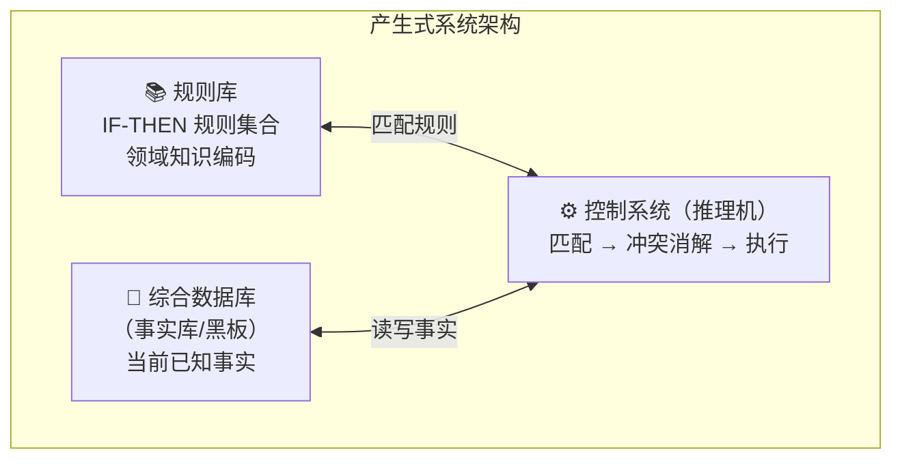
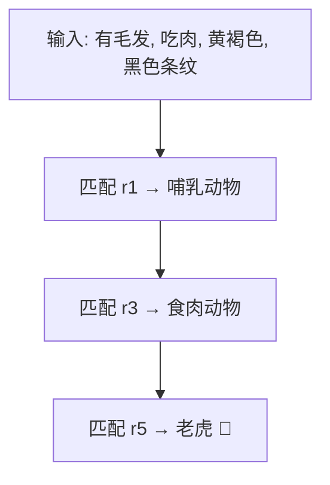

# 产生式系统

## 定义

**产生式系统**是最直觉化的知识表示方法——用 `IF-THEN` 规则编码知识，通过"匹配→触发→执行"循环完成推理。一条规则一个功能块，好理解、好维护，是专家系统的核心引擎。

## 产生式系统 = 规则库 + 数据库 + 推理机



推理机循环：
1. **匹配**：哪些规则的前提被当前事实满足？
2. **冲突消解**：多条匹配时选哪条？（见 [推理的基本概念 · 冲突消解](/articles/ai-ml/introduction-to-ai/concepts/推理的基本概念/#%E5%86%B2%E7%AA%81%E6%B6%88%E8%A7%A3%E7%AD%96%E7%95%A5)）
3. **执行**：触发规则，新事实加入数据库
4. **终止判断**：达到目标 or 无规则可触发？

## 四类产生式表达

| 类型 | 格式 | 示例 |
|------|------|------|
| **确定性规则** | `IF P THEN Q` | `IF 发烧 AND 咳嗽 THEN 可能感冒` |
| **不确定性规则** | `IF P THEN Q（置信度 0.8）` | `IF 乌云 THEN 下雨（置信度 0.7）` |
| **确定性事实** | `(对象, 属性, 值)` | `(北京, 人口, 2069万)` |
| **不确定性事实** | `(对象, 属性, 值, 置信度)` | `(火星, 有生命, 否, 0.99)` |

> 产生式的 `IF-THEN` ≠ 逻辑蕴含 `→`。逻辑蕴含是"如果 P 为真则 Q 必为真"的**静态数学关系**；产生式是"如果满足条件则执行动作"的**动态操作语义**。

## 经典例子：动物识别系统

```
规则库（15 条）:
r1:  IF 有毛发                       THEN 哺乳动物
r2:  IF 产奶                         THEN 哺乳动物
r3:  IF 哺乳动物 AND 吃肉              THEN 食肉动物
r4:  IF 哺乳动物 AND 有蹄              THEN 有蹄动物
r5:  IF 食肉动物 AND 黄褐色 AND 黑色条纹  THEN 老虎
r6:  IF 食肉动物 AND 黄褐色 AND 黑色斑点  THEN 豹
r7:  IF 有蹄动物 AND 长腿 AND 长脖子     THEN 长颈鹿
```



## 优缺点

| ✅ 优点 | ❌ 缺点 |
|----------|----------|
| **自然性**：`IF-THEN` 贴近人类思维 | **推理效率低**：规则多时反复扫描匹配 |
| **模块性**：每条规则独立，增删改不影响其他 | **难以表达结构知识**：不好描述层级关系 |
| **有效性**：正确规则一定得出正确结论 | **冲突消解难**：多条规则同时匹配 |
| **清晰性**：规则即是知识 | **缺乏学习能力**：规则全依赖人工编写 |

## 经典例子：XCON 配置系统

> DEC 公司用 R1（后改名 XCON）专家系统自动配置 VAX 计算机硬件——从 ~420 种组件中选匹配组合。最终包含 **~10,000 条规则**，每年为 DEC 节省 **4000 万美元**。但维护万条规则成为噩梦——添加新规则可能引入隐蔽冲突。

## 相关概念

- [知识的概念与表示](/articles/ai-ml/introduction-to-ai/concepts/知识的概念与表示/)
- [一阶谓词逻辑](/articles/ai-ml/introduction-to-ai/concepts/一阶谓词逻辑/)
- [框架表示法](/articles/ai-ml/introduction-to-ai/concepts/框架表示法/)
- [推理的基本概念](/articles/ai-ml/introduction-to-ai/concepts/推理的基本概念/)
- [自然演绎推理](/articles/ai-ml/introduction-to-ai/concepts/自然演绎推理/)
