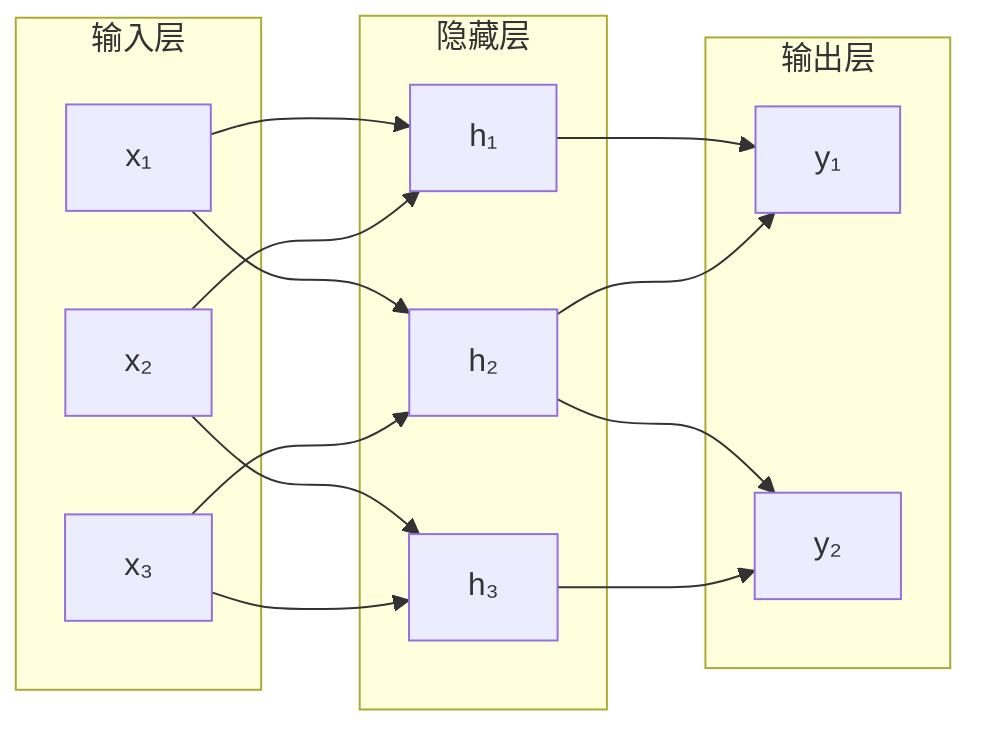
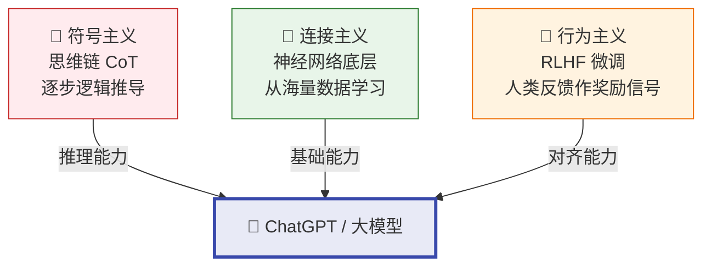

# 人工智能三大学派

## 定义

人工智能三大学派是从不同角度回答"**智能如何产生**"的三种技术路线：符号主义（逻辑推理）、连接主义（神经网络）、行为主义（环境交互）。三者并非互斥，现代 AI 系统往往是它们的融合。

## 核心对比

| 维度 | 符号主义 | 连接主义 | 行为主义 |
|------|----------|----------|----------|
| **别名** | 逻辑主义/心理学派 | 仿生学派/生理学派 | 进化主义/控制论学派 |
| **核心隐喻** | 大脑 = 计算机 | 大脑 = 神经网络 | 大脑 = 控制器 |
| **智能来源** | 知识 + 逻辑推理 | 数据 + 连接权重 | 环境交互 + 反馈 |
| **知识表示** | 显式符号（规则） | 隐式分布（权值） | 无需表示 |
| **学习方式** | 知识工程（人工注入） | 数据驱动（梯度下降） | 试错（强化学习） |
| **可解释性** | ⭐⭐⭐⭐⭐ | ⭐ | ⭐⭐ |
| **代表成果** | MYCIN、深蓝 | AlphaGo、GPT-4 | Atlas 机器人 |

## 一、符号主义

### 原理

将知识用符号显式编码，通过逻辑推理操纵符号来模拟人类心智。

### 优点
- 高度可解释：每一步推理有迹可循
- 知识可编辑：规则可人工增删改
- 小样本可行：不需海量数据

### 缺点
- 知识获取瓶颈：隐性知识难形式化
- 组合爆炸：搜索空间指数增长
- 脆弱：超出规则库即失效

### 经典例子
**MYCIN 专家系统**（1976）：600 条规则诊断血液感染，治疗方案可接受率优于部分人类医生。但未临床部署——太慢、太贵、责任难界定。

## 二、连接主义

### 原理

大规模人工神经元通过加权连接构成网络，学习 = 调整权重使输出逼近目标。知识隐式分布在权值中。

> 每层操作：加权求和 → 激活函数 → 传递到下一层

### 优点
- 自动特征提取，端到端学习
- 强大拟合能力（万能逼近定理）
- 擅长图像/语音/文本感知

### 缺点
- 黑盒，可解释性差
- 需要海量数据和算力
- 灾难性遗忘、对抗攻击脆弱

### 经典例子
**AlphaGo**（2016）4:1 击败李世石。AlphaGo Zero 从零自弈 40 天超越所有此前版本。

## 三、行为主义

### 原理

智能在 **感知→行动** 闭环中涌现，不需要内部符号表示。智能体通过与环境交互获得奖励/惩罚，自适应调整行为。

### 优点
- 自适应动态环境
- 不需要先验知识/标注数据
- 天然适合物理交互任务

### 缺点
- 样本效率极低
- 奖励函数设计困难
- 难以处理符号推理

### 经典例子
**波士顿动力 Atlas**：跑酷、后空翻——不是精确编程每个关节，而是模型预测控制实时"感知-规划-执行"闭环。

## 现代融合

当前 AI 前沿是三派融合：

- ChatGPT 底层是**连接主义**（神经网络）
- RLHF 微调吸收**行为主义**（人类反馈作为奖励信号）
- 思维链推理体现**符号主义**（逐步逻辑推导）

## 相关概念

- [第1章 绪论](/articles/ai-ml/introduction-to-ai/summaries/第1章-绪论/)
- [人工智能](/articles/ai-ml/machine-learning/concepts/人工智能/)
- [机器学习](/articles/ai-ml/machine-learning/concepts/机器学习/)
- [神经网络](/articles/ai-ml/deep-learning/concepts/神经网络/)
