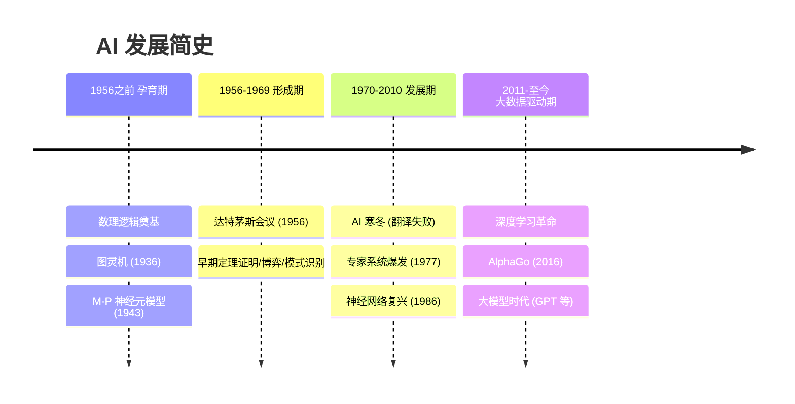

# 人工智能发展简史

## 四阶段总览

## 关键转折点

| 时间 | 事件 | 意义 |
|------|------|------|
| 1956 | **达特茅斯会议** | AI 学科正式诞生，麦卡锡提出"人工智能"一词 |
| 1966 | 美国 ALPAC 报告 | 机器翻译失败 → **第一次 AI 寒冬** |
| 1977 | 费根鲍姆提出"知识工程" | 专家系统爆发，AI 从"通用求解"转向"领域知识" |
| 1986 | BP 算法推广 | 神经网络复兴，[连接主义](/articles/ai-ml/introduction-to-ai/concepts/人工智能三大学派/#%E4%BA%8C%E3%80%81%E8%BF%9E%E6%8E%A5%E4%B8%BB%E4%B9%89)崛起 |
| 2012 | AlexNet 赢得 ImageNet | 深度学习时代开启 |
| 2016 | AlphaGo 4:1 李世石 | AI 在围棋上超越人类顶级棋手 |
| 2022 | ChatGPT 发布 | 大语言模型走进大众，AI 能力被重新定义 |

## 孕育期（1956 之前）

| 里程碑 | 人物 | 贡献 |
|--------|------|------|
| 三段论 | 亚里士多德 | 最早的形式逻辑 |
| 归纳法 | 培根 | 从个别到一般的推理方法 |
| 万能符号 | 莱布尼茨 | 提出推理计算的思想 |
| 布尔代数 | 布尔 | 用符号逻辑描述推理 |
| 图灵机 | 图灵（1936） | 计算理论的数学基础 |
| M-P 神经元模型 | 麦克洛奇、匹兹（1943） | 人工神经网络的起点 |

## 形成期（1956-1969）

- 麦卡锡提出"**人工智能**"术语
- 早期成果覆盖：机器学习、定理证明、模式识别、博弈、专家系统、AI 语言
- 1969 年首届 **IJCAI** 国际人工智能联合会议
- 1970 年《**Artificial Intelligence**》国际期刊创刊

## 发展期（1970-2010）

- **第一次 AI 寒冬**：机器翻译项目受挫（1966 美政府 ALPAC 报告）
- **知识工程时代**（1977 费根鲍姆）：专家系统爆发
- 不确定性推理理论突破：主观 Bayes、确定性理论、证据理论
- 1986 后集成发展期：计算智能完善 AI 理论框架

## 大数据驱动期（2011-至今）

- 底层支撑：物联网、大数据、云计算协同赋能 AI
- **专用人工智能**：面向单一任务，单项能力超越人类（AlphaGo、人脸识别、医学影像识别）
- **通用人工智能（AGI）**：多模态综合智能，尚处于起步阶段

> **AI 寒冬的教训**：早期对机器翻译的过度乐观导致期望落空、经费削减。此后 AI 研究学会了更务实地设定目标——这是"技术成熟度曲线"的经典案例。

## 相关概念

- [人工智能的概念与定义](/articles/ai-ml/introduction-to-ai/concepts/人工智能的概念与定义/)
- [人工智能三大学派](/articles/ai-ml/introduction-to-ai/concepts/人工智能三大学派/)
- [人工智能研究领域](/articles/ai-ml/introduction-to-ai/concepts/人工智能研究领域/)
- [人工智能](/articles/ai-ml/machine-learning/concepts/人工智能/)
