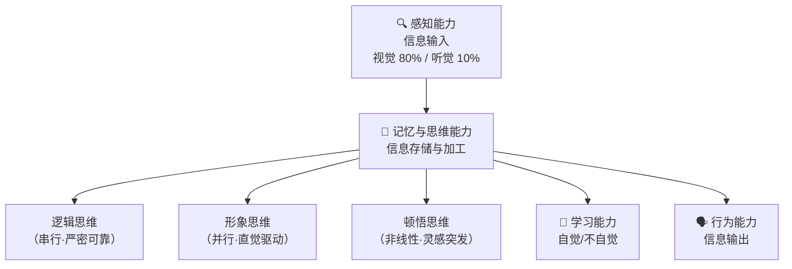

# 人工智能的概念与定义

## 定义

**人工智能**（Artificial Intelligence，AI）是计算机科学的一个分支，旨在构造能够模拟、延伸和扩展人类智能的机器系统。

- **工程层面**：用人工方法在计算机上实现类人智能
- **学科层面**：研究如何构造智能机器/系统，模拟、延伸和扩展人类智能

## 智能 = 知识 + 智力

| 维度 | 定义 | 说明 |
|------|------|------|
| **知识** | 智能行为的基础 | 事实、规则、经验的内化积累 |
| **智力** | 获取并运用知识求解问题的能力 | 推理、学习、适应、创造 |

**三类智能理论**：

| 理论 | 核心观点 | 局限 |
|------|----------|------|
| **思维理论** | 智能取决于思维能力 | 忽略了知识的作用 |
| **知识阈值理论** | 知识量超过阈值即产生智能 | 忽略了思维品质的差异 |
| **进化理论** | 智能是生物体适应环境的产物 | 难以解释高级抽象思维 |

## 智能的四个特征

| 思维类型 | 执行方式 | 特点 | 典型场景 |
|----------|----------|------|----------|
| **逻辑思维** | 串行 | 严密、可靠、易形式化 | 数学证明、编程 |
| **形象思维** | 并行 | 依赖直觉、残缺信息下仍可推理 | 人脸识别、艺术创作 |
| **顿悟思维** | 非线性 | 突发性、独创性 | 科学发现、Eureka 时刻 |

## 两大经典验证

| 测试 | 提出者 | 年份 | 核心思想 | 争议 |
|------|--------|------|----------|------|
| **图灵测试** | 图灵 | 1950 | 若机器在对话中让人类无法分辨其为机器，则具备智能 | 仅测试行为，不测试"理解" |
| **中文屋** | 塞尔 | 1980 | 屋内人按规则手册处理中文，输出正确但完全不懂中文 | 反驳：行为模拟 ≠ 真正理解 |

> [!tip] 核心洞察
> 图灵测试衡量"看起来是否智能"，中文屋实验追问"是否真的理解"。ChatGPT 能否通过图灵测试？它真的"理解"语言吗？这是 AI 哲学的核心命题。

## 相关概念

- [人工智能三大学派](/articles/ai-ml/introduction-to-ai/concepts/人工智能三大学派/)
- [人工智能发展简史](/articles/ai-ml/introduction-to-ai/concepts/人工智能发展简史/)
- [人工智能研究领域](/articles/ai-ml/introduction-to-ai/concepts/人工智能研究领域/)
- [人工智能（机器学习视角）](/articles/ai-ml/machine-learning/concepts/人工智能/)
