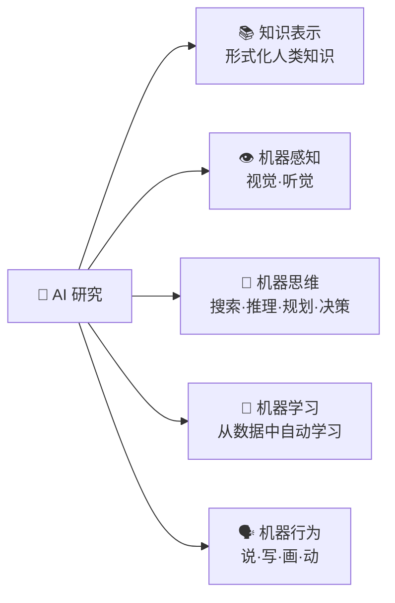

# 人工智能研究领域

## 五大基本研究内容

### 知识表示

将人类知识转化为计算机可操作的形式化结构。详见 [知识的概念与表示](/articles/ai-ml/introduction-to-ai/concepts/知识的概念与表示/)。

### 机器感知

通过传感器采集物理信号 → 信号处理/特征提取 → 模式识别与理解。两大分支：**机器视觉**、**机器听觉**。

| 子领域 | 优点 | 缺点 | 里程碑 |
|--------|------|------|--------|
| **机器视觉** | 超越人眼精度和速度 | 光照/遮挡/角度敏感 | ResNet（2015）错误率 3.57% < 人类 5.1% |
| **机器听觉** | 可分析亚声/超声频段 | 噪声环境下性能骤降 | Siri/Alexa/科大讯飞 |

### 机器思维

对感知信息和存储知识进行目的性处理。核心技术：**搜索**（A\*）、**推理**（归结原理）、**规划**（STRIPS）、**决策**（博弈树）。详见 [推理的基本概念](/articles/ai-ml/introduction-to-ai/concepts/推理的基本概念/)。

### 机器学习

从数据中寻找函数 f，使 f(输入) ≈ 输出。四大范式：**监督学习**、**无监督学习**、**半监督学习**、**强化学习**。详见 [机器学习](/articles/ai-ml/machine-learning/concepts/机器学习/)。

### 机器行为

将内部处理结果输出到物理世界或信息空间。趋势：预编程 → 自适应 → 生成式（大模型创造新内容）。

---

## 核心应用领域

| 领域 | 原理 | 里程碑 |
|------|------|--------|
| **自动定理证明** | 归结原理验证"前提→结论"永真性 | 吴方法（1977）、Robinson 归结（1965） |
| **博弈** | 搜索+评估找到最优策略 | 深蓝（1997）、AlphaGo（2016） |
| **模式识别&视觉** | 信号→特征空间→分类 | AlexNet（2012）、ResNet（2015） |
| **NLP** | 规则→统计→RNN→Transformer→GPT | ChatGPT（2022） |
| **专家系统** | 知识库+推理机搜索求解 | MYCIN（1976） |
| **数据挖掘** | 从数据库自动发现隐藏模式 | 关联规则（啤酒与尿布） |
| **智能机器人** | 感知→规划→控制三大模块 | 达芬奇手术机器人、Atlas |
| **无人驾驶** | 感知→SLAM→预测→规划→控制 | Waymo |
| **具身智能** | 身体-大脑-环境三位一体 | PaLM-SayCan |

## 其他重要领域

| 领域 | 概括 |
|------|------|
| **语音识别** | 声波→文本，已接近人类水平 |
| **机器翻译** | Google NMT（2016）神经翻译革命 |
| **智能信息检索** | Google 搜索、RAG 检索增强生成 |
| **自动程序设计** | GitHub Copilot、Cursor |
| **组合优化** | NP 难问题求近似解（TSP 旅行商） |
| **多智能体系统** | 星际争霸 AlphaStar（2019） |
| **云端 AI** | AWS SageMaker、Google Vertex AI |
| **脑机接口（BCI）** | Neuralink、BrainGate |
| **智慧医疗** | AlphaFold 蛋白质结构预测 |

## 相关概念

- [人工智能的概念与定义](/articles/ai-ml/introduction-to-ai/concepts/人工智能的概念与定义/)
- [人工智能三大学派](/articles/ai-ml/introduction-to-ai/concepts/人工智能三大学派/)
- [知识的概念与表示](/articles/ai-ml/introduction-to-ai/concepts/知识的概念与表示/)
- [推理的基本概念](/articles/ai-ml/introduction-to-ai/concepts/推理的基本概念/)
- [机器学习](/articles/ai-ml/machine-learning/concepts/机器学习/)
- [深度学习应用领域](/articles/ai-ml/deep-learning/concepts/深度学习应用领域/)
