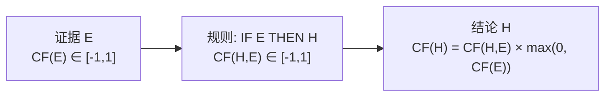

# 可信度方法（C-F Model）

## 定义

**可信度方法**（Certainty Factor）由 **Shortliffe（1975）** 在开发 MYCIN 专家系统时提出。用一个 `[-1, 1]` 的数值描述知识/证据/结论的可信程度——1 为确定真，0 为未知，-1 为确定假。

## 原理



**两类 CF 值**：

| 类型 | 含义 | 来源 |
|------|------|------|
| **静态强度** CF(H,E) | 规则本身的可靠程度 | 专家给定 |
| **动态强度** CF(E) | 证据当前的可信程度 | 观察/计算 |

## 核心算法

**组合证据**：
- 合取 AND: `CF(E₁∧E₂) = min(CF(E₁), CF(E₂))`
- 析取 OR: `CF(E₁∨E₂) = max(CF(E₁), CF(E₂))`

**不确定性传递**：`CF(H) = CF(H,E) × max(0, CF(E))`

**多规则结论合成**：

| 情况 | 公式 |
|------|------|
| CF₁>0 且 CF₂>0 | CF = CF₁ + CF₂ − CF₁×CF₂ |
| CF₁<0 且 CF₂<0 | CF = CF₁ + CF₂ + CF₁×CF₂ |
| 异号 | CF = (CF₁+CF₂)/(1−min(\|CF₁\|,\|CF₂\|)) |

## 经典例子：呼吸道感染诊断

```
R1: IF 发烧(0.7) AND 咳嗽(0.6) THEN 呼吸道感染  CF=0.8
R2: IF 呼吸道感染           THEN 需要抗生素   CF=0.9

CF(发烧∧咳嗽) = min(0.7, 0.6) = 0.6
CF(呼吸道感染) = 0.8 × 0.6 = 0.48
CF(需要抗生素) = 0.9 × 0.48 = 0.432
```

## 优缺点

| ✅ | ❌ |
|----|----|
| 公式简单直观 | 主观性强（CF 值靠专家拍） |
| 工程效果好 | 缺乏严格概率论基础 |
| AND/OR 组合自然 | 无法区分"不知道"与"否定" |

## 相关概念

- [产生式系统](/articles/ai-ml/introduction-to-ai/concepts/产生式系统/)
- [证据理论](/articles/ai-ml/introduction-to-ai/concepts/证据理论/)
- [推理的基本概念](/articles/ai-ml/introduction-to-ai/concepts/推理的基本概念/)
