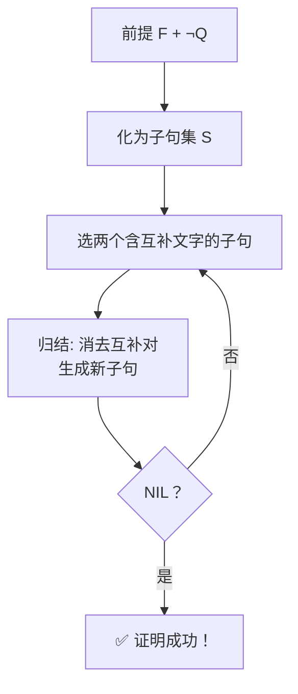
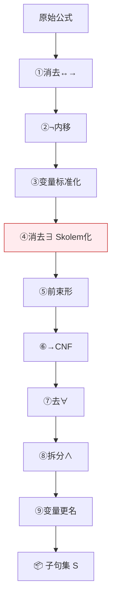

# 归结原理

## 定义

**归结原理**（Resolution Principle）由 **Robinson（1965）** 提出，是自动定理证明的里程碑——用**唯一一条推理规则**（消去互补文字）取代了所有传统推理规则（假言推理、拒取式、三段论等全是归结的特例），让机器自动推理成为可能。

## 核心思想：反证法

```
要证明 "前提 F 蕴含结论 Q"  (F ⊢ Q)
⟹ 等价于证明 "F ∧ ¬Q 不可满足"
⟹ 将 F ∧ ¬Q 化为子句集 S
⟹ 对 S 反复归结，若推出空子句 NIL → 证明完成
```



---

## 前置：九步标准化转换（公式 → 子句集）



| # | 步骤 | 关键技巧 |
|:--:|------|------|
| ① | 消去 ↔ → | `P→Q` → `¬P∨Q` |
| ② | ¬ 内移 | `¬∀xP` → `∃x¬P`（德摩根+量词转换） |
| ③ | 变量标准化 | 不同量词的同名变量改名 |
| ④ | **Skolem 化** | 消 ∃：外层无 ∀ → 常量；有 ∀ → 函数 |
| ⑤ | 前束形 | 所有 ∀ 移至前端 |
| ⑥ | →CNF | 分配律：`P∨(Q∧R) ≡ (P∨Q)∧(P∨R)` |
| ⑦ | 去 ∀ | 默认全称量化，省略 |
| ⑧ | 拆分 ∧ | 合取各部分独立成子句 |
| ⑨ | 变量更名 | 子句间变量互不干扰 |

### Skolem 化详解

| 情况 | ∃ 在谁的辖域里？ | 用什么替换？ |
|------|:---------------:|--------------|
| A | 不被任何 ∀ 约束 | **常量** a, b, c... |
| B | 在 ∀ 辖域内 | **Skolem 函数** f(外层∀变元...) |

经典对比：
- `∃x∀y Loves(x,y)` → `∀y Loves(a,y)`（∃ 在最外层 → 常量 a）
- `∀x∃y Loves(x,y)` → `∀x Loves(x, f(x))`（∃y 在 ∀x 辖域 → 函数 f(x)）

> 用常量会把"每个人爱不同人"变成"所有人爱同一个人"——**意思完全变了！**

---

## 命题逻辑归结

消去互补文字（P 和 ¬P），剩余文字析取：

```
C1: P ∨ Q       C2: ¬P ∨ R
──────────────────────────
归结式:  Q ∨ R          (消去 P 和 ¬P)
```

## 谓词逻辑归结（含变量）

含变量子句不能直接归结——需要先**合一**（Unification）。

### 合一算法（MGU）

找到使两个表达式在语法上完全相同的最简变量替换。

**逐迭代演示**：将 `P(a, x, f(g(y)))` 与 `P(z, f(z), f(u))` 合一

| 迭代 | 分歧 | 操作 | σ |
|:--:|------|------|-----|
| 1 | a ≠ z | z←a（常 vs 变） | {z/a} |
| 2 | x ≠ f(a) | x←f(a)（变 vs 项） | {z/a, x/f(a)} |
| 3 | g(y) ≠ u | u←g(y)（项 vs 变） | {z/a, x/f(a), u/g(y)} |
| 4 | 完全一致 ✓ | — | — |

### 合一规则速查

| 相遇类型 | 条件 | 操作 |
|----------|------|------|
| 常量 vs 变量 | 常≠变 | 变量→常量 |
| 变量 vs 复合项 | 变量不在该项中 | 变量→项 |
| 变量 vs 变量 | 无约束 | 任一→另一 |
| 常量 vs 常量 | 相等 | 跳过 |
| 常量 vs 常量 | 不相等 | ❌ 失败 |
| 函数 vs 函数 | 同名 | 递归合一参数 |
| 函数 vs 函数 | 异名 | ❌ 失败 |
| 变量 vs 含自身的项 | Occurs Check | ❌ 失败（x vs f(x) 无限循环） |

---

## 归结反演（证明定理）

### 核心定理

> Q 是 F 的逻辑结论 ⇔ F ∧ ¬Q 不可满足

### 证明四步法

```
① 翻译前提为谓词公式集 F
② 待证结论 Q 取反 → ¬Q
③ F 与 ¬Q 合并 → 子句集 S
④ 反复归结 S → 出现 NIL → ✅ 证明成功
```

### 例子：亲属关系推理

```
已知:
  F1: ∀x∀y (Father(x,y) → Parent(x,y))
  F2: ∀x∀y (Mother(x,y) → Parent(x,y))
  F3: ∀x∀y∀z (Parent(x,y) ∧ Parent(y,z) → GrandParent(x,z))
  F4: Father(John, Mary)
  F5: Mother(Mary, Tom)
目标: GrandParent(John, Tom)

子句集: {
  C1: ¬Father(x,y) ∨ Parent(x,y)
  C2: ¬Mother(x,y) ∨ Parent(x,y)
  C3: ¬Parent(x,y) ∨ ¬Parent(y,z) ∨ GrandParent(x,z)
  C4: Father(John, Mary)
  C5: Mother(Mary, Tom)
  C6: ¬GrandParent(John, Tom)  ← ¬Q
}

归结:
  C7: Parent(John, Mary)                  (C1, C4 MGU)
  C8: Parent(Mary, Tom)                   (C2, C5 MGU)
  C9: ¬Parent(Mary,Tom) ∨ GrandParent(John,Tom)  (C3, C7 MGU)
  C10: GrandParent(John, Tom)             (C8, C9)
  C11: NIL □                              (C6, C10) → 证明成功！
```

---

## ANSWER 提取法（求解问题）

证明 Q 成立还不够——有时候要**求出"谁"让 Q 成立**。

```
① 前提 → 子句集 S
② 目标 Q 取反 + ANSWER:  ¬Q(x) ∨ ANSWER(x)
③ 并入 S' = S ∪ {¬Q∨ANSWER}
④ 归结 S'
⑤ 归结出 ANSWER(值) → 值即答案
```

> **原理**：`¬TeacherOf(w, X) ∨ ANSWER(w)` — "要么 w 不是老师，要么把 w 记入 ANSWER"。归结中 `¬TeacherOf` 与前提推导出的 `TeacherOf(Zhang, X)` 互补消去，w 被替换为 Zhang，留下 `ANSWER(Zhang)`。

## 优劣总结

| ✅ | ❌ |
|----|----|
| 单一推理规则 | 组合爆炸 |
| 完备（不可满足→必出 NIL） | 方向性缺失，盲目归结 |
| 机械可自动化 | 人类难理解归结过程 |
| 统一反证法框架 | 半可判定（可满足不一定能停） |

## 相关概念

- [推理的基本概念](/articles/ai-ml/introduction-to-ai/concepts/推理的基本概念/)
- [自然演绎推理](/articles/ai-ml/introduction-to-ai/concepts/自然演绎推理/)
- [一阶谓词逻辑](/articles/ai-ml/introduction-to-ai/concepts/一阶谓词逻辑/)
- [人工智能研究领域](/articles/ai-ml/introduction-to-ai/concepts/人工智能研究领域/)
