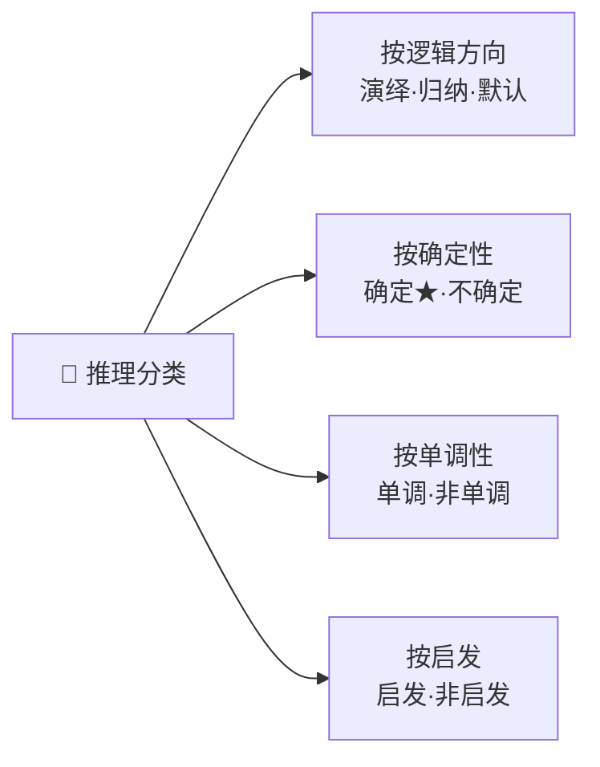

# 推理的基本概念

## 定义

**推理**是依据已有知识（事实+规则）推出中间结论或最终结果的思维过程。在 AI 中，推理是问题求解的**核心手段**——没有推理能力，知识只是一堆无法利用的数据。

## 四维分类体系

| 维度 | 类型 | 原理 | 示例 |
|------|------|------|------|
| **逻辑方向** | 演绎 | 一般→个别，必然性 | 所有人会死→诸葛亮会死 |
| | 归纳 | 个别→一般，不完全归纳非必然 | 1000 只白天鹅→"天鹅都白" |
| | 默认 | 知识不完备时假设典型情况 | "鸟会飞"（鸵鸟除外） |
| **确定性** | 确定 | 真值唯一 T/F | 数学证明 |
| | 不确定 | 含概率/模糊性 | "发烧**可能**感冒" |
| **单调性** | 单调 | 新知识不推翻旧结论 | 经典逻辑 |
| | 非单调 | 新知识可能否定旧结论 | "鸟会飞"→知是鸵鸟→撤回 |
| **启发** | 启发式 | 用经验缩小搜索 | A\* 算法 |
| | 非启发式 | 穷举所有可能 | [归结原理](/articles/ai-ml/introduction-to-ai/concepts/归结原理/) |

## 推理方向

### 正向推理（数据驱动）

从已知事实出发 → 匹配规则前提 → 触发生成新事实 → 反复循环至目标达成。

| 优点 | 缺点 |
|------|------|
| 实现简单，充分利用数据 | **目的性弱**——可能推大量无关中间结论 |

### 逆向推理（目标驱动）

从假设目标出发 → 反向找能推出目标的规则 → 规则前提变新子目标 → 递归求解。

| 优点 | 缺点 |
|------|------|
| **目的性强**，只推相关结论 | 初始目标选择盲目，回溯代价大 |

### 混合与双向

- **混合**：先正向推候选目标 → 逆向验证；或先逆向获线索 → 正向拓展
- **双向**：正向和逆向同步推理，中间结论相遇即完成

## 冲突消解策略

多条规则同时被事实满足时，选择触发哪条：

| 策略 | 规则 | 直觉 |
|------|------|------|
| **按针对性排序** | 前提越具体越优先 | "特殊情况优先" |
| **按新鲜度排序** | 用到越新生成的事实越优先 | "趁热打铁" |
| **按匹配度排序** | 被满足的条件数越多越优先 | "证据充分优先" |
| **按条件数量排序** | 前提条件数越多越优先 | "更严格的规则优先" |

## 相关概念

- [自然演绎推理](/articles/ai-ml/introduction-to-ai/concepts/自然演绎推理/)
- [归结原理](/articles/ai-ml/introduction-to-ai/concepts/归结原理/)
- [产生式系统](/articles/ai-ml/introduction-to-ai/concepts/产生式系统/)
- [一阶谓词逻辑](/articles/ai-ml/introduction-to-ai/concepts/一阶谓词逻辑/)
