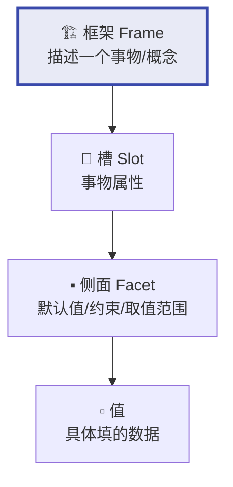
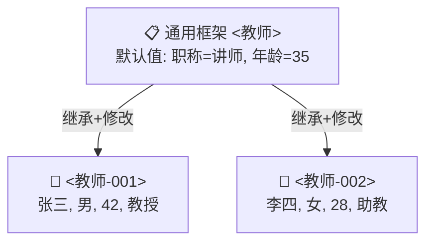

# 框架表示法

## 定义

**框架表示法**（Frame Representation）由**明斯基（1975）**提出，用"槽-侧面-值"三层结构描述具有层级关系的实体。它模仿人类"用典型模板套具体对象"的认知方式——提到"鸟"默认会飞，除非特别指明是鸵鸟。

## 核心结构：槽-侧面-值



| 层级 | 作用 | 示例 |
|------|------|------|
| **框架** | 一个概念或事物的完整描述 | `<教师>`、`<教室>`、`<地震>` |
| **槽** | 框架的一个属性 | 姓名、年龄、职称 |
| **侧面** | 属性的细分维度 | 默认值（缺省值）、取值范围、约束条件 |
| **值** | 具体填入的数据 | 张三、35、教授 |

## 实例：教师框架

**通用框架（类模板）**：
```
框架名: <教师>
槽-姓名:   侧面-默认值: 未知
槽-性别:   侧面-取值范围: {男, 女}
槽-年龄:   侧面-缺省值: 35
槽-职称:   侧面-默认值: 讲师   侧面-取值范围: {助教,讲师,副教授,教授}
槽-院系:   侧面-子框架: <院系>  ← 嵌套指向另一个框架！
```

**具体实例（填入数据）**：
```
框架名: <教师-001>
  继承: <教师>
槽-姓名: 张三 | 性别: 男 | 年龄: 42 | 职称: 教授 | 院系: <院系-计算机>
```



## 三大特性

| 特性 | 含义 | 示例 |
|------|------|------|
| **结构性** | 自动描述内部结构和事物间关系 | 教室框架嵌套墙体、门窗、黑板子框架 |
| **继承性** | 下层框架自动获得上层槽值 | `灾害→地震`：继承"地点、日期"，新增"震级" |
| **自然性** | 符合人类"典型+特例"认知模式 | 提到"鸟"默认会飞——除非指明是鸵鸟 |

## 优缺点

| ✅ 优点 | ❌ 缺点 |
|----------|----------|
| 结构化强，适合描述层级实体 | 不擅表达过程性知识（操作步骤） |
| 继承减少冗余 | 缺乏形式化语义 |
| 默认值处理不完整信息（缺省推理） | 推理机制不如[谓词逻辑](/articles/ai-ml/introduction-to-ai/concepts/一阶谓词逻辑/)严谨 |

## 经典例子：地震新闻理解

给定框架 `<地震>`（槽：地点、日期、震级、伤亡），当读到"今日四川 5.6 级地震"，自动填入对应槽。若未提伤亡数，槽保留为空（默认值或待补全），而不会崩溃——这就是**缺省推理**能力。

## 相关概念

- [知识的概念与表示](/articles/ai-ml/introduction-to-ai/concepts/知识的概念与表示/)
- [一阶谓词逻辑](/articles/ai-ml/introduction-to-ai/concepts/一阶谓词逻辑/)
- [产生式系统](/articles/ai-ml/introduction-to-ai/concepts/产生式系统/)
- [知识图谱](/articles/ai-ml/introduction-to-ai/concepts/知识图谱/)
