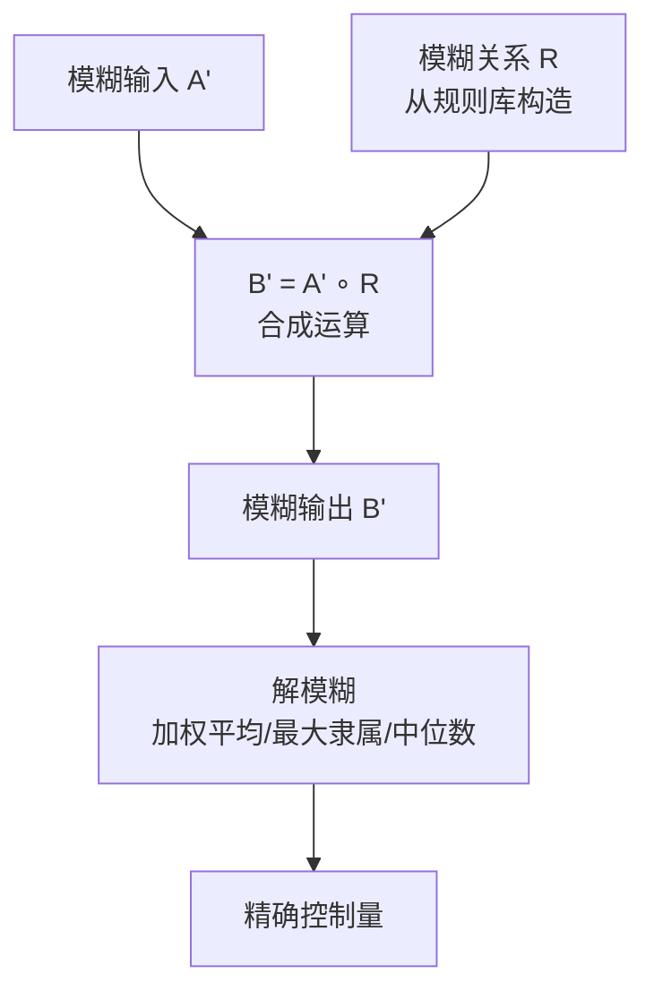

# 模糊推理

## 定义

**模糊推理**（Fuzzy Reasoning）由 **Zadeh（1965）** 提出。它不用概率，而是用**隶属度** μ(x) ∈ [0,1] 描述 x 属于某个模糊概念的程度——"37.8°C 算不算发烧？"经典逻辑说非黑即白，模糊逻辑说"0.7 的程度属于发烧"。

## 模糊集合 vs 经典集合

```
经典集合: 体温≥38°C→发烧, <38°C→不发烧（37.9°C 和 38.0°C 被硬性割裂）
模糊集合: μ_发烧(37.8)=0.7, μ_发烧(38.5)=0.95（平滑过渡）
```

**三种表示法**（Zadeh 法/序偶法/向量法）+ 三种常用隶属函数（三角/梯形/正态）

## 核心运算

| 运算 | 公式 | 直觉 |
|------|------|------|
| 交 A∩B | min(μ_A, μ_B) | "又高又瘦"取瓶颈 |
| 并 A∪B | max(μ_A, μ_B) | "高或瘦"取最优 |
| 补 ¬A | 1 − μ_A | 反过来 |

## 模糊推理流程



- **单条规则** "IF x is A THEN y is B" → `R = min(μ_A(x), μ_B(y))`
- **多条规则** → R = max(R₁, R₂, ...)
- **合成推理** → B' = A' ∘ R（∨-∧ 合成 = 模糊版矩阵乘法）

## 经典例子：温度-风门模糊控制

```
输入 26°C → 计算隶属度 → 模糊推理 → 解模糊 → 风门开 53°
（26°C既有一点"舒适"(0.8)又有一点"热"(0.3) → 加权平均得到中等开度）
```

## 优缺点

| ✅ | ❌ |
|----|----|
| 自然处理模糊概念 | 隶属函数设计依赖经验 |
| 数学成熟，工程应用广泛 | 解模糊会损失信息 |
| 不依赖精确数学模型 | 缺乏严格最优性证明 |

## 相关概念

- [可信度方法](/articles/ai-ml/introduction-to-ai/concepts/可信度方法/)
- [证据理论](/articles/ai-ml/introduction-to-ai/concepts/证据理论/)
- [推理的基本概念](/articles/ai-ml/introduction-to-ai/concepts/推理的基本概念/)
