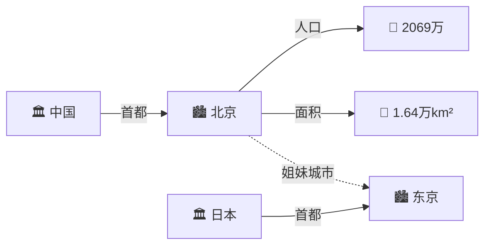
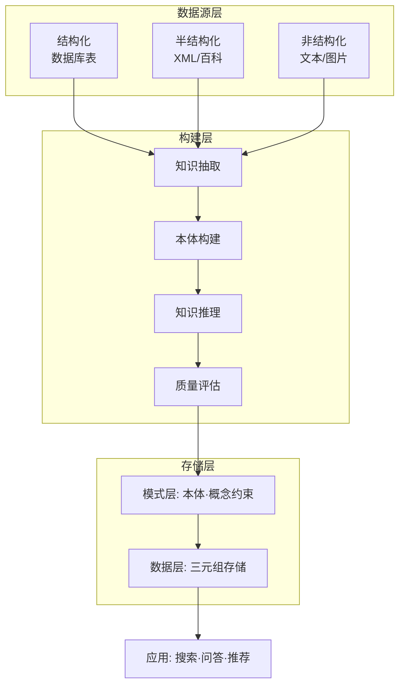

# 知识图谱

## 定义

**知识图谱**（Knowledge Graph）不是一种"新表示法"，而是将[谓词逻辑](/articles/ai-ml/introduction-to-ai/concepts/一阶谓词逻辑/) + [产生式](/articles/ai-ml/introduction-to-ai/concepts/产生式系统/) + [框架](/articles/ai-ml/introduction-to-ai/concepts/框架表示法/)的思想融合为大规模**图结构**。2012 年 Google 发布 Knowledge Graph，解决了"搜索'苹果'不知道用户要水果、公司还是电影"的语义歧义问题。

## 核心三元组

知识图谱的最小存储单元：

| 类型 | 格式 | 示例 |
|------|------|------|
| **实体-关系-实体** | (头实体, 关系, 尾实体) | `(中国, 首都, 北京)` |
| **实体-属性-属性值** | (实体, 属性, 值) | `(北京, 人口, 2069万)` |

> 知识图谱 = 把全世界的信息编码为 **(头, 关系/属性, 尾)** 三元组的巨型网络。

## 架构

## 两种构建方式

| 方式 | 思路 | 优点 | 缺点 | 代表 |
|------|------|------|------|------|
| **自顶向下** | 先定义本体，再填充实体 | 结构严谨、质量高 | 覆盖有限、人工成本高 | 早期 Freebase |
| **自底向上** | 从开放数据抽取实体，后归纳本体 | 覆盖面广、自动化 | 质量参差、噪声多 | DBpedia、XLORE |

> 实际大项目**混合使用**：自顶向下保核心质量，自底向上扩覆盖面。

## 主流开源项目

| 项目 | 数据源 | 特点 | 规模 |
|------|--------|------|------|
| **DBpedia** | Wikipedia 信息框 | 结构化版维基，Linked Data 核心 | 数十亿三元组 |
| **YAGO** | Wiki + WordNet + GeoNames | 带时间空间标注 | 1.24 亿+ 三元组 |
| **XLORE** | 中英文维基/百科 | 清华开发，中英双语平衡 | 千万级实体 |

## 优缺点

| ✅ 优点 | ❌ 缺点 |
|----------|----------|
| 图结构直观，人机皆可读 | 构建成本高：实体消歧、关系抽取是 NLP 难题 |
| 支持推理：沿边遍历发现隐含关系 | 时效性差：现实变化快于知识更新 |
| 可扩展：新实体/关系自然融入 | 知识冲突：多源数据可能矛盾 |

## 经典例子：Google 知识面板

2012 年前搜索"Picasso"只返回蓝色链接。有了知识图谱后，右侧出现**知识面板**：出生日期、代表作、艺术流派、相关人物——聚合自 DBpedia、Freebase 等多源数据，实时拼出毕加索的"知识画像"。

## 相关概念

- [知识的概念与表示](/articles/ai-ml/introduction-to-ai/concepts/知识的概念与表示/)
- [一阶谓词逻辑](/articles/ai-ml/introduction-to-ai/concepts/一阶谓词逻辑/)
- [产生式系统](/articles/ai-ml/introduction-to-ai/concepts/产生式系统/)
- [框架表示法](/articles/ai-ml/introduction-to-ai/concepts/框架表示法/)
- [推理的基本概念](/articles/ai-ml/introduction-to-ai/concepts/推理的基本概念/)
