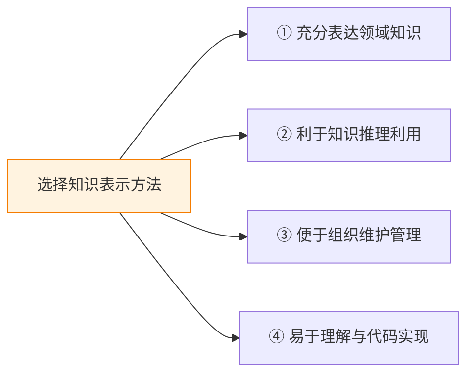
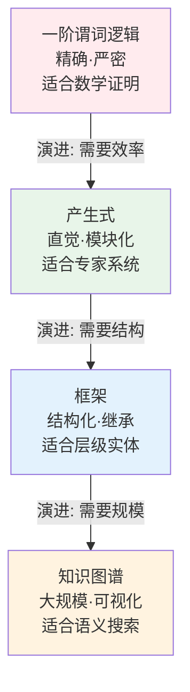

# 知识的概念与表示

## 什么是知识

**知识**是把有关信息关联在一起形成的信息结构——是对客观世界的认识和经验，反映不同事物之间的联系。

| 形式 | 定义 | 示例 |
|------|------|------|
| **事实** | 描述客观事物 | "雪是白色的""北京是中国的首都" |
| **规则** | 事物间的关联（如果…则…） | "如果头痛流涕，则可能感冒" |

> 事实告诉机器"是什么"，规则告诉机器"怎么推"——二者结合才能完成智能推理。

## 知识的四大特性

| 特性 | 含义 | 经典例子 |
|------|------|----------|
| **相对正确性** | 知识只在特定条件下成立 | 十进制 `1+1=2`，二进制 `1+1=10` |
| **不确定性** | 四类成因：随机/模糊/经验/不完全 | 赤壁东风（随机）、"年轻人"（模糊）、老马识途（经验）、火星生命（不完全） |
| **可表示性** | 知识必须能编码为机器可读结构 | 文字符号、数学公式、神经网络权值、三元组 |
| **可利用性** | 表示的目的是使用——能推理出新知识 | 从"所有人都会死"+"诸葛亮是人"推导出"诸葛亮会死" |

## 知识表示的选择原则

> 不存在"最好的"知识表示方法——**只有最适合特定问题的方法**。

## 四种主要表示方法

| 方法 | 推理方式 | 不确定性 | 规模 | 典型应用 |
|------|----------|:--------:|------|----------|
| 谓词逻辑 | 归结/假言推理 | ❌ | 几十~几百条 | 定理证明、Prolog |
| 产生式 | 匹配-触发 | ✅ 置信度 | 几百~几万条 | 专家系统 |
| 框架 | 继承/默认推理 | ✅ 默认值 | 数百框架 | 自然语言理解 |
| 知识图谱 | 图遍历/路径推理 | ✅ 概率 KG | 数十亿三元组 | 语义搜索、问答 |

## 相关概念

- [一阶谓词逻辑](/articles/ai-ml/introduction-to-ai/concepts/一阶谓词逻辑/)
- [产生式系统](/articles/ai-ml/introduction-to-ai/concepts/产生式系统/)
- [框架表示法](/articles/ai-ml/introduction-to-ai/concepts/框架表示法/)
- [知识图谱](/articles/ai-ml/introduction-to-ai/concepts/知识图谱/)
- [推理的基本概念](/articles/ai-ml/introduction-to-ai/concepts/推理的基本概念/)
- [归结原理](/articles/ai-ml/introduction-to-ai/concepts/归结原理/)
