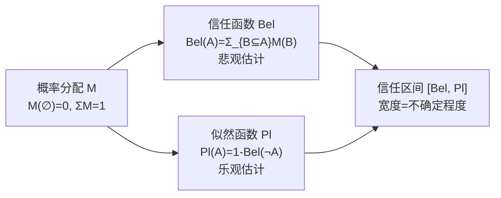

# 证据理论（D-S Theory）

## 定义

**Dempster-Shafer 证据理论**（Dempster 1967 奠基，Shafer 1976 完善）的核心突破：**区分"不知道"和"否定"**。它用信任区间 [Bel, Pl] 代替单点概率——Bel 是悲观估计，Pl 是乐观估计，区间宽度就是"不知道"的空间。

## 为什么需要 D-S？

```
贝叶斯: P(有)=0.3, P(无)=0.7 → 强制对立，无法表达"我不确定"
D-S:    Bel(有)=0, Pl(有)=0.5 → "最多50%，最少0%，剩下50%不知道"
```

## 核心三函数



| 区间 | 含义 |
|------|------|
| [0, 0] | 确定为假 |
| [1, 1] | 确定为真 |
| [0, 1] | **完全无知** |
| [0.3, 0.3] | 精确概率 0.3（退化为贝叶斯） |

## 双证据组合（正交和）

```
M(A) = (1/(1-K)) × Σ_{X∩Y=A} M₁(X) × M₂(Y)
K = Σ_{X∩Y=∅} M₁(X) × M₂(Y)   ← 冲突系数
```

> [!important] K 的正确含义
> - K = 0：无冲突，证据完全一致
> - 0 < K < 1：部分冲突，可归一化组合
> - K → 1：高度矛盾，组合结果不可靠

## 经典例子：医疗综合诊断

证据 1（血常规）: M₁({感,肺})=0.6, M₁({脑})=0.3, M₁(D)=0.1
证据 2（X 光）: M₂({感})=0.5, M₂({肺})=0.3, M₂(D)=0.2

正交和结果: K=0.24 → 感冒信任区间 [0.461, 0.645]

## 优缺点

| ✅ | ❌ |
|----|----|
| 区分"不知道"与"否定" | 子集数 = 2^|D|，指数爆炸 |
| 先验概率不需要 | K→1 时组合不可靠 |
| 多源组合有严格数学基础 | BPA 获取依赖专家 |

## 相关概念

- [可信度方法](/articles/ai-ml/introduction-to-ai/concepts/可信度方法/)
- [模糊推理](/articles/ai-ml/introduction-to-ai/concepts/模糊推理/)
- [推理的基本概念](/articles/ai-ml/introduction-to-ai/concepts/推理的基本概念/)
