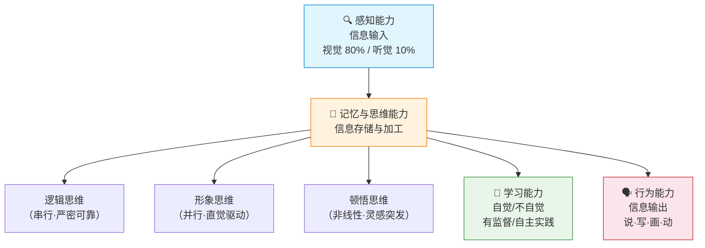
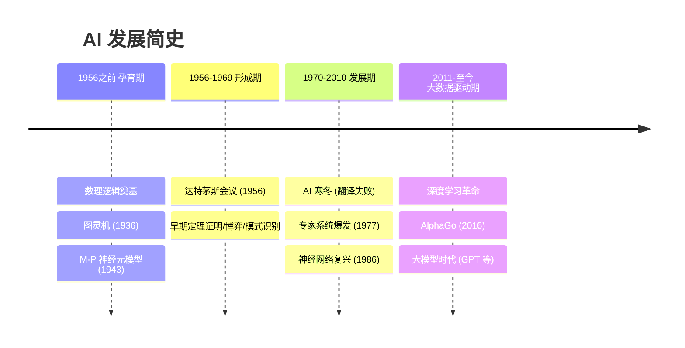
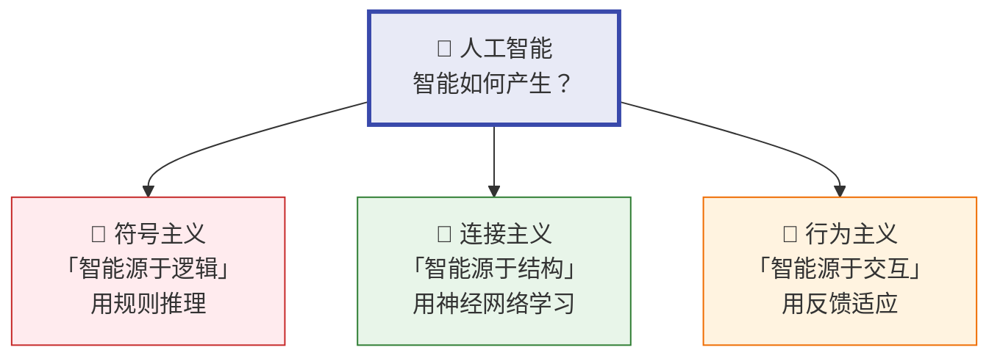
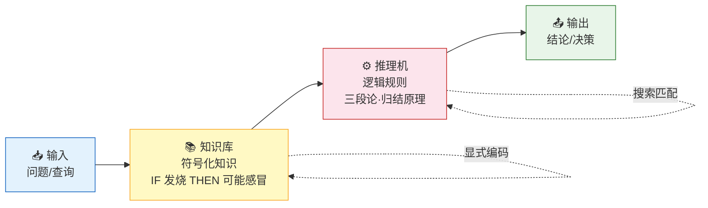
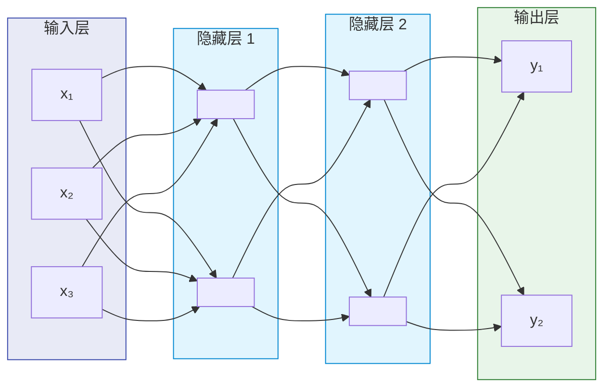
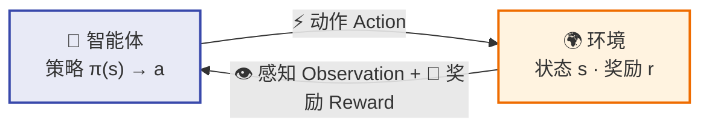
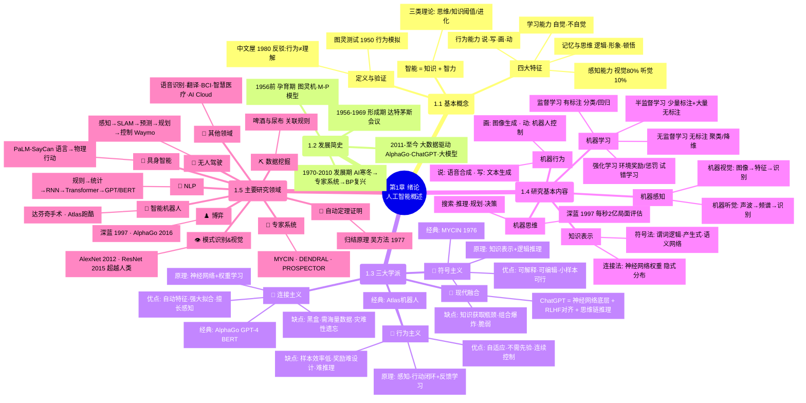

# 第1章 绪论 — 人工智能概述

> 本章从概念、历史、学派、研究内容和应用领域五个维度，建立对人工智能的全局认知框架。

> [!abstract] 📘 知识点导航
> | 知识块 | 概念页 |
> |--------|--------|
> | 智能与 AI 定义 | [人工智能的概念与定义](/articles/ai-ml/introduction-to-ai/concepts/人工智能的概念与定义/) |
> | 发展历史 | [人工智能发展简史](/articles/ai-ml/introduction-to-ai/concepts/人工智能发展简史/) |
> | 三大学派 | [人工智能三大学派](/articles/ai-ml/introduction-to-ai/concepts/人工智能三大学派/) |
> | 研究领域 | [人工智能研究领域](/articles/ai-ml/introduction-to-ai/concepts/人工智能研究领域/) |

---

## 1.1 人工智能的基本概念

### 1.1.1 什么是智能

**智能**是知识与智力的总和：

| 维度 | 定义 | 说明 |
|------|------|------|
| **知识** | 智能行为的基础 | 事实、规则、经验的内化积累 |
| **智力** | 获取并运用知识求解问题的能力 | 推理、学习、适应、创造 |

**三类智能理论**：

| 理论 | 核心观点 | 局限 |
|------|----------|------|
| **思维理论** | 智能取决于思维能力 | 忽略了知识的作用 |
| **知识阈值理论** | 知识量超过阈值即产生智能 | 忽略了思维品质的差异 |
| **进化理论** | 智能是生物体适应环境的产物 | 难以解释高级抽象思维 |

> **经典例子**：人类能认出不同光照、角度下的人脸——这需要同时调用感知（视觉）、记忆（人脸库）、思维（模式匹配）三种能力，缺一不可。

### 1.1.2 智能的四个特征

**三种思维形式的对比**：

| 思维类型 | 别名 | 执行方式 | 特点 | 典型场景 |
|----------|------|----------|------|----------|
| **逻辑思维** | 抽象思维 | 串行 | 严密、可靠、易形式化 | 数学证明、编程 |
| **形象思维** | 直感思维 | 并行 | 依赖直觉、残缺信息下仍可推理 | 人脸识别、艺术创作 |
| **顿悟思维** | 灵感思维 | 非线性 | 突发性、独创性 | 科学发现、Eureka 时刻 |

### 1.1.3 人工智能的定义与验证

**双重定义**：
- **工程层面**：用人工方法在计算机上实现类人智能
- **学科层面**：研究如何构造智能机器/系统，模拟、延伸和扩展人类智能

**两大经典验证**：

| 测试 | 提出者 | 年份 | 核心思想 | 争议 |
|------|--------|------|----------|------|
| **图灵测试** | 图灵 | 1950 | 若机器在对话中让人类无法分辨其为机器，则具备智能 | 仅测试行为，不测试"理解" |
| **中文屋** | 塞尔 | 1980 | 屋内人按规则手册处理中文，输出正确但完全不懂中文 | 反驳：行为模拟 ≠ 真正理解 |

> [!tip] 核心洞察
> 图灵测试衡量"看起来是否智能"，中文屋实验追问"是否真的理解"。这场争论至今未落幕——ChatGPT 能否通过图灵测试？它真的"理解"语言吗？这是 AI 哲学的核心命题。

---

## 1.2 人工智能的发展简史

**关键转折点**：

| 时间 | 事件 | 意义 |
|------|------|------|
| 1956 | **达特茅斯会议** | AI 学科正式诞生，麦卡锡提出"人工智能"一词 |
| 1966 | 美国 ALPAC 报告 | 机器翻译失败 → **第一次 AI 寒冬** |
| 1977 | 费根鲍姆提出"知识工程" | 专家系统爆发，AI 从"通用求解"转向"领域知识" |
| 1986 | BP 算法推广 | 神经网络复兴，连接主义崛起 |
| 2012 | AlexNet 赢得 ImageNet | 深度学习时代开启 |
| 2016 | AlphaGo 4:1 李世石 | AI 在围棋上超越人类顶级棋手 |
| 2022 | ChatGPT 发布 | 大语言模型走进大众，AI 能力被重新定义 |

> **AI 寒冬的教训**：早期对机器翻译的过度乐观导致期望落空、经费削减。此后 AI 研究学会了更务实地设定目标——这是"技术成熟度曲线"的经典案例。

---

## 1.3 人工智能的三大学派

> 这是理解 AI 技术路线的**核心框架**。三大学派从不同角度回答同一个问题："智能如何产生？"

### 1.3.1 符号主义（Symbolism）——"逻辑学派"

> 别名：逻辑主义 / 心理学派 / 计算机学派

| 维度 | 内容 |
|------|------|
| **理论根基** | 数理逻辑（亚里士多德 → 布尔 → 弗雷格 → 罗素） |
| **核心原理** | 将知识用**符号**显式表示，通过**逻辑推理**操纵符号来模拟人类心智。智能 = 知识表示 + 推理机 |
| **技术路线** | 启发式算法 → 专家系统 → 知识工程 → 知识图谱 |

**原理详解**：

- 知识**显式编码**为"IF-THEN"产生式规则或谓词逻辑表达式
- 推理机对符号进行**搜索和匹配**，推导出新结论
- 典型技术：自动定理证明、专家系统、语义网络

**优点**：
- ✅ **高度可解释**：每一步推理都有迹可循，可向用户解释"为什么得出这个结论"
- ✅ **知识可编辑**：规则可人工增删修改，精确控制行为
- ✅ **小样本可行**：不需要海量数据，依赖专家知识即可工作
- ✅ **逻辑严密**：推理过程具有数学上的完备性和可靠性

**缺点**：
- ❌ **知识获取瓶颈**：专家知识难以穷举，隐性知识无法形式化
- ❌ **组合爆炸**：搜索空间随规则数量指数增长
- ❌ **脆弱性**：遇到规则库未覆盖的情况直接失效
- ❌ **难以处理感知**：无法从原始像素或音频中自动提取特征

> **经典例子：MYCIN 专家系统（1976）**
> 
> MYCIN 是斯坦福开发的医疗诊断系统，能根据血液感染症状推荐抗生素。其知识库包含 ~600 条规则。在 1979 年的正式评估中，MYCIN 给出的治疗方案**可接受率约 69%**（即专家评审认为其推荐与人类专科医生相当或更好），**超过了参与评估的部分感染科医生**。
> 
> 但它从未被实际临床使用——原因不是准确率不够，而是：① 每次诊断需要 30-60 分钟交互，医生嫌慢；② 法律责任无法界定（机器开药出事故谁负责？）。

### 1.3.2 连接主义（Connectionism）——"仿生学派"

> 别名：仿生学派 / 生理学派

| 维度 | 内容 |
|------|------|
| **理论根基** | 人脑神经元结构（M-P 神经元模型，1943） |
| **核心原理** | 用大量简单处理单元（人工神经元）的连接网络来模拟智能。智能 = 网络结构 + 连接权重。知识**隐式分布**在权值中，通过调整权值来"学习" |
| **技术路线** | M-P 模型 → 感知器 → BP 算法 → 深度学习 → 大模型 |

**原理详解**：

> 每个连接有权重 wᵢⱼ，学习 = 调整所有权重使输出逼近目标

- 单个神经元：加权求和 → 激活函数 → 输出
- 学习算法：**反向传播（BP）**——计算输出误差 → 逐层反向传播 → 梯度下降更新权重
- 深层网络可自动学习**层次化特征**（边缘 → 纹理 → 部件 → 物体）

**优点**：
- ✅ **自动特征提取**：不需要人工设计特征，端到端从原始数据学习
- ✅ **强大的拟合能力**：理论上可逼近任意连续函数（万能逼近定理）
- ✅ **擅长感知任务**：图像、语音、文本处理远超传统方法
- ✅ **海量数据驱动**：数据越多，表现越好（Scale 效应）

**缺点**：
- ❌ **可解释性差**：模型是"黑盒"，难以解释为什么做出某个决策
- ❌ **需要大量数据**：深度学习通常需要百万级标注样本
- ❌ **计算资源巨大**：训练大模型需数千 GPU 时，成本高昂
- ❌ **灾难性遗忘**：在新任务上微调后，旧的学到的知识可能被覆盖
- ❌ **易受对抗攻击**：人眼不可察觉的像素扰动可导致模型完全误判

> **经典例子：AlphaGo（2016）**
> 
> DeepMind 的 AlphaGo 使用深度神经网络 + 蒙特卡洛树搜索，以 4:1 击败围棋世界冠军李世石。其核心创新是将**监督学习**（从人类棋谱学习）、**强化学习**（自我对弈）和**蒙特卡洛搜索**（决策推理）结合。
> 
> AlphaGo Zero 更进一步——完全抛弃人类棋谱，仅靠自我对弈从零开始训练，40 天后超越所有此前版本。这说明至少在围棋这类"规则明确、反馈清晰"的领域，连接主义方法可以超越人类千年经验。

### 1.3.3 行为主义（Behaviorism）——"控制论学派"

> 别名：进化主义 / 控制论学派

| 维度 | 内容 |
|------|------|
| **理论根基** | 维纳《控制论》（1948） |
| **核心原理** | 智能不需要内部的符号表示或推理，而是在**感知-行动**的闭环中涌现。智能体通过与环境持续交互、获得反馈（奖励/惩罚），自适应地调整行为 |
| **技术路线** | 控制论 → 三大并行分支：强化学习、进化计算、具身智能 |

**原理详解**：

> 学习信号来自环境反馈，而非显式标注或规则。核心循环：**状态 → 动作 → 奖励 → 更新策略 → 新状态**

- 核心概念：**状态（State）→ 动作（Action）→ 奖励（Reward）** 循环
- 目标：学习一个**策略**，使长期累积奖励最大化
- **Model-Free**（无模型）：直接从试错中学习，不构建环境模型（如 Q-Learning）
- **Model-Based**（有模型）：先学习环境的内部模型，再在模型中规划最优动作

**优点**：
- ✅ **自适应性强**：能适应动态变化的环境，实时调整行为
- ✅ **不需要先验知识**：不需要标注数据集或知识库
- ✅ **可处理连续控制**：天然适合机器人、自动驾驶等物理交互任务
- ✅ **涌现复杂行为**：简单反馈规则叠加可产生看似智能的行为

**缺点**：
- ❌ **样本效率极低**：需要海量试错交互，在真实世界成本高昂
- ❌ **奖励函数设计困难**：复杂任务难以定义合适的奖励信号
- ❌ **难以处理符号推理**：不适合数学证明、逻辑规划等抽象任务
- ❌ **安全性难保障**：试错过程中的行为可能造成实际损害
- ❌ **泛化能力有限**：在一个环境中学会的策略难以迁移到不同环境

> **经典例子：波士顿动力 Atlas 人形机器人**
> 
> Atlas 能完成跑酷、后空翻、搬运重物等复杂动作——这些行为并非靠精确编程每一个关节角度，而是通过**模型预测控制（MPC）**在"感知-规划-执行"闭环中实时调整。机器人持续感知自身质心、地面反作用力等状态，每毫秒级计算出最优动作序列。
> 
>  它体现了行为主义的精髓： 智能行为从身体与环境的实时交互中涌现，而非来自大脑中的符号运算。

### 三大学派对比总结

| 维度       | 符号主义            | 连接主义               | 行为主义                    |
| -------- | --------------- | ------------------ | ----------------------- |
| **核心隐喻** | 大脑 = 计算机        | 大脑 = 神经网络          | 大脑 = 控制器                |
| **智能来源** | 知识+逻辑推理         | 数据+连接权重            | 环境交互+反馈                 |
| **知识表示** | 显式符号（规则）        | 隐式分布（权值）           | 无需表示                    |
| **学习方式** | 知识工程（人工注入）      | 数据驱动（梯度下降）         | 试错（强化学习）                |
| **可解释性** | ⭐⭐⭐⭐⭐           | ⭐                  | ⭐⭐                      |
| **数据处理** | 符号、结构化数据        | 图像、语音、文本           | 传感器信号                   |
| **典型应用** | 专家系统、定理证明       | 图像识别、大语言模型         | 机器人、自动驾驶                |
| **代表成果** | MYCIN、深蓝、Watson | AlphaGo、GPT-4、BERT | Atlas、Dota2 OpenAI Five |

> [!important] 现代趋势
> 当前 AI 前沿是**三大学派融合**。以 ChatGPT 为代表的大模型：其底层是**连接主义**（神经网络），但其强化学习微调阶段（RLHF）吸收了**行为主义**（通过人类反馈获得奖励信号），而思维链（Chain-of-Thought）推理体现了**符号主义**（逐步逻辑推导）的思想。单一范式已无法解释最先进的 AI 系统。

---

## 1.4 人工智能研究的基本内容

### 1.4.1 知识表示

| 维度 | 内容 |
|------|------|
| **原理** | 将人类知识转化为计算机可操作的形式化结构。好的知识表示需满足：**可表达性**（能表达所需知识）、**可推理性**（支持新结论推导）、**可修改性**（便于增删改）、**可理解性**（人类可读） |
| **两类方法** | ① **符号表示法**：谓词逻辑、产生式规则、语义网络、框架、本体 → 显式、可解释 ② **连接机制表示法**：神经网络权重 → 隐式、自动学习 |

| 表示方法 | 优点 | 缺点 | 例子 |
|----------|------|------|------|
| **谓词逻辑** | 严密、完备 | 组合爆炸 | `∀x (Human(x) → Mortal(x))` |
| **产生式规则** | 直观、模块化 | 冲突消解难 | `IF 发烧 AND 咳嗽 THEN 可能感冒` |
| **语义网络** | 自然、可视化 | 缺乏标准语义 | WordNet、ConceptNet |
| **神经网络** | 自动学习、处理模糊 | 黑盒、难解释 | Transformer 嵌入向量 |

> **经典例子：WordNet**
> 
> 普林斯顿大学开发的词汇语义网络，将英语词汇按同义词集（Synset）组织为**层级化网络**。例如 "dog" 是其上位词 "canine → carnivore → mammal → animal" 的一环。这种结构化知识表示支撑了早期 NLP 系统的语义理解。

### 1.4.2 机器感知

| 维度 | 内容 |
|------|------|
| **原理** | 通过传感器采集物理信号 → 信号处理/特征提取 → 模式识别与理解，赋予机器"看"和"听"的能力 |
| **两大分支** | ① **机器视觉**：图像采集 → 预处理 → 特征提取 → 识别/理解 ② **机器听觉**：声波采集 → 频谱分析 → 特征提取 → 语音/声学事件识别 |

| 子领域 | 优点 | 缺点 | 经典例子 |
|--------|------|------|----------|
| **机器视觉** | 超越人眼的精度和速度 | 光照/遮挡/角度敏感 | ImageNet 竞赛：2015 年 ResNet 识别错误率 3.57%，首次低于人类（5.1%） |
| **机器听觉** | 可分析亚声/超声频段 | 噪声环境下性能骤降 | Siri/Alexa 语音助手、科大讯飞语音输入 |

### 1.4.3 机器思维

| 维度       | 内容                                                                                      |
| -------- | --------------------------------------------------------------------------------------- |
| **原理**   | 对感知信息和存储知识进行目的性处理——包括搜索、推理、规划、决策等高级认知功能                                                 |
| **核心挑战** | ① 搜索空间爆炸（围棋状态数 ~10¹⁷¹ > 宇宙原子数） ② 常识推理（人类默认的"房间里不会有大象"对机器不是默认） ③ 不确定性处理（概率推理、模糊逻辑） |

| 技术 | 原理 | 优点 | 缺点 | 例子 |
|------|------|------|------|------|
| **搜索** | 状态空间遍历 | 保证找到解 | 组合爆炸 | A* 算法、Alpha-Beta 剪枝 |
| **推理** | 前提 + 逻辑推导 | 结论可靠 | 知识获取难 | 归结原理、Prolog |
| **规划** | 目标 → 动作序列 | 自动化 | 动态重规划代价高 | STRIPS 规划器 |
| **决策** | 效用最大化 | 数学上最优 | 需完整模型 | 博弈树搜索 |

> **经典例子：深蓝 vs 卡斯帕罗夫（1997）**
> 
> IBM 深蓝战胜国际象棋世界冠军卡斯帕罗夫，核心就两个：① 暴力搜索（每秒评估 2 亿个局面）② 精心调校的评估函数。这是典型**符号主义+机器思维**的胜利——没有"学习"，只有搜索和规则。但它也暴露了局限性：深蓝只会下棋，不能做任何其他事。

### 1.4.4 机器学习

| 维度     | 内容                                                                    |
| ------ | --------------------------------------------------------------------- |
| **原理** | 利用经验（数据）改善系统性能。核心三要素：**任务 T**（做什么）、**性能度量 P**（做得好不好）、**经验 E**（从什么数据学） |
| **本质** | 从数据中寻找一个函数 f，使得 f(输入) ≈ 输出。不同于传统编程的"规则+数据→结果"，ML 是"数据+结果→规则"          |

| 类型 | 原理 | 优点 | 缺点 | 经典例子 |
|------|------|------|------|----------|
| **监督学习** | 有标注数据，学习输入→输出映射 | 准确、目标明确 | 标注成本高 | MNIST 手写数字识别（99%+ 准确率） |
| **无监督学习** | 无标注，发现数据内在结构 | 无需标签 | 结果难以评估 | K-Means 客户分群 |
| **半监督学习** | 少量标注+大量无标注联合训练 | 降低标注成本 | 假设较强 | Google Photos 人脸聚类 |
| **强化学习** | 通过环境奖励/惩罚信号学习策略 | 无需标注、自适应 | 样本效率极低 | AlphaGo、ChatGPT RLHF |

### 1.4.5 机器行为

| 维度 | 内容 |
|------|------|
| **原理** | 将机器内部的信息处理结果**输出**到物理世界或信息空间。包括：说（语音合成）、写（文本生成）、画（图像生成）、动（机器人运动控制） |
| **核心趋势** | 从预编程（工业机器人重复固定轨迹）→ 自适应（感知反馈实时调整）→ 生成式（大模型创造新内容） |

> **经典例子：GPT-4 的"表达能力"**
> 大语言模型可以写文章、作诗、编程、翻译——这些本质上都是"机器行为"。与工业机器人不同，GPT-4 的行为不是物理动作而是**信息输出**，但其本质仍然是"将内部状态转化为外部可感知的信号"。

---

## 1.5 人工智能的主要研究领域

> 以下从 29 个领域中选出核心领域，按**原理-优缺点-经典例子**展开；其余领域简要描述。

### 🔑 核心领域详解

#### 1. 自动定理证明

| 维度 | 内容 |
|------|------|
| **原理** | 将数学定理形式化为逻辑命题，通过**符号推导**验证"前提→结论"的永真性。关键技术：归结原理（Robinson, 1965）——将待证命题取反，与前提合并，尝试推导出矛盾 |
| **优点** | 严密性超越人类、永不疲劳、可检查证明步骤 |
| **缺点** | 搜索空间膨胀、大量数学分支无法完全形式化、缺乏数学直觉 |
| **经典例子** | **吴文俊"吴方法"**（1977）：用代数几何方法实现几何定理的机器证明，成功证明和发现了数百条几何定理。吴文俊因此获 2000 年国家最高科学技术奖 |

#### 2. 博弈

| 维度 | 内容 |
|------|------|
| **原理** | 在对抗性环境中，通过**搜索+评估**找到最优策略。核心技术：Minimax 搜索 + Alpha-Beta 剪枝（传统）、蒙特卡洛树搜索 + 深度神经网络（现代） |
| **优点** | 可在封闭规则下超越人类 |
| **缺点** | 仅适用于规则明确、状态可枚举的领域；泛化到现实世界困难 |
| **经典例子** | **AlphaGo（2016）**4:1 李世石：第 37 手"尖冲"是人类棋手从未见过的下法，被李世石称为"神之一手"。AlphaGo Zero 更彻底——从零自弈 40 天超越人类千年棋谱积累 |

#### 3. 模式识别 & 机器视觉

| 维度 | 内容 |
|------|------|
| **原理** | 将原始信号（像素、波形）映射到**特征空间**，在特征空间中进行分类/回归。传统方法：手工特征（SIFT、HOG）+ 分类器（SVM）；现代方法：CNN 端到端学习 |
| **优点** | 速度远超人类、可全天候工作、可识别超出人眼范围的信号 |
| **缺点** | 对抗样本脆弱、泛化到训练分布外场景差、缺乏语义理解 |
| **经典例子** | **AlexNet（2012）**赢得 ImageNet：深度学习在图像识别的**开山之作**，Top-5 错误率 15.3%，远超第二名传统方法（26.2%）。从此计算机视觉全面转向深度学习 |

#### 4. 自然语言处理（NLP）

| 维度 | 内容 |
|------|------|
| **原理** | 机器对文本/语音进行**理解、生成、翻译**。技术演进：规则方法 → 统计 NLP → 神经网络（RNN/LSTM） → Transformer → 预训练大模型（BERT/GPT） |
| **优点** | 可处理海量文本、多语言、24/7 运行 |
| **缺点** | 缺乏真正的语义理解（仍是统计相关而非因果推理）、易产生幻觉、文化偏见 |
| **经典例子** | **ChatGPT（2022）**：GPT-3.5 用 RLHF（人类反馈强化学习）微调后展现出令人震惊的对话和推理能力，2 个月用户破亿。但其"幻觉"问题（编造事实）至今未完全解决 |

#### 5. 专家系统

| 维度 | 内容 |
|------|------|
| **原理** | 将领域专家的知识编码为**知识库（规则）**，通过**推理机**在特定问题空间搜索求解。架构：知识库 + 推理机 + 人机接口 + 解释机构 + 知识获取模块 |
| **优点** | 可解释、不遗忘、可复制、知识可积累 |
| **缺点** | 知识获取瓶颈、脆弱（超出知识库范围即失效）、维护成本高 |
| **经典例子** | **MYCIN（1976）** 血液感染诊断，治疗方案可接受率优于部分人类医生。虽是符号主义 AI 的巅峰之一，但从未临床部署——慢、贵、法律责任不明确。这个教训直接催生了后来的"知识工程"方法论 |

#### 6. 数据挖掘与知识发现

| 维度 | 内容 |
|------|------|
| **原理** | 从大规模数据库中**自动发现**隐含的、有潜在价值的模式和规律。完整流程：数据清洗 → 集成 → 选择 → 变换 → 挖掘 → 模式评估 → 知识呈现 |
| **优点** | 可发现人类直觉无法察觉的模式、支撑数据驱动决策 |
| **缺点** | 容易发现伪相关（"冰激凌销量与溺水死亡正相关"）、隐私风险 |
| **经典例子** | **沃尔玛"啤酒与尿布"**故事（虽可能为都市传说，但完美阐释了关联规则挖掘的核心价值——发现反直觉的关联模式） |

#### 7. 智能机器人

| 维度 | 内容 |
|------|------|
| **原理** | 融合**感知（传感器）→ 规划（决策）→ 控制（执行）**三大模块，让机器在物理世界中自主完成目标。三代演进：程序控制型 → 自适应型 → 智能型（学习+推理） |
| **优点** | 可进入人类无法进入的环境、重复精度高、无疲劳 |
| **缺点** | 灵巧操作远低于人类、对非结构化环境适应差、成本高 |
| **经典例子** | **达芬奇手术机器人**：将外科医生的手部动作缩小 10 倍并滤除颤抖，实现微创手术。但它不是"自主"手术——始终由医生远程操控，体现的是人机协作而非替代 |

#### 8. 无人驾驶

| 维度 | 内容 |
|------|------|
| **原理** | 感知（激光雷达/摄像头/毫米波雷达融合）→ 定位与建图（SLAM）→ 预测（其他交通参与者行为）→ 规划（路径/行为）→ 控制（转向/加速/刹车） |
| **优点** | 反应速度远超人类、360° 无盲区感知、无疲劳/情绪/酒驾 |
| **缺点** | 长尾场景（罕见情况）处理难、伦理困境（电车难题）、法律法规滞后 |
| **经典例子** | **Waymo** 已在凤凰城等地运营无人驾驶出租车，但完全无人化的 L5 级自动驾驶仍遥遥无期——行业从"激进乐观"转向"务实渐进" |

#### 9. 具身智能（Embodied Intelligence）

| 维度 | 内容 |
|------|------|
| **原理** | 智能不是纯粹的符号运算，而是**身体-大脑-环境三位一体**的产物。智能体必须拥有物理或模拟的身体，在与环境的交互中产生智能行为。这融合了行为主义、连接主义和认知科学 |
| **优点** | 贴近人类智能本质、可迁移到真实物理世界 |
| **缺点** | 尚在早期阶段、硬件成本高、Sim-to-Real 迁移难 |
| **经典例子** | Google 的 **PaLM-SayCan** 将大语言模型与机器人结合——用户说"我饿了"，机器人自主推理出"需要拿零食→去厨房→找薯片→抓取→送到用户手中"这一系列动作。体现了语言理解→物理行动的闭环 |

---

### 📋 其他重要领域速览

| 领域 | 一句话概括 | 关键里程碑 |
|------|-----------|-----------|
| **语音识别** | 声波→文本的技术，已接近人类水平 | 科大讯飞、Whisper |
| **机器翻译** | 源语言→目标语言的自动转换 | Google NMT（2016）神经翻译革命 |
| **智能信息检索** | 从海量信息中精准找到所需 | Google 搜索、RAG（检索增强生成） |
| **自动程序设计** | 程序自动合成/验证/修复 | GitHub Copilot、Cursor |
| **组合优化** | NP 难问题求近似解 | TSP 旅行商问题、物流调度 |
| **多智能体系统** | 多个 AI 协同/竞争 | 星际争霸 AlphaStar（2019） |
| **智能控制** | AI + 控制理论，处理复杂系统 | 模糊控制、神经网络控制 |
| **脑机接口（BCI）** | 大脑↔计算机直接通信 | Neuralink、BrainGate |
| **云端 AI** | AI 能力以云服务形式交付 | AWS SageMaker、Google Vertex AI |
| **人工生命** | 在计算机中模拟生命现象 | Conway 生命游戏、进化算法 |
| **智慧医疗** | AI 辅助诊断/治疗/药物研发 | AlphaFold 蛋白质结构预测 |
| **智能仿真** | 用计算机模拟复杂系统行为 | 数字孪生、ANSYS 仿真 |
| **智能 CAD/CAI** | AI 辅助设计与教学 | 智能教学系统、生成式设计 |
| **智能决策** | AI 辅助管理决策 | 供应链优化、金融风控 |

---

## 🗺️ 知识地图

## 相关概念

- [人工智能](/articles/ai-ml/machine-learning/concepts/人工智能/)
- [机器学习](/articles/ai-ml/machine-learning/concepts/机器学习/)
- [深度学习](/articles/ai-ml/deep-learning/concepts/深度学习/)
- [神经网络](/articles/ai-ml/deep-learning/concepts/神经网络/)
- [神经网络训练](/articles/ai-ml/deep-learning/concepts/神经网络训练/)
- [深度学习应用领域](/articles/ai-ml/deep-learning/concepts/深度学习应用领域/)
