# 第2章 知识表示与知识图谱

> 核心问题：**如何让计算机"理解"人类知识？** 本章从抽象逻辑到可视化网络，介绍 4 种知识表示方法 + 知识图谱。

> [!abstract] 📘 知识点导航
> | 知识块 | 概念页 |
> |--------|--------|
> | 知识的概念与表示 | [知识的概念与表示](/articles/ai-ml/introduction-to-ai/concepts/知识的概念与表示/) |
> | 一阶谓词逻辑 | [一阶谓词逻辑](/articles/ai-ml/introduction-to-ai/concepts/一阶谓词逻辑/) |
> | 产生式系统 | [产生式系统](/articles/ai-ml/introduction-to-ai/concepts/产生式系统/) |
> | 框架表示法 | [框架表示法](/articles/ai-ml/introduction-to-ai/concepts/框架表示法/) |
> | 知识图谱 | [知识图谱](/articles/ai-ml/introduction-to-ai/concepts/知识图谱/) |

---

## 2.1 知识与知识表示的概念

### 2.1.1 什么是知识

**知识**是把有关**信息关联**在一起形成的信息结构：
- 是对客观世界的认识和经验
- 反应对不同事物之间的联系

| 形式     | 定义            | 示例                |
| ------ | ------------- | ----------------- |
| **事实** | 描述客观事物        | "雪是白色的""北京是中国的首都" |
| **规则** | 事物间的关联（如果…则…） | "如果头痛流涕，则可能感冒"    |

> 事实告诉机器"是什么"，规则告诉机器"怎么推"——二者结合才能完成智能推理。

### 2.1.2 知识的四大特性

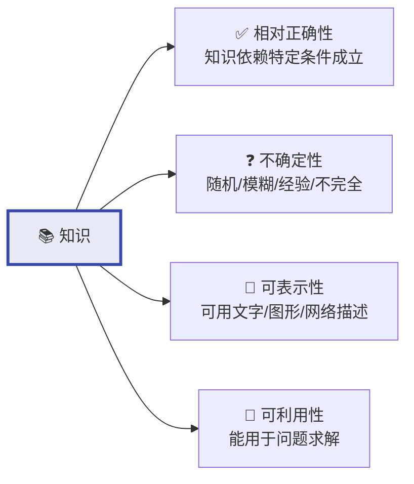

| 特性        | 含义                                                          | 经典例子                                           |
| --------- | ----------------------------------------------------------- | ---------------------------------------------- |
| **相对正确性** | 知识只**在特定条件下成立**，换环境可能错了                                     | 十进制 `1+1=2`，二进制 `1+1=10`；菊花在当下是哀悼符号，古人诗中却是隐逸高洁 |
| **不确定性**  | 四类成因：随机性（赤壁东风）、模糊性（"年轻人"无精确边界）、经验性（"老马识途"管仲）、不完全性（火星有无生命未知） | 头痛流鼻涕，**可能**感冒；天气冷热边界的判断；经验的不确定；探索的不完全性        |
| **可表示性**  | 知识**必须能编码为机器可读的结构**                                         | 文字符号、数学公式、神经网络权值、知识图谱三元组                       |
| **可利用性**  | **表示的目的是使用**——能够推理出新知识、回答查询                                 | 从"所有人都会死"+"诸葛亮是人"推导出"诸葛亮会死"                    |

### 2.1.3 知识表示的选择原则

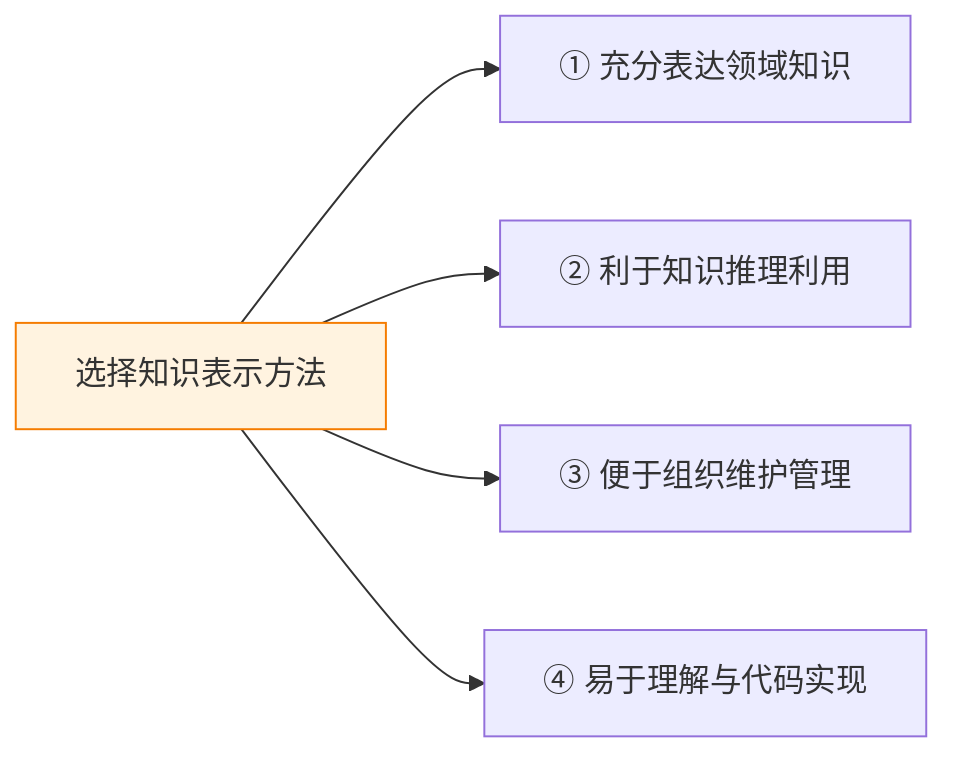

> 不存在“最好的”知识表示方法——**只有最适合特定问题的方法**。这四条原则就是选型标准。

---

## 2.2 一阶谓词逻辑表示法

> 最强的**精确性**、最严密的**逻辑基础**，但也最**脆弱**。适合数学证明、逻辑推理，不适合模糊知识。****

### 原理详解：从命题到谓词公式

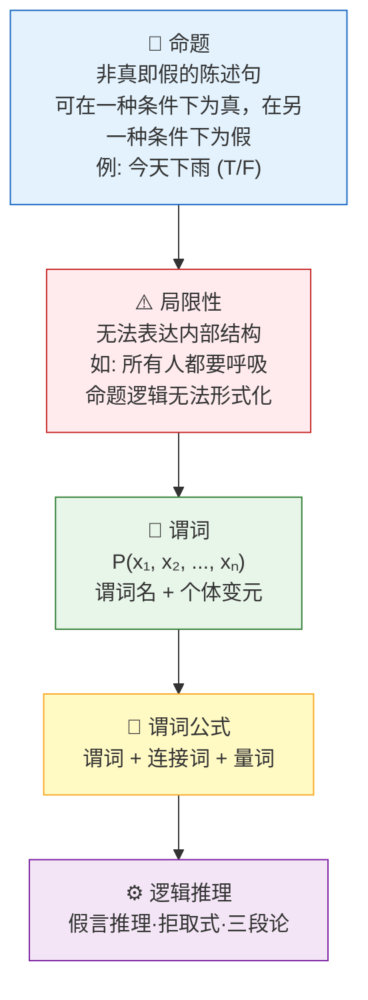

#### 核心概念拆解

| 概念      | 定义           | 示例                                                    |
| ------- | ------------ | ----------------------------------------------------- |
| **命题**  | 非真即假的陈述句     | "雪是白色的"（真 T）、"1+1=3"（假 F）                             |
| **谓词**  | 描述个体性质或关系的函数 | `Teacher(Zhang)` — Zhang 是老师；`Greater(x, 5)` — x 大于 5 |
| **个体**  | 独立事物或抽象概念    | 常量（Zhang）、变元（x）、函数（`father(Li)` 映射到某人）、谓词             |
| **连接词** | 组合谓词形成复杂公式   | `¬` 非、`∧` 与、`∨` 或、`→` 蕴含、`↔` 等价                        |
| **量词**  | 约束变元范围       | `∀x` 全称（所有 x）、`∃x` 存在（存在某个 x）                         |

#### 五大逻辑连接词

连接词将简单谓词组合为复杂公式，优先级从高到低：

| 连接词 | 符号 | 含义 | 真值条件 | 优先级 |
|--------|:----:|------|----------|:------:|
| **否定** | `¬` | 非 | `¬P` 为真 ⇔ P 为假 | ① 最高 |
| **合取** | `∧` | 且（与） | `P∧Q` 为真 ⇔ P 和 Q 同时为真 | ② |
| **析取** | `∨` | 或 | `P∨Q` 为真 ⇔ P 和 Q 至少一个为真 | ③ |
| **蕴含** | `→` | 如果…则… | `P→Q` 为假 ⇔ P 真且 Q 假（"善意推定"） | ④ |
| **等价** | `↔` | 当且仅当 | `P↔Q` 为真 ⇔ P 和 Q 真值相同 | ⑤ 最低 |

> [!tip] 蕴含式的"善意推定"
> `P→Q` 当 **P 为假时，无论 Q 真假，整个蕴含式都为真**。这称为"善意推定"——只有前提成立而结论不成立时才算错。例如"如果太阳从西边出来，那么 1+1=3"在逻辑上为真（因前提不成立）。

**优先级记忆口诀**：**非 > 与 > 或 > 蕴含 > 等价**，即 `¬ > ∧ > ∨ > → > ↔`。括号可改变顺序，如 `¬(P∧Q)` 先算 `P∧Q` 再取反。

#### 两类量词

| 量词 | 符号 | 读法 | 含义 | 真值条件 |
|------|:----:|------|------|----------|
| **全称量词** | `∀x` | "对所有 x" | 个体域中**每一个** x 都使 P(x) 为真 | 全部满足才为真 |
| **存在量词** | `∃x` | "存在 x" | 个体域中**至少存在一个** x 使 P(x) 为真 | 找到一个即为真 |

> **量词顺序影响语义**：`∀x∃y Loves(x,y)` = "每个人都有爱的人"（不同人可以爱不同人），`∃y∀x Loves(x,y)` = "存在一个人被所有人爱"（同一个人）。顺序一换，含义截然不同。

**量词嵌套示例**：
- `∀x∃y Greater(y, x)` = "对任意数 x，总存在比它大的 y"（真，在整数域）
- `∃y∀x Greater(y, x)` = "存在一个 y 比所有 x 都大"（假，在整数域）

#### 谓词公式的递归定义

谓词公式由以下规则**递归构造**：

```
1. 原子公式：P(t₁, t₂, ..., tₙ) 是公式（谓词 + 个体项）
2. 若 G 是公式，则 ¬G 是公式
3. 若 G、H 是公式，则 G∧H、G∨H、G→H、G↔H 是公式
4. 若 G 是公式，x 是自由变元，则 ∀xG、∃xG 是公式
5. 仅由上述 4 条规则生成的才是公式（封闭性）
```

> 例：`∀x(P(x)→Q(x))` 合法；`∀x→P(x)` 非法（量词后缺少公式）。

#### 量词辖域、约束变元、自由变元

```
       ┌──────── 辖域 ────────┐
∀x ( P(x, y) ∧ ∃y Q(y, z) )
↑                         ↑
指导变元                约束出现
       ↑                   ↑
    x 的约束出现       y 被 ∃y 重新约束

自由变元：y（未被 ∀x 约束）、z（无对应量词）
```

| 概念 | 定义 | 判别方法 |
|------|------|----------|
| **辖域** | 量词后面紧跟的括号/公式范围 | `∀x(...)` 中括号内是 x 的辖域 |
| **约束变元** | 在对应量词辖域内的同名变元 | 在 `∀x(...)` 括号内出现的 x |
| **自由变元** | 无对应量词约束的变元 | 不在任何自己同名量词辖域内的变元 |

> 例：`∀x(P(x) → ∃y Q(x, y)) ∨ R(z)` — x 全程约束，y 被 ∃y 约束，**z 自由**。自由变元无法确定真值。

#### 谓词公式的解释（语义）

给公式**赋予具体含义**才能确定真值。一个**解释 I** 包含：

| 组件        | 作用               | 示例                     |
| --------- | ---------------- | ---------------------- |
| **个体域 D** | 变元的取值范围          | D = {所有人} 或 D = {整数}   |
| **常量赋值**  | 指定每个常量对应 D 中哪个元素 | `ZhugeLiang` → 诸葛亮     |
| **谓词赋值**  | 指定每个谓词在 D 上的真假条件 | `Human(x)` → x 属于人类时为真 |
| **函数赋值**  | 指定每个函数在 D 上的映射   | `father(Li)` → 李的父亲    |

> 同一个公式在不同解释下真值不同。`∀x∀y (x+y = y+x)` 在整数域为真，在字符串拼接域为假。

#### 谓词公式等价变换

常用等价律（可相互替换）：

| 定律 | 形式 |
|------|------|
| **德摩根律（量词版）** | `¬∀xP(x) ≡ ∃x¬P(x)`、`¬∃xP(x) ≡ ∀x¬P(x)` |
| **量词转换律** | `∀xP(x) → ∃xP(x)`（非空域）、`∃x∀yP(x,y) → ∀y∃xP(x,y)` |
| **量词分配律** | `∀x(P(x)∧Q(x)) ≡ ∀xP(x)∧∀xQ(x)`、`∃x(P(x)∨Q(x)) ≡ ∃xP(x)∨∃xQ(x)` |
| **量词换名** | `∀xP(x) ≡ ∀yP(y)`、`∃xP(x) ≡ ∃yP(y)`（y 不在 P(x) 中出现） |
| **双重否定** | `¬¬P ≡ P` |
| **蕴含等价** | `P→Q ≡ ¬P∨Q` |

> 例：`¬∀x(Human(x)→Mortal(x))` 德摩根律化为 `∃x¬(Human(x)→Mortal(x))` 进一步化为 `∃x(Human(x)∧¬Mortal(x))`——即"存在永生的人"。

#### 标准推理规则（P/T/CP + 反证法）

除了假言推理、拒取式、假言三段论之外，还有三个形式化推理规则：

| 规则        | 全称                     | 含义                              |
| --------- | ---------------------- | ------------------------------- |
| **P 规则**  | Premise 前提引入           | 任何时刻可引入给定前提                     |
| **T 规则**  | Tautology 永真式引用        | 由前面已证的公式，利用永真蕴含推导新公式            |
| **CP 规则** | Conditional Proof 条件证明 | 要证 `P→Q`，可假设 P 成立，在此假设下推出 Q 即完成 |

**反证法**：要证 `P ⊢ Q`，假设 `¬Q` 为真，与前提 P 一起推出矛盾（如同时推出 R 和 ¬R），则原命题成立。

#### 实例：用推理规则证明

> 证明 `∀x(P(x)→Q(x)), ∀xP(x) ⊢ ∀xQ(x)`

```
1. ∀x(P(x)→Q(x))        P 规则（前提）
2. ∀xP(x)               P 规则（前提）
3. P(a)→Q(a)            由 1，全称量词实例化
4. P(a)                 由 2，全称量词实例化
5. Q(a)                 由 3、4，假言推理
6. ∀xQ(x)              由 5，全称量词泛化
```

#### 一个完整的推理示例

```
已知：
  ∀x (Human(x) → Mortal(x))     "所有人都会死"
  Human(ZhugeLiang)              "诸葛亮是人"

推理（假言推理）：
  Human(ZhugeLiang) → Mortal(ZhugeLiang)    ← 全称量词实例化
  ∴ Mortal(ZhugeLiang)                      ← 结论：诸葛亮会死
```

**三种核心推理规则**：

| 规则        | 形式                     | 名称                     | 白话                    |
| --------- | ---------------------- | ---------------------- | --------------------- |
| **假言推理**  | `P → Q, P ⊢ Q`         | Modus Ponens           | "如果下雨地会湿，下雨了，所以地湿了"   |
| **拒取式**   | `P → Q, ¬Q ⊢ ¬P`       | Modus Tollens          | "如果下雨地会湿，地没湿，所以没下雨"   |
| **假言三段论** | `P → Q, Q → R ⊢ P → R` | Hypothetical Syllogism | "下雨→地湿，地湿→路滑，所以下雨→路滑" |

#### 谓词公式的三大性质

| 性质 | 定义 | 示例 |
|------|------|------|
| **永真式** | 任何解释下均为真 | `P ∨ ¬P`（排中律） |
| **可满足式** | 存在某个解释使其为真 | `P ∧ Q`（P、Q 均为真时成立） |
| **不可满足式**（永假式） | 任何解释下均为假 | `P ∧ ¬P`（矛盾式） |

#### 数据库实例：住户-房间-电话

**场景**：一栋楼有若干住户，每户住一个房间，每户有一部电话。要求用谓词逻辑形式化表示并回答问题。

**步骤 1：定义谓词**

| 谓词                | 含义            |
| ----------------- | ------------- |
| `Occupier(x, r)`  | 住户 x 住在房间 r   |
| `Telephone(x, t)` | 住户 x 的电话号码是 t |
| `Room(r)`         | r 是房间         |
| `Person(x)`       | x 是住户         |

**步骤 2-4：构造谓词公式表示事实**

```
F1: ∀x∃r (Person(x) → Room(r) ∧ Occupier(x, r))
    "每个住户恰好住一个房间"

F2: ∀x∃t (Person(x) → Telephone(x, t))
    "每个住户有一部电话"

F3: ∀x∀r1∀r2 (Occupier(x, r1) ∧ Occupier(x, r2) → r1 = r2)
    "每个住户最多住一个房间"（唯一性约束）
```

> [!important] 为什么 ∀ 配 →、∃ 配 ∧？
> 
> 这是谓词逻辑知识表示中最容易出错的地方。记住一条铁律：
> 
> | 量词 | 连接词 | 模式 | 含义 | 反例（用错了会怎样） |
> |:----:|:------:|------|------|------|
> | `∀x` | `→` | `∀x (P(x) → Q(x))` | "所有 P 都是 Q" | 若用 `∧`：`∀x (P(x) ∧ Q(x))` → 断言**一切**都是 P，非 P 对象（如房间、数字）会使公式为假 |
> | `∃x` | `∧` | `∃x (P(x) ∧ Q(x))` | "存在 P 是 Q" | 若用 `→`：`∃x (P(x) → Q(x))` → 只要存在一个非 P 的对象，蕴含就为真（善意推定），公式退化 |
> 
> **以 F1 为例**：
> - ✅ `∀x∃r (Person(x) → Room(r) ∧ Occupier(x, r))` — 对每个 x，**如果**它是人，则它有一个房间；如果不是人（是房间本身、是电话号码），自动满足，不干扰
> - ❌ `∀x∃r (Person(x) ∧ Room(r) ∧ Occupier(x, r))` — 断言个体域中**每个对象**都是人、都是房间、都入住……房间 101 不是人，公式直接为假，整个知识库崩溃
> 
> 同理，查询"102 房间住的是谁"用 `∃x (Person(x) ∧ Occupier(x, 102))`，而不是 `∃x (Person(x) → Occupier(x, 102))`——后者只要存在任何一个非人的对象就为真（比如存在一部电话不是人），完全失去查询意义。

**实际数据（谓词实例化）**：

```
Person(Zhang)              Occupier(Zhang, 101)    Telephone(Zhang, 1234)
Person(Li)                 Occupier(Li, 102)       Telephone(Li, 5678)
Person(Wang)               Occupier(Wang, 103)     Telephone(Wang, 9012)
```

**查询示例**："102 房间住的是谁？" → `∃x (Person(x) ∧ Occupier(x, 102))` → 推理得出 `x = Li`。

> 这个实例展示了谓词逻辑如何把真实世界的结构化信息（住户、房间、电话）**完全形式化**为可供机器推理的逻辑命题。

### 优缺点

| ✅ 优点 | ❌ 缺点 |
|----------|----------|
| **自然性**：接近人类逻辑思维 | **无法表达不确定知识**：非黑即白，无法说"可能" |
| **精确性**：无歧义，适合形式化证明 | **组合爆炸**：搜索空间指数增长 |
| **严密性**：有完整数学推理体系 | **推理效率低**：量词实例化和归结过程计算量大 |
| **易程序实现**：Prolog 语言直接支持 | **知识获取困难**：隐性知识（经验直觉）无法形式化 |

> **经典例子：Prolog 自动推理**
>
> Prolog（Programming in Logic）是直接基于一阶谓词逻辑的编程语言。给定知识库 `mortal(X) :- human(X).` 和 `human(socrates).`，查询 `?- mortal(socrates).` 返回 `true`。Prolog 自己完成量词实例化和归结推导。
>
> 但 Prolog 在处理 100+ 条规则后会急剧变慢——这就是"组合爆炸"的真实体验。

---

## 2.3 产生式表示法

> 最**直觉化**、最**模块化**的知识表示方式。一条规则一个功能块，好理解、好维护。适合专家系统。

### 原理详解

**产生式系统 = 规则库 + 数据库 + 推理机**

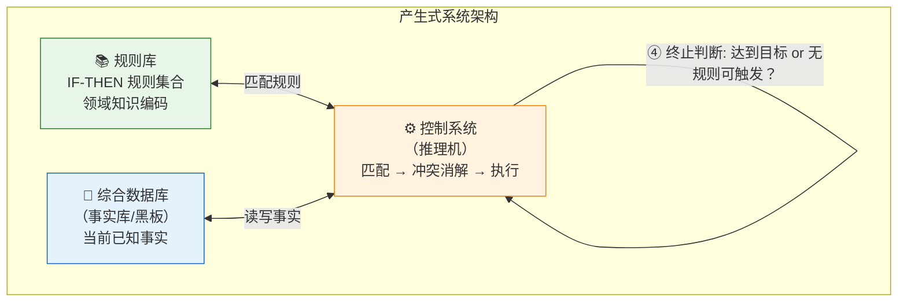

**四类产生式表达**：

| 类型 | 格式 | 示例 |
|------|------|------|
| **确定性规则** | `IF P THEN Q` | `IF 发烧 AND 咳嗽 THEN 可能感冒` |
| **不确定性规则** | `IF P THEN Q（置信度 0.8）` | `IF 乌云 THEN 下雨（置信度 0.7）` |
| **确定性事实** | `(对象, 属性, 值)` | `(北京, 人口, 2069万)` |
| **不确定性事实** | `(对象, 属性, 值, 置信度)` | `(火星, 有生命, 否, 0.99)` |

> 产生式的 `IF-THEN` 看似与逻辑蕴含 `→` 很像，但**含义不同**：逻辑蕴含是"如果 P 为真则 Q 必为真"的静态数学关系；产生式是"如果满足条件则执行动作"的动态操作语义。

### 经典例子：动物识别系统

这是产生式系统最经典的入门案例，麻雀虽小五脏俱全：

```
规则库（15 条）:
r1:  IF 有毛发                       THEN 哺乳动物
r2:  IF 产奶                         THEN 哺乳动物
r3:  IF 哺乳动物 AND 吃肉              THEN 食肉动物
r4:  IF 哺乳动物 AND 有蹄              THEN 有蹄动物
r5:  IF 食肉动物 AND 黄褐色 AND 黑色条纹  THEN 老虎
r6:  IF 食肉动物 AND 黄褐色 AND 黑色斑点  THEN 豹
r7:  IF 有蹄动物 AND 长腿 AND 长脖子     THEN 长颈鹿
...
```

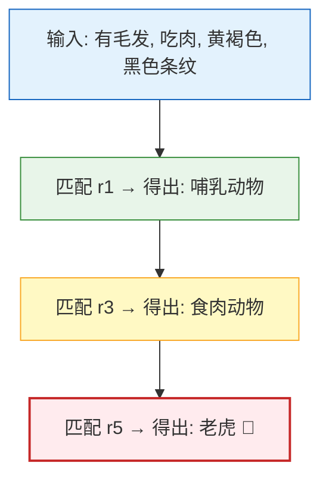

> 推理过程就是**反复匹配→触发→加入新事实**，直到无法继续或得出结论。正向推理（从事实推结论）如上；反向推理则是从假设目标出发，回溯寻找支持事实。

### 优缺点

| ✅ 优点                     | ❌ 缺点                      |
| ------------------------ | ------------------------- |
| **自然性**：`IF-THEN` 贴近人类思维 | **推理效率低**：规则多时反复扫描匹配      |
| **模块性**：每一条规则独立，增删改不影响其他 | **难以表达结构知识**：不好描述对象间的层级关系 |
| **有效性**：正确规则一定得出正确结论     | **冲突消解难**：多条规则同时匹配时如何选择   |
| **清晰性**：规则即是知识，知识即是规则    | **缺乏学习能力**：规则全依赖人工编写      |

> **经典例子：R1/XCON 配置系统（1980）**
>
> DEC 公司用 R1（后改名 XCON）专家系统自动配置 VAX 计算机的硬件组合——从 ~420 种组件中选出匹配的组合。该系统最终包含 **~10,000 条规则**，每年为 DEC 节省 **4000 万美元**。但维护 10,000 条规则成为噩梦——添加新规则可能引入隐蔽冲突，这是规则库膨胀后的典型困境。

---

## 2.4 框架表示法

> 最强**结构性**。不是平铺规则，而是模仿人类"用模板套具体对象"的认知方式。适合描述具有层级结构的实体。

### 原理详解：槽-侧面-值三层结构

**明斯基（1975）** 提出框架理论：人类在认知新事物时，会从记忆中调取一个"典型框架"，根据实际情况稍作修改即可理解。

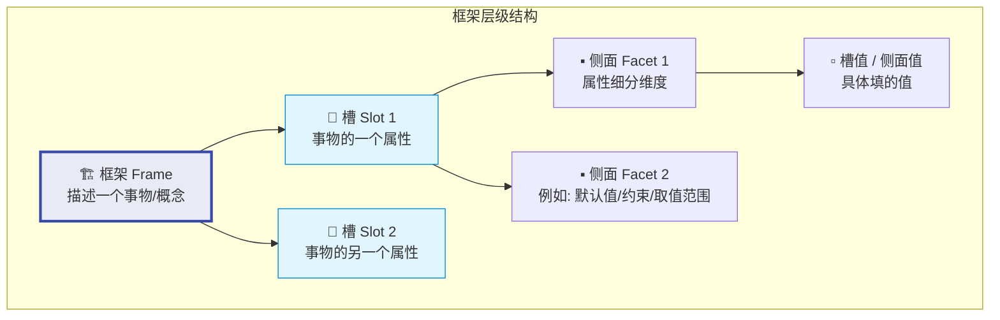

### 实例：教师框架

**通用框架（类模板）**：

```
框架名: <教师>

槽-姓名:         侧面-默认值: 未知
槽-性别:         侧面-取值范围: {男, 女}
槽-年龄:         侧面-缺省值: 35
槽-职称:         侧面-默认值: 讲师       侧面-取值范围: {助教,讲师,副教授,教授}
槽-院系:         侧面-子框架: <院系>       ← 嵌套！指向另一个框架
```

**具体实例（填入数据）**：

```
框架名: <教师-001>
  继承: <教师>

槽-姓名:  张三
槽-性别:  男
槽-年龄:  42
槽-职称:  教授
槽-院系:  <院系-计算机学院>
```

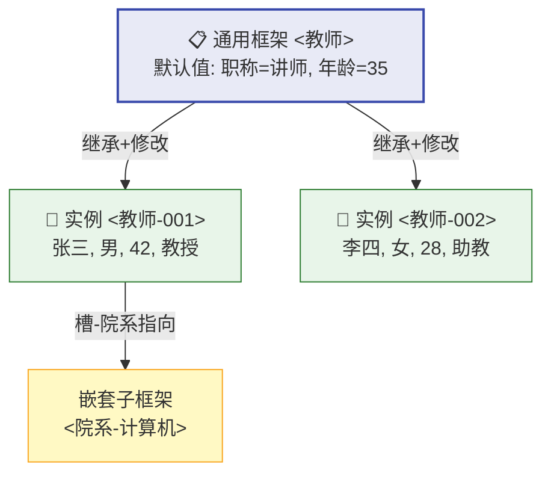

### 框架网络的三大特性

| 特性      | 含义                                  | 示例                                    |
| ------- | ----------------------------------- | ------------------------------------- |
| **结构性** | 框架天生能描述事物**内部结构**（槽）和**事物间关系**（子框架） | 教室框架嵌套墙体、门窗、黑板子框架                     |
| **继承性** | 下层框架自动获得上层槽值，只需声明差异部分               | `灾害→(继承)→地震`，自动获得"地点、日期"槽，额外添加"震级、烈度" |
| **自然性** | 符合人类"典型+特例"的认知模式                    | 提到"鸟"我们默认会飞——除非特别指明是鸵鸟或企鹅             |

### 优缺点

| ✅ 优点 | ❌ 缺点 |
|----------|----------|
| 结构化强，适合描述**层级实体** | 不擅表达过程性知识（如操作步骤） |
| 继承减少冗余 | 缺乏形式化语义——理解因人而异 |
| 默认值处理不完整信息 | 推理机制不如谓词逻辑严谨 |

> **经典例子：地震新闻理解系统**
>
> 给定框架 `<地震>`（槽：地点、日期、震级、伤亡），当系统读到"今日四川发生 5.6 级地震"，自动将"四川""今日""5.6"填入对应槽。如果新闻只说"地震造成房屋倒塌"而未提伤亡数，系统保留槽为空（利用默认值或待补全），而不会崩溃——这就是框架的**缺省推理**能力。

---

## 2.5 知识图谱

> 不是"第四种表示法"，而是**上述思想的大规模工程实现**。将符号逻辑+产生式+框架的理念融合为**图结构**，支撑搜索引擎和智能问答。

### 2.5.1 什么是知识图谱

**2012 年 Google 发布 Knowledge Graph**，背景是搜索"苹果"不知道用户想找水果、公司还是电影——纯文本匹配无法理解实体含义。

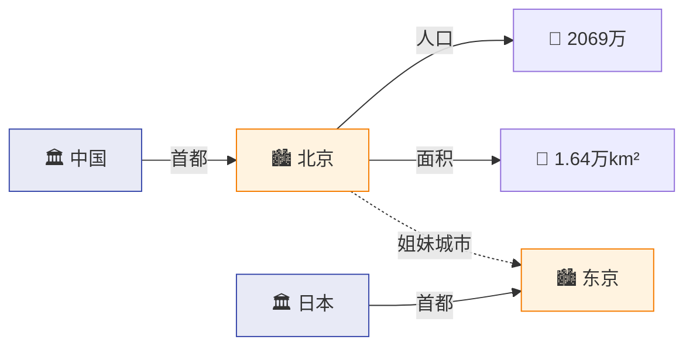

**核心三元组**：

| 类型            | 格式             | 含义             | 示例                |
| ------------- | -------------- | -------------- | ----------------- |
| **实体-关系-实体**  | (头实体, 关系, 尾实体) | **两个实体间的语义关联** | `(中国, 首都, 北京)`    |
| **实体-属性-属性值** | (实体, 属性, 值)    | **实体内在特征**     | `(北京, 人口, 2069万)` |

> 知识图谱 = 把全世界的信息编码为 **(头, 关系/属性, 尾)** 三元组的巨型网络。

### 2.5.2 知识图谱架构

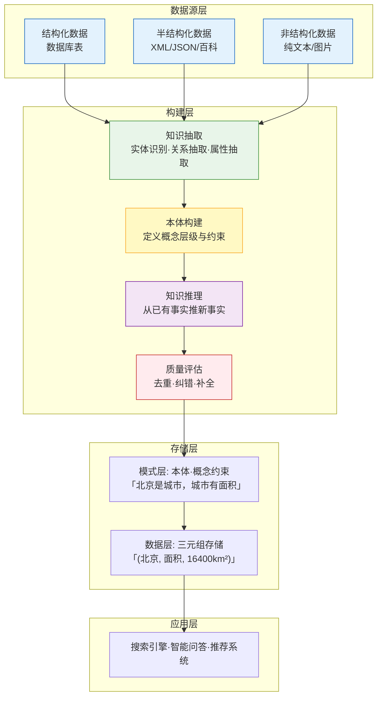

### 2.5.3 两种构建方式

| 方式 | 思路 | 优点 | 缺点 | 代表 |
|------|------|------|------|------|
| **自顶向下** | 先定义本体（概念层级），再填充实体 | 结构严谨、质量高 | 覆盖度有限、人工成本高 | 早期 Freebase、企业知识图谱 |
| **自底向上** | 从开放数据抽取实体，再归纳本体 | 覆盖面广、自动化 | 质量参差、噪声多 | DBpedia、XLORE、Google KG |

> 实际大项目是**混合模式**：自顶向下保证核心领域质量，自底向上扩展覆盖面。

### 2.5.4 主流开源知识图谱

| 项目 | 数据源 | 特点 | 规模 |
|------|--------|------|------|
| **Wikipedia** | 人工编辑 | 最原始的知识库，结构化不足 | 600万+ 英文条目 |
| **DBpedia** | 从 Wikipedia 信息框自动抽取 | 结构化版维基，Linked Data 核心节点 | 数十亿三元组 |
| **YAGO** | Wikipedia + WordNet + GeoNames | 融合多源、带时间空间标注 | 1.24 亿+ 三元组 |
| **XLORE** | 中英文维基/百科 | 清华开发，中英文双语平衡 | 千万级实体 |

### 优缺点

| ✅ 优点 | ❌ 缺点 |
|----------|----------|
| 直观易理解：图结构人机皆可读 | 构建成本高：实体消歧、关系抽取是 NLP 难题 |
| 支持推理：沿边遍历发现隐含关系 | 时效性差：现实世界变化快于知识更新 |
| 可扩展：新实体/关系自然融入 | 知识冲突：多源数据可能矛盾 |
| 支撑 AI 应用：搜索引擎、推荐、问答 | 覆盖率不足：长尾知识缺失 |

> **经典例子：Google 搜索"毕加索"**
>
> 2012 年之前，搜索"Picasso"返回蓝色链接列表。有了知识图谱后，右侧出现**知识面板**：出生日期、代表作、艺术流派、相关人物——这些信息不是来自单一网页，而是知识图谱聚合了 DBpedia、Freebase 等多源数据，实时拼出毕加索的"知识画像"。

---

## 🗺️ 四种方法对比总结

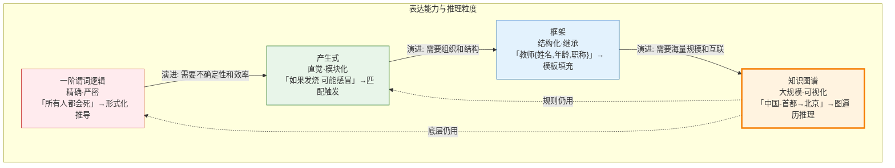

| 维度 | 一阶谓词逻辑 | 产生式 | 框架 | 知识图谱 |
|------|:----------:|:------:|:----:|:--------:|
| **知识粒度** | 原子命题 | 独立规则 | 槽-侧面-值 | 三元组 |
| **推理方式** | 归结/假言推理 | 匹配-触发 | 继承/默认推理 | 图遍历/路径推理 |
| **表达能力** | 精确但脆弱 | 直觉但不精确 | 结构但不灵活 | 丰富但噪声多 |
| **不确定性** | ❌ 无法表达 | ✅ 支持置信度 | ✅ 支持默认值 | ✅ 概率知识图谱 |
| **规模** | 几十~几百条 | 几百~几万条 | 数百框架 | 数十亿三元组 |
| **典型应用** | 定理证明、Prolog | 专家系统 | 自然语言理解 | 语义搜索、知识问答 |

---

## 🧭 知识地图

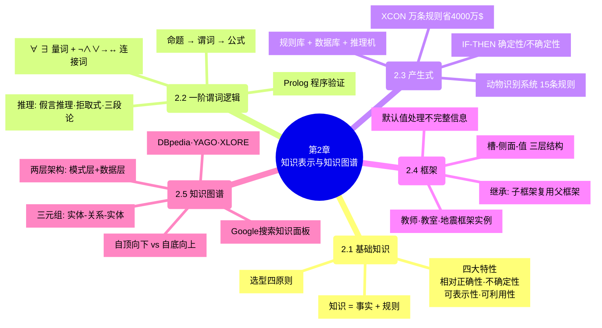

## 相关概念

- [第1章 绪论](/articles/ai-ml/introduction-to-ai/summaries/第1章-绪论/)
- [人工智能三大学派](/articles/ai-ml/introduction-to-ai/concepts/人工智能三大学派/)
- [人工智能](/articles/ai-ml/machine-learning/concepts/人工智能/)
- [机器学习](/articles/ai-ml/machine-learning/concepts/机器学习/)
