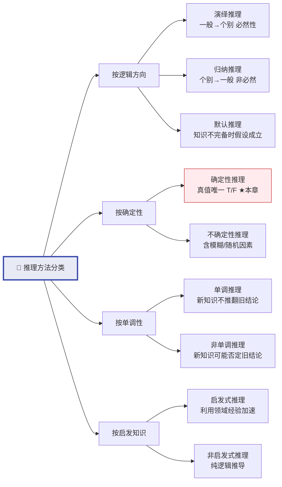
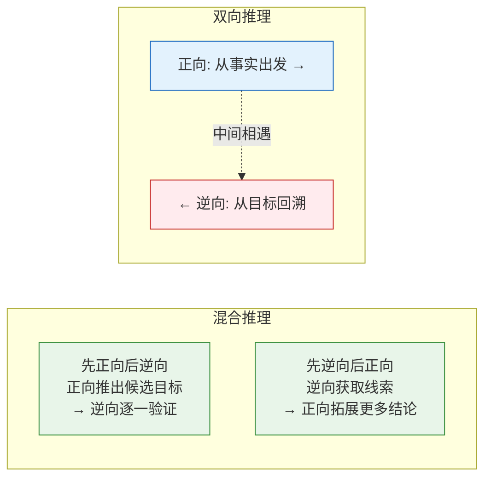
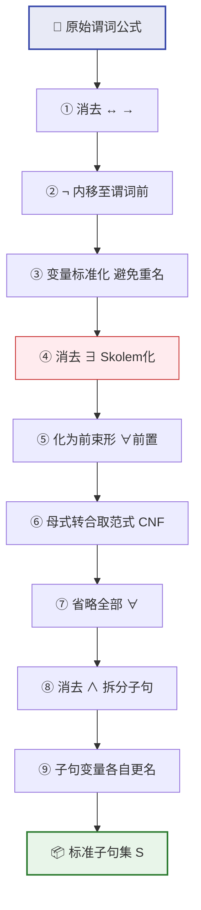
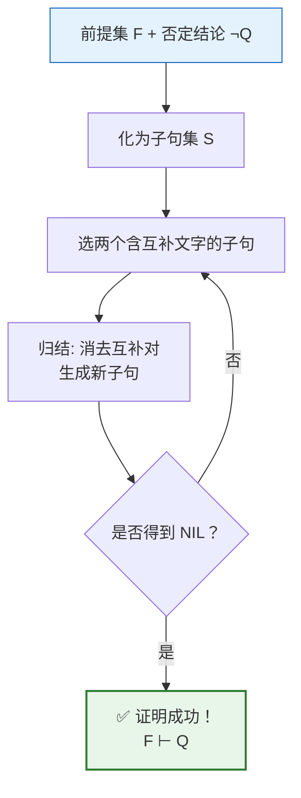
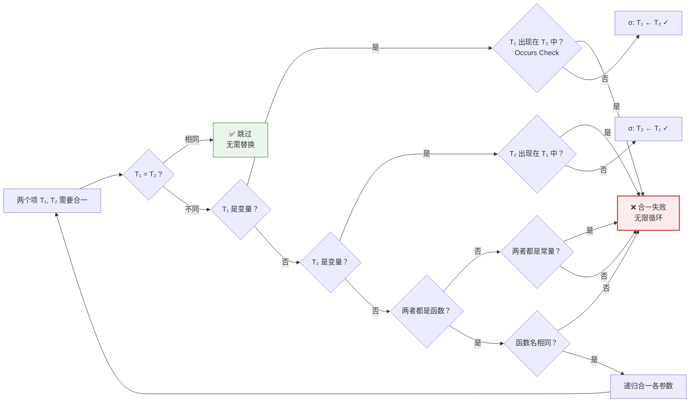
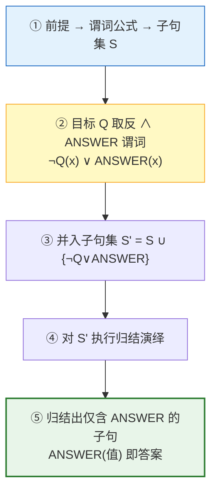
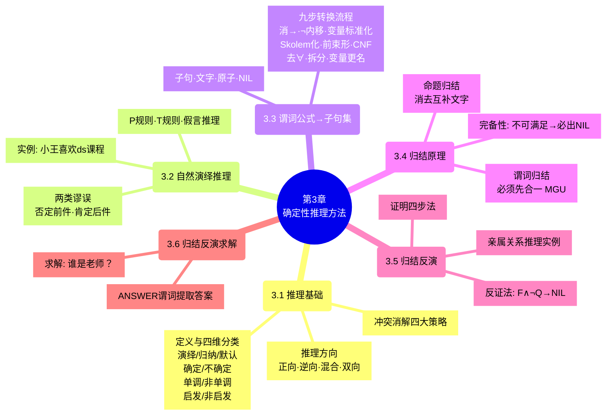

# 第3章 确定性推理方法

> 核心问题：**已知一些事实和规则，如何让计算机自动推导出新结论？** 本章从推理方向、自然演绎到归结反演，构建完整的确定性推理体系。

> [!abstract] 📘 知识点导航
> | 知识块 | 概念页 |
> |--------|--------|
> | 推理基本概念与方向 | [推理的基本概念](/articles/ai-ml/introduction-to-ai/concepts/推理的基本概念/) |
> | 自然演绎推理 | [自然演绎推理](/articles/ai-ml/introduction-to-ai/concepts/自然演绎推理/) |
> | 归结原理（子句集·合一·反演·求解） | [归结原理](/articles/ai-ml/introduction-to-ai/concepts/归结原理/) |

---

## 3.1 推理的基本概念

### 3.1.1 什么是推理

**推理**是依据已有知识（事实+规则）推出中间结论或最终结果的思维过程。在 AI 中，推理是问题求解的**核心手段**——没有推理能力，知识只是一堆无法利用的数据。

### 3.1.2 推理的分类体系



**四种分类维度详解**：

| 维度       | 类型   | 原理               | 示例                            |
| -------- | ---- | ---------------- | ----------------------------- |
| **逻辑方向** | 演绎   | 一般→个别，三段论        | 所有人会死→诸葛亮是人→诸葛亮会死             |
|          | 归纳   | 个别→一般，不完全归纳非必然   | 看到 1000 只天鹅都是白的→"天鹅都是白的"（可能错） |
|          | 默认   | 知识不完备时**假设典型情况** | "鸟会飞"（鸵鸟除外，直到被告知）             |
| **确定性**  | 确定性  | **知识、证据、结论真值唯一** | 数学定理证明                        |
|          | 不确定性 | 含概率/模糊性          | "如果发烧则**可能**感冒"               |
| **单调性**  | 单调   | 加知识只丰富结论，不推翻已有   | 经典逻辑推理                        |
|          | 非单调  | 新知识可能否定旧结论       | 默认推理："鸟会飞"→ 知道是鸵鸟→撤回          |
| **启发**   | 启发式  | 用经验缩小搜索空间        | A* 算法、博弈树剪枝                   |
|          | 非启发式 | 穷举所有可能           | 归结原理                          |

### 3.1.3 推理的方向

#### 正向推理（数据驱动）

```
事实: {A, B, C}  ──→  匹配规则  ──→  触发: 新事实 D  ──→  重新匹配  ──→  ...  ──→  目标达成
```

| 维度     | 内容                                                   |
| ------ | ---------------------------------------------------- |
| **原理** | 从已知事实出发，反复匹配规则的**前提部分**，触发后生成新事实加入数据库，直到推导出目标或无规则可触发 |
| **优点** | 实现简单；能充分利用初始数据；适合监测、诊断类问题                            |
| **缺点** | **目的性弱**——可能推导出大量无关中间结论；规则多时效率低                      |

#### 逆向推理（目标驱动）

```
目标 G  ──→  找能推出 G 的规则  ──→  规则前提变新子目标  ──→  递归求解  ──→  事实匹配成功
```

| 维度     | 内容                                                 |
| ------ | -------------------------------------------------- |
| **原理** | 从假设目标出发，反向寻找能使目标成立的规则，将规则前提作为新子目标递归求解，直到所有子目标被事实证实 |
| **优点** | **目的性强**——只推导与目标相关的结论；便于解释（可回溯推理链）                 |
| **缺点** | **初始目标选择盲目**；事实不足时反复回溯代价大                          |

#### 混合推理与双向推理



### 3.1.4 冲突消解策略

当多条规则的**同时被已知事实满足**时，需要选择先触发哪条。四种经典策略：

| 策略          | 规则                 | 直觉         |
| ----------- | ------------------ | ---------- |
| **按针对性排序**  | 规则前提越具体（覆盖情况越少）越优先 | "特殊情况优先"   |
| **按新鲜度排序**  | 规则前提中用到越新生成的事实越优先  | "趁热打铁"     |
| **按匹配度排序**  | 规则前提被满足的条件数越多越优先   | "证据充分优先"   |
| **按条件数量排序** | 规则前提的条件数越多越优先      | "更严格的规则优先" |

---

## 3.2 自然演绎推理

> 模拟人类"一步步推导"的思维方式。最直观、最自然，但容易组合爆炸。

### 原理

基于经典逻辑规则，从已知真事实**直接**推导新结论。核心规则与第2章一致：**P 规则**（引入前提）、**T 规则**（永真式引用）、假言推理、拒取式。

### ⚠️ 两类常见推理谬误

这是自然演绎中最容易犯的逻辑错误：

| 谬误 | 形式 | 含义 | 反例 |
|------|------|------|------|
| **否定前件** | `P→Q, ¬P ⊢ ¬Q` ❌ | "如果下雨地湿，没下雨所以地不湿" | 洒水车也可以让地湿 |
| **肯定后件** | `P→Q, Q ⊢ P` ❌ | "如果下雨地湿，地湿了所以下雨了" | 地湿不一定是雨导致的 |

> [!important] 记忆口诀
> **蕴含式只能顺着箭头方向推**（P→Q 只能由 P 推 Q 或由 ¬Q 推 ¬P），不能逆着推！

### 优缺点

| ✅ 优点 | ❌ 缺点 |
|----------|----------|
| 过程自然易懂，贴近人类思维 | **组合爆炸**：中间结论指数级增长 |
| 推理规则丰富（P/T/假言/拒取/三段论） | 缺乏策略控制，盲目推导 |
| 可嵌入领域启发知识 | 不适合大规模知识库 |

### 经典例子：证明"小王喜欢 ds 课程"

```
已知：
  F1: ∀x (EasyCourse(x) → Like(Wang, x))     "小王喜欢所有容易的课程"
  F2: CS_Course(ds)                            "ds 是 C 班的课程"
  F3: ∀x (CS_Course(x) → EasyCourse(x))       "所有 C 班课程都是容易的"

证明目标：Like(Wang, ds)  "小王喜欢 ds"

推理过程：
  1. CS_Course(ds)                             P 规则（F2）
  2. CS_Course(ds) → EasyCourse(ds)            F3 全称实例化 (x=ds)
  3. EasyCourse(ds)                            1、2 假言推理
  4. EasyCourse(ds) → Like(Wang, ds)           F1 全称实例化 (x=ds)
  5. Like(Wang, ds)                            3、4 假言推理 ✓
```

---

## 3.3 谓词公式化为子句集

> 归结原理的**前置步骤**。把任意谓词公式机械地转换为标准子句集，是自动推理的"编译器前端"。

### 为什么需要子句集？

机器自动推理需要**统一的输入格式**。子句集就是这个统一格式——任意谓词公式都能化为等不可满足性的子句集。

### 核心概念

| 概念 | 定义 | 示例 |
|------|------|------|
| **原子** | 不可再分的谓词公式单元 | `P(x)`, `Q(a, y)` |
| **文字** | 原子或其否定 | `P(x)`（正文字）、`¬P(x)`（负文字） |
| **子句** | 若干文字的析取式 | `P(x) ∨ ¬Q(x) ∨ R(x, y)` |
| **空子句 NIL** | 永假、不可满足 | 归结出 NIL = 发现了矛盾 |
| **子句集** | 子句的集合，各子句间隐含合取 | `{P∨Q, ¬P∨R, ¬Q∨R}` |

> [!tip] 核心定理
> 谓词公式 G **不可满足** ⇔ G 的子句集 S **不可满足**。由此，证明 G 永真 = 证明 ¬G 不可满足 = 归结 ¬G 的子句集直到推出 NIL。

### 九步标准化转换流程



**各步骤详解**：

| # | 步骤 | 操作 | 关键技巧 |
|:--:|------|------|------|
| ① | **消去 ↔ →** | `P↔Q` → `(P→Q)∧(Q→P)` → `(¬P∨Q)∧(¬Q∨P)` | 用 `¬P∨Q` 替换 `P→Q` |
| ② | **¬ 内移** | `¬(P∧Q)` → `¬P∨¬Q`；`¬∀xP` → `∃x¬P`；`¬∃xP` → `∀x¬P` | 德摩根律 + 量词转换律 |
| ③ | **变量标准化** | 不同量词约束的同名变量要改名 | `∀xP(x) ∨ ∀xQ(x)` → `∀xP(x) ∨ ∀yQ(y)` |
| ④ | **Skolem 化（消 ∃）** | 见下方详解 ↓ | 见下方详解 ↓ |
| ⑤ | **化为前束形** | 所有量词移到公式最前端 | `∀x(P(x)→∀yQ(y))` → `∀x∀y(P(x)→Q(y))` |
| ⑥ | **母式→CNF** | 母式转为合取范式 | 利用分配律：`P∨(Q∧R) ≡ (P∨Q)∧(P∨R)` |
| ⑦ | **省略 ∀** | 全称量词默认存在，省略 | `∀x∀y(...)` → `(...)` |
| ⑧ | **拆分 ∧** | 合取的各部分独立成子句 | `(P∨Q) ∧ (¬P∨R)` → 两个子句：`{P∨Q, ¬P∨R}` |
| ⑨ | **变量更名** | 不同子句的变量互不干扰 | `{P(x)∨Q(x), ¬P(y)∨R(y)}` |

> **Skolem 化的核心思想**：存在量词 `∃x` 说"存在某个 x"，我们不知道是谁，但可以给它起个名字（常量/函数）代替它。这个名字必须反映**依赖关系**——如果 `∃y` 在 `∀x` 的辖域内，y 依赖于 x，所以用 `f(x)` 而非常量 `a`。

#### 🔍 Skolem 化详解

**为什么要消去 ∃？** 归结原理要求公式中只有 ∀（全称量词）。但 `∃x P(x)` 说的是"存在某个个体使 P 成立"——我们不知道那个个体叫什么，必须给它起名。

**两类情况**：

| 情况 | ∃ 在谁的辖域里？ | 用什么替换？ | 直觉 |
|------|:---------------:|--------------|------|
| **情况 A** | 不被任何 ∀ 约束 | **常量** a, b, c... | "存在这么一个人，不管别人是谁，他都行" |
| **情况 B** | 在某个 ∀ 的辖域内 | **Skolem 函数** f(x₁,...,xₙ) | "对每个 x，都存在一个 y（但 y 的取值依赖于 x）" |

函数的参数 = **包含该 ∃ 的所有外层 ∀ 变元**。这是一个纯机械的判断——不需要理解语义。

#### 六个例子，按难度递进

```
────────────────────────────────────────────────────────────
例 1: ∃x P(x)                      ← 最简单
────────────────────────────────────────────────────────────
  ∃x 外层无 ∀ → 常量 a
  结果: P(a)
  
  直觉: "存在一个人 x 满足 P"，既然存在，就叫它 a 吧。

────────────────────────────────────────────────────────────
例 2: ∀x∃y Loves(x, y)             ← 经典：依赖关系
────────────────────────────────────────────────────────────
  ∃y 在 ∀x 的辖域内 → Skolem 函数 f(x)
  结果: ∀x Loves(x, f(x))
  
  为什么是 f(x) 不是常量？
  因为 "对每个 x，都存在一个 y 被 x 爱"——不同 x 爱不同人。
  f(x) = "x 爱的那个人"，依赖 x。
  如果写成常量 a → "所有人都爱同一个人 a"，意思完全变了！

────────────────────────────────────────────────────────────
例 3: ∃x∀y Loves(x, y)             ← 与例 2 对比
────────────────────────────────────────────────────────────
  ∃x 外层无 ∀ → 常量 a
  结果: ∀y Loves(a, y)
  
  为什么这里是常量？
  因为 ∃x 在最外层，不被任何 ∀ 约束。
  直觉: "存在一个人 a，他爱所有人"——这人固定，不依赖 y。

────────────────────────────────────────────────────────────
例 4: ∀x∃y∀z∃w P(x, y, z, w)      ← 双重 Skolem
────────────────────────────────────────────────────────────
  ∃y 在 ∀x 的辖域内 → f(x)
  ∃w 在 ∀x, ∀z 的辖域内 → g(x, z)
  结果: ∀x∀z P(x, f(x), z, g(x, z))
  
  关键: w 在 ∀x 和 ∀z 的辖域内 → g 有两个参数。
  不要漏掉 z！即使 z 在 y 后面出现，只要在 w 外面，就是 w 的依赖。

────────────────────────────────────────────────────────────
例 5: ∀x( P(x) → ∃y Q(x, y) )     ← 带括号
────────────────────────────────────────────────────────────
  ∃y 在 ∀x 的辖域内 → f(x)
  结果: ∀x( P(x) → Q(x, f(x)) )
  
  括号不影响辖域判断——直接看 ∃y 在哪些 ∀ 里面。

────────────────────────────────────────────────────────────
例 6: ∃x P(x) ∨ ∃y Q(y)            ← 多个独立 ∃
────────────────────────────────────────────────────────────
  左半 ∃x: 外层无 ∀ → 常量 a
  右半 ∃y: 外层无 ∀ → 常量 b
  结果: P(a) ∨ Q(b)
  
  注意: a 和 b 必须不同！x 和 y 可能不是同一个人。
```

#### 逐步骤判断口诀

```
1. 找到公式中每一个 ∃x
2. 看 ∀x 出现在哪些 ∀ 的辖域内
3. 收集这些 ∀ 的变元，作为函数参数列表
4. 参数列表为空 → 常量；参数列表非空 → 函数
5. 用该常量/函数替换 ∃x 辖域内所有 x 的出现
6. 删除 ∃x 本身（它的使命已完成）
```

**完整转换示例（穿越全部 9 步）**：

```
原始公式:  ∃x∀y P(x, y) → ∀y∃x P(x, y)
          （"如果存在某人爱所有人，则每个人都被人所爱"——直觉上成立）

─────────────────────────────────────────────────────
① 消去 → :
    ¬∃x∀y P(x, y) ∨ ∀y∃x P(x, y)

    技巧: A→B ≡ ¬A∨B，把整个蕴含式变为析取式。

─────────────────────────────────────────────────────
② ¬ 内移至紧靠谓词前 :
    ∀x∃y ¬P(x, y) ∨ ∀y∃x P(x, y)

    技巧: ¬∃x ≡ ∀x¬, ¬∀y ≡ ∃y¬
    左半: ¬∃x∀y P(x,y) → ∀x¬∀y P(x,y) → ∀x∃y ¬P(x,y) ✓

─────────────────────────────────────────────────────
③ 变量标准化（消除重名冲突）:
    ∀x∃y ¬P(x, y) ∨ ∀u∃v P(v, u)

    技巧: 右半的 ∀y∃x 中 y 和 x 与左半重名！
    改名: 右半边 y→u, x→v，得到 ∀u∃v P(v,u)
    注意: 仅改约束变元名，语义不变。

─────────────────────────────────────────────────────
④ Skolem 化（消去 ∃）:

    左半 ∀x∃y ¬P(x, y):
      ∃y 在 ∀x 的辖域内 → Skolem 函数 f(x)
      → ∀x ¬P(x, f(x))
      
    右半 ∀u∃v P(v, u):
      ∃v 在 ∀u 的辖域内 → Skolem 函数 g(u)
      → ∀u P(g(u), u)

    合并: ∀x ¬P(x, f(x)) ∨ ∀u P(g(u), u)

    核心判断: ∃ 在哪些 ∀ 的辖域内？
    - 左 ∃y 在 ∀x 内 → f(x) 带参数 x
    - 右 ∃v 在 ∀u 内 → g(u) 带参数 u

─────────────────────────────────────────────────────
⑤ 化为前束形（∀ 移至最前端）:
    ∀x∀u ( ¬P(x, f(x)) ∨ P(g(u), u) )

    技巧: ∀x A ∨ ∀u B ≡ ∀x∀u (A ∨ B)，前提是 x 不在 B 中自由出现且 u 不在 A 中。
    此处满足条件，可安全前置。

─────────────────────────────────────────────────────
⑥ 母式转为 CNF（合取范式）:
    ¬P(x, f(x)) ∨ P(g(u), u)   ← 已经是析取式，即单子句的 CNF ✓

    技巧: 若形如 (A∧B)∨C，需用分配律展开为 (A∨C)∧(B∨C)。
    本例无需展开。

─────────────────────────────────────────────────────
⑦ 省略全部 ∀ :
    ¬P(x, f(x)) ∨ P(g(u), u)

    技巧: 子句集中所有变量默认全称量化，全写出来是冗余的。

─────────────────────────────────────────────────────
⑧ 消去 ∧ 拆分子句 :
    只有一个析取式，已是最简子句 ✓

    如果是 (A∨B) ∧ (C∨D)，则拆为 {A∨B, C∨D} 两个子句。

─────────────────────────────────────────────────────
⑨ 子句变量更名 :
    ¬P(x₁, f(x₁)) ∨ P(g(u₁), u₁) 

    技巧: 虽然只有一个子句不需要隔离，但规范操作会将变量改为独立名。

─────────────────────────────────────────────────────

最终子句集: S = { ¬P(x₁, f(x₁)) ∨ P(g(u₁), u₁) }
```

---

## 3.4 鲁宾逊归结原理（消解原理）

> **Robinson, 1965**。自动定理证明的里程碑——用**唯一一条推理规则**取代了所有传统推理规则，让机器自动推理成为可能。

### 3.4.1 基本思想

```
核心逻辑:
  若要证明 "前提 F 蕴含结论 Q"  (F ⊢ Q)
  ⟹ 等价于证明 "F ∧ ¬Q 不可满足"  (反证法)
  ⟹ 将 F ∧ ¬Q 化为子句集 S
  ⟹ 对 S 反复归结，若推出空子句 NIL，则证明完成
```



### 3.4.2 命题逻辑归结

两个子句消去**互补文字**（P 和 ¬P），剩余文字析取：

```
父辈子句:   C1: P ∨ Q        C2: ¬P ∨ R
────────────────────────────────
归结式:             Q ∨ R          (消去 P 和 ¬P)
```

| 概念 | 含义 |
|------|------|
| **亲本子句** | 参与归结的两个子句 C₁、C₂ |
| **归结式** | 消去互补文字后剩余的析取式 |
| **互补文字** | 一对正/负文字，如 P 与 ¬P |

**重要推论**：
- 用归结式替换亲本子句，新集不可满足 ⇒ 原集不可满足
- 添加归结式到原集，新旧子句集不可满足性等价（归结式是亲本子句的**逻辑结论**）

### 3.4.3 谓词逻辑归结（含变量）

含变量的子句不能直接归结——需要先**合一**（Unification）。

**合一 = 找到一组变量替换，让两个表达式在语法上完全相同。**

#### 合一算法（逐步示例）

**问题**：将 `P(a, x, f(g(y)))` 与 `P(z, f(z), f(u))` 合一。

```
设初始替换集合 σ = {}（空）
设"分歧集"为两表达式从左边开始第一个不同的位置

迭代 1: 逐项扫描
  P(a,     x,      f(g(y)))    ← 表达式 1
  P(z,     f(z),   f(u))       ← 表达式 2
    ↑
  分歧! a ≠ z
  
  规则: a 是常量，z 是变量 → 令 z = a
  更新 σ = {z/a}
  将 z 替换为 a:
  P(a, x, f(g(y)))  与  P(a, f(a), f(u))

迭代 2: 继续扫描
  P(a, x,     f(g(y)))
  P(a, f(a),  f(u))
       ↑
  分歧! x ≠ f(a)
  
  规则: x 是变量，f(a) 不包含 x → 令 x = f(a)
  更新 σ = {z/a, x/f(a)}
  将 x 替换为 f(a):
  P(a, f(a), f(g(y)))  与  P(a, f(a), f(u))

迭代 3: 继续扫描
  P(a, f(a), f(g(y)))
  P(a, f(a), f(u))
                  ↑
  分歧! g(y) ≠ u
  
  规则: u 是变量，g(y) 不包含 u → 令 u = g(y)
  更新 σ = {z/a, x/f(a), u/g(y)}

迭代 4: 再次扫描，完全一致 ✓

最终 MGU: σ = {z/a, x/f(a), u/g(y)}
验证: P(a, f(a), f(g(y))) ≡ P(a, f(a), f(g(y))) ✓
```

#### 六种合一类型详解

上面是一个综合例子，下面**按冲突类型**逐一拆解。

**类型 1：常量 vs 变量** → 变量替换为常量

```
P(a)  与  P(x)
      ↑ 分歧: 常量 a vs 变量 x
规则: 变量 ← 常量
结果: σ = {x/a}, 合一成功 → P(a) ≡ P(a)
```

**类型 2：变量 vs 复合项** → 变量替换为整个项（前提：变量不出现在该项中）

```
P(x)  与  P(f(y))
      ↑ 分歧: 变量 x vs 复合项 f(y)
规则: 检查 x 是否出现在 f(y) 中 → 没有 → 变量 ← 项
结果: σ = {x/f(y)}, 合一成功 → P(f(y)) ≡ P(f(y))
```

**类型 3：两个变量相遇** → 任选一个替换为另一个

```
P(x, y)  与  P(u, v)
       ↑          ↑
规则: 两个都是变量，x←u 或 u←x 都可以
结果: σ = {x/u}（或 {u/x}），合一成功
      替换后: P(u, y) 与 P(u, v)
      继续: σ = {x/u, y/v} ✨
```

> 两个变量互替无所谓方向，但一旦选定就要全文一致。

**类型 4：常量 vs 常量** → 相等跳过，不等失败

```
P(a)  与  P(b)
      ↑ 分歧: 常量 a ≠ 常量 b
规则: 无法替换 → ❌ 合一失败！

P(a)  与  P(a)
      ↑ 相同 → 跳过 ✓
```

**类型 5：函数 vs 函数** → 函数名相同则递归合一参数，不同则失败

```
✅ 成功:
  P(f(a, x))  与  P(f(y, b))
        ↑  fn: f   fn: f → 相同，递归
        参数1: a vs y → y←a
        参数2: x vs b → x←b
  结果: σ = {y/a, x/b} ✓

❌ 失败:
  P(f(x))  与  P(g(x))
       ↑  fn: f ≠ fn: g → ❌ 合一失败！
```

**类型 6：变量出现在替换目标中（Occurs Check）** → 合一失败

```
P(x)  与  P(f(x))
      分歧: 变量 x vs 复合项 f(x)
检查: x 出现在 f(x) 中吗？→ 是！→ ❌ 合一失败！

原因: x → f(x) → f(f(x)) → f(f(f(x))) → ... 无限循环
     永远换不完，永远合不了一。
```

```
另一个经典失败例:
  P(x, g(x))  与  P(f(y), y)
  扫描: x vs f(y) → x←f(y)
  替换后: P(f(y), g(f(y))) vs P(f(y), y)
  继续: g(f(y)) vs y → y←g(f(y))
  检查: y 出现在 g(f(y)) 中吗？→ 是！→ ❌ 合一失败！
```

#### 合一判定流程图



#### 合一规则速查

| 相遇类型 | 条件 | 操作 | 示例 |
|----------|------|------|------|
| 常量 vs 变量 | 常≠变 | 变量→常量 | `{x/a}` |
| 变量 vs 复合项 | 变量不在该项中 | 变量→项 | `{x/f(a)}` |
| 变量 vs 变量 | 无约束 | 任一→另一 | `{x/y}` |
| 常量 vs 常量 | 相等 | 跳过 | — |
| 常量 vs 常量 | 不相等 | ❌ 失败 | a vs b |
| 函数 vs 函数 | 函数名相同 | 递归合一参数 | f(a,x) vs f(y,b) |
| 函数 vs 函数 | 函数名不同 | ❌ 失败 | f vs g |
| 变量 vs 含自身的项 | Occurs Check | ❌ 失败 | x vs f(x) |

**归结计算示例**：

```
C1: P(a) ∨ Q(x)          C2: ¬P(y) ∨ R(y)
─────────────────────────────────────────
MGU: {y/a}
应用:    P(a) ∨ Q(x) 与 ¬P(a) ∨ R(a)
归结:    Q(x) ∨ R(a)                              ✨ 归结式
```

### 核心结论

| 结论 | 含义 |
|------|------|
| **子句集不可满足 ⇒ 必存在到 NIL 的归结序列** | 归结原理是**完备的**（反证方向） |
| **推不出 NIL ⇒ 无法判定可满足性** | 归结原理是**半可判定的**——不可满足一定能证，可满足不一定能停 |

### 优缺点

| ✅ 优点 | ❌ 缺点 |
|----------|----------|
| **单一推理规则**：只需归结一条规则 | **组合爆炸**：子句数量可能快速增长 |
| **完备性**：不可满足必能归结出 NIL | **方向性缺失**：归结顺序无指导 |
| **易于机器实现**：机械操作 | **效率低**：大量无意义的中间归结 |
| **统一反证法框架**：证明=推导矛盾 | **不直观**：归结过程难以被人类理解 |

> **经典例子：归结原理在定理证明中的应用**
>
> Robinson 1965 年提出归结原理后，自动定理证明从"手工技艺"变成"机械算法"。它统一了所有推理规则——假言推理、拒取式、三段论等全部是**归结的特例**。Prolog 语言的推理引擎本质上就是**基于归结原理 + 特定策略**（SLD 归结）实现的。

---

## 3.5 归结反演（用归结原理证明定理）

### 核心定理

> Q 是前提 F₁, F₂, ..., Fₙ 的逻辑结论 ⇔ F₁ ∧ F₂ ∧ ... ∧ Fₙ ∧ ¬Q 不可满足

简单说：**要证明 Q 成立，就假设 ¬Q，若能推出矛盾（NIL），则 Q 必成立。**

### 证明四步法

```
步骤1: 前提翻译为谓词公式集 F
步骤2: 待证结论 Q 取反 → ¬Q
步骤3: F 与 ¬Q 合并 → 化为子句集 S
步骤4: 对 S 反复归结 → 若出现 NIL → ✅ 证明成功
```

### 经典例子 1：命题逻辑归结证明

> 这是最简形式，帮助看懂"归结"到底是什么操作。

```
已知:  P → Q  和  P
证明:  Q

子树化: F = {¬P ∨ Q, P},  否定目标: ¬Q
子句集 S = { ¬P ∨ Q,  P,  ¬Q }

归结:
  C1: ¬P ∨ Q
  C2: P
  C3: ¬Q
  ─────────
  C4: Q        (C1, C2 归结: 消去 P 和 ¬P)
  C5: NIL  □   (C3, C4 归结: 消去 Q 和 ¬Q) → 证明成功！
```

> 假言推理 `P→Q, P ⊢ Q` 被归结原理的两步"消去互补文字"完美模拟。所有传统推理规则都是归结的特例。

### 经典例子 2：亲属关系推理

```
已知:
  F1: ∀x∀y (Father(x, y) → Parent(x, y))
  F2: ∀x∀y (Mother(x, y) → Parent(x, y))
  F3: ∀x∀y∀z (Parent(x, y) ∧ Parent(y, z) → GrandParent(x, z))
  F4: Father(John, Mary)
  F5: Mother(Mary, Tom)

证明: GrandParent(John, Tom)

子句化:
  C1: ¬Father(x, y) ∨ Parent(x, y)
  C2: ¬Mother(x, y) ∨ Parent(x, y)
  C3: ¬Parent(x, y) ∨ ¬Parent(y, z) ∨ GrandParent(x, z)
  C4: Father(John, Mary)
  C5: Mother(Mary, Tom)
  C6: ¬GrandParent(John, Tom)        ← ¬Q

归结:
  C7: Parent(John, Mary)              (C1, C4 MGU: {x/John, y/Mary})
  C8: Parent(Mary, Tom)               (C2, C5 MGU: {x/Mary, y/Tom})
  C9: ¬Parent(Mary, Tom) ∨ GrandParent(John, Tom)  (C3, C7 MGU)
  C10: GrandParent(John, Tom)         (C8, C9 归结)
  C11: NIL  □                         (C6, C10 归结) → 证明成功！
```

---

## 3.6 应用归结反演求解实际问题

> 证明 Q 成立还不够——更重要的是**求出"谁"让 Q 成立**（如"谁是小张的老师？"）。

### ANSWER 提取法（五步流程）



> **ANSWER 为什么能工作？** 来看逻辑本质：
>
> 原目标: `∃w TeacherOf(w, XiaoZhang)` — "存在某个 w，w 是小张的老师"
> 取反后: `∀w ¬TeacherOf(w, XiaoZhang)` — "没有人是小张的老师"
> 加 ANSWER: `¬TeacherOf(w, XiaoZhang) ∨ ANSWER(w)` — "要么 w 不是老师，要么把 w 记入 ANSWER"
>
> 归结过程中，`¬TeacherOf(w, XiaoZhang)` 与前提推导出的 `TeacherOf(Zhang, XiaoZhang)` 互补消去，w 被替换为 Zhang，剩下 `ANSWER(Zhang)`。这就好比：**"既然你证明了张是小张的老师，那就把'张'这个答案交出来吧！"**

### 经典例子：求解小张的老师是谁

```
已知前提:
  F1: ∀x∀y (Teaches(y, x) ∧ Student(x) → TeacherOf(y, x))
      "如果 y 教 x 且 x 是学生，则 y 是 x 的老师"

  F2: Teaches(Zhang, XiaoZhang)         "张老师教小张"
  F3: Student(XiaoZhang)                 "小张是学生"

求解目标: ∃w TeacherOf(w, XiaoZhang)    "谁是 w，使得 w 是小张的老师？"

──────── 步骤 ────────

步骤①: 前提子句化
  C1: ¬Teaches(y, x) ∨ ¬Student(x) ∨ TeacherOf(y, x)    (F1)
  C2: Teaches(Zhang, XiaoZhang)                           (F2)
  C3: Student(XiaoZhang)                                  (F3)

步骤②: 目标取反 + ANSWER
  目标: ∃w TeacherOf(w, XiaoZhang)
  否定: ∀w ¬TeacherOf(w, XiaoZhang)
  加 ANSWER: ¬TeacherOf(w, XiaoZhang) ∨ ANSWER(w)  → C4

步骤③: 子句集 S' = {C1, C2, C3, C4}

步骤④⑤: 归结
  C5: ¬Student(XiaoZhang) ∨ TeacherOf(Zhang, XiaoZhang)   (C1, C2 MGU: {y/Zhang, x/XiaoZhang})
  C6: TeacherOf(Zhang, XiaoZhang)                         (C3, C5 归结)
  C7: ANSWER(Zhang)                                       (C6, C4 MGU: {w/Zhang}) ✨
  
  答案: Zhang（张老师是小张的老师）
```

---

## 🗺️ 知识地图



## 相关概念

- [第2章 知识表示与知识图谱](/articles/ai-ml/introduction-to-ai/summaries/第2章-知识表示与知识图谱/)
- [第1章 绪论](/articles/ai-ml/introduction-to-ai/summaries/第1章-绪论/)
- [人工智能](/articles/ai-ml/machine-learning/concepts/人工智能/)
- [机器学习](/articles/ai-ml/machine-learning/concepts/机器学习/)
