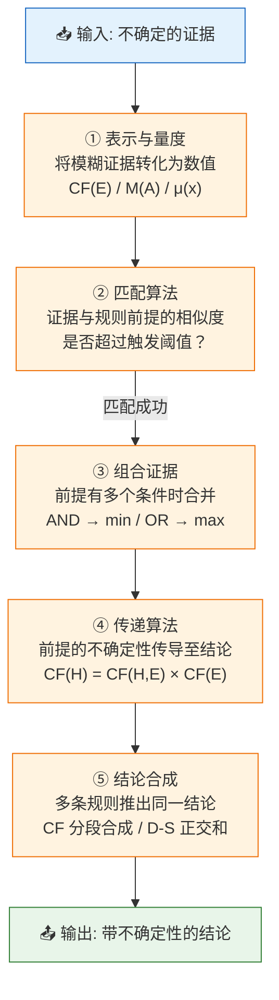
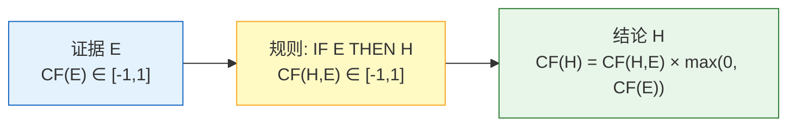
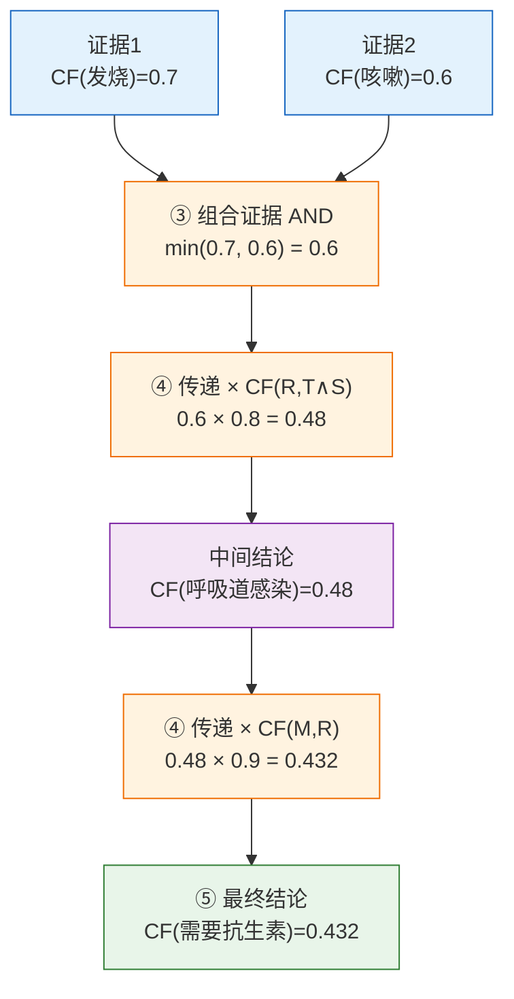
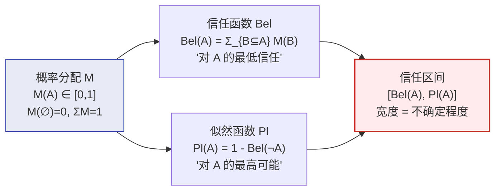
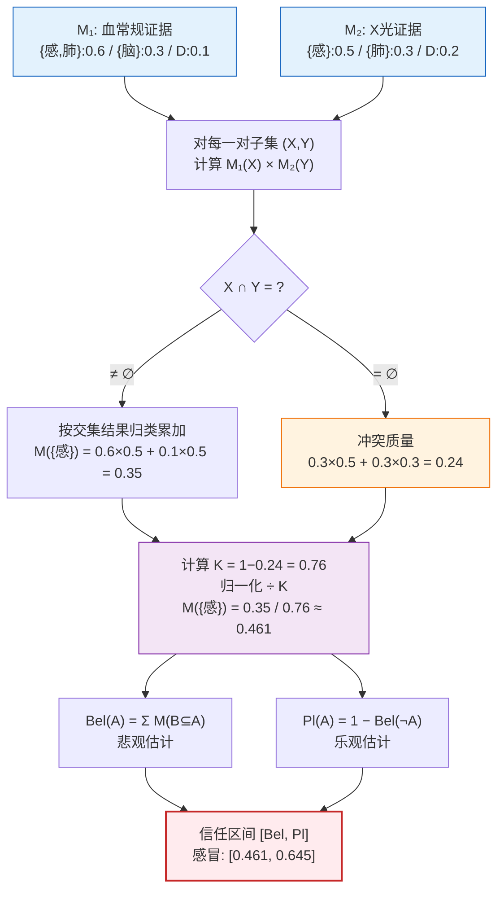
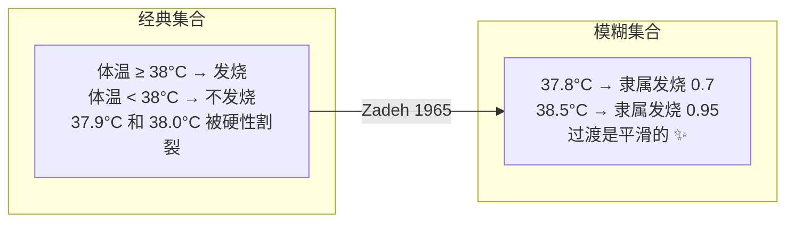
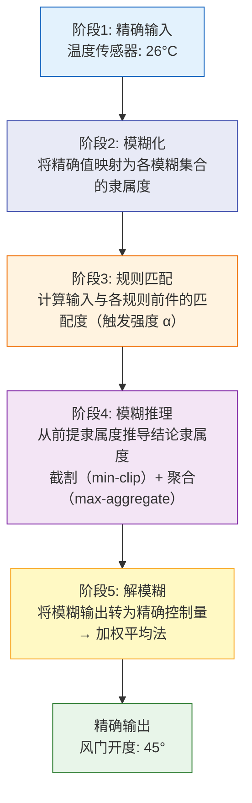
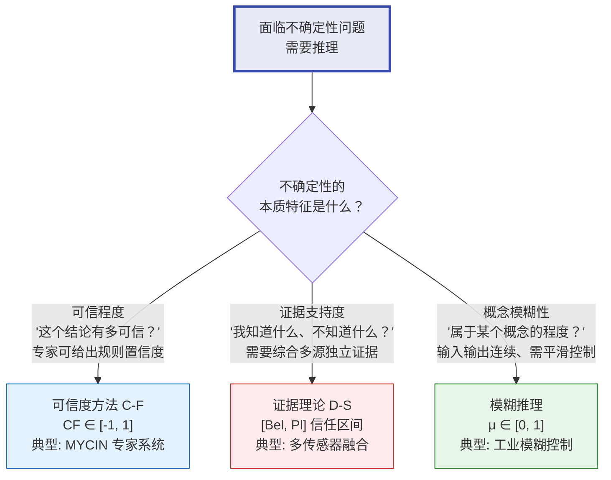
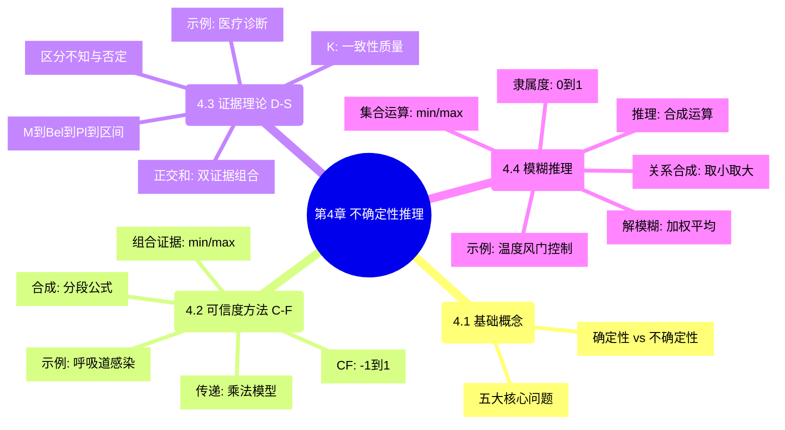

# 第4章 不确定性推理方法

> 核心问题：**现实世界充满"可能""大概""有点"——如何让计算机在不确定的知识和证据下，仍然做出合理的推理？**

> [!abstract] 📘 知识点导航
> | 知识块 | 说明 |
> |--------|------|
> | [可信度方法 (C-F)](/articles/ai-ml/introduction-to-ai/concepts/可信度方法/) | MYCIN 的推理引擎，直观简单 |
> | [证据理论 (D-S)](/articles/ai-ml/introduction-to-ai/concepts/证据理论/) | 区分"不知道"与"否定" |
> | [模糊推理](/articles/ai-ml/introduction-to-ai/concepts/模糊推理/) | 处理"年轻""热"等模糊概念 |

---

## 4.1 不确定性推理的基本概念

### 4.1.1 为什么需要不确定性推理？

[确定性推理](/articles/ai-ml/introduction-to-ai/concepts/推理的基本概念/)（第 3 章）要求知识 100% 精确、证据 100% 确定。但真实世界不是这样：

| 场景 | 确定性推理会怎样 | 实际需要 |
|------|:---------------:|------|
| "如果**发烧**则**可能**感冒" | 无法表达"可能" | 给结论加一个置信度 |
| "体温 37.8°C——算发烧吗？" | 非黑即白，无法判断 | 用隶属度描述"属于发烧的程度" |
| "两位专家给出矛盾的诊断" | 无法处理冲突 | 综合多源证据，给出信任区间 |

### 4.1.2 不确定性推理五大核心问题

五个核心问题并非孤立存在——它们构成了一个完整的推理流水线，每一个环节的输出都是下一个环节的输入：



流水线的含义：首先必须将模糊的、用自然语言表达的"不确定"转化为某种数值（①），然后判断当前证据是否与规则前提足够匹配以触发规则（②），对于有多个条件的前提需合并各条件的可信度（③），接着将前提的可信度按公式传递到结论（④），最后将多条规则对同一结论的贡献合并为最终结果（⑤）。

|  #  | 问题        | 核心挑战                        |     本章对应方法      |
| :-: | --------- | --------------------------- | :-------------: |
|  ①  | **表示与量度** | 用什么样的数值描述"不确定"？             | CF 值、BPA 函数、隶属度 |
|  ②  | **匹配算法**  | 证据不完全满足规则前提时，相似度多少才触发？      |      设定阈值       |
|  ③  | **组合证据**  | IF 前提有多个条件（AND/OR），总可信度怎么算？ |  min/max 法、概率法  |
|  ④  | **传递算法**  | 前提 → 结论的推理中，不确定性的"传导公式"是什么？ |      乘法模型       |
|  ⑤  | **结论合成**  | 两条规则各自独立推出同一结论，怎么合并？        |   CF 分段合成、正交和   |

---

## 4.2 可信度方法（C-F Model）

> **Shortliffe, 1975**。MYCIN 专家系统的推理引擎。直观简单、工程效果好——用一个 $[-1, 1]$ 的数字表示"多可信"。

### 原理



**两类 CF 值**：

| 类型 | 含义 | 来源 |
|------|------|------|
| **静态强度** CF(H,E) | 规则本身的可靠程度 | 专家给定（知识库） |
| **动态强度** CF(E) | 证据当前的可信程度 | 观察/计算得到 |

**CF 值含义**：

| CF 值 | 含义 |
|:-----:|------|
| 1 | 完全可信（确定真） |
| 0.6 | 比较可信 |
| 0 | 一无所知（无关联） |
| -0.6 | 比较不可信 |
| -1 | 完全不可信（确定假） |

### C-F 推理流水线

以下流程图展示了一条典型 C-F 规则链从证据输入到最终结论的完整数据流：



关键观察：0.8 × 0.6 × 0.9 = 0.432——每一步乘法都在衰减可信度。这意味着规则链越长，最终结论的可信度越低。因此专家系统设计时须将推理深度控制在合理范围（通常不超过 3-5 层）。

### 核心算法

**① 组合证据**：

$$
\begin{aligned}
\text{合取 AND: } & CF(E_1 \land E_2) = \min(CF(E_1),\, CF(E_2)) \\
\text{析取 OR: }  & CF(E_1 \lor E_2) = \max(CF(E_1),\, CF(E_2))
\end{aligned}
$$

> AND 取 min 的原因：合取要求所有条件同时成立，因此整体可信度受制于最不可靠的那个条件——"链条的强度等于最弱一环"。OR 取 max 的原因：析取只要求至少一个条件成立，因此整体可信度由最可靠的那个条件决定——"有一条充分证据就够了"。

**② 不确定性传递**：

$$
CF(H) = CF(H,E) \times \max(0,\, CF(E))
$$
> 当 $CF(E) \leq 0$（证据不成立），不触发规则，$CF(H) = 0$。

**③ 多规则结论合成**（两条规则独立推出同一 H）：

| 情况 | 公式 |
|------|------|
| $CF_1 > 0$ 且 $CF_2 > 0$ | $CF = CF_1 + CF_2 - CF_1 \times CF_2$ |
| $CF_1 < 0$ 且 $CF_2 < 0$ | $CF = CF_1 + CF_2 + CF_1 \times CF_2$ |
| 异号 | $CF = \dfrac{CF_1 + CF_2}{1 - \min(|CF_1|,\, |CF_2|)}$ |

> 为什么需要分段？当两条证据都支持结论（同正），简单相加会超过 1——乘积项 $CF_1 \times CF_2$ 起到阻尼作用，使结果保留在 $[0,1]$ 内。当两条证据都反对结论（同负），乘积项同样是阻尼。当一正一负时，两者互相抵消，分母 $1-\min$ 确保结果不偏向任何一方。

### 经典例子：多层规则链推理

```
已知规则:
  R1: IF 发烧(T) AND 咳嗽(S)  THEN 呼吸道感染(R)   CF(R, T∧S)=0.8
  R2: IF 呼吸道感染(R)        THEN 需要抗生素(M)    CF(M, R)=0.9

已知证据:
  CF(发烧) = 0.7,  CF(咳嗽) = 0.6

──────── 计算过程 ────────

Step 1: 组合证据
  CF(T∧S) = min(0.7, 0.6) = 0.6

Step 2: R1 传递
  CF(R) = CF(R, T∧S) × max(0, CF(T∧S))
        = 0.8 × 0.6 = 0.48

Step 3: R2 传递
  CF(M) = CF(M, R) × max(0, CF(R))
        = 0.9 × 0.48 = 0.432

结论: 需要抗生素的可信度为 0.432（中等偏低）
```

> 链越长，不确定性逐级衰减——这就是为什么专家系统要把规则链控制在合理长度。

### 优缺点

| ✅ 优点              | ❌ 缺点                           |
| ----------------- | ------------------------------ |
| 公式简单，计算直观         | **主观性强**：CF(H,E) 全靠专家拍脑袋       |
| 工程效果好（MYCIN 已验证）  | 缺乏严格概率论基础                      |
| 支持 AND/OR 组合和链式推理 | 多规则合成时分段公式不自然                  |
| `[-1, 1]` 取值范围直观  | 无法区分"不知道"与"否定"（$-1$ vs $0$ 之间信息丢失） |

---

## 4.3 证据理论（D-S Theory）

> **Dempster (1967) 奠基，Shafer (1976) 完善**。核心突破：**区分"不知道"和"否定"**——这是可信度方法和贝叶斯方法做不到的。

### 4.3.1 核心思想：证据不是概率

D-S 证据理论回答的根本问题，与概率论**完全不同**：

| 视角 | 概率论 | D-S 证据理论 |
|------|--------|-------------|
| **在描述什么？** | 世界本身的随机性 | 证据对人的说服力 |
| **根本问题** | "这件事客观上有多大概率发生？" | "现有证据在多大程度上说服我相信这件事？" |
| **无知怎么表达？** | 均匀分布——但"均匀"本身是一种精确假设，不能代表真无知 | $M(D)=1$——"我没有任何证据"，真正的一无所知 |
| **典型场景** | 掷骰子、抽样统计（客观随机） | 专家诊断、多传感器融合（证据有限） |

这个区别虽然微妙，但后果深远。以"火星上有生命吗"为例：

```
贝叶斯方式:
  必须回答 P(有) = ? 且 P(无) = 1 - P(有)
  如果我说 P(有)=0.3，那就被迫承认 P(无)=0.7
  → "0.7 的把握说没有生命"——但这根本不是我的本意！
  → 我只是证据不足，不是有证据否定

D-S 方式:
  Bel(有) = 0     "没有任何证据直接证明有生命"
  Pl(有)  = 0.5   "也没有多少证据直接否定有生命"
  区间 [0, 0.5] → "我基本什么都不知道"
  → 宽度 0.5 精准刻画了无知的程度
```

**核心哲学**：概率论在"描述世界"，D-S 在"描述证据"。你不需要假装自己知道不确定的事。

---

### 4.3.2 关键突破：证据可以分配给"集合"

D-S 理论最核心的技术创新只有一个——**基本概率分配（BPA）的对象不是单个假设，而是假设的任意子集**。

这听起来抽象，但对实际建模至关重要。因为专家知识的天然粒度往往是粗的：

```
场景: 医生看了血常规报告

概率论方式（强制拆分——粗暴）:
  "这报告让我 60% 确信是感冒，40% 确信是肺炎"
  → 但报告根本没提供区分两者的信息！医生只是被逼着拆开了

D-S 方式（保留证据粒度——诚实）:
  M({感冒, 肺炎}) = 0.6
  → "我有 60% 把握这是呼吸道疾病（感冒或肺炎），分不清具体是哪个"
  → 报告的实际分辨力被忠实保留，不强行替证据做决定
```

**为什么这很重要？** 因为当第二条证据（如 X 光片）能区分感冒和肺炎时，正交和会自然地把 M({感冒, 肺炎}) 中的 0.6 按 X 光片的倾向重新分配。如果一开始就强行拆成 0.3+0.3，就永远丢失了"它们本应联动"的信息。

这就是 D-S 被称为**证据理论**的原因——它如实记录证据说了什么，而不是替证据做决定。

---

### 4.3.3 三道透镜：M → Bel → Pl

有了 BPA（原始账本）之后，D-S 提供三个函数从不同角度解读同一批证据。理解三者的关键不是记公式，而是理解**它们各自在问什么问题**：

**M(A)**——原始账本
- 问："这份证据精确地、独立地支持了哪个子集？"
- 地位：最底层、最原始的数据，是 Bel 和 Pl 的共同原料

**Bel(A)**——悲观透镜
- 问："把所有**确定支持 A** 的证据加起来，有多少？"
- 公式：$\displaystyle Bel(A) = \sum_{B \subseteq A} M(B)$
- 直觉：只统计那些**完全落在 A 内部**的证据——这是 A 成立的**最低保证**

**Pl(A)**——乐观透镜
- 问："把所有**不直接反对 A** 的证据加起来，有多少？"
- 公式：$Pl(A) = 1 - Bel(\neg A)$
- 直觉：只要证据与 A 有一丝交集（不明确否定 A），就算上——这是 A 成立的**最高可能**

**一个类比——投资人看项目**：

```
问题："这个项目能赚钱吗？"  论域 D = {赚, 赔}

四位分析师提交报告（= 证据）:
  分析师1: "肯定赚"                → M({赚}) = 0.4
  分析师2: "肯定赔"                → M({赔}) = 0.2
  分析师3: "可能赚可能赔，说不清"    → M({赚, 赔}) = 0.3
  分析师4: "我放弃，不发表意见"     → M(D) = 0.1

Bel({赚}) = M({赚}) = 0.4
  → "直接说赚的报告，加起来只有 0.4"——悲观估计

Pl({赚}) = 1 - Bel({赔}) = 1 - 0.2 = 0.8
  → "除了明确说赔的那 0.2，其余 0.8 都不排除赚"——乐观估计

信任区间 [0.4, 0.8]:
  ├─ Bel=0.4: 底线——"至少 40% 把握"
  ├─ Pl=0.8: 上限——"至多 80% 可能"
  └─ 宽度 0.4: 分析师意见分歧 + 信息不足的程度
```

**[Bel, Pl] 区间的三重含义**：

| 含义 | 公式 | 解读 |
|------|------|------|
| Bel(A) | 确定性下界 | "我已证实这么多" |
| Pl(A) | 可能性上界 | "我最多相信这么多" |
| Pl(A) − Bel(A) | 无知区间 | "我还不确定的部分"——D-S 的精髓所在 |

**特殊区间的诊断价值**：

| 区间 | 含义 | 诊断 |
|------|------|------|
| $[0, 0]$ | A 确定为假 | 所有证据一致否定 A |
| $[1, 1]$ | A 确定为真 | 所有证据一致支持 A，无知区间为 0 |
| $[0, 1]$ | **完全无知** | 对 A 一无所知——这是概率论无法表达的 |
| $[0.3, 0.3]$ | 精确概率 | 无知区间为 0 → 退化为贝叶斯情形 |
| $[0.2, 0.8]$ | 证据严重不足 | 宽度 0.6 → 需要收集更多证据 |

### 核心三函数（可视化总结）

上节用文字和类比解释了 M / Bel / Pl 各自在问什么问题。下面这张图是它们在 D-S 理论中的数学关系——从原始 BPA 到最终信任区间的数据流：



> **一句话速记**：M 是原材料 → Bel 取"已证实"的下界 → Pl 取"未否定"的上界 → 区间宽度 = 无知程度。

### 双证据组合（正交和）

两条独立证据 $M_1$、$M_2$ 的合成规则：

$$
M(A) = \frac{1}{K} \sum_{X \cap Y = A} M_1(X) \times M_2(Y)
$$

$$
\text{其中 } K = 1 - \sum_{X \cap Y = \emptyset} M_1(X) \times M_2(Y) \quad \leftarrow \text{非冲突系数（一致性质量）}
$$

> [!important] **K 的含义**
> $K$ 是两份证据的**一致性质量**——即所有非冲突部分的概率之和。
> - $K = 1$：证据**完全一致**，无任何冲突（理想情况，直接组合）
> - $0 < K < 1$：存在部分冲突，组合时需归一化（除以 $K$ 以放大至 1）
> - $K \to 0$：证据**高度矛盾**，分母趋近于 0，归一化急剧放大噪声，组合结果不可靠
>
> 注意：某些教材将冲突质量本身记为 $K$（此时公式为 $M(A) = \frac{1}{1-K}\sum\dots$，$K$ 越大越矛盾）。本文采用一致性质量的定义——$K$ 越大越一致，更符合直觉。
> 
> 原教材若写"K=0 表示完全矛盾"在此定义下恰好正确（因为 $K \to 0$ 确实表示矛盾），但需注意两种定义的差异。

### 正交和计算流程

以下流程图展示了从两条独立证据到最终信任区间的完整计算路径：



### 信任区间的直观理解

信任区间 [Bel, Pl] 可以理解为数轴上的一段——Bel 是"确定成立"的底线，Pl 是"可能成立"的上限，两者之间的宽度即"不确定"的空间：

```
感冒的诊断结论:
  0        Bel=0.461          Pl=0.645        1
  ├────────── ├──────────────────├──────────────┤
  │← 确定支持  │←    不确定    →  │←  确定反对   →│
  │  的空间    │  (宽度 = 0.184) │    的空间     │

脑膜炎的诊断结论:
  0   Bel=0.079  Pl=0.105                       1
  ├─────├─────────├──────────────────────────────┤
  │←确定支持→│←不确定 →│←         确定反对          →│
  │          │ (0.026) │                             │
```

脑膜炎区间极窄（0.026），说明两份证据在脑膜炎上高度一致——基本排除。感冒区间较宽（0.184），说明证据还不够确定，存在较大的认知盲区。

### 经典例子：医疗诊断

```
样本空间 D = {感, 肺, 脑}  （感冒/肺炎/脑膜炎）

证据 1（血常规）:
  M₁({感, 肺}) = 0.6    "60% 把握是呼吸道疾病（感冒或肺炎），分不清哪个"
  M₁({脑})     = 0.3    "30% 把握是脑膜炎"
  M₁(D)        = 0.1    "10% 完全不确定"

证据 2（X 光片）:
  M₂({感})     = 0.5    "50% 把握就是感冒"
  M₂({肺})     = 0.3    "30% 把握是肺炎"
  M₂(D)        = 0.2    "20% 不确定"

──────── 正交和 ────────

计算冲突质量:
  M₁({感,肺}) ∩ M₂ = 无冲突（{感,肺}和{感}/{肺}都有交集）  
  M₁({脑}) ∩ M₂({感}) = ∅ → 0.3×0.5=0.15
  M₁({脑}) ∩ M₂({肺}) = ∅ → 0.3×0.3=0.09
  冲突合计 = 0.15 + 0.09 = 0.24

计算 K（一致性质量）:
  K = 1 - 0.24 = 0.76

计算 M({感}):
  M₁({感,肺})×M₂({感}) + M₁(D)×M₂({感}) = 0.6×0.5 + 0.1×0.5 = 0.35
  M({感}) = 0.35 / K = 0.35 / 0.76 ≈ 0.461

计算 M({肺}):
  M₁({感,肺})×M₂({肺}) + M₁(D)×M₂({肺}) = 0.6×0.3 + 0.1×0.3 = 0.21
  M({肺}) = 0.21/0.76 ≈ 0.276

计算 M({感,肺}):  M₁({感,肺})×M₂(D) / 0.76 = 0.6×0.2/0.76 ≈ 0.158
计算 M({脑}):    M₁({脑})×M₂(D)     / 0.76 = 0.3×0.2/0.76 ≈ 0.079
计算 M(D):       M₁(D)×M₂(D)        / 0.76 = 0.1×0.2/0.76 ≈ 0.026

──────── 结论 ────────

  Bel({感}) = M({感}) = 0.461
  Pl({感}) = 1 - Bel({肺, 脑}) = 1 - (0.276+0.079) = 0.645
  信任区间: [0.461, 0.645]  → 感冒可能性 46%~65%

  Bel({肺}) = 0.276, Pl({肺}) ≈ 0.460  → 肺炎可能性 28%~46%
  Bel({脑}) = 0.079, Pl({脑}) ≈ 0.105  → 脑膜炎可能性 8%~11%
```

> D-S 的优势一目了然：不仅给出了数字，还通过区间宽度揭示了不确定性。脑膜炎信任区间窄（8%~11%），说明证据对它比较确定（基本排除）。感冒区间宽（46%~65%），说明还不够确定。

### 补充例题：含不确定性证据的 D-S 推理

前面的例子假设两条证据各自确定，BPA 直接可用。实际场景中，**证据本身也带有不确定性**（流鼻涕 ≠ 100% 确定），此时需先对 BPA 进行**折扣处理**，再进行正交和。

---

**问题**：

设有规则：
- **R1**: 如果**流鼻涕** → 感冒但非过敏性鼻炎 (0.9) 或 过敏性鼻炎但非感冒 (0.1)
- **R2**: 如果**眼发炎** → 感冒但非过敏性鼻炎 (0.8) 或 过敏性鼻炎但非感冒 (0.05)

已知事实：
- 小王流鼻涕 (**0.9**)
- 小王眼发炎 (**0.4**)

**问**：小王患什么病？

---

**分析**：论域 $D = \{\text{感冒}(C),\; \text{过敏性鼻炎}(A)\}$。

##### Step 1：根据规则构造原始 BPA

两条规则给出了**条件成立时**的 BPA：

$$
\begin{aligned}
\text{R1: } & M_1(\{C\}) = 0.9,\quad M_1(\{A\}) = 0.1,\quad M_1(D) = 0 \quad (\text{规则概率之和}=1) \\
\text{R2: } & M_2(\{C\}) = 0.8,\quad M_2(\{A\}) = 0.05,\quad M_2(D) = 0.15 \quad (0.8+0.05=0.85<1,\;\text{剩余归}D)
\end{aligned}
$$

##### Step 2：证据不确定性折扣

证据可信度 $c < 1$ 时，不能直接使用原始 BPA。**折扣公式**：

$$
M'(A) = c \times M(A)\quad(A \neq D);\qquad M'(D) = 1 - c + c \times M(D)
$$

直观理解：证据只有 $c$ 的把握是可靠的，因此每个焦点元素的可信度打 $c$ 折，剩余 $(1-c)$ 的质量全部分配给 $D$（"不知道"）。

**R1 折扣**（$c_1 = 0.9$）：

$$
\begin{aligned}
M_1'(\{C\}) &= 0.9 \times 0.9 = 0.81 \\
M_1'(\{A\}) &= 0.9 \times 0.1 = 0.09 \\
M_1'(D)    &= 0.1 + 0.9 \times 0 = 0.10
\end{aligned}
$$

**R2 折扣**（$c_2 = 0.4$）：

$$
\begin{aligned}
M_2'(\{C\}) &= 0.4 \times 0.8 = 0.32 \\
M_2'(\{A\}) &= 0.4 \times 0.05 = 0.02 \\
M_2'(D)    &= 0.6 + 0.4 \times 0.15 = 0.66
\end{aligned}
$$

> 验证：$\sum M_1' = 0.81+0.09+0.10 = 1.0$ ✓；$\sum M_2' = 0.32+0.02+0.66 = 1.0$ ✓

##### Step 3：正交和计算

枚举 $M_1'$ 与 $M_2'$ 所有焦点元素的交集组合：

| $X$ ($M_1'$) | $Y$ ($M_2'$) | $X \cap Y$  | $M_1'(X) \times M_2'(Y)$ |
| :----------: | :----------: | :---------: | :----------------------: |
| $\{C\}$:0.81 | $\{C\}$:0.32 |   $\{C\}$   |          0.2592          |
| $\{C\}$:0.81 | $\{A\}$:0.02 | $\emptyset$ |          0.0162          |
| $\{C\}$:0.81 |   $D$:0.66   |   $\{C\}$   |          0.5346          |
| $\{A\}$:0.09 | $\{C\}$:0.32 | $\emptyset$ |          0.0288          |
| $\{A\}$:0.09 | $\{A\}$:0.02 |   $\{A\}$   |          0.0018          |
| $\{A\}$:0.09 |   $D$:0.66   |   $\{A\}$   |          0.0594          |
|   $D$:0.10   | $\{C\}$:0.32 |   $\{C\}$   |          0.0320          |
|   $D$:0.10   | $\{A\}$:0.02 |   $\{A\}$   |          0.0020          |
|   $D$:0.10   |   $D$:0.66   |     $D$     |          0.0660          |

- **冲突质量** $= 0.0162 + 0.0288 = 0.045$（两种病互斥的场景）
- **一致性质量** $K = 1 - 0.045 = 0.955$（证据高度一致）

归一化（÷K）：

$$
\begin{aligned}
M(\{C\}) &= (0.2592 + 0.5346 + 0.0320) / 0.955 = 0.8258 / 0.955 \approx 0.865 \\
M(\{A\}) &= (0.0018 + 0.0594 + 0.0020) / 0.955 = 0.0632 / 0.955 \approx 0.066 \\
M(D)    &= 0.0660 / 0.955 \approx 0.069
\end{aligned}
$$

> 验证：$0.865 + 0.066 + 0.069 = 1.0$ ✓

##### Step 4：计算信任区间

$$
\begin{aligned}
Bel(\{C\}) &= M(\{C\}) = 0.865 \\
Pl(\{C\})  &= 1 - Bel(\{A\}) = 1 - 0.066 = 0.934 \\
\text{信任区间: } &[0.865,\; 0.934]
\end{aligned}
$$

$$
\begin{aligned}
Bel(\{A\}) &= M(\{A\}) = 0.066 \\
Pl(\{A\})  &= 1 - Bel(\{C\}) = 1 - 0.865 = 0.135 \\
\text{信任区间: } &[0.066,\; 0.135]
\end{aligned}
$$

**可视化**：

```
感冒(C):
  0        Bel=0.865        Pl=0.934   1
  ├──────────├─────────────────├────────┤
  │←确定支持→│←    不确定     →│←确定反对→│
              (宽度 ≈ 0.07)

过敏性鼻炎(A):
  0   Bel=0.066  Pl=0.135              1
  ├──── ├──────────├───────────────────┤
  │←确定支持→│←不确定 →│←    确定反对    →│
              (≈ 0.07)
```

##### 结论

| 疾病 | 信任区间 | 诊断 |
|:---:|:---:|:---:|
| 感冒 (C) | $[0.865,\; 0.934]$ | ✅ **确诊** |
| 过敏性鼻炎 (A) | $[0.066,\; 0.135]$ | ❌ 基本排除 |

> **小王患感冒**。两区间宽度均约 0.07，说明证据冲突很小（$K = 0.955$），结论可靠。R2 的可信度仅 0.4，但由于其大部分质量也指向感冒，经正交和合并后感冒的信任度反而从 R1 的 0.81 提升至 0.865——体现了 D-S 理论"独立证据互相印证"的效应。

##### 关键启示

1. **证据折扣**是 D-S 处理不确定性证据的标准手段：将证据可信度 $c$ 以乘法方式折扣各 BPA，剩余质量归 $D$。
2. **正交和的"印证效应"**：即使第二条证据可信度不高（0.4），只要方向一致（也指感冒），组合后结论的可信度反而会**上升**。
3. **冲突质量小（0.045）→ $K$ 高（0.955）**：说明两条证据高度一致，归一化放大安全、结论可靠。

---

### 优缺点

| ✅ 优点 | ❌ 缺点 |
|----------|----------|
| **区分"不知道"与"否定"**：信任区间揭示认知盲区 | **计算量大**：子集数 $= 2^{|D|}$，论域稍大就指数爆炸 |
| 先验概率不需要（弱于贝叶斯的前提） | **K→0 时组合结果不可靠**（Zadeh 悖论） |
| 多源证据组合有严格的数学基础 | 概率分配（BPA）的获取本身依赖专家 |
| 信任区间直观表达不确定性范围 | 证据独立性假设在实际中常不满足 |

---

## 4.4 模糊推理方法

> **Zadeh, 1965**。不是概率——是用**隶属度**描述"属于某个概念的程度"。"37.8°C 算不算发烧？"经典逻辑说非黑即白，模糊逻辑说"0.7 的隶属度属于发烧"。

### 4.4.1 从经典集合到模糊集合



### 4.4.2 核心概念

| 概念               | 定义                             | 示例                             |
| ---------------- | ------------------------------ | ------------------------------ |
| **论域**           | 讨论对象的全体                        | 所有可能的体温值                       |
| **隶属度 $\mu(x)$** | $x$ 属于模糊集合 $A$ 的程度，$\in [0,1]$ | $\mu_{\text{发烧}}(38.5) = 0.95$ |
| **隶属函数**         | 定义了隶属度分布的曲线                    | 三角、梯形、正态分布                     |

**三种表示法**（离散论域 X = {x₁, x₂, ..., xₙ}）：

| 表示法 | 格式 | 示例 |
|--------|------|------|
| **Zadeh 法** | $A = \mu_1/x_1 + \mu_2/x_2 + \dots$ | "年轻" $= 1/20 + 0.8/30 + 0.3/40 + 0/60$ |
| **序偶法** | $A = \{(x_1,\mu_1), (x_2,\mu_2), \dots\}$ | "年轻" $= \{(20,1), (30,0.8), (40,0.3), (60,0)\}$ |
| **向量法** | $A = [\mu_1, \mu_2, \dots]$ | "年轻" $= [1, 0.8, 0.3, 0]$ |

**常用隶属函数**：

| 类型 | 形状 | 适用场景 |
|------|------|------|
| **三角** | ∧ | 最简单，中心明确 |
| **梯形** | ╱‾‾‾╲ | 有平坦区域的概念 |
| **正态（高斯）** | 钟形 | 自然分布，最常用 |
| 确定方法: 模糊统计法、例证法、专家经验法、二元对比排序法 |

### 4.4.3 模糊集合运算

#### 基本运算（Zadeh 算子）

| 运算 | 公式 | 说明 |
|------|------|------|
| **交** $A \cap B$ | $\mu_{A \cap B}(x) = \min(\mu_A(x),\, \mu_B(x))$ | 取隶属度最小值 |
| **并** $A \cup B$ | $\mu_{A \cup B}(x) = \max(\mu_A(x),\, \mu_B(x))$ | 取隶属度最大值 |
| **补** $\neg A$ | $\mu_{\neg A}(x) = 1 - \mu_A(x)$ | 对 1 的补 |

这三组是 Zadeh 于 1965 年提出的原始定义，也是模糊推理中最常用的算子。

> "又高又瘦" = $\min(\text{身高隶属度}, \text{瘦隶属度})$；"高或瘦" = $\max(\text{身高隶属度}, \text{瘦隶属度})$

#### 代数运算（替代 t-范数 / t-余范数）

min 和 max 并非模糊交与并的唯一选择。任何满足单调性、交换律、结合律和边界条件的二元运算都可以作为模糊交（t-范数）或模糊并（t-余范数）。以下是最常用的替代方案：

| 类型      | 运算        | 公式                                                        | t-范数（交的替代） | t-余范数（并的替代） |
| ------- | --------- | --------------------------------------------------------- | :--------: | :---------: |
| **代数型** | 积 / 和     | $\mu_A \cdot \mu_B$ / $\mu_A + \mu_B - \mu_A \cdot \mu_B$ |     ✓      |      ✓      |
| **有界型** | 有界积 / 有界和 | $\max(0, \mu_A + \mu_B - 1)$ / $\min(1, \mu_A + \mu_B)$   |     ✓      |      ✓      |

**代数积与代数和**：

$$
\begin{aligned}
\text{代数积: } &\mu_{A \cdot B}(x) = \mu_A(x) \times \mu_B(x) \\
\text{代数和: } &\mu_{A + B}(x) = \mu_A(x) + \mu_B(x) - \mu_A(x) \times \mu_B(x)
\end{aligned}
$$

- 代数积用乘法代替 min，两个隶属度都会影响结果（不似 min 只取较小者，丢失另一信息）
- 代数和的形式类似概率论中 $P(A \cup B) = P(A) + P(B) - P(A \cap B)$，因此也称**概率型并**

**有界积与有界和**：

$$
\begin{aligned}
\text{有界积: } &\mu_{A \otimes B}(x) = \max(0,\; \mu_A(x) + \mu_B(x) - 1) \\
\text{有界和: } &\mu_{A \oplus B}(x) = \min(1,\; \mu_A(x) + \mu_B(x))
\end{aligned}
$$

- 有界积要求两隶属度之和超过 1 才产生非零结果（比 min 和代数积更严格）
- 有界和将隶属度之和截断在 1（比 max 和代数和更宽松）

**四种运算对比示例**（设 $\mu_A = 0.7, \mu_B = 0.4$）：

| 运算 | 公式 | 交的结果 | 并的结果 |
|------|------|:--------:|:--------:|
| Zadeh（min / max）| $\min / \max$ | 0.4 | 0.7 |
| 代数（积 / 和）| $\times \; / \; + - \times$ | 0.28 | 0.82 |
| 有界（有界积 / 有界和）| $\max(0,+ - 1) \; / \; \min(1,+)$ | 0.10 | 1.0 |

- Zadeh 算子结果最"温和"（交损失信息最多，并增长最慢）
- 有界算子结果最"极端"（交最严格，并增长最快）
- 代数算子居中

**选择依据**：Zadeh 算子适用于规则触发强度的保守估计（Mamdani 推理）；代数算子适用于需要保留所有输入信息量的场景；有界算子适用于隶属度之和需严格限制在 $[0,1]$ 的问题。

### 4.4.4 模糊关系与合成

**模糊关系 R** 是两个论域间的模糊映射，用**矩阵**表示：

```
身高 vs 体重:
     50kg 60kg 70kg 80kg
170 [0.1  0.5  0.4  0.1 ]
180 [0.0  0.2  0.6  0.5 ]   ← 180cm 与 70+kg "匹配"程度高
190 [0.0  0.1  0.3  0.8 ]
```

**模糊关系合成**（$\lor$-$\land$ 合成）：$R = R_1 \circ R_2$

$$
r_{ijk} = \bigvee_k \big( r_{1ik} \land r_{2kj} \big) \quad \leftarrow \text{先取小}(\land)\text{再取大}(\lor)
$$

本质上就是**模糊版的矩阵乘法**，把 $\times$ 换成 $\min$，$+$ 换成 $\max$。

### 4.4.5 模糊推理：从模糊输入到模糊输出

模糊推理的完整流程包含五个阶段——从精确数值输入，经过模糊化、规则匹配、推理合成、解模糊，最终回到精确控制量：



#### 阶段3：规则触发强度

对于规则 "IF x is A THEN y is B"，当前输入 $x_0$ 与规则前件 $A$ 的匹配程度称为**触发强度**（firing strength）：

$$
\alpha = \mu_A(x_0)
$$

若前件有多个条件，组合方式与 4.2 节 C-F 方法中的证据组合相同：

$$
\begin{aligned}
\text{AND: } & \alpha = \min(\mu_{A_1}(x_1),\, \mu_{A_2}(x_2),\, \dots) \\
\text{OR: }  & \alpha = \max(\mu_{A_1}(x_1),\, \mu_{A_2}(x_2),\, \dots)
\end{aligned}
$$

触发强度 $\alpha \in [0, 1]$ 控制了该规则对最终结论的贡献权重。$\alpha = 0$ 表示规则未触发，不参与后续推理。

#### 阶段4：模糊推理（Mamdani 法）

从前提隶属度到结论隶属度的推理，实际工程中最常用的是 **Mamdani 推理法**（即最小-最大合成法），分为两步：

**第一步——截割（clip）**：将规则结论的隶属函数在触发强度 $\alpha$ 处截断：

$$
\mu_{B}'(y) = \min(\alpha,\; \mu_B(y))
$$

含义：规则结论的可靠程度不可能超过该规则前提的匹配程度——如果前提只有 0.8 的可信度，结论也不可能超过 0.8。

**第二步——聚合（aggregate）**：将所有已触发规则的输出合并为总模糊集：

$$
\mu_{\text{total}}(y) = \max\big(\mu_{B_1}'(y),\; \mu_{B_2}'(y),\; \dots\big)
$$

含义：输出空间中任意一点 $y$ 的总隶属度，取所有规则对该点隶属度估计的最大值——"有一条规则认为行，就算行"。

#### 两种等价视角

上述两步操作本质上等价于 4.4.4 节介绍的 **∨-∧ 合成**（模糊关系合成）：

每条规则 "IF x is A THEN y is B" 定义了一个模糊关系（从输入论域 $X$ 到输出论域 $Y$ 的模糊映射）：

$$
R(x, y) = \min(\mu_A(x),\; \mu_B(y))
$$

多规则的总体模糊关系为 $\displaystyle R = \max(R_1, R_2, \dots)$。

输入 $A'$ 与 $R$ 经过 ∨-∧ 合成得到输出 $B'$：

$$
\mu_{B'}(y) = \bigvee_{x \in X} \big( \mu_{A'}(x) \land R(x, y) \big)
$$

对于精确输入 $x_0$，$\mu_{A'}(x)$ 仅在 $x_0$ 处为 1、其余为 0，上式简化为：

$$
\mu_{B'}(y) = \min(\mu_A(x_0),\; \mu_B(y))
$$

这正是 Mamdani 的截割操作。因此：

| 工程实现（Mamdani） | 理论形式（∨-∧ 合成） |
|---------------------|---------------------|
| 截割：$\min(\alpha, \mu_B(y))$ | $\min$（$\land$）——先取小 |
| 聚合：$\max(\mu_{B_1}', \mu_{B_2}', \dots)$ | $\max$（$\lor$）——再取大 |

**两者是同一推理过程的两种表述方式**：理论形式用模糊关系矩阵描述，适合数学分析；Mamdani 法用逐规则截割再聚合描述，适合工程实现。

### 4.4.6 解模糊（清晰化）

阶段 4 的输出是一个模糊集合 $\mu_{\text{total}}(y)$，它刻画了输出论域 $Y$ 上每个取值 $y$ 的隶属度。但物理执行器（电机、阀门、显示屏）无法直接执行一个模糊集合——它们需要**一个精确数值**。解模糊的任务就是将 $\mu_{\text{total}}(y)$ 转化为单个数值 $y^*$。

以下三种方法依次利用了越来越多的信息量：

#### 最大隶属度法

取隶属度最大的点作为输出。若最大值对应多个 $y$，则取它们的均值：

$$
y^* = \arg\max_{y} \mu_{\text{total}}(y)
$$

- **优点**：计算最简单
- **缺点**：只取峰顶，忽略了隶属函数的整体形状——两个形状截然不同的模糊集若峰值相同，将输出相同的结果
- **适用**：对精度要求不高的快速决策

#### 加权平均法（重心法）

计算隶属函数曲线下面积的**重心**（centroid）作为输出。对于离散输出论域 $Y = \{y_1, y_2, \dots, y_n\}$：

$$
y^* = \frac{\displaystyle\sum_{j} y_j \,\mu_{\text{total}}(y_j)}{\displaystyle\sum_{j} \mu_{\text{total}}(y_j)}
$$

- **优点**：利用了 $\mu_{\text{total}}(y)$ 的全部形状信息，输出平滑连续，对输入变化不敏感跳跃
- **缺点**：计算量相对较大
- **适用**：**工程控制中最常用**（也称 COG, Center of Gravity）

在模糊控制的标准做法中，若各输出模糊集合的隶属函数为对称三角形/梯形，可用各集合的**峰心**（如 "小"=15、"中"=45、"大"=75）与触发强度做加权平均，即简化的重心法：

$$
y^* = \frac{\sum (\text{峰心}_i \times \alpha_i)}{\sum \alpha_i}
$$

这正是本节的示例中使用的方法（见经典例子 Step 5）。

#### 中位数法（面积平分法）

取将 $\mu_{\text{total}}(y)$ 曲线下总面积平分为两等份的点作为输出：

$$
\int_{-\infty}^{y^*} \mu_{\text{total}}(y)\,dy = \int_{y^*}^{+\infty} \mu_{\text{total}}(y)\,dy
$$

- **优点**：考虑了整个分布，不受峰值大小波动的影响
- **缺点**：需要求解积分方程，计算最慢
- **适用**：信息利用率最高，但对实时控制而言计算开销过大

#### 三种方法对比（同一输出模糊集为例）

设阶段 4 推理得到的 $\mu_{\text{total}}(y)$ 为两个对称三角截割后的聚合：

| 方法 | 计算依据 | 特点 | 结果示例 |
|------|---------|------|:--------:|
| 最大隶属度法 | 仅峰值位置 | 简单，丢弃形状信息 | 45° |
| 加权平均法 | 全部 $(\mu, y)$ 对 | 平滑、信息完整 | 45° |
| 中位数法 | 面积均分点 | 信息完整，计算最复杂 | 约 45° |

> 在仅有一条规则触发时（如经典例子），三种方法结果一致（45°）。差异出现在多条规则同时触发、输出模糊集形状不对称时——此时加权平均法给出的结果最平滑合理，因此成为工程首选。

### 经典例子：温度-风门模糊控制

演示用模糊关系矩阵进行推理的完整过程。

```
场景: 根据室温控制空调风门开度

论域:
  温度 X = [15, 35]    (离散化为 {15, 22, 26, 35})
  风门 Y = [0, 90]     (离散化为 {0, 30, 45, 60, 90})

Step 0: 定义模糊集合（隶属函数）

  温度:
    "冷"   三角 [15, 15, 22]
    "舒适" 三角 [20, 25, 30]
    "热"   三角 [27, 35, 35]

  风门:
    "小"   三角 [0, 0, 30]
    "中"   三角 [20, 45, 70]
    "大"   三角 [60, 90, 90]

  计算各模糊集在离散点上的隶属度:

                X:   15    22    26    35
    μ_冷           [  1.0   0     0     0  ]
    μ_舒适         [  0    0.4   0.8   0   ]
    μ_热           [  0    0     0    1.0  ]

                 Y:    0    30    45    60    90
    μ_小            [  1.0   0     0     0    0  ]
    μ_中            [  0   0.4   1.0   0.4   0  ]
    μ_大            [  0    0     0     0   1.0  ]

Step 1: 定义模糊规则，构造模糊关系矩阵 R

  规则:
    R1: IF 温度冷   THEN 风门小
    R2: IF 温度舒适 THEN 风门中
    R3: IF 温度热   THEN 风门大

  每条规则对应一个模糊关系 R_i(x, y) = min(μ_前件(x), μ_结论(y))：

  R₁ (冷→小):
           y=0  y=30 y=45 y=60 y=90
    x=15: [ 1,   0,   0,   0,   0 ]
    x=22: [ 0,   0,   0,   0,   0 ]
    x=26: [ 0,   0,   0,   0,   0 ]
    x=35: [ 0,   0,   0,   0,   0 ]

  R₂ (舒适→中):
           y=0  y=30 y=45 y=60 y=90
    x=15: [ 0,   0,   0,   0,   0 ]
    x=22: [ 0,  0.4, 0.4, 0.4,  0 ]
    x=26: [ 0,  0.4, 0.8, 0.4,  0 ]
    x=35: [ 0,   0,   0,   0,   0 ]

  R₃ (热→大):
           y=0  y=30 y=45 y=60 y=90
    x=15: [ 0,   0,   0,   0,   0 ]
    x=22: [ 0,   0,   0,   0,   0 ]
    x=26: [ 0,   0,   0,   0,   0 ]
    x=35: [ 0,   0,   0,   0,  1.0 ]

  总模糊关系 R = max(R₁, R₂, R₃)：
           y=0  y=30 y=45 y=60 y=90
    x=15: [ 1,   0,   0,   0,   0 ]
    x=22: [ 0,  0.4, 0.4, 0.4,  0 ]
    x=26: [ 0,  0.4, 0.8, 0.4,  0 ]
    x=35: [ 0,   0,   0,   0,  1.0 ]

Step 2: 输入精确温度 26°C，构造输入模糊集 C

  26°C 是精确值，表示为模糊单点集（fuzzy singleton）：
    μ_C(15) = 0,  μ_C(22) = 0,  μ_C(26) = 1,  μ_C(35) = 0
  → C = [0, 0, 1, 0]ᵀ

  通过 ∨-∧ 合成计算输出 B' = C ∘ R：
    B'(y) = ∨_{x∈X} (μ_C(x) ∧ R(x, y))

  由于 C 仅在 x=26 处为 1，其余为 0，合成简化为取 R 中第 26 行：

    y=0:  min(1, 0)   = 0
    y=30: min(1, 0.4) = 0.4
    y=45: min(1, 0.8) = 0.8
    y=60: min(1, 0.4) = 0.4
    y=90: min(1, 0)   = 0

  → B' = [0, 0.4, 0.8, 0.4, 0]

  B' 的含义：风门开度各离散值的隶属度——最有可能是 45°（μ=0.8），
  30° 和 60° 也有一定可能性（μ=0.4）。

Step 3: 解模糊（加权平均法）

  y* = (0×0 + 30×0.4 + 45×0.8 + 60×0.4 + 90×0) / (0 + 0.4 + 0.8 + 0.4 + 0)
     = (12 + 36 + 24) / 1.6
     = 72 / 1.6 = 45°

  → 空调风门开到 45°，中等开度，合理！
```

> 用模糊关系矩阵推理与直接 Mamdani 截割+聚合的结果完全一致（45°），因为两者本质上执行了相同的 min-max 运算。区别在于：关系矩阵将规则知识**显式编码为一张固定表**，可以反复使用——更换输入 C 时不需要重新构造 R，只需重新做一次合成计算。

### 优缺点

| ✅ 优点 | ❌ 缺点 |
|----------|----------|
| 自然处理"年轻""热"等模糊概念 | 隶属函数设计依赖经验 |
| 数学成熟，工程应用广泛（家电/地铁/工业控制） | 规则增多后推理复杂度上升 |
| 不依赖精确数学模型 | 解模糊会损失信息 |
| 过渡平滑，不会硬切换 | 缺乏严格的最优性证明 |

---

## 🗺️ 三种方法对比

| 维度 | 可信度 C-F | 证据理论 D-S | 模糊推理 |
|------|:----------:|:------------:|:--------:|
| **不确定性的本质** | 可信程度 | 证据支持度（区间） | 隶属程度 |
| **数值范围** | $[-1, 1]$ | $[0, 1]$（区间） | $[0, 1]$（隶属度） |
| **能否区分"不知道"和"否定"** | ❌ | ✅ 核心优势 | ❌ |
| **概率论基础** | 弱（启发式） | 强 | 无（独立体系） |
| **计算复杂度** | 低 | 高（指数级） | 中 |
| **典型应用** | 专家系统 (MYCIN) | 多传感器融合 | 模糊控制 |
| **代表年份** | 1975 | 1976 | 1965 |

---

## 🧭 知识地图

### 方法选择决策图

以下流程图帮助在实际问题中根据不确定性的本质特征选择合适的推理方法：



### 知识地图



## 相关概念

- [第3章 确定性推理方法](/articles/ai-ml/introduction-to-ai/summaries/第3章-确定性推理方法/)
- [推理的基本概念](/articles/ai-ml/introduction-to-ai/concepts/推理的基本概念/)
- [产生式系统](/articles/ai-ml/introduction-to-ai/concepts/产生式系统/)
- [一阶谓词逻辑](/articles/ai-ml/introduction-to-ai/concepts/一阶谓词逻辑/)
