# 第5章 搜索求解策略

> 核心问题：**当问题不能一步求解、需要逐步试探时，如何系统化地找到从初始状态到目标状态的路径？**

> [!abstract] 📘 知识点导航
> | 知识块 | 说明 |
> |--------|------|
> |  | 逐层拓展，保证最短路径 |
> |  | 纵深优先，空间效率高 |
> |  | 基于估价函数 f = g + h 的最佳优先搜索 |
> |  | 可采纳启发式保证最优解 |
> |  | 随机模拟 + 树搜索，AlphaGo 核心 |

---

## 5.1 搜索的概念

### 5.1.1 问题求解与搜索基础

人工智能中的问题求解包含两大核心环节：

1. **问题表示**：将实际问题形式化为状态、操作算子、目标的形式化语言
2. **求解方法**：在问题表示的基础上寻找解路径

主流求解方法包括：

| 方法        |            核心思想            |
| --------- | :------------------------: |
| **搜索法**   | 在状态空间中逐步探索，寻求从初始状态到目标状态的路径 |
| **归约法**   |  将原问题分解为子问题，子问题解决了原问题即解决   |
| **归结法**   |    逻辑公式的归谬推理，将目标取反后导出矛盾    |
| **推理法**   |      基于知识库中的规则从前提到结论       |
| **产生式方法** |    匹配-选择-执行循环，规则驱动的状态转换    |

> 搜索法的本质是"在解空间中尝试不同路径"。它与[确定性推理](/articles/ai-ml/introduction-to-ai/concepts/推理的基本概念/)的共有根基是**状态转换**——每步操作将当前状态变为新状态，逐步逼近目标。

### 5.1.2 搜索需要解决的四大基本问题

任何搜索算法都需回答以下四个问题：

| #   | 问题                  | 含义                                   |
| --- | ------------------- | ------------------------------------ |
| ①   | **完备性**（是否有解一定能找到？） | 若问题存在解，算法是否保证找到？BFS 完备，DFS 在无限深度时不完备 |
| ②   | **最优性**（找到的解是否最优？）  | 找到的路径是否代价最小？BFS 对等代价最优，A* 满足条件时最优    |
| ③   | **复杂度**（需要多少时间/空间？） | 时间复杂度决定运行耗时，空间复杂度决定内存需求——两者可能指数增长    |
| ④   | **可终止性**（是否会陷入死循环？） | 若问题无解，算法是否能在有限步内报告失败？状态空间无限时尤其关键     |

> 这四个问题是评估任何搜索算法的基本维度。后续 BFS、DFS、A* 的对比都将围绕这四个维度展开。

### 5.1.3 搜索完整执行过程

搜索算法遵循统一的执行框架：

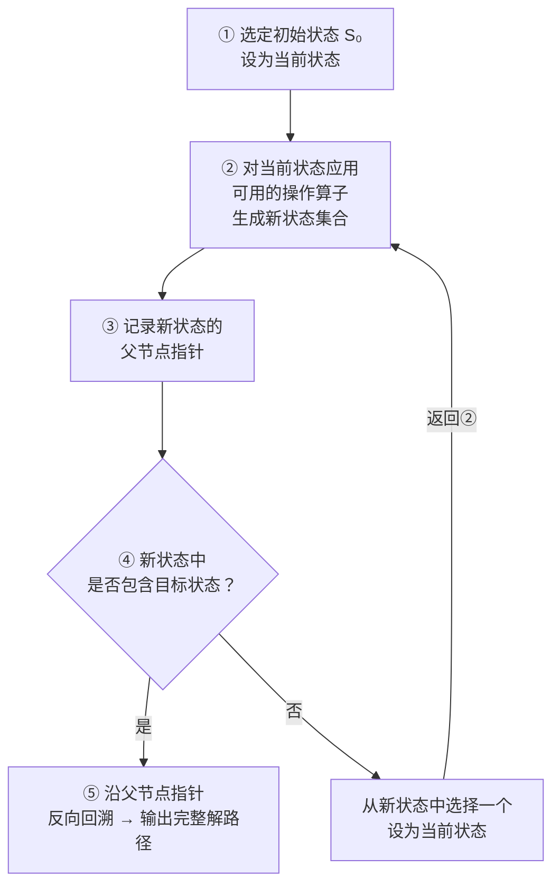

每一步的核心操作：
- **步骤②（拓展）**：将操作算子应用于当前状态，产生后继状态
- **步骤③（记录）**：为每个新状态保存指向其父状态的指针，以便最终还原路径
- **步骤⑤（回溯输出）**：从目标状态沿父指针链走到初始状态，反转即得解路径

不同搜索算法的区别在于**步骤⑥中选择哪个新状态作为当前状态**——这是 BFS、DFS、A* 的分岔点。

### 5.1.4 搜索策略分类

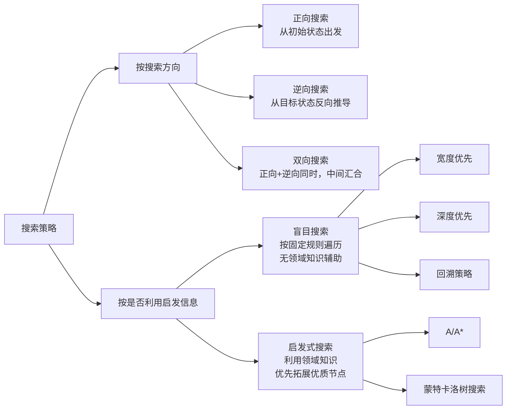

**搜索方向**的三个选择：

| 方向         | 特点                  | 适用场景            |
| ---------- | ------------------- | --------------- |
| 正向搜索（数据驱动） | 从已知初始条件出发，应用操作算子往前走 | 初始条件明确，分支不太多    |
| 逆向搜索（目的驱动） | 从目标出发，反向推导哪些状态能到达目标 | 目标明确，但前向分支过多    |
| 双向搜索       | 两头同时推进，中间路径汇合时终止    | 两头分支都有限，搜索空间可减半 |

**盲目 vs 启发式**的根本区别：

- 盲目搜索：拓展节点时不区分优先顺序，只按固定策略（深度优先/广度优先）机械遍历
- 启发式搜索：利用领域知识（启发函数）估算各节点的"目标接近程度"，优先拓展估计最优的节点

> 从信息论角度看，启发信息的作用是**降低信息熵**——**用领域知识缩小搜索范围**。一个优秀的启发函数，能将指数级搜索空间压缩到接近线性。

---

## 5.2 状态空间的搜索策略

### 5.2.1 状态空间表示法

**核心概念**：

| 概念 | 定义 | 八数码例子 |
|------|------|-----------|
| **状态** | 描述问题在某一时刻的完整快照，通常用向量/数组表示 | `[[2,8,3],[1,6,4],[7,□,5]]` |
| **操作算子** | 将一种状态转换为另一种状态的变换规则 | 空格上移(Up)/下移(Down)/左移(Left)/右移(Right) |
| **状态空间** | 从初始状态出发，经操作算子能到达的所有状态构成的集合 | 3×3棋盘的所有合法排列（$9! / 2 \approx 181440$ 个可达状态） |

**状态空间的形式化定义**——一个四元组 $(S, O, S_0, G)$：

$$
\begin{aligned}
S &: \text{全体可能状态的集合} \\
O &: \text{全体操作算子的集合，每个算子 } o \in O \text{ 是函数 } o: S \rightarrow S \\
S_0 &: \text{初始状态的非空子集} \\
G &: \text{目标状态集合，或目标状态需满足的性质}
\end{aligned}
$$

**状态空间的解**：从 $S_0$ 中某状态出发，经过有限的操作算子序列 $o_1, o_2, \dots, o_k$，到达 $G$ 中某状态的路径——即操作算子的有序序列。

> 状态空间表示法是所有搜索算法的**统一数学框架**。BFS 和 A* 的不同仅在于选择拓展节点的策略，它们操作的对象都是同一状态空间。

**经典实例：八数码问题**

```
┌───┬───┬───┐      ┌───┬───┬───┐
│ 2 │ 8 │ 3 │      │ 1 │ 2 │ 3 │
├───┼───┼───┤      ├───┼───┼───┤
│ 1 │ 6 │ 4 │  →   │ 8 │ □ │ 4 │
├───┼───┼───┤      ├───┼───┼───┤
│ 7 │ □ │ 5 │      │ 7 │ 6 │ 5 │
└───┴───┴───┘      └───┴───┴───┘
  初始状态             目标状态
```

- 状态 $S$：数字 1-8 + 空格 □ 在 3×3 格中的任一排列
- 操作算子 $O$：{Up, Down, Left, Right}，将空格向对应方向移动
- 初始状态 $S_0$：上图左侧布局
- 目标 $G$：上图右侧布局
- 特性：并非所有排列都能经操作到达目标——只有 1/2 的状态（181440 个）可从给定初始状态到达

### 5.2.2 状态空间的图描述

将状态空间映射为有向图：

- **节点**：一个状态
- **有向边**：一个操作算子的应用。若 $o(s_1) = s_2$，则有一条从 $s_1$ 指向 $s_2$ 的边，标注 $o$
- **路径**：从初始节点到目标节点的有向路径，对应一个操作算子序列

**八数码状态空间局部**（从初始状态走两步的局部图）：

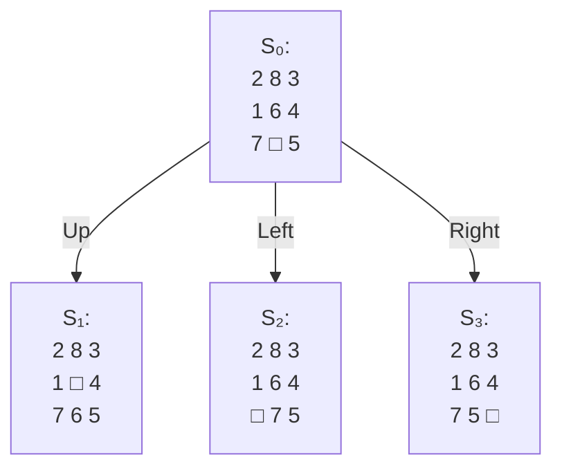

每个节点展开时，空格有 2-4 种合法移动方向（取决于空格在边角还是中央）。

**旅行商问题（TSP）的状态空间图描述**：

设城市集合 {A, B, C, D}，从 A 出发寻找最短回路。状态不仅记录当前位置，还需记录已访问城市：

```
状态表示：[当前位置, {已访问城市集合}]

           [A, {A}]  ← 初始状态
          /        \
   [B, {A,B}]    [C, {A,C}]    ...
    /      \
[C,{A,B,C}] [D,{A,B,D}]
    |
[D,{A,B,C,D}]  →  回到 A 的成本为 0（目标判定：当前位置=A 且 全部城市已访问）
```

每个有向边标注该段路径的代价，目标是从 $S_0$ 出发回到 A 且访问全部城市的回路中，总代价最小者。

> 状态空间图不同于问题描述中的原始图——它记录的是搜索进度（已走路径），每个节点的分支数随未访问城市减少而减少。

---

## 5.3 盲目的图搜索策略

盲目搜索的共同特征：**不利用任何领域知识估算节点与目标的距离**，只按固定策略决定拓展顺序。

### 5.3.1 回溯策略

核心思想：沿一条路径深入试探，遇到死胡同（所有子节点均已探索且均非目标）时，回溯至最近一个有未探索子节点的祖先，换一条分支继续。

三张核心记录表：

| 表       | 全称                 | 存储内容                      | 作用            |
| ------- | ------------------ | ------------------------- | ------------- |
| **PS**  | Path States        | 当前路径上的所有状态（从 $S_0$ 到当前节点） | 找到目标时 PS 即解路径 |
| **NPS** | New Path States    | 已生成但尚未完全探索的状态             | 供回溯时选取新节点     |
| **NSS** | No Solution States | 已确定无解（所有子孙均为死胡同）的状态       | 避免重复进入死胡同     |

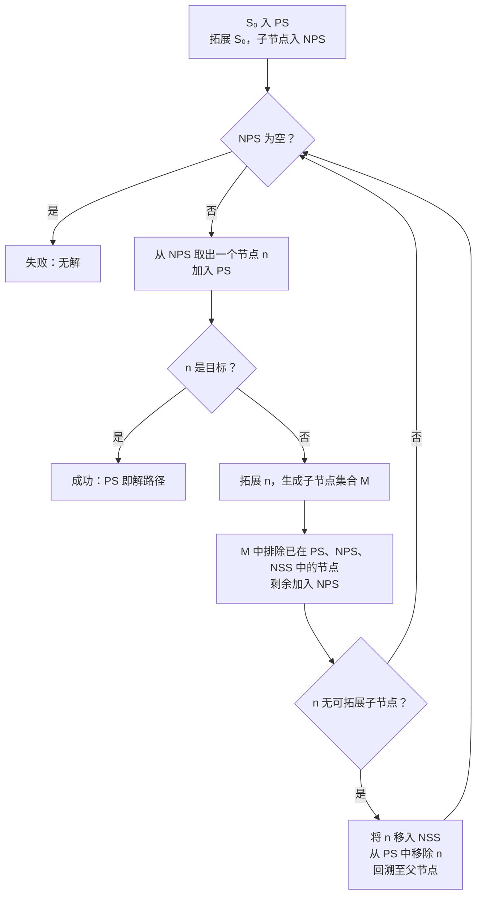

回溯策略的**效率取决于试探顺序**。在最坏情况下是穷举搜索。引入启发信息优先拓展有希望的分支，即演变为**启发式回溯搜索**。

---

### 5.3.2 宽度优先搜索（BFS）

**核心规则**：按与起始节点的距离（深度）逐层拓展。深度 0 的所有节点拓展完，才拓展深度 1 的节点，以此类推。

**数据结构**：
- **OPEN 表**：先进先出（FIFO）队列，存放已生成但尚未拓展的节点
- **CLOSED 表**：存放已完全拓展的节点（即算法不再关心的节点）

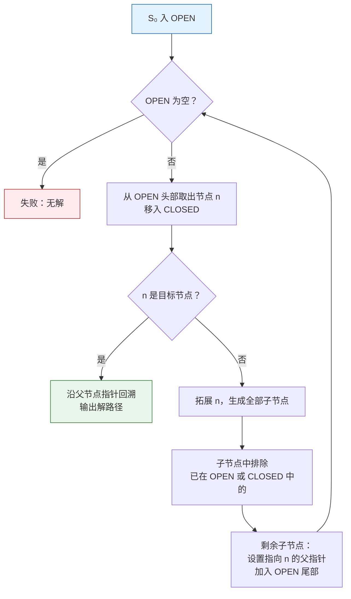

**为什么 BFS 保证最短路径**：拓展顺序按深度递增，首次遇到目标节点时，所有深度更浅的节点均已排除，故路径长度最短。

**复杂度分析**（设分支因子为 $b$，解深度为 $d$）：

| 指标 | 值 | 说明 |
|------|-----|------|
| 时间复杂度 | $O(b^d)$ | 最坏需拓展所有深度 ≤ d 的节点 |
| 空间复杂度 | $O(b^d)$ | **关键瓶颈**：需同时存储整层的所有节点 |
| 完备性 | 完备 | 若解存在且分支有限，必找到 |
| 最优性 | 最优（等代价） | 每条边代价相同时保证最短路径 |

**实例：积木世界移动问题**

```
初始状态:              目标状态:
  B                      A
  A       C              B
 ───     ───            ─── C ───

操作算子 MOVE(x, y): 将积木 x 移到 y 上方
  (y 可以是 Table，表示放回桌面)
```

BFS 从初始状态出发，第一层（depth=1）生成所有单次移动可达的状态——如 MOVE(B, Table)、MOVE(C, B)、MOVE(B, C)。第二层对第一层每个状态再应用所有合法 MOVE 算子。直到某个状态匹配目标布局。

---

### 5.3.3 深度优先搜索（DFS）

**核心规则**：优先拓展最新生成、最深层的节点。**后进先出（LIFO）**——OPEN 表是堆栈。

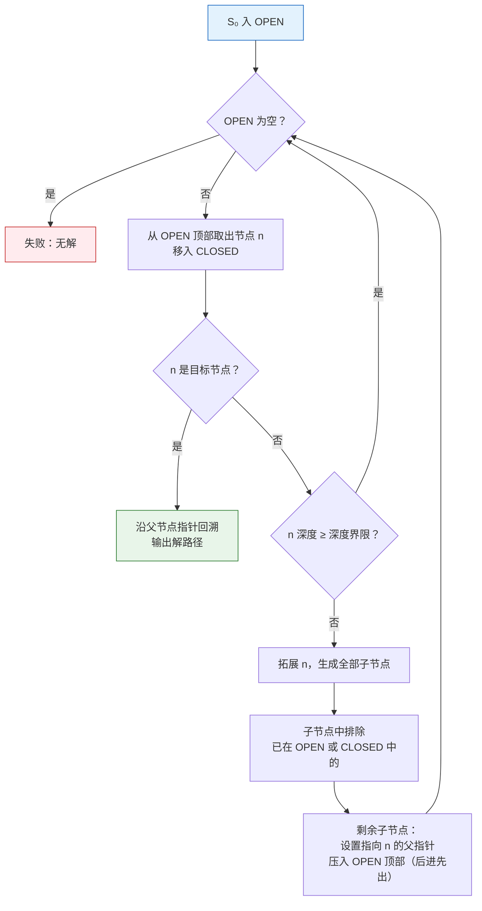

BFS 与 DFS 的唯一区别在于 OPEN 表的数据结构：

| | BFS | DFS |
|--|-----|-----|
| OPEN 表 | FIFO 队列 | LIFO 堆栈（或递归调用栈） |
| 拓展顺序 | 浅层先拓展 | 深层先拓展 |

**复杂度分析**（分支因子 $b$，最大深度 $m$，解深度 $d$）：

| 指标 | 值 | 说明 |
|------|-----|------|
| 时间复杂度 | $O(b^m)$ | 最坏情形需要探索整棵树 |
| 空间复杂度 | $O(b \cdot m)$ | **显著优势**：只需存储当前路径 + 兄弟节点 |
| 完备性 | 不完备（无限深度时） | 可能沿无限分支永远深入，错过较浅的解 |
| 最优性 | 不保证 | 找到的第一个解可能不是最短路径 |

**深度界限**：为防止无限递归，DFS 需预设深度界限 $L$。超过 $L$ 的节点一律不拓展——这是不可缺失的安全机制。

**迭代加深搜索（IDS）**：逐步放宽深度界限 $L = 1, 2, 3, \dots$，每次以该深度限制执行 DFS。综合了 DFS 的空间效率与 BFS 的完备性和最优性。

**实例：卒子穿阵迷宫**

一枚棋子需从起点穿越障碍到达终点。DFS 会沿某方向一路走到黑，撞墙后回溯到最近交叉口换方向。深度界限设为 $L$，保证不会无限绕圈。迭代加深的做法是先设 $L=5$ 搜索，若无解再设 $L=10$，避免第一次就走得过深。

---

## 5.4 启发式图搜索策略

### 5.4.1 启发式策略基础

**启发信息**（heuristic information）的定义：来自问题领域、可用于简化搜索的专有知识。它不是通用搜索策略的一部分，而是问题特定的。

启发式策略适用的两类典型场景：

| 场景 | 原因 |
|------|------|
| 问题本身无确定求解算法 | 只能靠启发式逐步搜索 |
| 状态空间指数级庞大 | 暴力搜索理论上可行但实际不可行，需启发式剪枝 |

核心操作：依据启发信息的估值**重排 OPEN 表**，使预估最接近目标的节点优先被拓展。

**一字棋博弈中的启发式搜索**：

一字棋（Tic-Tac-Toe）的完整状态空间有 $9! = 362880$ 个节点。全展开后分支极为庞大。利用启发信息——如"己方形成两个一线棋、对方未封堵"的节点优先展开——可将有效搜索空间压缩两个数量级。这说明启发信息的效果不体现在理论上（最坏复杂度不变），而是体现在**平均情形的实际压缩比**上。

### 5.4.2 启发信息与估价函数

**启发信息的三种类型**：

| 类型      | 作用                        | 例子                        |
| ------- | ------------------------- | ------------------------- |
| **陈述性** | 优化**状态**本身的描述方式，使关键信息更易提取 | 八数码用单行数组代替 3×3 矩阵         |
| **过程性** | 构造高效的操作**算子**             | 八数码中限定空格向四个方向移动（而非所有可能排列） |
| **控制性** | 控制**节点的拓展顺序**——最核心的启发信息类型 | 启发函数 $h(n)$，决定哪个节点优先拓展    |

**估价函数**的定义：

$$
f(n) = g(n) + h(n)
$$

| 分量     | 含义                            | 特性                         |
| ------ | ----------------------------- | -------------------------- |
| $g(n)$ | 从初始状态 $S_0$ 到节点 $n$ 的**实际代价** | 精确已知，沿路径累积                 |
| $h(n)$ | 从节点 $n$ 到目标状态的**启发式估计代价**     | 估计值，无法超过实际问题；$h$ 的质量决定搜索效率 |
| $f(n)$ | 经过节点 $n$ 的最优路径的**总估计代价**      | 用于 OPEN 表排序                |

**八数码问题的四种启发函数**：

| 启发函数     | 公式                      | 可采纳性（≤ h*） | 效果          |
| -------- | ----------------------- | :--------: | ----------- |
| $h_1(n)$ | 不在位的牌数（错误位置牌的数量）        |     ✓      | 基准          |
| $h_2(n)$ | 曼哈顿距离之和（每张牌到目标位置的横纵距离和） |     ✓      | 优于 $h_1$    |
| $h_3(n)$ | 逆序数（线性冲突的估计）            |     ✓      | 接近 $h^*$    |
| $h_4(n)$ | 模式数据库匹配                 |     ✓      | 效果最优，计算开销最大 |

> $h_2$ 支配 $h_1$（对任意 $n$ 有 $h_2(n) \geq h_1(n)$），因此 $A^*_{h_2}$ 拓展的节点数不超过 $A^*_{h_1}$。

### 5.4.3 A 搜索算法

**A 算法**是启发式搜索的通用框架——使用估价函数 $f(n) = g(n) + h(n)$ 对 OPEN 表排序，每次取 $f$ 值最小的节点拓展。此即**最佳优先搜索**（Best-First Search）。

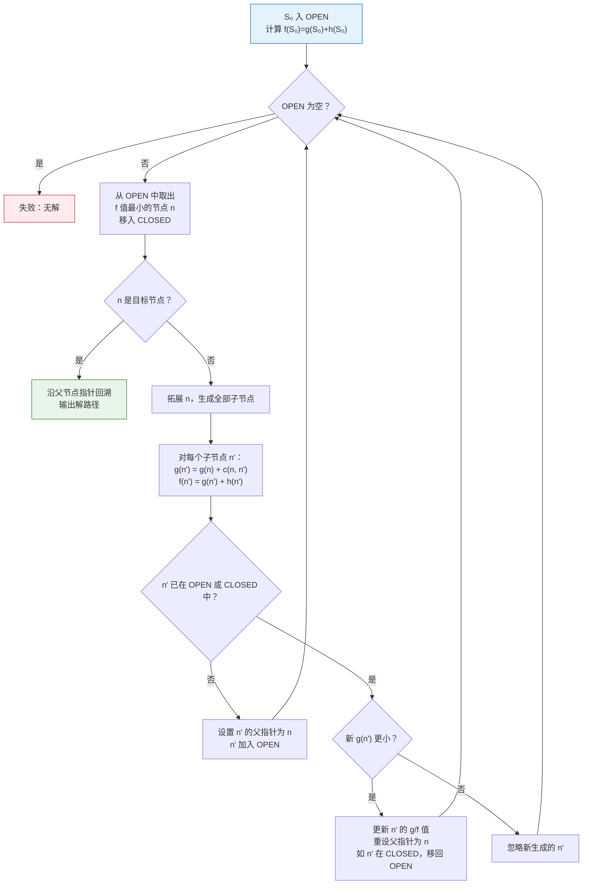

**关键步骤说明**：

1. **$g(n')$ 的更新**：实际代价沿路径累加——$g(n') = g(n) + \text{cost}(n \rightarrow n')$。八数码中每步代价为 1，故 $g$ 等于节点深度。
2. **$h(n')$ 的计算**：调用启发函数（如曼哈顿距离），估算剩余代价。
3. **OPEN/CLOSED 表合并**：当同一状态经不同路径再次生成时，比较 $g$ 值。若新路径更优（$g$ 更小），更新该节点的 $g$、$f$ 和父指针；若旧路径更优，丢弃新生成的。

**A 算法的局限性**：对启发函数 $h(n)$ 无任何限制。若 $h(n)$ 设计不当（高估剩余代价），A 算法**不保证找到最优解**。

**八数码 A 算法搜索树片段**（$h_2$ = 曼哈顿距离和）：

```
S₀: f=4 (g=0, h=4)        ← OPEN[0]
├─S₁(Up): f=5 (g=1, h=4)
├─S₂(Down): f=5 (g=1, h=4)
├─S₃(Left): f=6 (g=1, h=5)
└─S₄(Right): f=6 (g=1, h=5)

从 S₀ 拓展后，OPEN 按 f 排序：[S₁(f=5), S₂(f=5), S₃(f=6), S₄(f=6)]
取 f 最小的 S₁ 拓展...（同 f 值时任取）
```

### 5.4.4 A* 搜索算法及其特性分析

**A* 算法** = A 算法 + 对 $h(n)$ 的额外约束：

> $$
> h(n) \leq h^*(n) \quad \forall n \in S
> $$
>
> 其中 $h^*(n)$ 是从 $n$ 到目标的最优路径的真实代价。

满足该条件的 $h$ 称为**可采纳启发函数**（admissible heuristic）。A* 算法流程与 A 算法完全一致，区别仅在于 $h$ 的取值受此约束。

#### A* 的设计思想：$f = g + h$ 的平衡

A* 的估价函数同时包含"已走代价"和"剩余估计"两个分量。将任意分量推向极端，A* 退化为已知算法：

| 设置 | 退化为 | 行为特征 |
|------|--------|---------|
| $h(n) \equiv 0$ | **Dijkstra / 等代价搜索**（边权为 1 时 = BFS） | 向外均匀扩散，保证最优但无方向性 |
| $g(n) \equiv 0$ | **贪心最佳优先搜索**（Greedy Best-First） | 直奔目标，但可能被局部最优欺骗 |

A* 的定位恰在两者之间：既不像 Dijkstra 盲目向所有方向推进，也不像贪心算法只顾眼前目标不顾已走代价。

**A* 的四大核心性质**：

#### 性质 1：可采纳性（Admissibility）

> 若问题有解，A* 算法必能找到全局最优解（代价最小的路径）。

直观理解：$h(n) \leq h^*(n)$ 保证了 $f(n) = g(n) + h(n)$ 不会高估经 $n$ 的最优路径总代价。算法总是优先拓展 $f$ 值最小的节点，因此最优路径上的节点不会被"漏掉"。

**证明概要**：设最优路径上的任一节点 $n$，$f(n) = g(n) + h(n) \leq g(n) + h^*(n) = f^*(n) = C^*$（$C^*$ 为最优解代价）。因此最优路径上所有节点的 $f$ 值不超过 $C^*$。A* 在目标被取出 CLOSED 前，总会优先拓展 $f \leq C^*$ 的节点，最终 $f = C^*$ 的路径必然入榜。

#### 性质 2：单调性（一致性，Consistency）

> 若对任意节点 $n$ 及其任意后继 $n'$（经操作 $a$ 到达，代价 $c(n,a,n')$）满足：
> $$
> h(n) \leq c(n, a, n') + h(n')
> $$
> 则称 $h$ 满足**单调性**（一致性）。

单调性的好处：
- 保证了 $f$ 值沿任意路径**非减**：$f(n) \leq f(n')$
- 节点首次被取出 CLOSED 时即已找到它的最优路径，**无需重复更新** $g$ 值、节点也**不会从 CLOSED 移回 OPEN**
- 搜索效率更高——简化算法的状态更新逻辑

**单调性与可采纳性的关系**：单调性 ⇒ 可采纳性（单调性是更强的条件），反之不成立。

#### 性质 3：信息性（Informedness）

> 在可采纳的前提下，**$h(n)$ 越大（越接近 $h^*(n)$），A* 拓展的节点越少**。

对于两个可采纳的启发函数 $h_1$ 和 $h_2$，若 $\forall n: h_2(n) \geq h_1(n)$，称 $h_2$ **支配**（dominate）$h_1$。使用 $h_2$ 的 A* 拓展节点数不超过使用 $h_1$ 的 A*。

实例：八数码中，曼哈顿距离 $h_2$ 支配错位数 $h_1$——$h_2(n) \geq h_1(n)$ 恒成立。使用 $h_2$ 搜索效率明显更高。

**特例**：当 $h(n) \equiv 0$ 时，A* 退化为宽度优先搜索（或等代价搜索）。此时 $f(n) = g(n)$，拓展顺序由实际代价决定。当每条边代价均为 1 时，$f = \text{depth}$，与 BFS 等同。

#### 性质 4：最优有效性和完备性

**完备性**：只要状态空间有限或存在有限代价的解，A* 保证在有限步内终止。

**A* 不是所有情形下最优的搜索算法**——存在其他算法（如 IDA*）在空间效率上优于 A*。但 A* 在给定的启发函数约束下是最优有效的：**不存在另一个使用相同启发函数的算法，永远拓展比 A* 更少的节点且保证找到最优解**。

---

#### A* 运行实例：$4 \times 4$ 网格最短路径

**问题**：从起点 A 到终点 B，每步上下左右移动（代价 1），黑色格子为障碍。

```
  1  2  3  4
1 .  .  .  .
2 .  ■  .  .
3 .  .  ■  .
4 A  .  .  B
```

**设定**：$h(n)$ = 曼哈顿距离（可采纳，因曼哈顿距离是忽略障碍后的最短路径下界）。$g(n)$ = 起点到当前节点的步数。

**搜索过程逐轮展开**：

| 轮次 | 取出节点 | 拓展 | OPEN 表（按 $f$ 排序） | 说明 |
|:---:|---------|------|----------------------|------|
| 1 | A$(4,1)$ $f=3$ | $(4,2)$ $f=3$, $(3,1)$ $f=5$ | $(4,2,f=3),\;(3,1,f=5)$ | A 的 $h=3$，两个后继 $f$ 不同 |
| 2 | $(4,2)$ $f=3$ | $(4,3)$ $f=3$, $(3,2)$ $f=5$ | $(4,3,f=3),\;(3,1,f=5),\;(3,2,f=5)$ | $(4,1)$ 已在 CLOSED，忽略 |
| 3 | $(4,3)$ $f=3$ | $(4,4)$ $f=3$ **目标!** | $(3,1,f=5),\;(3,2,f=5)$ | 朝目标直行，$f$ 一直为 3 |
| 4 | 取出目标 $(4,4)$ | — | — | 回溯路径：$(4,4) \leftarrow (4,3) \leftarrow (4,2) \leftarrow (4,1)$ |

**关键观察**：
- A* **没有**在 $(4,1)$ 处试探 $(3,1)$（$f=5$），因为 $(4,2)$ 的 $f=3$ 更具优先
- A* **没有**在 $(4,2)$ 处试探 $(3,2)$（$f=5$），因为 $(4,3)$ 的 $f=3$ 更具优先
- $f$ 值保持非减，搜索路径始终保持在最优方向上

**对比 Dijkstra**：Dijkstra（$h\equiv 0$）从 A 出发会向四个方向同时扩散 $(4,2)、(3,1)$——因为 $f=g$ 相同，两者都会先被拓展，然后再拓展它们的后继，最终"填满"左上区域后到达目标。A* 利用曼哈顿距离避开了左上方向的无用探索。

#### A* 与相关算法的关系

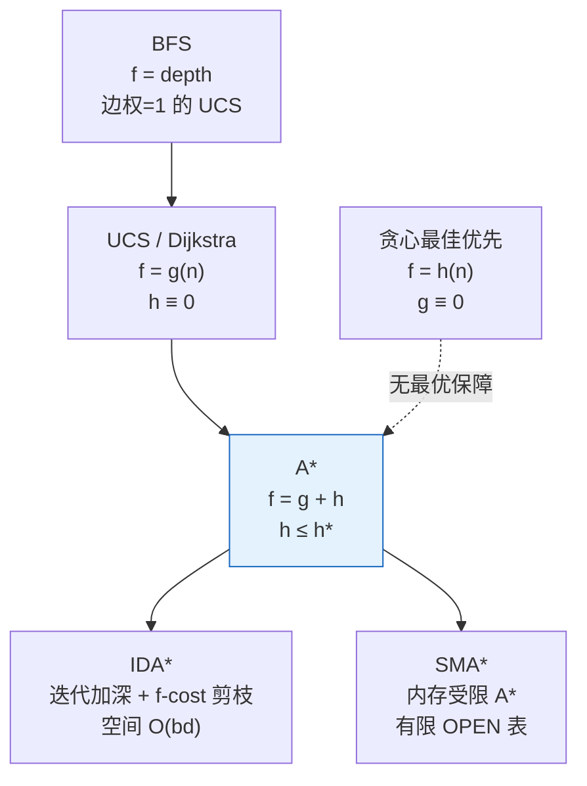

---

### 5.4.5 蒙特卡洛树搜索 MCTS

MCTS（Monte Carlo Tree Search）于 2006 年提出于围棋博弈场景，是 AlphaGo 的核心算法组件。与 A* 的根本区别在于：A* 依赖一个手工设计的启发函数 $h(n)$，MCTS 则通过**大量随机模拟**自动评估节点价值——不需要明确的启发函数。

**四步标准流程**：

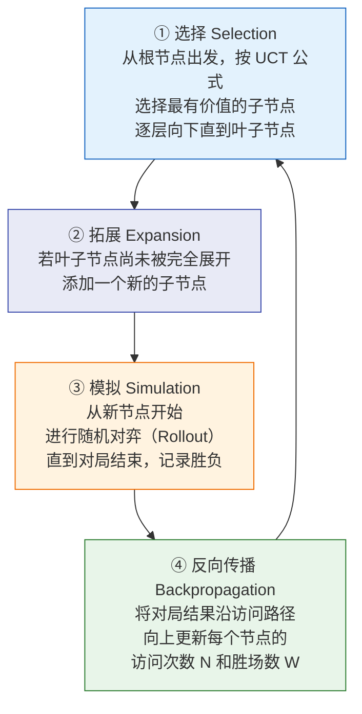

**逐步详解**：

**① 选择（Selection）**：从根节点出发，沿已构建的树向下选择子节点。选择标准是 **UCT 公式**（Upper Confidence Bound applied to Trees）：

$$
UCT(j) = \frac{W_j}{N_j} + C \cdot \sqrt{\frac{\ln N}{N_j}}
$$

| 符号 | 含义 |
|------|------|
| $W_j$ | 节点 $j$ 的累计得分（黑方胜率 × 访问次数） |
| $N_j$ | 节点 $j$ 被访问的次数 |
| $N$ | 父节点的总访问次数 |
| $C$ | 探索参数（通常 $C \approx \sqrt{2}$），越大越倾向于探索未充分尝试的分支 |

UCT 公式的第一项是**利用**（exploitation）——倾向选择当前平均表现好的节点；第二项是**探索**（exploration）——倾向选择访问次数少的节点（因为置信不足，值得一试）。参数 $C$ 在两者之间做权衡。

**② 拓展（Expansion）**：当选择到达某一节点，该节点尚未被完全展开（仍有未尝试的合法动作），则添加该动作对应的新子节点。

**③ 模拟（Simulation / Rollout）**：从新拓展的节点出发，按简单策略（或纯随机策略）对弈至终局，记录胜负结果。模拟策略越快越好——不需要准确，只需要大量采样的统计意义。围棋中一次 Rollout 通常 100-1000 步，耗时约 10μs-10ms。

**④ 反向传播（Backpropagation）**：将对局结果（胜为 1，负为 0）沿本次访问路径反向更新所有经过节点的 $(W, N)$ 统计量。实际实现中通常只需更新 $N_j \leftarrow N_j + 1$，$W_j \leftarrow W_j + \text{result}$。

**MCTS 与 A* 的对比**：

| 维度 | A* | MCTS |
|------|-----|------|
| 启发信息 | 手工设计 $h(n)$ | 随机模拟自动获取 |
| 搜索方式 | 确定性的最佳优先 | 随机性的统计采样 |
| 适用场景 | 路径代价可精确估计的问题 | 博弈、大规模状态空间且难以设计 $h$ 的问题 |
| 解的最优性 | 满足条件时保证 | 概率近似最优 |
| 典型应用 | 路径规划、八数码 | 围棋 AlphaGo、AlphaZero |

> MCTS 的核心哲学：在一个极其庞大、无法精确求解的空间中，与其设计一个启发函数去猜测哪个走法好，不如**让搜索本身通过随机模拟来自动发现**哪个走法好。统计采样替代了启发函数。

---

## 🗺️ 四大搜索算法综合对比

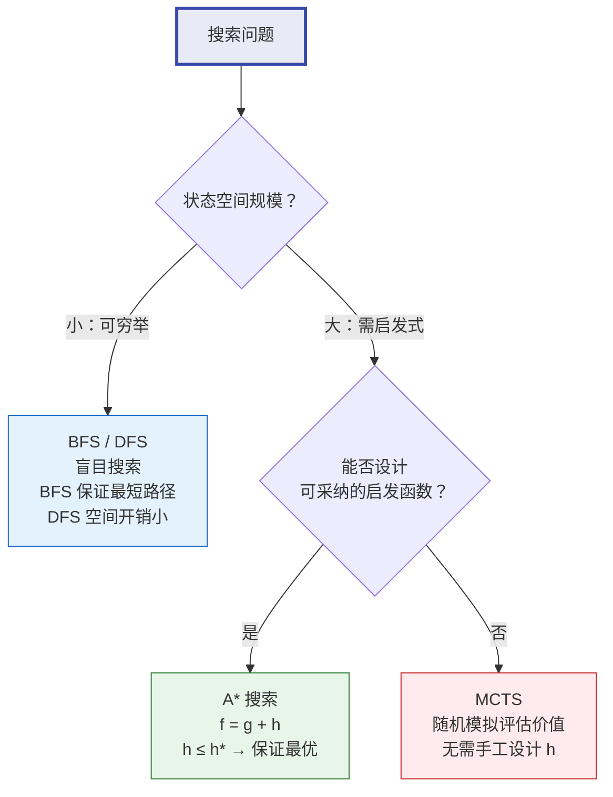

| 维度 | BFS | DFS | A* | MCTS |
|------|:---:|:---:|:--:|:---:|
| **完备性** | ✓ | ✗（无限深度时） | ✓（h 可采纳） | 概率完备 |
| **最优性** | ✓（等代价） | ✗ | ✓（h 可采纳） | 概率近似最优 |
| **时间复杂度** | $O(b^d)$ | $O(b^m)$ | $O(b^d)$（依赖 h） | 由采样数决定 |
| **空间复杂度** | $O(b^d)$ | $O(b \cdot m)$ | $O(b^d)$ | $O(N)$（N=节点数） |
| **需要启发函数** | 否 | 否 | **是**（且需可采纳） | 否（自动评估） |
| **典型应用** | 最短路径 | 迷宫回溯 | 八数码、路径规划 | 围棋、博弈 |

---

## 🧭 知识地图

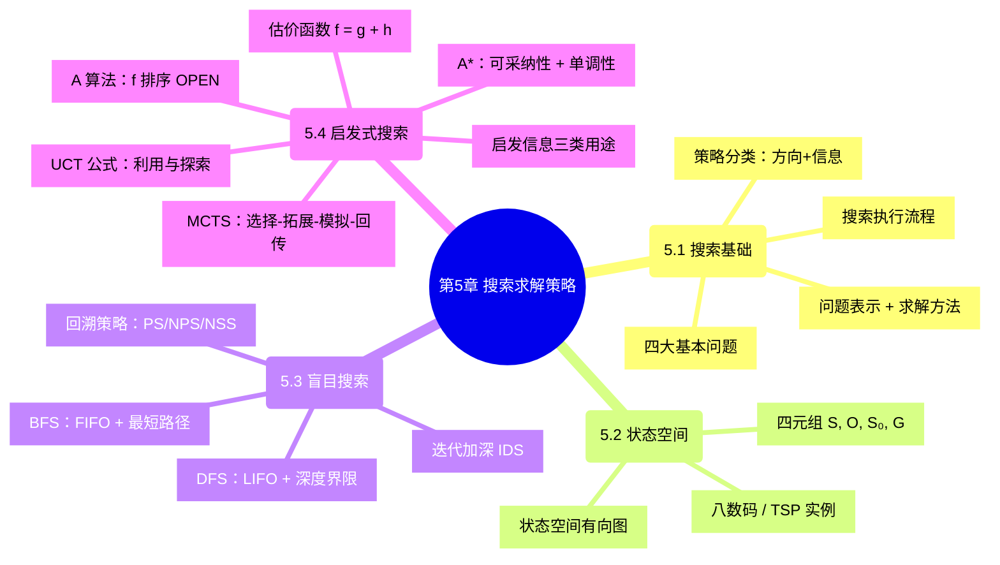

## 相关概念

- [第3章 确定性推理方法](/articles/ai-ml/introduction-to-ai/summaries/第3章-确定性推理方法/)——搜索与推理都基于状态转换
- [产生式系统](/articles/ai-ml/introduction-to-ai/concepts/产生式系统/)——规则驱动的搜索框架
- 与或图搜索——问题的分解与归约
- [推理的基本概念](/articles/ai-ml/introduction-to-ai/concepts/推理的基本概念/)
