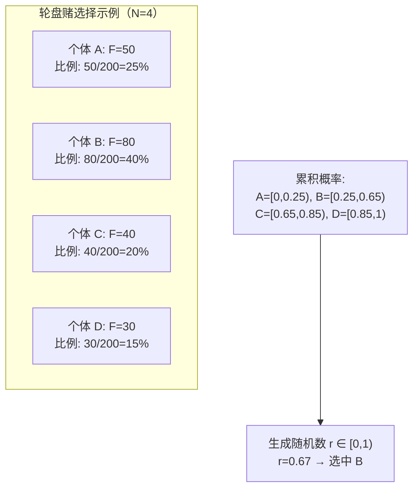
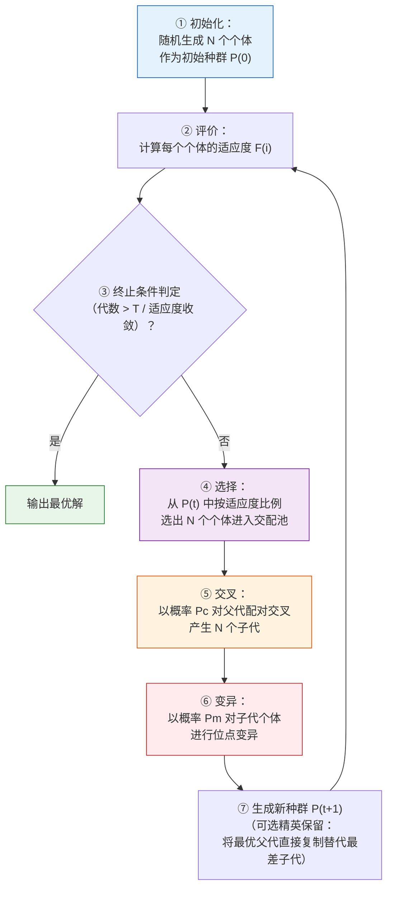
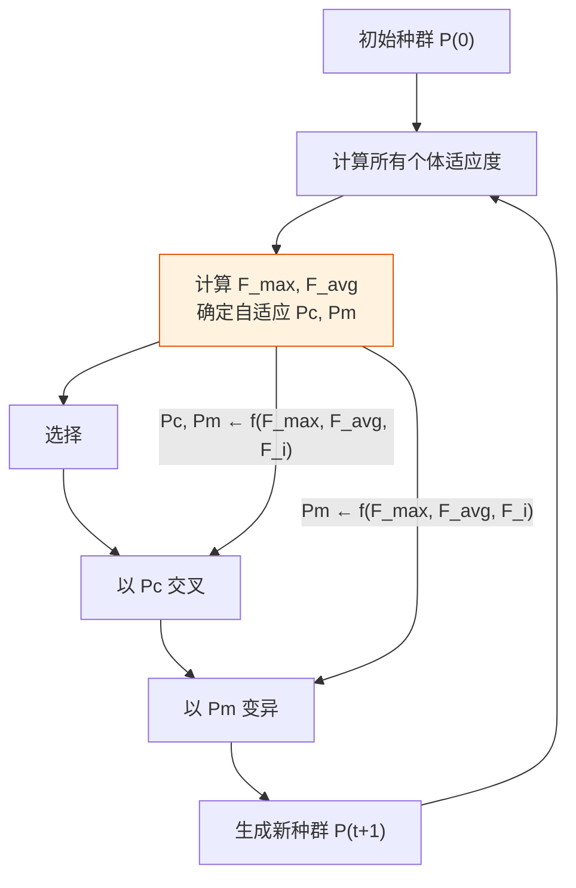
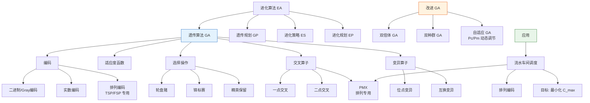

# 第6章 智能计算及其应用

## 6.1 进化算法的产生与发展

### 6.1.1 进化算法的概念

**进化算法（Evolutionary Algorithm, EA）** 是一类模拟生物自然选择与遗传机制的**随机搜索优化算法**。

| 方面   | 说明                                                                    |
| ---- | --------------------------------------------------------------------- |
| 核心操作 | **选择**（Selection）、**重组/交叉**（Recombination/Crossover）、**变异**（Mutation） |
| 算法簇  | 遗传算法（GA）、遗传规划（GP）、进化策略（ES）、进化规划（EP）                                   |
| 典型应用 | 组合优化、机器学习参数调优、自适应控制、规划设计、人工生命                                         |

进化算法与第 5 章搜索算法（BFS、A*）的根本区别在于：搜索算法通常依赖**确定性规则**或**领域启发信息**逐节点探索；进化算法则基于**随机变异 + 选择压力**在种群层面隐式并行搜索，不依赖问题梯度或解析性质。

### 6.1.2 生物学背景

进化算法的设计灵感来自达尔文的自然选择理论。以下术语对应算法的核心构件：

| 生物学术语               | 定义         | 算法对应物             |
| ------------------- | ---------- | ----------------- |
| **染色体（Chromosome）** | 遗传物质的载体    | 问题的一个候选解（编码串）     |
| **基因（Gene）**        | 控制性状的功能单元  | 解中某个决策变量          |
| **基因座（Locus）**      | 基因在染色体上的位置 | 编码串中某位的索引         |
| **等位基因（Allele）**    | 基因可取的值集合   | 该位编码可取的值（0/1 或实数） |
| **种群（Population）**  | 一群个体的集合    | 候选解的集合            |
| **适应度（Fitness）**    | 个体对环境的适应程度 | 目标函数值（经变换后的质量评分）  |

生物进化的完整循环：
```
种群（一定规模的个体）→ 婚配（父代选择+交叉）→ 变异（基因随机扰动）
→ 竞争（适应度评价）→ 淘汰（劣质个体被筛选掉）→ 新一代种群
```

### 6.1.3 进化算法五大设计原则

| 原则       | 含义              | 实践体现                |
| -------- | --------------- | ------------------- |
| **适用性**  | 算法设计适配问题的特征     | TSP 用排列编码，连续优化用实数编码 |
| **可靠性**  | 对多数问题实例能达指定精度   | 经参数调优后在基准函数集上表现稳定   |
| **收敛性**  | 能收敛到全局最优，且速度可接受 | 精英保留策略保证不退化         |
| **稳定性**  | 对参数和输入噪声不敏感     | 种群规模在一定范围内变化时解质量波动小 |
| **生物类比** | 借鉴生物有效机制而非随意设计  | 双倍体、免疫机制等生物启发的改进    |

---

## 6.2 基本遗传算法

遗传算法（Genetic Algorithm, GA）是进化算法中最具代表性、应用最广泛的一支。

### 6.2.1 基本思想

#### 生物遗传与 GA 概念对照

| 生物进化            | 遗传算法               |
| --------------- | ------------------ |
| 个体（Individual）  | 问题的一个候选解           |
| 染色体（Chromosome） | 解的编码表示（二进制串、实数向量等） |
| 基因（Gene）        | 解中某个决策变量的值         |
| 适应度（Fitness）    | 解的优劣程度（由适应度函数计算）   |
| 种群（Population）  | 一组候选解的集合           |
| 选择（Selection）   | 按适应度概率选取父代个体       |
| 交叉（Crossover）   | 两个父代交换部分基因产生子代     |
| 变异（Mutation）    | 随机改变某个基因的值，维持种群多样性 |

**核心思路**：从多个初始解（种群）出发，通过**选择—交叉—变异**的迭代进化，使种群向更优的解空间逼近。

---

#### 实例：Rastrigin 函数最小值求解

Rastrigin 函数是 GA 的经典基准测试函数：

$$
f(\mathbf{x}) = A n + \sum_{i=1}^{n} \left[ x_i^2 - A \cos(2 \pi x_i) \right], \quad A = 10
$$

**特性**：
- 全局最小值在 $\mathbf{x} = \mathbf{0}$ 处，$f(0) = 0$
- 有大量局部极小值呈正弦排列，极易陷入局部最优
- 是测试算法**全局搜索能力**的典型函数（而非梯度下降，梯度下降在此函数上几乎必然陷入局部极小）

**GA 求解概要**：
1. **编码**：每个解 $\mathbf{x}$ 编码为二进制串（每位代表一个维度的分段）
2. **初始种群**：随机生成 $N = 50$ 个个体
3. **适应度**：$F(\mathbf{x}) = 1 / (f(\mathbf{x}) + \epsilon)$（最小化问题取倒数）
4. **迭代**：轮盘赌选择 + 单点交叉 + 位点变异 → 50 代后种群收敛到 $(0, 0)$ 附近

---

### 6.2.2 发展历史（简要）

| 年份 | 贡献者 | 进展 |
|:---:|--------|------|
| 1962 | Fraser | 提出自然遗传算法的模拟 |
| 1965 | Holland | 正式提出遗传操作（选择、交叉、变异） |
| 1967 | Bagley | 首次命名"遗传算法"（Genetic Algorithm） |
| 1975 | Holland, DeJong | 奠定理论基础（模式定理、积木块假设） |
| 1980s— | 多人 | 快速发展，广泛应用于优化、机器学习、工程 |

---

### 6.2.3 编码方法

编码是将问题的解空间映射到 GA 可操作的染色体空间的过程。编码方式直接影响交叉/变异算子的设计。

#### 1. 位串编码

##### （1）二进制编码（Binary Encoding）

将解空间的实数/整数映射为固定长度的 0/1 串。

**示例**：变量 $x \in [-5, 12]$，精度要求 $0.01$。

$$
\text{编码长度} = \left\lceil \log_2\left(\frac{12 - (-5)}{0.01} + 1\right) \right\rceil = \lceil \log_2(1701) \rceil = 11
$$

$x = 3.75$ 的编码过程：
1. 将区间映射到 $[0, 1700]$：$idx = \lfloor (3.75 - (-5)) / 0.01 \rfloor = 875$
2. 转为 11 位二进制：$875_{10} = 01101101011_2$

| 优点 | 缺点 |
|------|------|
| 编码/解码直观 | **相邻整数间的汉明距离可能很大**（如 7→0111, 8→1000，4 位全变） |
| 交叉、变异操作实现简单 | 高精度时需要很长的串，搜索空间膨胀 |

##### （2）格雷编码（Gray Encoding）

格雷编码保证相邻整数只有 **1 位不同**，消除二进制编码的汉明悬崖问题。

**二进制转格雷**：
$$
g_k = \begin{cases}
b_k & k = \text{最高位} \\
b_k \oplus b_{k+1} & \text{其余位}
\end{cases}
$$

其中 $\oplus$ 为异或运算。

**示例**：$7 = 0111_2 \rightarrow 0100_{\text{Gray}}$，$8 = 1000_2 \rightarrow 1100_{\text{Gray}}$。从 7 到 8 只需翻转 1 位（最高位）。

| 十进制 | 二进制 | 格雷码 |
|:---:|:------:|:------:|
| 6 | 0110 | 0101 |
| 7 | 0111 | 0100 |
| 8 | 1000 | 1100 |
| 9 | 1001 | 1101 |

#### 2. 实数编码（Real Encoding）

染色体直接用实数向量表示，无需进制转换。

**示例**：$\mathbf{x} = (3.75, -1.2, 8.33) \rightarrow$ 染色体直接为 `[3.75, -1.2, 8.33]`

| 优点          | 缺点                            |
| ----------- | ----------------------------- |
| 无精度损失       | 需设计实数专用的交叉/变异算子（如模拟二进制交叉 SBX） |
| 适合高维连续优化    | —                             |
| 染色体长度远短于二进制 | —                             |

#### 3. 多参数映射编码

当问题有多个不同类型的决策变量时，将各变量的编码**拼接**为一条染色体。

**示例**：优化函数 $f(x, y, z)$ 且 $x \in \mathbb{R}$（实数编码）、$y \in \{A,B,C\}$（整数编码）、$z \in \{0,1\}$（二进制编码）：
$$
\text{染色体} = [\underbrace{3.75}_{\text{x: 实数}}, \underbrace{01}_{\text{y: 2位二进制}}, \underbrace{1}_{\text{z: 1位二进制}}]
$$

---

### 6.2.4 群体设定

#### 初始种群生成

| 方法         | 描述                       | 适用场景   |
| ---------- | ------------------------ | ------ |
| **随机生成**   | 在定义域内均匀采样                | 无先验知识时 |
| **择优补充**   | 先随机生成大量个体，保留最优的 N 个      | 提高初始质量 |
| **依据分布生成** | 按问题特性分布采样（如 TSP 用最近邻启发式） | 有先验知识时 |

#### 种群规模的影响

| 规模 | 优势 | 劣势 |
|:---:|------|------|
| **过小（< 20）** | 每代计算快 | 易早熟收敛（局部最优），模式多样性不足 |
| **适中（50–200）** | 平衡探索与开发，大多数问题的经验推荐范围 | — |
| **过大（> 500）** | 保持充分多样性 | 每代计算开销巨大，收敛速度慢 |

种群规模的理论依据来自**模式定理**（Schema Theorem，Holland 1975）：种群越大，包含的优良模式（低阶、短距、高适应度的基因组合）越多，搜索能力越强。

---

### 6.2.5 适应度函数

适应度函数 $F(x)$ 必须**非负**且**越大越好**（表示个体越优），因为选择概率基于适应度比例。

#### 目标函数 → 适应度函数转换

| 问题类型           | 转换公式                                                           | 说明                                    |
| -------------- | -------------------------------------------------------------- | ------------------------------------- |
| **最大化** $f(x)$ | $F(x) = f(x) + C_{\min}$                                       | $C_{\min}$ 确保 $F(x) \geq 0$（可取当前代最小值） |
| **最小化** $f(x)$ | $F(x) = C_{\max} - f(x)$ 或 $F(x) = \dfrac{1}{f(x) + \epsilon}$ | $C_{\max}$ 为当前代最大值，$\epsilon$ 防除零     |

#### 欺骗问题（Deception）

| 问题       | 表现               | 原因                 | 解决方案                   |
| -------- | ---------------- | ------------------ | ---------------------- |
| **过早收敛** | 种群在未找到全局最优时即完全趋同 | 某个超常个体迅速占据种群，多样性丧失 | 缩小这些个体的适应度             |
| **种群停滞** | 适应度不再提升但未达最优     | 选择压力太小或变异率过低       | 改变原始适应值的比例关系，以提高个体间竞争力 |

#### 适应度尺度变换

当种群中适应度差异过小（搜索停滞）或过大（超级个体主导）时，通过变换重新分配选择概率。

| 变换 | 公式 | 效果 |
|------|------|------|
| **线性变换** | $F' = aF + b$ | 缩放适应度差距，系数 $a, b$ 由最大/平均适应度确定 |
| **幂函数变换** | $F' = F^k$ | $k > 1$ 放大差距，$k < 1$ 缩小差距 |
| **指数变换** | $F' = e^{-\beta F}$ | 适应度越差则变换后差距越小，适合约束优化 |

---

### 6.2.6 选择操作

选择操作决定哪些个体进入交配池成为父代。核心原则：**适应度越高的个体被选中的概率越大**，但同时也需保留一定的随机性以维持多样性。

#### 选择概率分配方法

##### （1）适应度比例法（轮盘赌）

个体 $i$ 的被选概率：

$$
p_i = \frac{F_i}{\sum_{j=1}^{N} F_j}
$$

其中 $N$ 为种群规模，$F_i$ 为个体 $i$ 的适应度。

##### （2）排序选择（Rank-Based Selection）

按适应度排序后，选择概率由**排名**而非绝对值决定：

- **线性排序**：$p_i = \frac{1}{N} \left( \eta_{\max} - (\eta_{\max} - \eta_{\min}) \frac{i-1}{N-1} \right)$，其中 $\eta_{\max} \in [1,2]$
- **非线性排序**：$p_i \propto 1 / \text{rank}(i)$

排序选择能避免超级个体主导种群（即使某个体适应度远高于平均，也不会获得压倒性的选择概率）。

#### 个体选取实现方式

##### 轮盘赌选择（Roulette Wheel Selection）



**步骤**：
1. 计算每个个体的累积选择概率 $q_i = \sum_{j=1}^{i} p_j$
2. 生成随机数 $r \in [0, 1)$
3. 若 $q_{i-1} \leq r < q_i$，选中个体 $i$

##### 锦标赛选择（Tournament Selection）

每次从种群中**随机抽取 $k$ 个个体**（$k$ 通常取 2–3），选出其中适应度最高的一个进入交配池，重复 $N$ 次。

$$
\text{Win}(i) = \max\{F_{i_1}, F_{i_2}, \dots, F_{i_k}\}
$$

$k$ 越大，选择压力越大（收敛越快但可能丢失多样性）。

##### 最佳个体保存（精英保留，Elitism）

将当前代适应度最高的 $E$ 个个体**直接复制**到下一代，不参与交叉和变异。

> **作用**：保证算法的最优解不会退化或被交叉/变异破坏。理论上，精英保留是 GA 收敛性证明的前提条件之一（无精英保留的 GA 不保证收敛）。

---

### 6.2.7 交叉算子

交叉算子将两个父代个体的部分基因交换，产生子代。交叉是 GA 的主要搜索手段（**探索**新解空间）。

#### 基础交叉

##### 一点交叉（One-Point Crossover）

随机选择一个切点，交换切点后的基因片段。

```
父代 A:  101|00110     子代 A': 101|11001
父代 B:  011|11001     子代 B': 011|00110
            ↑ 切点位置 3
```

##### 二点交叉（Two-Point Crossover）

随机选择两个切点，交换两切点之间的基因片段。

```
父代 A:  10|1001|10     子代 A': 10|0110|10
父代 B:  01|0110|01     子代 B': 01|1001|01
            ↑   ↑
         切点 2,5
```

#### 修正交叉：PMX（部分匹配交叉）

PMX 专门解决**排列编码**（如 TSP：每个城市恰好出现一次）的交叉问题——简单的一点/二点交叉会产生非法排列（某城市重复出现或缺失）。

**PMX 步骤**（以 TSP 为例）：

```
父代 A:  1 2 | 3 4 5 6 | 7 8 9
父代 B:  4 5 | 6 9 2 1 | 8 7 3
            ↑切点间区域↑

第1步：交换切点区域 → 子代保留交换后的片段
子代 A': [?, ?, | 6 9 2 1 | ?, ?, ?]
子代 B': [?, ?, | 3 4 5 6 | ?, ?, ?]

第2步：建立映射关系 6↔3, 9↔4, 2↔5, 1↔6
      注意：1↔6 且 6↔3, 因此传递得 1↔3

第3步：填入非冲突位置，冲突时按映射替换
子代 A': [4, 5, | 6 9 2 1 | 7, 8, 3]
       ↑A的1→按映射1↔3→填3; 2→按映射2↔5→填5但5已在→继续映射?
      (实际填入过程需依次检查并递归映射)
```

> PMX 保证了子代仍是合法排列，适用于路径规划、调度排序等问题。

---

### 6.2.8 变异算子

变异以较小的概率 $P_m$（通常 $0.001$–$0.1$）随机改变染色体上的基因，作用是**维持种群多样性**，防止早熟收敛。

| 变异类型 | 描述 | 适用范围 |
|---------|------|---------|
| **位点变异** | 二进制编码中翻转某位（$0 \rightarrow 1$ 或 $1 \rightarrow 0$） | 二进制编码 |
| **逆转变异** | 随机选取一段基因，反转其顺序 | 排列编码 |
| **插入变异** | 随机选取一个基因，插入到随机位置 | 排列编码 |
| **互换变异** | 随机交换两个基因的位置 | 排列编码 |
| **移动变异** | 将一段基因移动到另一位置 | 排列编码 |

**示例（排列编码的互换变异）**：

```
变异前:  1 2 3 4 5 6 7 8 9
              ↑     ↑
             交换位置 3 和 6
变异后:  1 2 6 4 5 3 7 8 9
```

---

### 6.2.9 遗传算法完整执行步骤



**参数经验范围**：

| 参数 | 典型值 | 说明 |
|------|--------|------|
| 种群规模 $N$ | 50–200 | 过小易早熟，过大计算昂贵 |
| 交叉概率 $P_c$ | 0.6–0.9 | 控制探索能力的主要参数 |
| 变异概率 $P_m$ | 0.001–0.1 | $P_m$ 过高 → 随机漫游；过低 → 缺乏多样性 |
| 精英保留数 $E$ | 1–5 | 保证不退化 |

---

### 6.2.10 遗传算法的核心特点

1. **不依赖问题的数学性质**：无需梯度、导数、连续性假设，直接操作编码后的结构对象
2. **全局寻优能力强**：基于群体的随机搜索，不易陷入局部最优（对比梯度下降）
3. **隐式并行性**：种群中每个个体独立评估，天然适合并行计算（对比 A* 的串行节点拓展）
4. **通用性**：仅需定义编码、适应度函数、算子，即可适配大多数优化问题

> **GA vs 传统优化方法**：
> - 梯度下降：要求目标函数可微 → GA 无此限制
> - 枚举搜索：$O(b^d)$ 指数爆炸 → GA 用概率搜索绕过组合爆炸
> - 贪心算法：只走一条路径 → GA 维持种群多样性，多方向探索

---

## 6.3 遗传算法的改进算法

### 6.3.1 双倍体遗传算法（Double Chromosome GA）

**核心思想**：每个个体携带两条染色体——显性（Dominant）和隐性（Recessive），模拟生物中的显隐性遗传机制。隐性染色体**记忆优良基因片段**，即使当前未被表达，也能在后续代通过重排恢复。

**算子设计**：

| 操作 | 描述 |
|------|------|
| **双编码** | 每条染色体由显性 + 隐性两条编码串构成 |
| **复制** | 两条染色体各自独立复制 |
| **同步交叉** | 两个父体的显性与显性、隐性与隐性分别交叉 |
| **差异化变异** | 显性变异率低（保护优良基因），隐性变异率高（探索更多基因组合） |
| **显隐性重排** | 定期交换显性/隐性角色，使隐性中的优良基因有机会表达 |

### 6.3.2 双种群遗传算法（Dual Population GA）

**核心思想**：两个种群**独立进化**，每间隔一定代数**交换**部分优质个体。

```
种群 A ──独立进化──→ 种群 A' ←──→ 每 G 代
种群 B ──独立进化──→ 种群 B' ←──→ 交换 E 个最佳个体
```

**优势**：两个种群可能收敛到不同的局部最优区域，交换个体打破了各自的平衡，从而跳出局部最优。本质上是增加种群多样性的显式策略。

### 6.3.3 自适应遗传算法（Adaptive GA, AGA）

**核心原理**：根据种群当前的适应度分布，**动态调整** $P_c$ 和 $P_m$。

**调整策略**：
- 种群趋同（个体间差异小）→ **增大** $P_c$ 和 $P_m$，破坏当前平衡，探索新区域
- 优良个体（适应度接近最大值）→ **减小** $P_c$ 和 $P_m$，保护优良基因不受破坏

**自适应公式**（Srinivas & Patnaik, 1994）：

$$
P_c = \begin{cases}
k_1 \cdot \dfrac{F_{\max} - F'}{F_{\max} - F_{\text{avg}}}, & F' \geq F_{\text{avg}} \\[8pt]
k_3, & F' < F_{\text{avg}}
\end{cases}
$$

$$
P_m = \begin{cases}
k_2 \cdot \dfrac{F_{\max} - F}{F_{\max} - F_{\text{avg}}}, & F \geq F_{\text{avg}} \\[8pt]
k_4, & F < F_{\text{avg}}
\end{cases}
$$

其中：
- $F_{\max}$：当前代最大适应度
- $F_{\text{avg}}$：当前代平均适应度
- $F'$：交叉双方中较大的适应度
- $F$：待变异个体的适应度
- $k_1, k_2, k_3, k_4$ 为预设常数（通常 $k_1 = k_3 = 1.0$, $k_2 = k_4 = 0.5$）

**逻辑**：适应度高于平均的个体（优良解）→ 赋予较低的 $P_c$ / $P_m$，保护之；低于平均的个体 → 赋予较高的 $P_c$ / $P_m$，加速探索。



---

## 6.4 遗传算法的应用：流水车间调度问题

### 6.4.1 问题描述

**流水车间调度问题（Flow Shop Scheduling Problem, FSP）** 是经典组合优化问题，描述如下：

有 $n$ 个工件（Jobs）和 $m$ 台机器（Machines），所有工件按**相同的顺序**经过各台机器加工——即每个工件依次经过机器 $1, 2, \dots, m$。

**六大约束条件**：

1. 每个工件在各机器上的**加工顺序相同**
2. 每台机器**同一时间最多加工一个工件**
3. 每个工件**同一时间最多在一台机器上加工**
4. 操作一旦开始**不可中断**（不可抢占）
5. 工件在某机器加工完毕后，**立即进入下一机器的等待队列**
6. 所有工件在 0 时刻均**可开始加工**

**目标**：最小化**最大完工时间**（Makespan, $C_{\max}$）。

**数学定义**：设 $C(i, j)$ 为工件 $i$ 在机器 $j$ 上的完工时间，$p(i, j)$ 为加工时间：

$$
\begin{aligned}
C(1, 1) &= p(1, 1) \\
C(i, 1) &= C(i-1, 1) + p(i, 1), \quad i = 2, \dots, n \\
C(1, j) &= C(1, j-1) + p(1, j), \quad j = 2, \dots, m \\
C(i, j) &= \max\{C(i-1, j), C(i, j-1)\} + p(i, j), \quad i, j \geq 2 \\
C_{\max} &= C(n, m)
\end{aligned}
$$

完工时间的递推关系图示：

```
机器 1:  工件1 ──→ 工件2 ──→ 工件3 ──→ ... ──→ 工件n
机器 2:  工件1 ──→ 工件2 ──→ 工件3 ──→ ... ──→ 工件n
机器 3:  工件1 ──→ 工件2 ──→ 工件3 ──→ ... ──→ 工件n
           ↑              ↑
    C(i,j) 取决于 C(i-1,j) 和 C(i,j-1)
```

### 6.4.2 GA 求解设计

**编码**：每个个体表示一个**工件排列**（排列编码）。

$$
\text{染色体} = [\pi_1, \pi_2, \dots, \pi_n], \quad \pi_i \in \{1, 2, \dots, n\}
$$

即加工顺序为工件 $\pi_1$ 最先、$\pi_n$ 最后。

**适应度函数**：

$$
F(\pi) = \frac{1}{C_{\max}(\pi)}
$$

（$C_{\max}$ 越小 → 适应度越高）

**交叉算子**：采用 PMX（部分匹配交叉），因为 PMX 保证子代仍为合法排列。

**变异算子**：采用互换变异或逆转变异。

**选择算子**：锦标赛选择（$k=2$）+ 精英保留（$E=2$）。

### 6.4.3 实例：5 工件 × 4 机器

**加工时间矩阵** $p(i, j)$：

| 工件 | 机器 1 | 机器 2 | 机器 3 | 机器 4 |
|:---:|:------:|:------:|:------:|:------:|
| 1 | 5 | 7 | 3 | 4 |
| 2 | 8 | 2 | 6 | 5 |
| 3 | 4 | 9 | 5 | 3 |
| 4 | 6 | 3 | 7 | 2 |
| 5 | 3 | 6 | 4 | 8 |

**GA 参数设置**：
- 种群规模 $N = 20$
- 交叉概率 $P_c = 0.8$，PMX 交叉
- 变异概率 $P_m = 0.05$，互换变异
- 精英保留 $E = 2$
- 终止条件：50 代或连续 10 代 $C_{\max}$ 无改善

**解的表达**：
$$
\text{染色体（工件顺序）} = [5, 1, 3, 4, 2]
$$

表示：工件 5 → 工件 1 → 工件 3 → 工件 4 → 工件 2 依次进入流水线。

**计算 $C_{\max}$ 的过程**（按 $[5,1,3,4,2]$）：

```
                      机器1  机器2  机器3  机器4
工件5: 开始加工时间      0      3      9     13
       加工时间          3      6      4      8
       完工时间          3      9     13     21

工件1: 开始加工时间      3      9     13     21
       加工时间          5      7      3      4
       完工时间          8     16     16     25

工件3: 开始加工时间      8     16     21     25
       加工时间          4      9      5      3
       完工时间         12     25     26     28

工件4: 开始加工时间     12     25     28     30
       加工时间          6      3      7      2
       完工时间         18     28     35     32

工件2: 开始加工时间     18     28     35     35
       加工时间          8      2      6      5
       完工时间         26     30     41     40

C_max = 40（所有工件完成的时间）
```

**算法性能迭代曲线**描述：
```
C_max
 55│    ·
    |   / \
 50│  /   \       ·         ← 初始代 C_max ≈ 55
    | /     \   / \
 45│/        \ /   \        ← 快速下降期（探索出更优排列）
    |          ·     \
 40│                  ·    ← 收敛到 C_max = 40
    |
    └────────────────────
       0    10    20    30    代
```

---

## 知识图谱



---

## 与其他章节的关联

- [第5章 搜索求解策略](/articles/ai-ml/introduction-to-ai/summaries/第5章-搜索求解策略/) — GA 与 BFS/A*/MCTS 的对比：确定性搜索 vs 随机进化搜索。GA 的交叉/变异可视为搜索中的**算子**，适应度函数可视为**启发函数**的反向度量
- [贪心算法](/articles/algorithms/concepts/贪心算法/) — GA 的选择操作蕴含"择优"贪心思想，但 GA 的随机性避免了贪心的"只走一条路"缺陷
- [梯度下降](/articles/ai-ml/deep-learning/concepts/梯度下降/) — GA 与 GD 是两种不同的优化范式：GA 无需梯度，适合不可微目标函数；GD 收敛更快，适合可微函数
