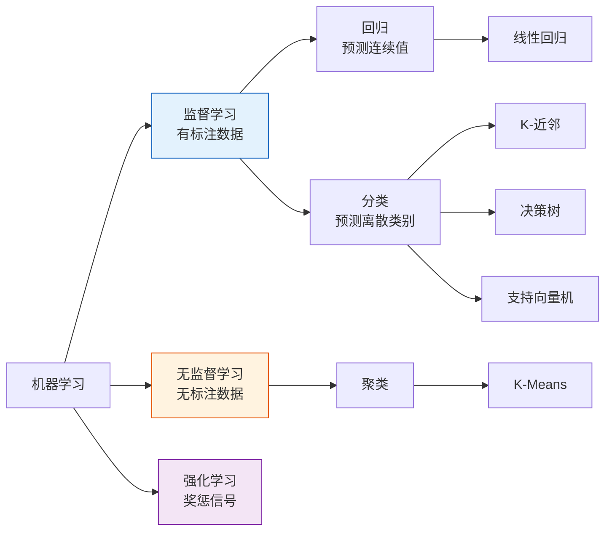
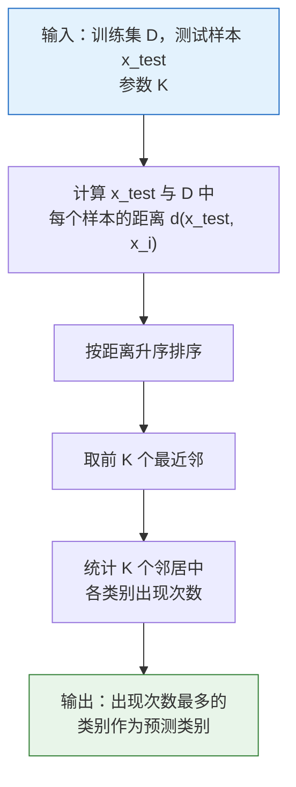
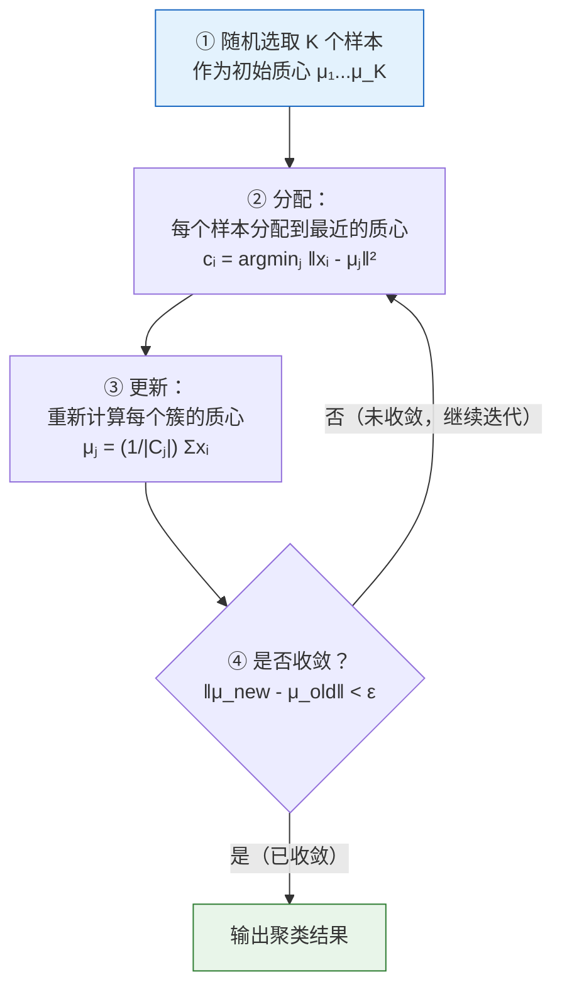
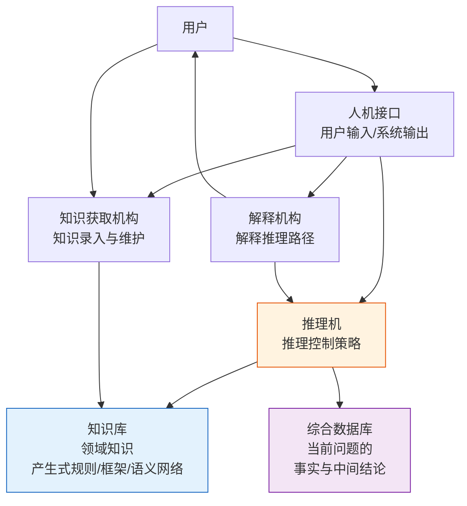
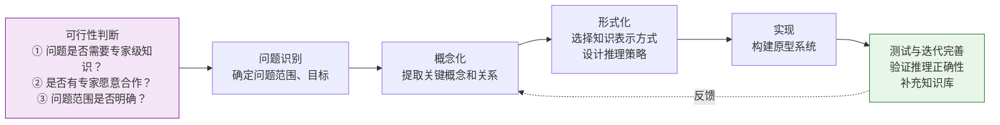
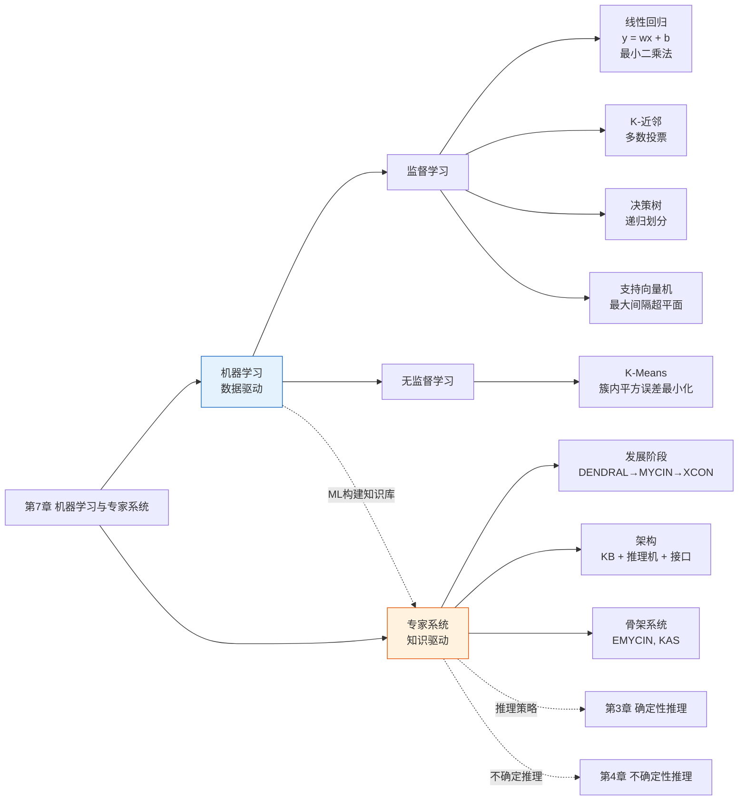

# 第7章 机器学习与专家系统

> 本章分为两大部分：**机器学习**（7.1–7.6）介绍监督/无监督/弱监督学习的基本算法；**专家系统**（7.7–7.9）介绍知识驱动的 AI 系统的架构与开发。前者是**数据驱动**的范式，后者是**知识驱动**的范式——两者在 1980–90 年代曾是 AI 的两条主线，今天则趋向融合（如用 ML 自动构建知识库）。

---

## 第一部分：机器学习

## 7.1 机器学习概述

### 7.1.1 机器学习的概念

**定义**：机器学习（Machine Learning）是计算机模拟人类学习行为，从数据中自动获取知识，并持续优化自身性能的过程。

**三大核心研究方向**：

| 方向 | 关注问题 |
|------|---------|
| **学习机理** | 人类如何获取知识、抽象概念——认知科学基础 |
| **学习方法** | 将生物学习规律简化为可计算的算法——算法设计 |
| **学习系统** | 实现机器学习的完整软硬件系统——工程实现 |

**学习系统的四大基础组成**：

```
环境（数据源） → 学习模块 → 知识库 → 执行与评价模块
                                      ↓
                                 性能反馈（回馈到学习模块）
```

| 组件          | 作用                   |
| ----------- | -------------------- |
| **环境**      | 提供原始数据或外部信息源         |
| **学习模块**    | 从环境数据中提炼模式、更新知识库     |
| **知识库**     | 存储已习得的知识（规则、参数、模型结构） |
| **执行与评价模块** | 应用知识库解决实际问题，输出性能反馈   |

### 7.1.2 机器学习的多种分类方式

#### 按学习方法划分

| 类型                                   | 原理              | 例子        |
| ------------------------------------ | --------------- | --------- |
| **机械式学习**（Rote Learning）             | 直接存储输入-输出对，检索复用 | 缓存查询结果    |
| **指导式学习**（Learning by Instruction）   | 将外部指导信息转换为内部知识  | 基于规则的系统   |
| **示例学习**（Learning from Examples）     | 从正反样例中归纳概念      | 决策树、SVM   |
| **类比学习**（Learning by Analogy）        | 将已知领域知识迁移到新问题   | 案例推理（CBR） |
| **解释学习**（Explanation-Based Learning） | 从单一例子中提取一般化规则   | 基于解释的泛化   |

#### 按监督信息划分（最常用分类）



#### 按推理方式划分

| 类型                  | 原理           | 输出特点            |
| ------------------- | ------------ | --------------- |
| **演绎学习**（Deductive） | 从一般规则推导出具体事实 | 保真（结论一定正确）      |
| **归纳学习**（Inductive） | 从具体实例中总结一般规则 | 可错（结论可能不正确，需验证） |

绝大多数机器学习算法（决策树、SVM、KNN）属于**归纳学习**——从有限样本中归纳出可泛化的模式。

### 7.1.3 监督学习与无监督学习

#### 监督学习（Supervised Learning）

**定义**：训练数据包含输入 $\mathbf{x}$ 和对应的标签 $y$，模型学习从 $\mathbf{x}$ 到 $y$ 的映射 $f: \mathcal{X} \rightarrow \mathcal{Y}$。

**流程**：

```
训练集 {(x₁,y₁), ..., (x_N,y_N)}
        ↓
学习算法 → 模型 f(x)
        ↓
测试集 x_test → 预测 ŷ = f(x_test)
        ↓
评估：ŷ 与真实 y_test 比较 → 误差
```

|   子类   | 输出类型 | 损失函数示例    | 算法          |
| :----: | ---- | --------- | ----------- |
| **回归** | 连续值  | 均方误差（MSE） | 线性回归        |
| **分类** | 离散类别 | 交叉熵损失     | KNN、决策树、SVM |

#### 无监督学习（Unsupervised Learning）

**定义**：训练数据**不含标签**，模型自主发现数据的内在结构、分布或模式。

**典型任务**：
- **聚类**：将样本分组，类内相似度高、类间差异大（K-Means）
- **降维**：将高维数据映射到低维空间，保留关键结构（PCA）
- **密度估计**：估计数据的概率分布

> 深度学习（2006 年后）的发展极大推动了无监督学习——自编码器、生成对抗网络（GAN）、自监督学习等方法使无标注数据的利用效率大幅提升。

### 7.1.4 弱监督学习

**弱监督学习（Weakly Supervised Learning）**：训练标签**不完全、不精确或不完整**。

| 类型        | 标签情况             | 方法                          |
| --------- | ---------------- | --------------------------- |
| **半监督学习** | 少量标注 + 大量无标注     | 自训练（Self-Training）、一致性正则化   |
| **迁移学习**  | 源领域有标注，目标领域无/少标注 | 样本迁移、特征迁移、模型迁移（Fine-tuning） |
| **强化学习**  | 无标准答案，仅有奖惩信号     | Q-Learning、策略梯度             |

**迁移学习的三种方式**：

```
① 样本迁移：复用源域的部分标注样本（加权）
② 特征迁移：将源域学到的特征表示映射到目标域
③ 模型迁移（Fine-tuning）：在源域预训练模型上，用目标域少量数据微调

→ 当前最常用的迁移方式：预训练模型 + 下游任务微调
```

### 7.1.5 深度学习

**起源**：2006 年 Hinton 提出**逐层预训练**（Layer-wise Pre-training）方法，解决了深层网络难以有效训练的问题，标志着深度学习的复兴。

**核心优势**：依托大数据自动提取**多层层次化特征**——底层检测边缘/纹理、中层检测部件/形状、高层检测完整对象——无需人工设计特征。

**与传统 ML 的根本区别**：

```
传统 ML:   特征工程（人工）→ 分类器/回归器
深度学习:  端到端学习，特征与分类器联合优化
```

---

## 7.2 线性回归（监督学习 · 回归算法）

### 7.2.1 模型定义

线性回归假设目标变量 $y$ 与特征 $\mathbf{x} = (x_1, x_2, \dots, x_m)$ 之间存在线性关系：

$$
y = w_1 x_1 + w_2 x_2 + \dots + w_m x_m + b = \mathbf{w}^T \mathbf{x} + b
$$

对于单变量（一元线性回归）：$y = wx + b$。

### 7.2.2 损失函数

采用**均方误差（Mean Squared Error, MSE）**衡量预测值与真实值的偏差：

$$
L(\mathbf{w}, b) = \frac{1}{N} \sum_{i=1}^{N} (y_i - (\mathbf{w}^T \mathbf{x}_i + b))^2
$$

目标：$\min_{\mathbf{w}, b} L(\mathbf{w}, b)$

### 7.2.3 最小二乘法求解

将损失函数对 $\mathbf{w}, b$ 求偏导并令其为零，得到闭式解：

$$
\mathbf{w}^* = (\mathbf{X}^T \mathbf{X})^{-1} \mathbf{X}^T \mathbf{y}, \quad b^* = \bar{y} - \mathbf{w}^T \bar{\mathbf{x}}
$$

其中 $\mathbf{X}$ 为设计矩阵（每行一个样本），$\bar{\mathbf{x}}$ 为特征均值向量，$\bar{y}$ 为目标均值。

> **与梯度下降的关系**：最小二乘法直接求解析解，适合中小规模数据。当特征维度极高或样本量极大时，通常用梯度下降（GD/SGD）迭代求解——此时线性回归等同于**单层神经网络**。

### 7.2.4 实例

**例 1：导丝盘速度与电流周波数**

| 导丝盘速度（x）| 1 | 2 | 3 | 4 | 5 |
|:---:|:---:|:---:|:---:|:---:|:---:|
| 电流周波数（y）| 8 | 10 | 12 | 14 | 16 |

数据呈完全线性关系：$y = 2x + 6$（斜率为 2，截距为 6）。

**例 2：钢包容积与使用次数**

| 使用次数（x）| 2 | 3 | 4 | 5 | 6 | 7 | 8 | 9 | 10 | 11 |
|:---:|:---:|:---:|:---:|:---:|:---:|:---:|:---:|:---:|:---:|:---:|
| 容积（y）| 106.42 | 108.20 | 109.58 | 109.50 | 109.93 | 110.49 | 110.59 | 110.60 | 110.90 | 110.76 |

拟合结果：$y \approx 0.42x + 106.3$（容积随使用次数增加但增幅递减，线性模型是近似）。

---

## 7.3 K-近邻（KNN，监督分类算法）

### 7.3.1 核心思想

> **一个样本的类别由它在特征空间中距离最近的 $K$ 个邻居的多数投票决定。**

KNN 是**惰性学习**（Lazy Learning）——训练阶段仅存储样本，不建立显式模型；预测阶段才进行计算。

### 7.3.2 距离度量

| 度量 | 公式 | 特点 |
|------|------|------|
| **欧氏距离** | $d(\mathbf{x}_i, \mathbf{x}_j) = \sqrt{\sum_{k=1}^{m} (x_{ik} - x_{jk})^2}$ | 最常用，适用于连续特征 |
| **曼哈顿距离** | $d(\mathbf{x}_i, \mathbf{x}_j) = \sum_{k=1}^{m} \|x_{ik} - x_{jk}\|$ | 适用于网格状特征 |

### 7.3.3 算法流程



**影响 KNN 性能的关键因素**：
- $K$ 值：过小 → 对噪声敏感（过拟合）；过大 → 决策边界模糊（欠拟合）。经验值 $K = 3$–$10$，通过交叉验证选择
- 距离度量：需根据特征类型选择
- 特征缩放：欧氏距离对量纲敏感，需归一化/标准化

### 7.3.4 实例：学生成绩预测就业企业类型

**数据**：3 个学生已知的毕业去向，预测第 4 个学生的企业类型。

|  学生   |  平均成绩  |  编程能力  | 企业类型  |
| :---: | :----: | :----: | :---: |
|   A   |   85   |   90   |  互联网  |
|   B   |   70   |   75   | 传统软件  |
|   C   |   60   |   65   | 传统软件  |
| **D** | **80** | **85** | **?** |

计算 D 与各点的欧氏距离：
- $d(D, A) = \sqrt{(80-85)^2 + (85-90)^2} = \sqrt{50} \approx 7.07$
- $d(D, B) = \sqrt{(80-70)^2 + (85-75)^2} = \sqrt{200} \approx 14.14$
- $d(D, C) = \sqrt{(80-60)^2 + (85-65)^2} = \sqrt{800} \approx 28.28$

| $K$ 值 |   最近邻   |    投票结果     |  预测  |
| :---: | :-----: | :---------: | :--: |
|   1   |    A    | 互联网:1, 传统:0 | 互联网  |
|   3   | A, B, C | 互联网:1, 传统:2 | 传统软件 |

> KNN 没有显式训练过程，所有计算在预测时完成。当 $K$ = 1 时退化为最近邻分类（1-NN）。

---

## 7.4 决策树（监督分类算法）

### 7.4.1 基本结构

决策树通过一系列"如果—则"规则对样本进行分类。

```
               [根节点: 颜色?]
              /              \
          红色               绿色
           /                   \
    [内部: 形状?]          [叶子: 苹果]
      /        \
  圆形         椭圆形
   /              \
[叶子: 苹果]   [叶子: 草莓?]
```

| 节点类型     | 含义                |
| -------- | ----------------- |
| **根节点**  | 包含全部训练样本，第一次分裂的属性 |
| **内部节点** | 对某个属性进行测试，按结果分支   |
| **叶子节点** | 决策结果（类别标签）        |

### 7.4.2 递归终止条件

决策树的生长是一个**递归划分**过程，当满足以下任一条件时停止：

1. **节点样本全部属于同一类别** → 该节点成为叶子，标记为该类别
2. **无可用的划分属性**（所有属性已用完） → 叶子标记为多数类别
3. **节点不包含样本**（父节点的某分支无数据） → 叶子标记为父节点多数类别

### 7.4.3 划分属性选择

| 准则 | 公式 | 方向 |
|:---:|------|:----:|
| **信息增益**（ID3） | $\text{Gain}(D, A) = H(D) - \sum_{v} \frac{\|D^v\|}{\|D\|} H(D^v)$ | 最大化 |
| **增益率**（C4.5） | $\text{GainRatio}(D, A) = \frac{\text{Gain}(D, A)}{\text{SplitInfo}(A)}$ | 最大化 |
| **基尼指数**（CART） | $\text{Gini}(D) = 1 - \sum_{k=1}^{K} p_k^2$ | 最小化 |

其中 $H(D) = -\sum_{k} p_k \log_2 p_k$ 为信息熵。

### 7.4.4 实例：水果分类

训练数据：

| 水果 | 颜色 | 形状 | 大小 | 类别 |
|:---:|:---:|:---:|:---:|:---:|
| 1 | 红色 | 圆形 | 大 | 苹果 |
| 2 | 红色 | 椭圆形 | 小 | 草莓 |
| 3 | 绿色 | 圆形 | 大 | 西瓜 |
| 4 | 绿色 | 椭圆形 | 大 | 梨 |

按颜色划分：
- 红色 → {苹果, 草莓} → 需继续按形状划分
- 绿色 → {西瓜, 梨} → 需继续按形状划分

最终形成的决策树：
```
         [颜色]
        /      \
     红色      绿色
      /          \
   [形状]       [形状]
   /    \       /    \
圆形  椭圆形  圆形  椭圆形
  |      |      |      |
苹果  草莓  西瓜   梨
```

> **决策树与第 5 章搜索的联系**：决策树学习本质上是在假设空间中进行**贪心搜索**——每步选择当前最优的划分属性（局部最优），不回溯。这是决策树易过拟合的原因之一（通过剪枝缓解）。

---

## 7.5 支持向量机（SVM，监督分类）

### 7.5.1 核心思想

SVM 寻找一个**超平面**将两类样本分开，并最大化两类到超平面的**最小距离**（间隔，Margin）。

**线性可分情形**：

```
         ● ● ●
           ●   ○ ○ ○
         ●   ○     ○
           ●   ○ ○
          margin ←→
       超平面: wᵀx + b = 0
```

间隔由**支持向量**（距离超平面最近的样本）决定。

**形式化**：
$$
\max_{\mathbf{w}, b} \frac{2}{\|\mathbf{w}\|} \quad \text{s.t.} \quad y_i(\mathbf{w}^T \mathbf{x}_i + b) \geq 1, \; i = 1,\dots,N
$$

等价于最小化 $\frac{1}{2}\|\mathbf{w}\|^2$，这是一个**凸二次规划**（Convex Quadratic Programming）问题——有唯一全局最优解。

### 7.5.2 核函数：处理线性不可分

当数据线性不可分时，通过**核函数** $\phi(\mathbf{x})$ 将原始特征映射到高维空间，使数据在高维空间中线性可分。

| 核函数 | 公式 | 特点 |
|-------|------|------|
| **线性核** | $K(\mathbf{x}_i, \mathbf{x}_j) = \mathbf{x}_i^T \mathbf{x}_j$ | 无映射，等价于原始空间 |
| **多项式核** | $K(\mathbf{x}_i, \mathbf{x}_j) = (\mathbf{x}_i^T \mathbf{x}_j + c)^d$ | 映射到 $d$ 阶多项式空间 |
| **RBF 高斯核** | $K(\mathbf{x}_i, \mathbf{x}_j) = \exp(-\gamma \|\mathbf{x}_i - \mathbf{x}_j\|^2)$ | 映射到无穷维空间，最常用 |

**核技巧（Kernel Trick）**：只需定义核函数 $K(\mathbf{x}_i, \mathbf{x}_j) = \phi(\mathbf{x}_i)^T \phi(\mathbf{x}_j)$ 即可计算高维空间的内积，**无需显式计算** $\phi(\mathbf{x})$——这是 SVM 高效处理高维和非线性问题的关键。

> **SVM 与逻辑回归的对比**：SVM 只关心支持向量（边界附近的样本），逻辑回归使用所有样本。因此 SVM 在边界清晰、样本量少时表现更好，逻辑回归在大规模数据上计算更高效。

---

## 7.6 K-Means 聚类（无监督学习）

### 7.6.1 核心目标

将 $N$ 个样本划分到 $K$ 个簇（Cluster），使得：
- **簇内相似度高**：样本到簇中心的距离小
- **簇间差异大**：不同簇中心之间的距离大

### 7.6.2 算法流程



### 7.6.3 目标函数

最小化**簇内平方误差**（Sum of Squared Errors, SSE）：

$$
\text{SSE} = \sum_{j=1}^{K} \sum_{\mathbf{x} \in C_j} \|\mathbf{x} - \boldsymbol{\mu}_j\|^2
$$

其中 $C_j$ 为第 $j$ 个簇，$\boldsymbol{\mu}_j$ 为该簇的质心。

### 7.6.4 算法特性

| 方面     | 说明                                                   |
| ------ | ---------------------------------------------------- |
| **优点** | 简单高效，适合大规模数据；时间复杂度 $O(N \cdot K \cdot T)$（$T$ 为迭代次数） |
| **缺点** | 对初始质心敏感（不同初始化可能得到不同结果）；需预先指定 $K$ 值；对异常点敏感            |

**$K$ 值选择——肘部法（Elbow Method）**：

绘制 $K$ 与 SSE 的曲线，选择拐点（SSE 下降明显变缓的点）作为 $K$：

```
SSE
  |
  |\
  |  \
  |    \____
  |       \______
  |           \________
  +--------------------→ K
   1  2  3   4   5   6
            ↑
         肘部 (K=3)
```

---

## 第二部分：专家系统

## 7.7 专家系统概述

### 7.7.1 发展三阶段

|   阶段    |       时间        | 代表系统                                                     | 特征                  |
| :-----: | :-------------: | -------------------------------------------------------- | ------------------- |
| **初创期** | 1960s 中–1970s 初 | DENDRAL（化学分子结构）、MACSYMA（数学推导）                            | 专业性强但功能简陋，无通用框架     |
| **成熟期** | 1970s 中–1980s 初 | MYCIN（医疗诊断）、PROSPECTOR（地质勘探）、CASNET（青光眼诊断）、HEARSAY（语音理解） | 结构完整，支持不确定推理，具备解释能力 |
| **发展期** |     1980s–今     | XCON（计算机配置）、农业/医疗/地质领域专家系统                               | 通用开发骨架工具，各行业落地      |

### 7.7.2 定义与核心特点

**定义**（费根鲍姆，Feigenbaum）：专家系统是**利用专业知识和推理过程解决需要专家水平才能解决的复杂问题的智能计算机程序**。

**六大核心特点**：

| 特点          | 描述                                  |
| ----------- | ----------------------------------- |
| ① **专家级知识** | 包含特定领域的高质量知识                        |
| ② **有效推理**  | 能在合理时间内给出结论                         |
| ③ **启发性**   | 利用经验性知识（如"如果 X 且 Y，则很可能 Z"），而非纯数学推导 |
| ④ **灵活性**   | 知识库可增量扩充                            |
| ⑤ **透明可解释** | 能向用户解释推理路径和依据                       |
| ⑥ **人机交互**  | 支持用户输入、查询和解释请求                      |

**专家系统 vs 传统程序**：

| 对比维度     | 传统程序        | 专家系统           |
| -------- | ----------- | -------------- |
| **基本范式** | 数据结构 + 算法   | 知识库 + 推理机      |
| **知识存储** | 隐式嵌入代码逻辑    | 显式存储在知识库中      |
| **处理对象** | 数值计算、数据处理   | 符号推理、知识处理      |
| **解释能力** | 无           | 可解释推理路径        |
| **容错性**  | 输入/逻辑错误导致崩溃 | 可通过非精确推理给出合理结论 |
| **体系结构** | 代码与数据紧密耦合   | 知识库与推理机分离      |

### 7.7.3 专家系统分类

按多种维度划分：
- **按任务类型**：诊断型、预测型、设计型、规划型、监控型、教育型
- **按知识表示**：产生式规则系统、框架系统、语义网络系统
- **按推理方向**：正向推理、反向推理、双向推理

---

## 7.8 专家系统的工作原理

### 7.8.1 标准整体架构

专家系统由**六大核心模块**组成：



| 模块 | 功能 |
|------|------|
| **人机接口** | 接收用户输入（问题、事实、参数），输出结果和解释 |
| **知识库** | 存储领域知识，通常以产生式规则（IF–THEN）形式组织 |
| **综合数据库** | 存储当前求解问题的初始事实、推理过程中的中间结论 |
| **推理机** | 控制知识的选择和应用（第 3 章的推理策略在此实现） |
| **解释机构** | 向用户解释"如何得到这个结论"、"为什么需要某个信息" |
| **知识获取机构** | 支持领域专家录入、修改、维护知识库 |

> **推理机与第 3 章/第 4 章的关系**：推理机实现正向/反向/双向推理（第 3 章），且可结合可信度方法或证据理论处理不确定性（第 4 章）。例如 MYCIN 使用**逆向推理** + **可信度因子（CF）** 推理。

### 7.8.2 知识获取机构

**知识获取完整流程**：

```
领域专家(隐性知识) → 抽取 → 转换(形式化) → 输入 → 检测 → 知识库
```

**三种知识获取模式**：

| 模式 | 描述 | 优劣 |
|------|------|------|
| **非自动** | 知识工程师与领域专家交互，人工提取和编码 | 耗时但精度高 |
| **半自动** | 工具辅助知识编辑和校验 | 降低人力成本 |
| **自动** | 系统从数据/经验中自动学习新知识 | 效率最高，但质量受数据限制 |

---

## 7.9 专家系统的建立

### 7.9.1 开发流程



**可行性判断的三个关键问题**：
1. 问题是否需要**专家级别的知识**才能解决？
2. 是否有**愿意合作的领域专家**？
3. 问题**范围和边界**是否明确且可管理？

### 7.9.2 开发环境与工具

| 类型 | 工具/语言 | 特点 |
|:---:|----------|------|
| **AI 专用语言** | LISP、PROLOG | 符号处理能力强，适合知识表示和推理 |
| **通用编程语言** | Python、C/C++ | 生态系统丰富，适合与现代系统集成 |
| **模块化开发工具** | AGE | 提供可组合的预构建模块，降低开发门槛 |

### 7.9.3 骨架系统（Shell）概念

**定义**：骨架系统是一个**剥离了领域专用知识**的专家系统开发框架，保留通用的推理机、人机接口和解释机构等核心架构。

**优势**：只需填充新的领域规则（知识库），即可快速构建针对不同领域的专家系统，无需从零开始设计推理机。

```
骨架系统 = 通用架构（推理机 + 人机接口 + 解释机构 + 综合数据库）
           +
           领域知识库（按骨架规则格式填充）
           =
           特定领域专家系统
```

### 7.9.4 EMYCIN 骨架系统

| 方面 | 内容 |
|------|------|
| **原型** | MYCIN—医疗诊断系统（1970s，斯坦福） |
| **知识表示** | 产生式规则 + 可信度因子（CF），支持不确定推理 |
| **推理策略** | **逆向推理**：从假设目标出发，反向验证所需条件是否成立 |
| **核心模块** | 知识编辑工具、咨询模块、解释模块（HOW/WHY）、调试工具 |
| **应用** | 医疗诊断、故障检测、工程设计咨询等 |

**EMYCIN 的推理过程示例**：
```
用户目标：判断病人是否患菌血症

EMYCIN 逆向推理：
  ① 查询规则库中结论为"菌血症"的规则
  ② 检查规则前提（如"体温 > 38°C"、"白细胞计数 > 10K"等）
  ③ 向用户提问所需事实（若数据库中没有）
  ④ 根据 CF 组合计算最终可信度
  ⑤ 输出结论与置信度
```

### 7.9.5 KAS 骨架系统

| 方面 | 内容 |
|:---:|------|
| **原型** | PROSPECTOR—地质勘探专家系统（1970s，SRI） |
| **知识表示** | **产生式规则 + 语义网络**的混合表示 |
| **推理策略** | 正向/反向混合推理 |
| **核心模块** | 网络编辑器（构建语义网络）、匹配校验程序 |
| **应用** | 矿产资源勘探、工程结构识别、航空图像分类 |

> **EMYCIN vs KAS 对比**：EMYCIN 源于诊断型系统（逆向推理主导），KAS 源于勘探型系统（混合推理 + 语义网络表示丰富的空间/关系知识）。两个骨架系统的差异反映了不同任务类型对知识表示和推理策略的不同需求。

---

## 知识图谱



---

## 与其他章节的关联

- [第3章 确定性推理](/articles/ai-ml/introduction-to-ai/summaries/第3章-确定性推理方法/) — 专家系统的推理机基于第 3 章的正向/反向/双向推理策略。MYCIN 使用逆向推理，PROSPECTOR 使用混合推理。
- [第4章 不确定性推理](/articles/ai-ml/introduction-to-ai/summaries/第4章-不确定性推理方法/) — 专家系统的知识库包含不确定性知识。MYCIN 的可信度因子（CF）模型是第 4 章内容的应用实例。PROSPECTOR 使用了主观贝叶斯方法。
- [第5章 搜索求解策略](/articles/ai-ml/introduction-to-ai/summaries/第5章-搜索求解策略/) — 决策树学习本质上是假设空间的贪心搜索。推理机中的规则匹配也可视为搜索过程。
- [第6章 智能计算及其应用](/articles/ai-ml/introduction-to-ai/summaries/第6章-智能计算及其应用/) — 遗传算法可优化决策树、SVM 等模型的超参数，或用于自动进化专家系统的规则。
- [贪心算法](/articles/algorithms/concepts/贪心算法/) — 决策树 ID3 算法按信息增益最大原则贪心选择划分属性。
