# 第8章 人工神经网络及其应用

> 本章是 AI 导论课程中神经网络的系统讲解，从生物神经元出发，覆盖 BP、Hopfield、CNN、GAN 四类网络。BP 的详细数学推导参见 [深度学习：BP 反向传播](/articles/ai-ml/deep-learning/concepts/BP神经网络与反向传播/)（含完整手算实例），本章侧重概念脉络和应用。

---

## 8.1 神经元与神经网络

### 8.1.1 生物神经元结构

**人脑**由约 860 亿个神经元组成，通过约 $10^{15}$ 个突触连接构成极其复杂的网络。大脑按结构分为：

| 区域 | 功能 |
|------|------|
| **大脑皮层** | 高级认知（思维、语言、感知） |
| **中脑** | 视觉与听觉反射中枢 |
| **脑干** | 生命维持（呼吸、心跳） |
| **小脑** | 运动协调与平衡 |

**单个生物神经元**由四部分组成：

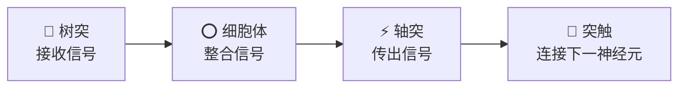

| 结构 | 功能 | 关键特征 |
|------|------|---------|
| **树突 (Dendrite)** | 接收其他神经元传来的信号 | 分支多而广，类似于"输入端" |
| **细胞体 (Soma)** | 整合所有输入，达到阈值则产生电脉冲 | "决策中心" |
| **轴突 (Axon)** | 传导电脉冲到下一级神经元 | 可长达一米，类似于"输出线缆" |
| **突触 (Synapse)** | 两个神经元之间的连接点 | **可塑性**——连接强度可变，是学习与记忆的生理基础 |

**神经元的两种状态**：

| 状态 | 描述 |
|------|------|
| **兴奋** | 输入总和超过阈值 → 发放动作电位 → 传出信号 |
| **抑制** | 输入总和未达阈值 → 静息状态 → 不传出信号 |

> 🧠 **生物可塑性**：突触的连接强度可增强或减弱——反复激活同一通路会强化突触（长时程增强 LTP），长期不用则弱化（长时程抑制 LTD）。这就是"熟能生巧"和"遗忘"的神经科学解释。

---

### 8.1.2 神经元数学模型（M-P 模型）

1943 年，McCulloch 和 Pitts 提出第一个**人工神经元数学模型（M-P 模型）**：

$$o = f\left(\sum_{i=1}^{n} w_i x_i - \theta\right)$$

或等价地写为（现代更常用）：

$$o = f\left(\sum_{i=1}^{n} w_i x_i + b\right)$$

其中 $b = -\theta$ 称为**偏置（bias）**。

| 符号 | 名称 | 生物对应 | 含义 |
|------|------|---------|------|
| $x_i$ | 输入 | 树突接收的信号 | 来自其他神经元或原始数据 |
| $w_i$ | 权值 | 突触连接强度 | 可调节，是学习的核心参数 |
| $\theta$ | 阈值 | 细胞体兴奋阈值 | 超过此值神经元才激活 |
| $b$ | 偏置 | $b = -\theta$ | 控制激活难易程度 |
| $f(\cdot)$ | 激活函数 | 轴突输出机制 | 引入非线性 |

#### 常用激活函数

| 函数 | 公式 | 输出范围 | 特点 |
|------|------|---------|------|
| **阶跃函数** | $f(x) = \begin{cases}1, & x \geq 0 \\ 0, & x < 0\end{cases}$ | $\{0,1\}$ | 最早使用，不可微 |
| **Sigmoid** | $f(x) = \frac{1}{1+e^{-x}}$ | $(0,1)$ | 光滑可微，导数 $f'=f(1-f)$ |
| **双曲正切 tanh** | $f(x) = \frac{e^x-e^{-x}}{e^x+e^{-x}}$ | $(-1,1)$ | 零中心，优于 Sigmoid |
| **ReLU** | $f(x) = \max(0,x)$ | $[0,+\infty)$ | 现代默认选择，计算极快 |

> 激活函数的完整对比与选择指南 → 详见 [激活函数](/articles/ai-ml/deep-learning/concepts/激活函数/)

#### 单神经元计算流程

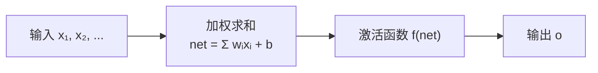

> 一个神经元做的事情本质上就是：**点积 + 加偏置 + 非线性映射**。万亿参数的大模型也是由这样的基本单元堆叠而成。

---

### 8.1.3 神经网络的结构与工作方式

决定 ANN 性能的**三大要素**：

| 要素 | 说明 | 例子 |
|------|------|------|
| **神经元特性** | 激活函数类型 | Sigmoid / ReLU / tanh |
| **拓扑连接** | 神经元之间的连接模式 | 前馈 / 反馈 / 卷积 |
| **学习规则** | 如何根据数据调整权值 | Hebb 规则 / BP 算法 |

#### 两种基本拓扑结构

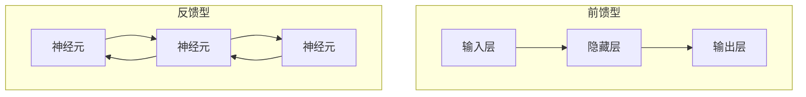

| 类型 | 信号方向 | 代表网络 | 特点 |
|------|---------|---------|------|
| **前馈型 (Feedforward)** | 单向：输入→隐藏→输出 | BP 网络、CNN | 无反馈回路，结构简单稳定 |
| **反馈型 (Feedback)** | 双向，存在回路 | Hopfield 网络、RNN | 具有记忆能力，可处理时序 |

#### 网络工作模式

| 模式 | 更新方式 | 适用场景 |
|------|---------|---------|
| **同步并行** | 所有神经元同时更新 | 理论分析 |
| **异步串行** | 每次随机选一个神经元更新 | 硬件实现、Hopfield |

---

### 8.1.4 神经网络的学习

> 神经网络的知识**不是存储在某个特定位置**，而是**分布式地编码在所有权值中**。这是与传统程序（知识 = 显式规则）的根本区别。

#### Hebb 学习规则（1944）

最古老的神经学习假说：

> "When an axon of cell A is near enough to excite cell B and repeatedly or persistently takes part in firing it, some growth process or metabolic change takes place in one or both cells such that A's efficiency, as one of the cells firing B, is increased."

> **通俗版**："一起放电的神经元，连接会增强。"

数学形式：$$\Delta w_{ij} = \eta \cdot o_i \cdot o_j$$

- 若神经元 $i$ 和 $j$ 同时兴奋（$o_i, o_j > 0$），它们之间的权值 $w_{ij}$ 增大
- **无监督学习**——不需要外部标签，仅依赖神经元自身的活动

> Hebb 规则是后续所有学习算法的思想先驱，包括 BP 和现代深度学习中的各种更新规则。

---

## 8.2 BP 神经网络及其学习算法

> [必知] BP（Back Propagation，误差反向传播）是神经网络历史上最重要的训练算法。1986 年 Rumelhart、Hinton 和 Williams 系统提出后，多层网络的训练才真正可行。

### 8.2.1 BP 神经网络的结构

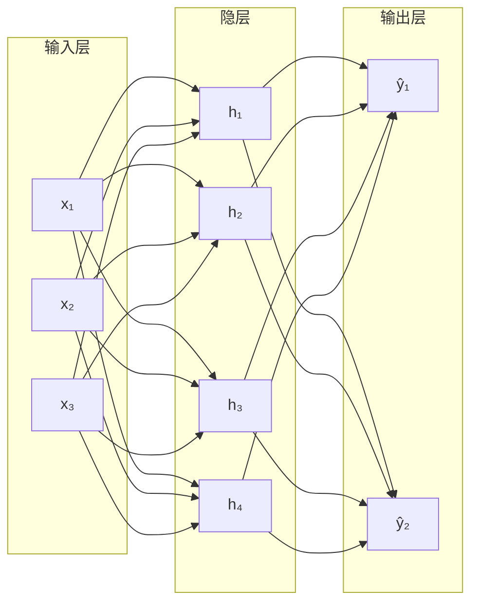

- **三层标准结构**：输入层（接收数据）、隐层（特征变换）、输出层（产生结果）
- **连接规则**：相邻层之间**全连接**，同层内无连接，无跨层连接
- **信号方向**：单向（输入→隐层→输出），无反馈回路

**两个工作阶段**：

| 阶段 | 做什么 | 数据流向 |
|------|--------|---------|
| **训练阶段** | 调整权值和偏置 | 前向算输出 + 反向传梯度 |
| **推理阶段** | 对新的输入做预测 | 仅前向计算 |

**万能逼近定理**：一个具有单隐层 + Sigmoid 激活 + 足够多隐节点的前馈网络，可以以**任意精度**逼近任何连续函数（在有界区间上）。这是 BP 网络强大表达能力的理论保证。

---

### 8.2.2 BP 学习算法核心原理

#### 两大传播过程

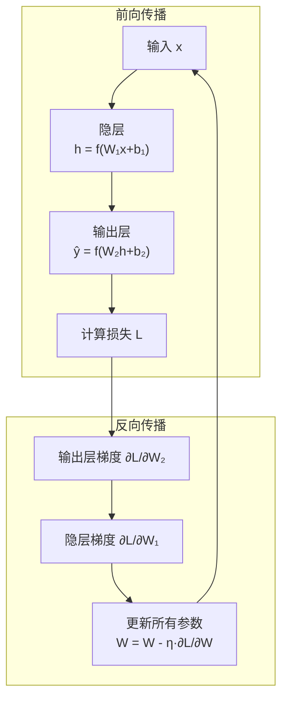

| 过程 | 方向 | 核心操作 |
|------|------|---------|
| **前向传播** | 输入 → 输出 | 逐层计算预测值 |
| **反向传播** | 输出 → 输入 | 链式法则逐层传梯度，更新参数 |

#### 损失函数

训练目标：最小化预测值 $\hat{y}$ 和真实值 $y$ 之间的差距。

| 损失函数 | 公式 | 适用场景 |
|---------|------|---------|
| 均方误差 (MSE) | $L = \frac{1}{2}(y - \hat{y})^2$ | 回归 |
| 交叉熵 (Cross-Entropy) | $L = -[y\log\hat{y}+(1-y)\log(1-\hat{y})]$ | 二分类 |

#### 梯度下降与链式法则

**梯度下降**更新公式：$$w \leftarrow w - \eta \cdot \frac{\partial L}{\partial w}$$

- 梯度指向损失**增大**的方向 → 沿**负梯度**方向更新 → 损失减小
- $\eta$（学习率）控制步长

**链式法则**是反向传播的数学引擎。若 $L = L(\hat{y}), \hat{y} = f(z), z = W\cdot h$：

$$\frac{\partial L}{\partial W} = \frac{\partial L}{\partial \hat{y}} \cdot \frac{\partial \hat{y}}{\partial z} \cdot \frac{\partial z}{\partial W}$$

> **完整数学推导（含 2→2→1 手算数值实例）** → 详见 [BP 神经网络与反向传播](/articles/ai-ml/deep-learning/concepts/BP神经网络与反向传播/)
>
> **梯度下降详解（几何含义、BGD/SGD/MiniBatch）** → 详见 [梯度下降](/articles/ai-ml/deep-learning/concepts/梯度下降/)
>
> **链式法则详解（简单例子 + NN 依赖链图）** → 详见 [链式法则](/articles/ai-ml/deep-learning/concepts/链式法则/)

---

### 8.2.3 BP 算法的实现

#### 超参数设计

| 超参数 | 指南 |
|--------|------|
| **隐层数量** | 3 层可逼近任意连续函数（万能逼近定理）；加深层数提升表示效率但增加训练难度 |
| **隐层节点数** | 经验公式 $\sqrt{n+l}+\alpha$（$n$ 输入, $l$ 输出, $\alpha\in[1,10]$），实际通过交叉验证确定 |
| **初始权值** | 随机初始化（防对称失效）；Sigmoid 用 $w \sim U[-2.4/n, 2.4/n]$ |
| **数据预处理** | 归一化到同一尺度（如 $[0,1]$ 或 $[-1,1]$），加速收敛 |

#### BP 完整迭代流程

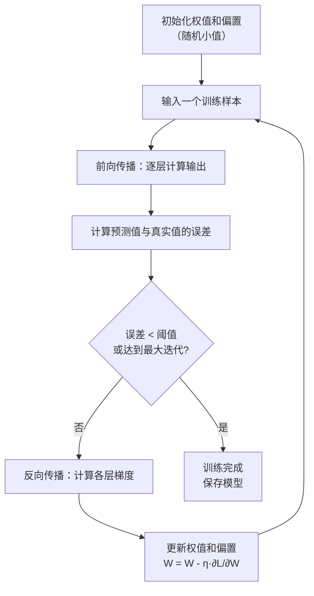

#### BP 算法优缺点

| 优点 | 缺点 |
|------|------|
| ✅ 强函数逼近能力（万能逼近定理） | ❌ 收敛速度慢（Sigmoid 饱和区） |
| ✅ 泛化能力强（对未见数据也能预测） | ❌ 易陷入局部极小值 |
| ✅ 容错性高（部分神经元故障不影响整体） | ❌ 隐层节点数无理论最优解 |
| ✅ 适用于各类问题（分类、回归） | ❌ 对初始权值和学习率敏感 |

> 现代深度学习中，这些缺陷已通过 ReLU、Adam 优化器、Batch Normalization、残差连接等技术大幅缓解。

---

## 8.3 BP 神经网络在模式识别中的应用

### 模式识别任务

模式识别是让机器自动识别数据中的规律，典型任务包括：

| 类型 | 例子 | 输入形式 |
|------|------|---------|
| **图像识别** | 手写数字、人脸识别 | 像素矩阵 |
| **语音识别** | 语音转文字 | 声学特征向量 |
| **文字识别** | OCR、文本分类 | 字符特征 / 词向量 |

### 神经网络相比传统方法的优势

| 优势 | 说明 |
|------|------|
| **并行处理** | 多个神经元同时计算，天然适合 GPU 加速 |
| **自适应** | 从数据中自动学习特征，无需人工设计规则 |
| **高容错** | 分布式存储知识，部分连接损坏不影响整体 |
| **非线性** | 激活函数赋予拟合复杂决策边界的能力 |

### 实例：0~9 手写数字识别

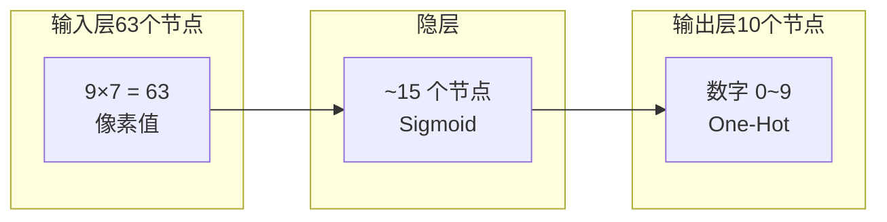

| 设计要素 | 选择 |
|---------|------|
| **输入** | $9 \times 7 = 63$ 个像素，展平为向量 |
| **输出** | 10 个节点，One-Hot 编码（如"3" → $[0,0,0,1,0,0,0,0,0,0]$） |
| **激活** | Sigmoid |
| **训练样本** | 每个数字提供多个标准样本 |
| **关键能力** | 对噪声/残缺样本仍能正确识别——这是 BP 泛化能力的直接体现 |

> 测试时输入一个有噪声或部分缺失的数字图像，网络仍能给出正确分类——因为知识分布在整个网络的权值中，而非某个特定节点。

---

## 8.4 Hopfield 神经网络及其改进

> [应知] Hopfield 网络由 John Hopfield 于 1982 年提出，是**反馈型神经网络**的奠基之作。Hopfield 因对神经网络和物理系统的开创性贡献获得 **2024 年诺贝尔物理学奖**。

---

### 8.4.1 离散型 Hopfield 神经网络

#### 网络拓扑

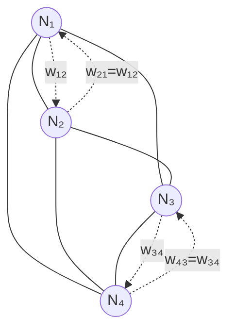

**关键特征**：

| 特征 | 说明 |
|------|------|
| **全连接** | 每个神经元与其他所有神经元相连（除自身外） |
| **对称权值** | $w_{ij} = w_{ji}$，权值矩阵对称 |
| **无自反馈** | $w_{ii} = 0$（自身不连自身） |
| **无分层** | 所有神经元地位平等，既是输入也是输出 |
| **二值状态** | 每个神经元只能是 $+1$（兴奋）或 $-1$（抑制） |

> 💡 **与 BP 网络的关键区别**：BP 是"输入→隐层→输出"的前馈分层结构；Hopfield 没有层次，所有神经元互相连接形成回路。BP 用于分类/回归，Hopfield 用于**联想记忆**和**组合优化**。

#### 神经元模型

Hopfield 神经元的状态更新规则：

$$x_i = \text{sgn}\left(\sum_{j \neq i} w_{ij} x_j - \theta_i\right)$$

其中 $\text{sgn}(u) = \begin{cases} +1, & u \geq 0 \\ -1, & u < 0 \end{cases}$

#### 两种更新方式

| 方式 | 规则 | 特点 |
|------|------|------|
| **同步更新** | 每轮**所有**神经元同时更新 | 可能出现震荡（2-循环） |
| **异步更新** | 每轮**随机选一个**神经元更新 | 保证收敛到稳定点 ✅ |

> 实际应用中**优先使用异步更新**，因为它能从理论上保证网络收敛。

#### 稳定点与吸引子 (Attractor)

**稳定点**：当网络状态不再变化时，称为到达了一个**稳定点**（也称吸引子）。

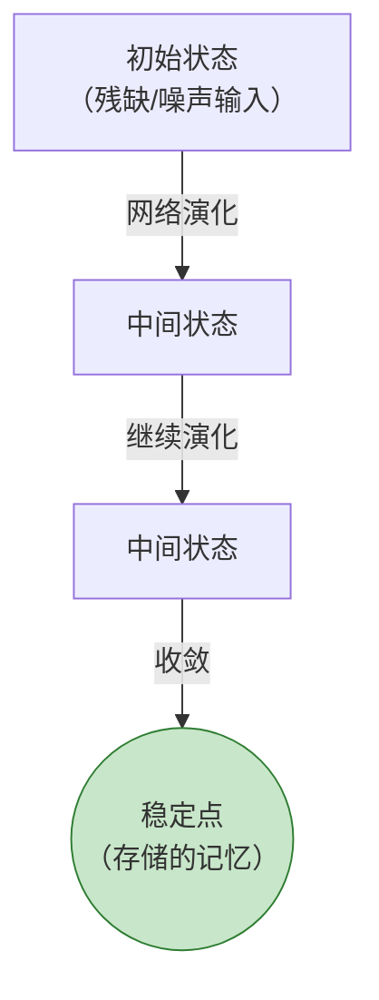

- 网络从**任意初始状态**出发，经过若干次异步更新后，必然收敛到某个稳定点
- 每个稳定点对应一个**存储的记忆模式**
- 稳定点附近的"盆地"（吸引域）内的状态都会被吸引到该稳定点

> 🏞️ **类比**：想象一个高低起伏的地形图。每个"山谷底"是一个稳定点（吸引子）。如果你在山谷的斜坡上任意位置放一个球（初始状态），球会沿着斜坡滚到谷底（演化到稳定点）。

#### Hopfield 稳定性定理

**能量函数**（Lyapunov 函数）：

$$E = -\frac{1}{2}\sum_{i}\sum_{j \neq i} w_{ij} x_i x_j + \sum_i \theta_i x_i$$

**核心定理**：在异步更新下，能量函数 $E$ **单调不增**——每次状态更新，$E$ 要么减小，要么不变。由于 $E$ 有下界，网络必然在有限步内收敛到一个局部极小点（稳定点）。

```
能量 E ↑
       │
       │ ╲___         ← 每次更新能量下降
       │     ╲___
       │         ╲___
       │             ╲___
       │                 ● ← 到达稳定点（局部极小）
       └─────────────────────→ 更新步数
```

> 🧠 这个能量函数的设计是整个 Hopfield 网络最精妙的地方——它把**神经网络演化**等价于**物理系统能量最小化**，这正是 Hopfield 获得诺贝尔奖的核心贡献之一。

---

### 8.4.2 连续型 Hopfield 神经网络

连续型 Hopfield 可以用**模拟电路 VLSI 硬件**直接实现，神经元状态不再是 $\{-1,+1\}$ 二值，而是 $[0,1]$ 或 $[-1,1]$ 之间的连续值。

#### 连续状态动力学方程

$$C_i \frac{du_i}{dt} = \sum_j w_{ij} V_j - \frac{u_i}{R_i} + I_i$$
$$V_i = g(u_i)$$

- $u_i$：神经元 $i$ 的膜电位（连续状态变量）
- $V_i$：神经元 $i$ 的输出（通过 $g(\cdot)$ 激活函数产生）
- $g(\cdot)$：通常使用 Sigmoid 型连续单调递增函数
- $C_i, R_i$：电容和电阻参数（模拟生物神经元的电特性）

#### 连续能量函数

$$E = -\frac{1}{2}\sum_i\sum_j w_{ij}V_iV_j - \sum_i I_i V_i + \sum_i \frac{1}{R_i}\int_0^{V_i} g^{-1}(v)dv$$

**收敛条件**：当权值为对称矩阵（$w_{ij}=w_{ji}$）且激活函数 $g(\cdot)$ 单调递增时，上述能量函数单调递减，网络收敛到稳态。

> 连续型与离散型的本质相同：**网络演化 = 能量下降 → 收敛到吸引子**。连续型的优势是可以直接用电路实现，速度极快。

---

### 8.4.3 随机神经网络

#### 从确定性到随机性

确定性 Hopfield 的缺陷：能量下降是"贪心"的——只往下降方向走，容易陷入较差的局部极小。

**随机网络的改进**：以一定概率接受"能量上升"的状态跳转——类似爬山时偶尔往上走，有机会翻过山脊找到更低的谷底。

#### Boltzmann 机

基于**玻尔兹曼分布**（统计力学）的神经元状态跳转概率：

$$P(x_i = +1) = \frac{1}{1 + e^{-\Delta E_i / T}}$$

- $\Delta E_i$：翻转神经元 $i$ 引起的能量变化
- $T$：**温度参数**（模拟物理系统的温度）

| $T$ | 行为 |
|-----|------|
| $T \to 0$ | 退化为确定性 Hopfield（只接受能量下降） |
| $T$ 大 | 可接受能量上升的状态跳转（探索能力强） |
| $T$ 逐渐降低 | **模拟退火**（Simulated Annealing）——先大范围探索，后精细收敛 |

> 🔥 **模拟退火**：训练初期用高温 → 网络可以"翻山越岭"逃离差局部极小；逐渐降温 → 网络在全局最优附近精细收敛。这是受冶金学退火工艺启发的优化策略。

#### 其他随机网络变体

| 变体 | 噪声分布 | 特点 |
|------|---------|------|
| **Boltzmann 机** | 玻尔兹曼分布 | 理论基础最完善 |
| **高斯机** | 高斯噪声 | 连续状态空间 |
| **柯西机** | 柯西分布（长尾） | 更激进的探索能力 |

---

## 8.5 Hopfield 神经网络的应用

### 8.5.1 联想记忆 (Associative Memory)

#### 核心原理

联想记忆是 Hopfield 网络**最经典**的应用：

> 输入一个**残缺的、有噪声的**模式 → 网络自动演化 → 收敛到**最接近的完整存储模式**

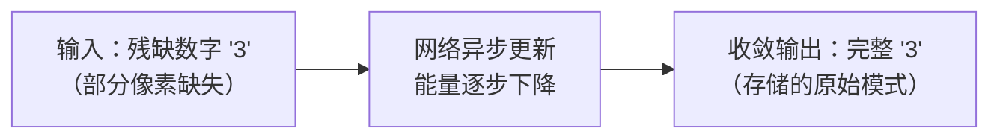

#### 实例一：苹果 vs 橘子 — 二分类器完整设计

**场景**：利用离散 Hopfield 网络设计一个自动分类器，以外形、质地、质量三个传感器的输出判断物体是苹果还是橘子。

##### 第一步：传感器编码

| 传感器 | 苹果特征 | 橘子特征 |
|--------|---------|---------|
| 外形 | 0（非圆形） | 1（圆形） |
| 质地 | 1（光滑） | 0（粗糙） |
| 质量 | 0（较轻） | 1（较重） |

标准样本向量（$\{0,1\}$ 二值）：

$$x^{(1)} = \begin{bmatrix}0 \\ 1 \\ 0\end{bmatrix}\ \text{(苹果)},\quad x^{(2)} = \begin{bmatrix}1 \\ 0 \\ 1\end{bmatrix}\ \text{(橘子)}$$

##### 第二步：转换为双极向量

Hopfield 网络的稳定吸引子要求状态为 $\{-1,+1\}$。转换规则：$0 \to -1,\ 1 \to +1$。

$$\tilde{x}^{(1)} = \begin{bmatrix}-1 \\ +1 \\ -1\end{bmatrix}\ \text{(苹果)},\quad \tilde{x}^{(2)} = \begin{bmatrix}+1 \\ -1 \\ +1\end{bmatrix}\ \text{(橘子)}$$

> 注意这两个向量恰好**互为相反数**：$\tilde{x}^{(1)} = -\tilde{x}^{(2)}$。在 Hopfield 网络中，相反的模式也是等价的稳定吸引子（网络也会收敛到 $\tilde{x}^{(3)} = [+1,-1,+1]^T$ 即 $\tilde{x}^{(2)}$ 的相反数——但 $\tilde{x}^{(2)} = -[+1,-1,+1]^T = [-1,+1,-1]^T = \tilde{x}^{(1)}$，实际只有两个独立吸引子）。

##### 第三步：外积法计算连接权矩阵

权值矩阵由 Hebb 规则构造——每个存储模式的外积求和，自连接置零：

$$W = \tilde{x}^{(1)}(\tilde{x}^{(1)})^T + \tilde{x}^{(2)}(\tilde{x}^{(2)})^T, \quad w_{ii}=0$$

**计算 $\tilde{x}^{(1)}(\tilde{x}^{(1)})^T$**：

$$\begin{bmatrix} -1 \\ +1 \\ -1 \end{bmatrix}\begin{bmatrix} -1 & +1 & -1 \end{bmatrix} = \begin{bmatrix} +1 & -1 & +1 \\ -1 & +1 & -1 \\ +1 & -1 & +1 \end{bmatrix}$$

**计算 $\tilde{x}^{(2)}(\tilde{x}^{(2)})^T$**：

$$\begin{bmatrix} +1 \\ -1 \\ +1 \end{bmatrix}\begin{bmatrix} +1 & -1 & +1 \end{bmatrix} = \begin{bmatrix} +1 & -1 & +1 \\ -1 & +1 & -1 \\ +1 & -1 & +1 \end{bmatrix}$$

**相加**：两项完全相同，每个元素叠加为 $+2$ 或 $-2$：

$$W_{\text{原始}} = \begin{bmatrix} 2 & -2 & 2 \\ -2 & 2 & -2 \\ 2 & -2 & 2 \end{bmatrix}$$

**自连接置零**（强迫对角元为 0，保证网络不自我驱动）：

$$W = \begin{bmatrix} 0 & -2 & 2 \\ -2 & 0 & -2 \\ 2 & -2 & 0 \end{bmatrix}$$

> 解读权值：$w_{12}=-2$ 表示神经元 1 和 2 **抑制性连接**（苹果和橘子在这两个传感器上取相反值）；$w_{13}=+2$ 表示神经元 1 和 3 **兴奋性连接**（苹果和橘子在这两个传感器上取值相同）。权值的正负和大小反映了模式间的统计关系。

##### 第四步：异步更新 — 噪声输入→正确分类

传感器检测可能不完美。例如，一个苹果表面有瑕疵，导致质地传感器误报。输入：

$$x_{\text{noisy}} = \begin{bmatrix}0 \\ 1 \\ 1\end{bmatrix}\ \text{(外形=苹果, 质地=苹果, 质量=橘子⚠️)}$$

转换为双极：$s^{(0)} = [-1,+1,+1]^T$。

按神经元顺序 $1 \to 2 \to 3$ 异步更新，更新规则 $s_i \leftarrow \text{sgn}(\sum_{j \neq i} w_{ij} s_j)$：

**第 1 轮更新：**

| 神经元 | 输入和 $\sum_{j \neq i} w_{ij}s_j$ | 计算过程 | 新状态 |
|--------|-------------------------------------|---------|--------|
| $s_1$ | $w_{12}s_2 + w_{13}s_3$ | $(-2)(+1) + (2)(+1) = -2+2 = 0$ | **$-1$**（不变） |
| $s_2$ | $w_{21}s_1 + w_{23}s_3$ | $(-2)(-1) + (-2)(+1) = 2-2 = 0$ | **$+1$**（不变） |
| $s_3$ | $w_{31}s_1 + w_{32}s_2$ | $(2)(-1) + (-2)(+1) = -2-2 = -4 < 0$ | **$-1$** ← 翻转！ |

更新后：$s^{(1)} = [-1,+1,-1]^T \equiv \tilde{x}^{(1)}$（苹果）✓

**第 2 轮验证（收敛检查）**：

| 神经元 | 输入和 | 状态变化 |
|--------|--------|---------|
| $s_1$ | $(-2)(+1) + (2)(-1) = -2-2 = -4 < 0$ | $-1$（不变） |
| $s_2$ | $(-2)(-1) + (-2)(-1) = 2+2 = 4 > 0$ | $+1$（不变） |
| $s_3$ | $(2)(-1) + (-2)(+1) = -2-2 = -4 < 0$ | $-1$（不变） |

状态不再变化 → **收敛到苹果吸引子** ✅


##### 第五步：能量函数验证

$$E = -\frac{1}{2}\sum_{i}\sum_{j \neq i} w_{ij} s_i s_j$$

| 状态 | $s$ 向量 | 能量 $E$ |
|------|----------|----------|
| 初始（噪声） | $[-1,+1,+1]$ | $-\frac{1}{2}(0+0-4) = \mathbf{+2}$ |
| 收敛（苹果） | $[-1,+1,-1]$ | $-\frac{1}{2}(4+4+4) = \mathbf{-6}$ |

能量从 $+2$ 陡降到 $-6$——这是**非平衡态→稳定吸引子**的典型跃迁。网络的"思考过程"就是顺着能量地形下滑到最近的谷底。

##### 对称情况：噪声橘子输入

若传感器检测到 $[1,0,0]$（外形=橘子，质地=苹果⚠️，质量=苹果⚠️），转双极为 $[+1,-1,-1]$：

| 轮次 | 更新 | 结果 |
|------|------|------|
| 第1轮 | $s_3$: $(2)(+1)+(-2)(-1)=2+2=4>0 \to +1$ 翻转 | $[+1,-1,+1] = \tilde{x}^{(2)}$ ✓ |
| 第2轮 | 三项均不变 | 收敛确认 ✅ |

→ 分类为**橘子**，执行器放入橘子筐 🍊

##### 总结：Hopfield 联想记忆分类器工作流

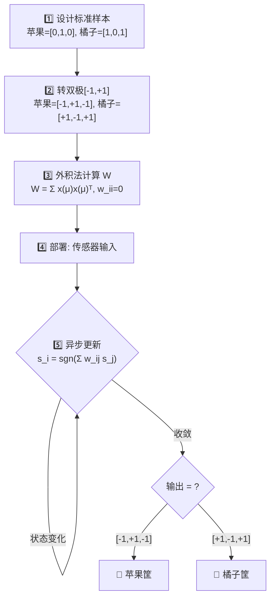

> ⚠️ **存储容量限制**：$n=3$ 个神经元理论上最多存储约 $0.15 \times 3 \approx 0.45$ 个独立模式。本例存储了 2 个（相反的）模式——它们恰好互为相反数，在 Hopfield 动力学中只算一个独立吸引子（另一半由对称性自动产生）。这已接近容量极限，再多存储一个新模式（如"香蕉"）会导致吸引子混淆。

---

### 8.5.2 Hopfield 求解组合优化问题（TSP）

1985 年，Hopfield 和 Tank 证明 Hopfield 网络可以求解**旅行商问题（TSP）**——这是神经网络应用于优化的开创性工作。

#### TSP 问题描述

> 给定 $N$ 个城市，找出一条经过每个城市恰好一次并回到起点的**最短路径**。

这是一个 **NP-hard 问题**——城市数量稍多，穷举所有路径就不可行。

#### Hopfield 求解 TSP 的五步流程

**第一步：换位矩阵编码**

用 $N \times N$ 矩阵表示路径。行 = 城市，列 = 访问顺序：

```
      第1站 第2站 第3站 第4站 第5站
城市A   0     0     0     1     0      ← 城市A在第4站访问
城市B   1     0     0     0     0      ← 城市B在第1站访问
城市C   0     1     0     0     0
城市D   0     0     1     0     0
城市E   0     0     0     0     1
```

约束条件：
- 每行恰好一个 1（每个城市访问一次）
- 每列恰好一个 1（每站恰好一个城市）

**第二步：神经元映射**

矩阵的 $N \times N$ 个元素各对应一个 Hopfield 神经元。$V_{xi}=1$ 表示"城市 $x$ 在第 $i$ 站被访问"。

**第三步：构造能量函数**

将 TSP 的约束和目标编码到能量函数中：

$$E = \frac{A}{2}\sum_x\sum_i\sum_{j\neq i}V_{xi}V_{xj} \quad \text{(每行最多一个1)}$$
$$+ \frac{B}{2}\sum_i\sum_x\sum_{y\neq x}V_{xi}V_{yi} \quad \text{(每列最多一个1)}$$
$$+ \frac{C}{2}\left(\sum_x\sum_i V_{xi} - N\right)^2 \quad \text{(恰好N个1)}$$
$$+ \frac{D}{2}\sum_x\sum_{y\neq x}\sum_i d_{xy}V_{xi}(V_{y,i+1}+V_{y,i-1}) \quad \text{(路径最短)}$$

- $A, B, C, D$：各约束项的权重（惩罚系数）
- $d_{xy}$：城市 $x$ 和 $y$ 之间的距离

> 💡 **能量函数设计的精妙之处**：前三个约束项强制解是合法路径（能量最低 = 满足所有约束），第四项让合法解中路径最短的那个具有最低能量。网络演化时，能量自然趋近于"最短合法路径"。

**第四步：推导权值与偏置**

将能量函数展开，与 Hopfield 标准能量函数 $E = -\frac{1}{2}\sum\sum w_{ij}V_iV_j - \sum I_i V_i$ 逐项比对，反推出 $w_{ij}$ 和 $\theta_i$。

**第五步：迭代至稳态**

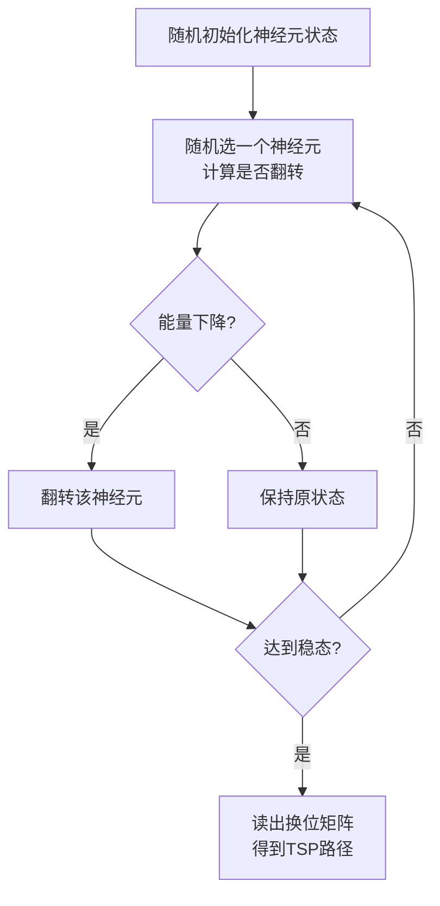

#### Hopfield 求解 TSP 的局限

| 问题 | 原因 |
|------|------|
| 解不稳定 | 每次运行可能收敛到不同路径 |
| 参数难调 | $A,B,C,D$ 四个权重的平衡极度敏感 |
| 大量局部极小 | 可能收敛到不满足约束的"非法解" |
| 规模受限 | 神经元数 = $N^2$，10个城市需要100个神经元 |

> 尽管 Hopfield-TSP 有这些局限，它开创了**神经网络求解优化问题**的范式，启发了后来的模拟退火、遗传算法等元启发式方法，并直接贡献于 2024 年诺贝尔物理学奖。

---

## 8.6 卷积神经网络（CNN）及其深度学习

> [必知] CNN 是计算机视觉领域革命性的架构，也是深度学习浪潮爆发的导火索。它的核心思想——**局部感受野、权值共享、池化**——比全连接网络高效几个数量级。

---

### 8.6.1 视觉机理与深度学习发展历程

#### 生物视觉的层次化处理

1959-1962 年，Hubel 和 Wiesel 的诺奖研究发现：

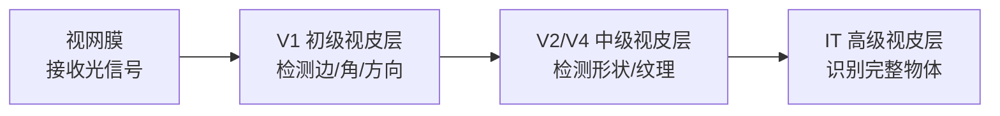

- **简单细胞**：对特定方向的边缘/线条敏感
- **复杂细胞**：对特定方向的运动敏感
- **超复杂细胞**：对特定长度/角度的特征敏感

> 🧠 CNN 的层级结构直接模仿了这个生物视觉通路——浅层卷积核检测边缘/纹理，中层检测形状/部件，深层检测完整物体。

#### CNN 发展脉络

| 时间 | 里程碑 | 贡献 |
|------|--------|------|
| 1980 | 福岛邦彦 **Neocognitron** | CNN 雏形：S 细胞（特征提取）+ C 细胞（容忍位移） |
| 1998 | LeCun **LeNet-5** | 第一个实用 CNN，商用手写支票识别 |
| 2006 | Hinton **逐层预训练** | 突破深层网络训练瓶颈，开启"深度学习"时代 |
| 2012 | Krizhevsky **AlexNet** | ImageNet 竞赛错误率暴降 10%+，引爆 CNN 浪潮 |
| 2014- | VGG, GoogLeNet, ResNet | 网络越来越深，性能越来越强 |

> 深度学习的核心优势：**多层自动特征提取**——不再需要人工设计特征（如 SIFT、HOG），网络自己学会"什么样的特征对分类有用"。

---

### 8.6.2 CNN 基础整体结构

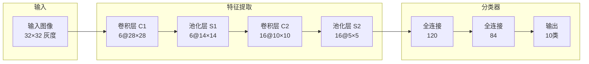

| 结构 | 作用 |
|------|------|
| **卷积层 (C)** | 用多个卷积核滑动扫描图像，提取局部特征（边缘、纹理等） |
| **池化层 (S)** | 下采样压缩特征图，降低计算量，增强平移不变性 |
| **全连接层 (FC)** | 将高层特征综合，输出最终分类结果 |

> CNN 本质上是 **"特征提取器（卷积+池化）+ 分类器（全连接）"** 的端到端组合。

---

### 8.6.3 卷积运算原理

#### 卷积核滑动计算

卷积核（Filter/Kernel）是一个小的权值矩阵，在输入图像上**滑动**，每到一个位置做**逐元素乘法+求和**：

```
输入图像 (5×5)          卷积核 (3×3)         输出特征图 (3×3)
┌─────────────────┐     ┌───────────┐    ┌───────────────┐
│  1  1  1  0  0  │     │  1  0  1  │    │    4  3  4    │
│  0  1  1  1  0  │  *  │  0  1  0  │  = │    2  4  3    │
│  0  0  1  1  1  │     │  1  0  1  │    │    2  3  4    │
│  0  0  1  1  0  │     └───────────┘    └───────────────┘
│  0  1  1  0  0  │
└─────────────────┘
```

**计算示例**（第一个位置，卷积核覆盖左上角 3×3）：

$$(1 \times 1) + (1 \times 0) + (1 \times 1) + (0 \times 0) + (1 \times 1) + (1 \times 0) + (0 \times 1) + (0 \times 0) + (1 \times 1) = 4$$

> 卷积核在图像上滑动，每个位置产生一个值，最终形成**特征图（Feature Map）**。特征图中高亮的位置表示"这里有卷积核要找的模式"。

#### 不同卷积核提取不同特征

| 卷积核 | 提取的特征 |
|--------|-----------|
| `[[-1,-1,-1],[2,2,2],[-1,-1,-1]]` | **水平边缘** |
| `[[-1,2,-1],[-1,2,-1],[-1,2,-1]]` | **垂直边缘** |
| `[[0,-1,0],[-1,5,-1],[0,-1,0]]` | **锐化** |
| `[[1/9]*9` | **模糊** |

> 一个 CNN 通常有几十到几百个卷积核，每个核学习检测一种不同的模式。

---

### 8.6.4 CNN 四大核心关键技术

#### 1. 局部感受野 (Local Receptive Field)

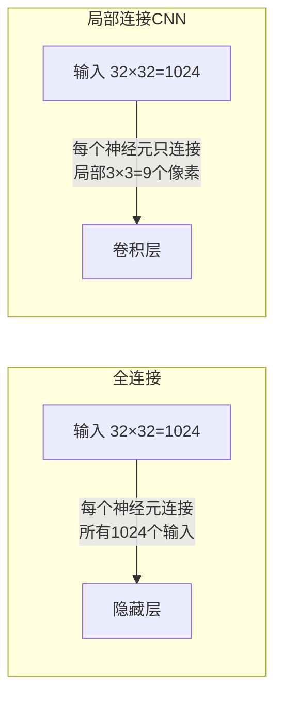

- 全连接：每个隐层神经元连接**所有**输入像素 → $1024 \times 1024 \approx 100\text{万}$ 参数
- 局部连接：每个卷积神经元只连接 **3×3=9** 个邻近像素 → 大幅减少参数

> 模仿生物视觉系统中每个神经元只对视野中一小块区域有反应的特性。

#### 2. 权值共享 (Weight Sharing)

同一个卷积核在图像的**所有位置共享同一组权值**。

```
位置(0,0): 卷积核 [1,0,1; 0,1,0; 1,0,1] 检测 →
位置(0,1): 同一个卷积核滑动过来继续检测 →
位置(0,2): 同一个卷积核继续滑动 → ...
```

- 无论图像多大，一个卷积核只有 $3 \times 3 = 9$ 个参数
- 同时赋予了**平移等变性**：同一个特征出现在图像任何位置都能被检测到

#### 3. 多卷积核 (Multiple Kernels)

每个卷积核检测一种特征，多个卷积核并行提取多种不同特征：

| 卷积核 1 | 检测水平边缘 |
| 卷积核 2 | 检测垂直边缘 |
| 卷积核 3 | 检测 45° 纹理 |
| ... | ... |
| 卷积核 K | 检测某种高级模式 |

> 浅层卷积核检测简单模式（边缘/颜色），深层卷积核组合浅层特征来检测复杂模式（眼睛/轮子/文字）。

#### 4. 池化 (Pooling)

```mermaid
flowchart LR
    subgraph 池化前4×4
        A["1 2 3 0<br>5 6 7 8<br>3 2 1 0<br>1 2 3 4"]
    end
    subgraph 最大池化2×2
        B["6 8<br>3 4"]
    end
    subgraph 平均池化2×2
        C["3.5 4.5<br>2.0 2.0"]
    end
    A -->|"最大池化"| B
    A -->|"平均池化"| C
```

| 池化类型 | 操作 | 效果 |
|---------|------|------|
| **最大池化 (Max Pooling)** | 取区域内最大值 | 保留最强特征信号 |
| **平均池化 (Avg Pooling)** | 取区域内平均值 | 平滑特征，保留背景信息 |

**池化的作用**：
- **降维**：$4\times4 \to 2\times2$，参数量减为 1/4
- **平移不变性**：特征在图像中稍微平移，池化后结果不变
- **防过拟合**：减少参数 → 降低过拟合风险

---

### 8.6.5 CNN 经典应用：LeNet-5 手写数字识别

Yann LeCun 于 1998 年提出的 LeNet-5 是第一个成功商用的 CNN（用于银行支票手写数字识别），定义了 CNN 的基本范式。

```
输入 32×32
  ↓
C1: 卷积层  6@28×28  (6个 5×5 卷积核)
  ↓
S2: 池化层  6@14×14  (2×2 平均池化)
  ↓
C3: 卷积层 16@10×10  (16个 5×5 卷积核)
  ↓
S4: 池化层 16@5×5    (2×2 平均池化)
  ↓
C5: 卷积层 120       (120个 5×5 卷积核，等价于全连接)
  ↓
F6: 全连接层 84
  ↓
输出: 10类 (0~9, RBF 输出层)
```

> LeNet-5 虽然只有 7 层，但它验证了 CNN 的核心设计理念：卷积提取特征 + 池化降维 + 全连接分类。这个范式沿用至今。

---

### 8.6.6 胶囊网络 CapsNet（补充）

Hinton 于 2017 年提出胶囊网络，旨在解决 CNN 的两个核心缺陷：

| CNN 缺陷 | CapsNet 改进 |
|---------|-------------|
| **视角鲁棒性差** | 胶囊输出**向量**（而不只是标量），编码了姿态、位置、大小等多维信息 |
| **池化丢失位置信息** | **动态路由**替代池化，保留精确的空间层级关系 |

> [选知] 胶囊网络的核心创新是用**一组神经元的向量输出（胶囊）**替代单个神经元的标量输出，每个胶囊的向量长度编码"实体存在概率"，方向编码"实体属性（姿态/位置/大小）"。虽然目前计算开销大、未大规模落地，但其理念深刻影响了可解释 AI 和几何深度学习方向。

---

## 8.7 生成对抗网络 GAN 及其应用

> [应知] GAN（Generative Adversarial Network）由 Ian Goodfellow 于 2014 年提出，是深度学习最令人兴奋的创意之一。Yann LeCun 称其为"过去十年机器学习中最有趣的想法"。

---

### 8.7.1 GAN 基本原理

#### 判别模型 vs 生成模型

| 类型 | 做什么 | 典型任务 |
|------|--------|---------|
| **判别模型** | 学习 $P(y \mid x)$：给定输入，判断类别 | 分类、识别（BP, CNN） |
| **生成模型** | 学习 $P(x)$：学习数据分布，生成新样本 | 图像生成、文本生成、数据增强 |

> 2024 年诺贝尔物理学奖得主 Hinton 和 Hopfield 的工作中就涉及生成模型（Boltzmann 机是早期生成模型）。GAN 将生成模型的训练提升到了新的高度。

#### 对抗训练思想

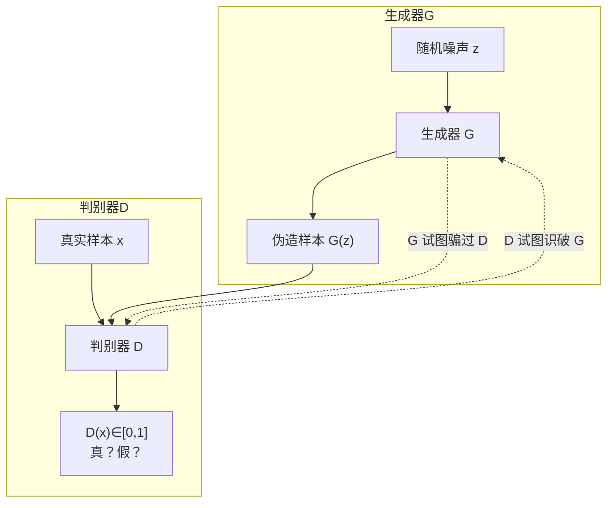

**两方博弈**：

| 角色 | 名称 | 目标 | 类比 |
|------|------|------|------|
| **生成器 G** | 伪造者 | 生成尽可能逼真的假样本，骗过判别器 | 造假钞的罪犯 |
| **判别器 D** | 警察 | 尽可能准确地区分真样本和假样本 | 验钞的警察 |

> 🎭 **博弈类比**：G 是造假钞的罪犯，D 是验钞警察。G 不断改进造假技术，D 不断提升鉴别能力。两者在对抗中共同进步——最终 G 造出的"假钞"和真钞完全无法区分。

#### GAN 的目标函数

$$\min_G \max_D V(D,G) = \mathbb{E}_{x\sim p_{\text{data}}}[\log D(x)] + \mathbb{E}_{z\sim p_z}[\log(1 - D(G(z)))]$$

- $D(x)$：判别器判断真实样本 $x$ 为真的概率（希望接近 1）
- $D(G(z))$：判别器判断生成样本为真的概率（G 希望接近 1，D 希望接近 0）
- **极小极大博弈**：G 最小化该目标，D 最大化该目标

---

### 8.7.2 交替训练流程

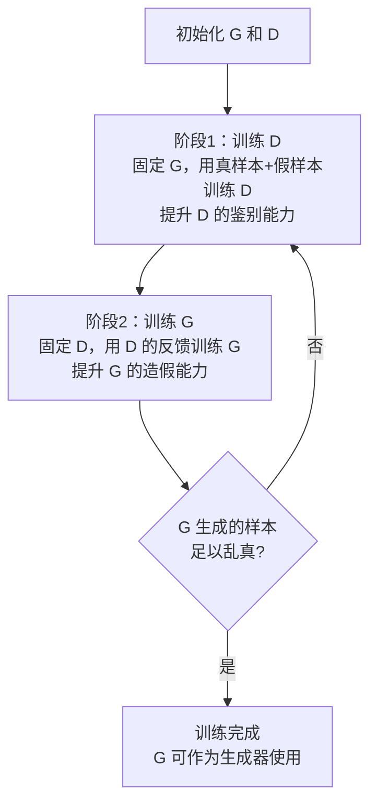

**关键问题**：

| 问题 | 表现 | 原因 |
|------|------|------|
| **震荡** | 损失函数来回波动不收敛 | G 和 D 你追我赶无法平衡 |
| **模式崩溃 (Mode Collapse)** | G 只能生成少数几类样本 | G 找到了能骗过 D 的"捷径"但失去了多样性 |
| **无意义生成** | 生成的图像模糊/非真实 | G 和 D 能力不平衡 |

> 后续变体（DCGAN、WGAN、StyleGAN 等）针对这些问题做了大量改进，使 GAN 的图像生成质量达到了惊人的水平。

---

### 8.7.3 GAN 在博弈领域的应用

**AlphaGo 系列**虽然不完全基于 GAN，但共享了"自我对抗"的核心思想：

- **AlphaGo**：监督学习 + 强化学习 + 蒙特卡洛树搜索
- **AlphaGo Zero**：完全抛弃人类棋谱，左右手互博自学——自己和自己下棋，赢了就强化当前策略
- **AlphaZero**：泛化到国际象棋和将棋，8 小时自学超越所有人类和程序冠军

> "自我博弈"思想：智能体不需要外部对手，自己和自己竞争就能不断进步。这是通用人工智能可能的一条路径。

---

### 8.7.4 图像处理应用

| 应用 | 说明 | 代表工作 |
|------|------|---------|
| **图像修复** | 填充缺失/损坏的图像区域 | Context Encoder |
| **风格迁移** | 将照片转换成某画家的风格 | CycleGAN |
| **图像翻译** | 白天→黑夜、素描→照片 | pix2pix |
| **超分辨率** | 将低分辨率图像放大为高清 | SRGAN |
| **AI 绘画** | 根据文字描述生成图像 | Stable Diffusion, DALL·E, Midjourney |

---

### 8.7.5 自然语言处理应用

| 应用 | 说明 |
|------|------|
| **AI 新闻生成** | 根据事实数据自动生成新闻稿件 |
| **古诗/对联生成** | 学习古诗语料后自动创作 |
| **文本转图像** | "一只戴着墨镜的猫在弹吉他" → 生成对应图像 |

---

### 8.7.6 视频生成应用

| 应用 | 说明 |
|------|------|
| **AI 换脸 (DeepFake)** | 将视频中的人脸替换为另一人的脸 |
| **虚拟主播** | 根据文本/语音自动生成播报视频 |
| **视频预测** | 给定前几帧，预测后续帧 |

---

### 8.7.7 医疗领域应用

| 应用 | 说明 | 影响 |
|------|------|------|
| **医学影像病灶识别** | GAN 增强稀有病灶样本用于训练 | 提升罕见病诊断率 |
| **新药分子生成** | 生成有期望药理性质的分子结构 | 加速新药研发 |
| **AlphaFold 蛋白质结构预测** | DeepMind 团队（2024 诺奖得主 Hassabis & Jumper） | **革命性突破**：从氨基酸序列直接预测蛋白质 3D 结构，精度达原子级别 |

> 🏆 AlphaFold 虽不是严格意义的 GAN，但同样体现了"深度学习解决科学问题"的范式。2024 年诺贝尔化学奖授予了这一成果。

---

## 本章知识体系总览

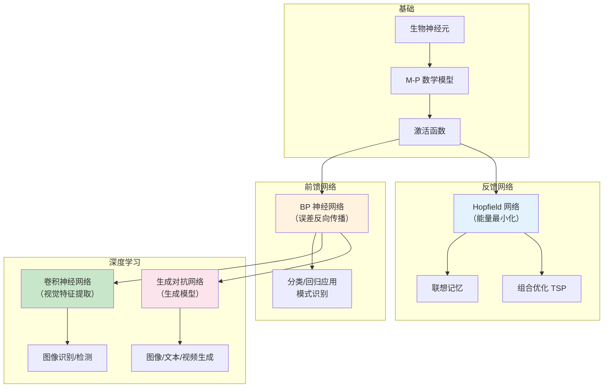

## 四种网络对比

| 维度 | BP 网络 | Hopfield 网络 | CNN | GAN |
|------|---------|-------------|-----|-----|
| **提出时间** | 1986 | 1982 | 1998 (LeNet) | 2014 |
| **拓扑** | 前馈分层 | 反馈全连接 | 前馈：卷积+池化 | 两个前馈网络对抗 |
| **学习方式** | 监督学习 | 无监督（设计权值） | 监督学习 | 无监督+对抗 |
| **核心机制** | 反向传播梯度 | 能量函数最小化 | 局部感受野+权值共享 | 生成器vs判别器博弈 |
| **主要应用** | 分类、回归 | 联想记忆、优化 | 图像识别、检测 | 图像/文本/视频生成 |
| **诺奖关联** | — | 2024 物理学奖 🏆 | — | — |

---

## 核心要点总结

> 1. **[必知] M-P 模型**：$o = f(\sum w_i x_i + b)$，是所有神经网络的计算原子单元
> 2. **[必知] BP 反向传播**：前向算输出 + 反向传梯度 + 梯度下降更新参数，是深度学习的训练基础
> 3. **[应知] Hopfield 网络**：反馈全连接 + 能量函数单调下降 → 自动收敛到稳定点（吸引子），用于联想记忆和组合优化
> 4. **[必知] CNN 四大技术**：局部感受野、权值共享、多卷积核、池化——比全连接高效几个数量级
> 5. **[应知] GAN 对抗训练**：生成器 vs 判别器的极小极大博弈，开创了生成模型的新范式

---

## 相关概念链接

- [神经网络](/articles/ai-ml/deep-learning/concepts/神经网络/) — 生物启发与 M-P 模型
- [激活函数](/articles/ai-ml/deep-learning/concepts/激活函数/) — 完整对比与选择指南
- [BP 神经网络与反向传播](/articles/ai-ml/deep-learning/concepts/BP神经网络与反向传播/) — ⭐ 完整数学推导 + 数值实例
- [链式法则](/articles/ai-ml/deep-learning/concepts/链式法则/) — 反向传播的数学基础
- [梯度下降](/articles/ai-ml/deep-learning/concepts/梯度下降/) — 优化算法详解
- [神经网络训练](/articles/ai-ml/deep-learning/concepts/神经网络训练/) — 训练循环概览
- [RBF 神经网络](/articles/ai-ml/deep-learning/concepts/RBF神经网络/) — 径向基函数网络
- [SOM 自组织映射](/articles/ai-ml/deep-learning/concepts/SOM自组织网络/) — 无监督竞争学习
