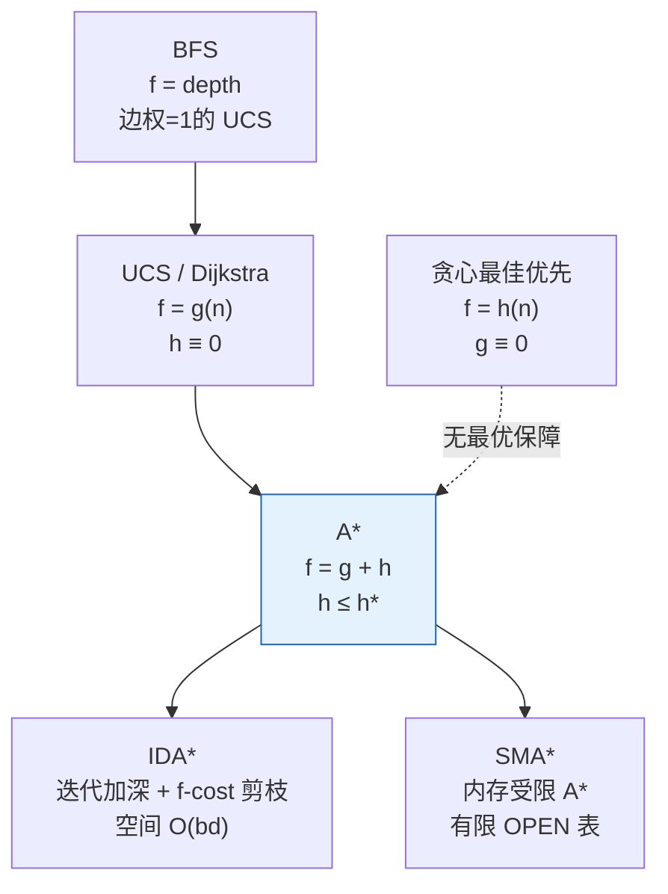

# A* 搜索算法

## 定义

A* 是一种**启发式图搜索算法**，在状态空间图上对每个节点 $n$ 定义估价函数 $f(n) = g(n) + h(n)$，按 $f$ 值从小到大拓展节点，并在 $h(n) \leq h^*(n)$ 的约束下保证找到全局最优解。

其中：

| 分量 | 含义 | 性质 |
|------|------|------|
| $g(n)$ | 起点 $S_0$ 到节点 $n$ 的**实际代价** | 精确已知，沿路径累积 |
| $h(n)$ | 节点 $n$ 到目标的**启发式估计代价** | 对 $h$ 的可采纳约束 $h \leq h^*$ 是 A* 区别于 A 算法的关键 |
| $f(n)$ | 经 $n$ 的最优路径的**总估计代价** | 用于 OPEN 表排序 |

## 核心要点

### 1. $f = g + h$ 的平衡设计

A* 同时考虑"已花代价"和"剩余估计"，两个极端退化情况：

| 设置 | 退化为 | 行为特征 |
|------|--------|---------|
| $h(n) \equiv 0$ | **Dijkstra/UCS**（边权为 1 时 = BFS） | 向外均匀扩散，保证最优但效率低 |
| $g(n) \equiv 0$ | **贪心最佳优先搜索**（GBFS） | 直奔目标但可能被局部最优欺骗 |

$$\text{A*} = \text{Dijkstra 的完备性} + \text{贪心搜索的效率}$$

### 2. 基本流程

```
1. S₀ 入 OPEN（优先级队列，按 f 排序）
2. while OPEN 非空:
3.   取出 f 最小的节点 n，移入 CLOSED
4.   if n == 目标: 回溯输出解 → 结束
5.   拓展 n，对每个子节点 n':
6.     g(n') = g(n) + c(n, n')
7.     f(n') = g(n') + h(n')
8.     if n' 不在 OPEN/CLOSED: 加入 OPEN
9.     elif 新 g(n') < 旧 g(n'): 更新 g/f/父指针
10. return 无解
```

### 3. 可采纳性（Admissibility）

> 若 $h(n) \leq h^*(n)$ 对所有节点成立，则 A* 必找到最优解。

$h^*(n)$ 是从 $n$ 到目标的真实最优代价。此条件保证 $f(n)$ 不会低于 $C^*$（最优解总代价），因此最优路径上的节点永远不会被"劣质节点"挤出 OPEN 表。

### 4. 单调性 / 一致性（Consistency）

> $h(n) \leq c(n, n') + h(n')$ 对任意节点 $n$ 及其后继 $n'$ 成立。

单调性的代数形式与三角形不等式同构：

```
              c(n,n')
        n ──────────────→ n'
         ↘              ↗
          ↘    h(n')   ↗
           ↘          ↗
        h(n) ↘      ↗
               ↘  ↗
              目标 G
```

**单调性的好处**：$f$ 沿路径非减，节点首次出 CLOSED 即定论，无需重复更新。

**关系**：单调性 ⇒ 可采纳性（单调性更强），反之不成立。

### 5. 信息性（Informedness）

在可采纳的前提下，$h(n)$ 越大（越接近 $h^*(n)$），A* 拓展的节点越少。

若 $h_2(n) \geq h_1(n)$ 对所有 $n$ 成立，称 $h_2$ 支配 $h_1$。$A^*_{h_2}$ 的搜索效率 $\geq$ $A^*_{h_1}$。

## 算法家族关系



## 时间复杂度与空间复杂度

| 指标 | 值 | 说明 |
|------|-----|------|
| 时间复杂度 | $O(b^d)$* | 最坏情况仍是指数级，取决于 $h$ 的质量 |
| 空间复杂度 | $O(b^d)$ | OPEN + CLOSED 表存储所有生成节点——瓶颈 |

> *若 $h$ 误差有界（$|h(n) - h^*(n)| \leq O(\log h^*(n))$），复杂度可降至多项式。但一般情况下，A* 在最坏情况下仍需指数级节点。

## 相关概念

- [第5章 搜索求解策略](/articles/ai-ml/introduction-to-ai/summaries/第5章-搜索求解策略/) — 本章完整笔记（含 BFS/DFS/A*/MCTS 对比）
- [贪心算法](/articles/algorithms/concepts/贪心算法/) — $g \equiv 0$ 时退化为贪心搜索
- 图论基础 — 状态空间图是搜索的底层结构
- [第4章 不确定性推理](/articles/ai-ml/introduction-to-ai/summaries/第4章-不确定性推理方法/) — 启发函数设计中的不确定性

## 常见题型

- 网格最短路径（A* vs Dijkstra 对比）
- 八数码 / 十五数码问题（设计可采纳启发函数）
- 地图导航（路网 + 欧氏距离作为 $h$）
- 游戏 AI 寻路（A* 的工程应用）
