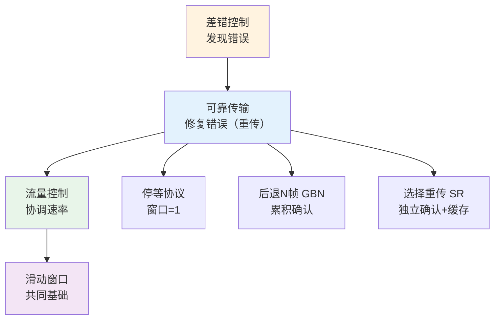
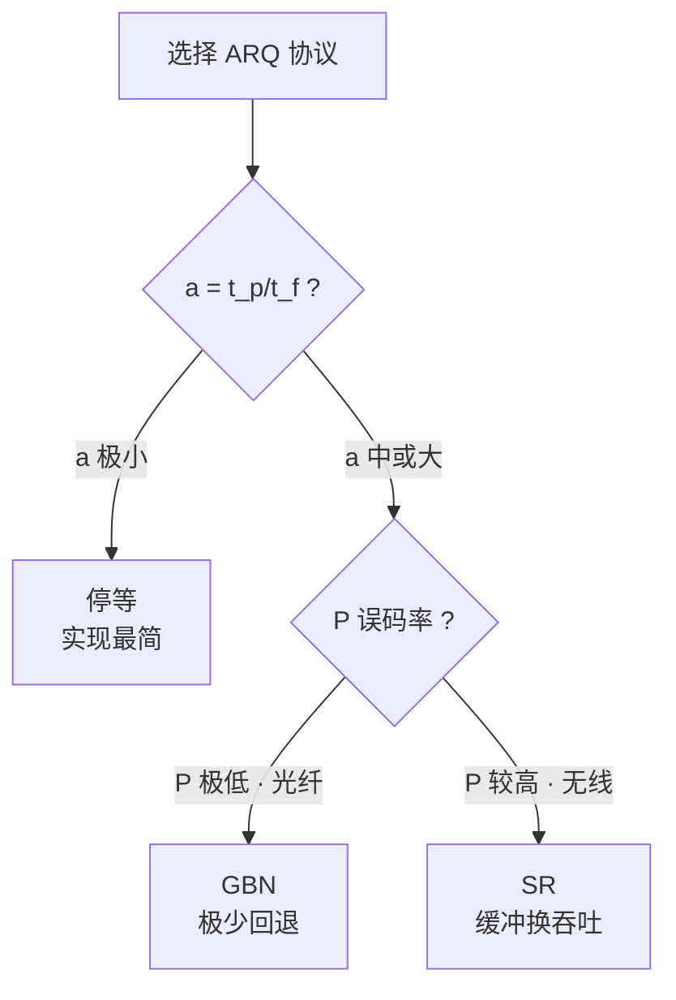

# ARQ 协议 — 可靠传输与流量控制

## 定义

在数据链路层中，**可靠传输**和**流量控制**密不可分——两者都依赖确认和重传机制，且滑动窗口是它们的共同基础。

> 核心关系：差错控制负责**发现**错误 → 可靠传输负责**修复**错误（通过重传）→ 流量控制负责**协调速率**（防止接收方被淹没）。

三个经典 **ARQ（自动重传请求）** 协议——停等、后退 N 帧、选择重传——在不同场景下平衡了**信道利用率**与**实现复杂度**。



---

## 4.1 停止等待协议（Stop-and-Wait）

最简 ARQ 协议：发送一帧后**必须停下来等 ACK**，收到确认后才发下一帧。

```
发送方:  [发帧0] ····等ACK···· [收ACK0] [发帧1] ····等ACK···· [收ACK1]
接收方:           [收帧0] [发ACK0]         [收帧1] [发ACK1]
```

### 滑动窗口

停等的窗口 = 1，等价于**没有真正的滑动窗口**——只有一帧在途，发送方状态要么"等确认"要么"正在发"。

### 帧编号

仅需 **1 bit 序号**（0/1 交替）。因为同时只有一帧在途，序号相同时必为重传帧，序号不同时必为新帧。

### 四种运行情形

| 情形 | 过程 | 处理 |
|------|------|------|
| 正常 | 发帧→收 ACK→发下一帧 | 无额外操作 |
| 帧丢失 | 接收方永远收不到 | 发送方超时重传 |
| ACK 丢失 | 发送方超时 | 重传帧→接收方收到重复帧→**重发 ACK 并丢弃重复帧** |
| 超时过早 | 延迟 ACK 到达但已超时 | 发送方重传→接收方收到重复帧（同上处理） |

### 信道利用率 — 停等的致命痛点

$$\text{利用率} = \frac{t_f}{t_f + 2t_p} = \frac{1}{1 + 2a},\quad a = \frac{t_p}{t_f}$$

**实例**：帧长 1000 bit，速率 1 Mbps，$t_p = 20$ ms（RTT = 40 ms）：
- 传输时间 $t_f = 1000 / 10^6 = \mathbf{1\ ms}$
- 利用率 $= 1 / (1 + 40) \approx \mathbf{2.4\%}$
- **97.6% 的时间信道在空等！**

> 停等协议实现极简、零缓冲区需求，但仅适合短帧 + 极低时延的场景（如极短距离的串口通信）。

---

## 4.2 后退 N 帧协议（Go-Back-N, GBN）

允许发送方**不等 ACK 连续发送最多 N 个帧**。一旦某帧出错或丢失，接收方丢弃该帧及之后所有帧，发送方超时后**从出错帧开始重传所有后续帧**。

### 滑动窗口

- **发送方**：维护大小为 $N$（$\le 2^n - 1$）的发送窗口，可连续发送窗口内所有帧
- **接收方**：窗口恒为 **1**，只接收**按序到达**的下一帧，乱序帧直接丢弃 ← 这是 GBN 与 SR 的核心分水岭

```
发送方:  [发0][发1][发2][发3]  ··等ACK··  [收ACK0]→窗口滑动→[发4]...
接收方:  收0→ACK0  收1→ACK1  [帧2丢失]  收3→丢弃!→发ACK1
                              ↑
                    帧2丢失, 帧3被丢弃(即使正确收到)

发送方帧2超时: 重传 [发2][发3][发4]...（从出错帧起全部重传）
```

### 确认机制 — 累积确认

**ACK n 表示「n 号及之前所有帧均已正确收到」**。两个特性：
- **ACK 丢失无妨**：后续更大序号的 ACK 自动覆盖（收到 ACK 5 即隐含确认了 0~5）
- **出错后 ACK 暂停**：帧 3 出错 → 即使帧 4 正确，接收方也只能重发 ACK 2（只接受按序帧）

### 帧编号与窗口上限

设序号 $n$ bit（范围 $0 \sim 2^n-1$），发送窗口最大为 $2^n - 1$。若窗口 $= 2^n$，当所有 ACK 丢失时新旧帧序号重叠，接收方无法区分。

### 接收窗口 = 1 的设计哲学

GBN 把复杂度全部推给发送方：接收方不缓存、不重排，只需一个变量（期望的下一个帧序号）。代价是浪费带宽——正确收到的乱序帧全部丢弃。在**低误码率链路**（如光纤）上极少回退，这个取舍是划算的。

> 代表协议：HDLC 的数据传输阶段默认使用 GBN。

---

## 4.3 选择重传协议（Selective Repeat, SR）

对 GBN 的改进：接收方**缓存乱序到达的帧**，只要求发送方重传**真正丢失或出错的那一帧**，避免大量冤枉重传。

### 滑动窗口

发送方和接收方维护**相同大小**的窗口（$\le 2^{n-1}$）。接收方接收窗口内**任意位置的帧**，不在窗口内的才丢弃。

```
发送方:  [发0][发1][发2][发3]
接收方:  收0→ACK0  收1→ACK1  [帧2丢失]  收3→缓存!→ACK3
                              ↑
                    帧2丢失, 帧3被缓存(不丢弃!)

发送方帧2超时: 仅重传 [发2]
接收方: 收到帧2 → 帧2+帧3 一起上交 → ACK3
```

### 确认机制 — 独立确认 + NAK

- **独立 ACK**：ACK n 仅表示帧 n 正确收到（不使用累积确认）
- **NAK（否定确认）**：接收方检测到帧出错时主动告知出错帧号，发送方无需等超时就立即重传

### 帧编号 — 窗口为何是 $2^{n-1}$

设序号 $n$ bit，SR 的发送窗口上限为 $2^{n-1}$（而非 GBN 的 $2^n-1$）。原因是收发双窗口会加倍消耗序号空间：

```
n=2 (序号 0,1,2,3), 窗口若设为 3 (> 2ⁿ⁻¹ = 2):

时刻1: 发[0,1,2]            接收窗口 [0,1,2]
时刻2: 收ACK0~2              发[3,0,1]      接收窗口 [3,0,1]
时刻3: ACK 全丢!             发方超时重传[0,1,2]
时刻4:                       接收方无法区分:
                             刚收到的是重传旧帧(0,1,2)还是下一轮新帧(0,1,2)?
                                           ↑ 序号完全相同, 歧义!
```

窗口 $\le 2^{n-1}$ 确保发送窗口和接收窗口覆盖的序号区间永不重叠。

### 接收方缓存与重排序

SR 的独特代价：需要缓冲区暂存乱序帧 + 重排序逻辑。但在**高误码率链路**（如 Wi-Fi）上避免大量冤枉重传的吞吐收益远超这点代价。

---

## 三种 ARQ 协议对比

| 维度 | 停等 | 后退 N 帧 (GBN) | 选择重传 (SR) |
|------|------|----------------|--------------|
| 发送窗口 | 1 | $\le 2^n-1$ | $\le 2^{n-1}$ |
| 接收窗口 | 1 | 1 | = 发送窗口 |
| 确认方式 | 单帧 ACK | 累积 ACK | 独立 ACK / NAK |
| 重传范围 | 1 帧 | 出错帧及之后所有 | 仅出错帧 |
| 帧序号位宽 | 1 bit | $n$ bit | $n$ bit |
| 接收方缓冲 | 无 | 无 | 需要 |
| 信道利用率 | 极低 | 中（低误码时高） | 高 |
| 实现复杂度 | 极简 | 中 | 较高 |
| 适用场景 | 短帧 + 极小 RTT | 低误码链路（光纤） | 高误码链路（Wi-Fi/4G/5G） |

---

## 信道利用率分析

设 $L$ = 帧长，$R$ = 速率，$t_f = L/R$ = 帧传输时间，$t_p$ = 单向传播时延。定义**归一化时延** $a = t_p / t_f$。

> $a$ 越大信道越"长"，停等协议越吃亏。管道填满条件：窗口 $N \ge 1 + 2a$。

以下统一取 $L = 1000$ bit，$R = 1$ Mbps，$t_p = 20$ ms，误帧率 $P = 0.01$。则 $t_f = 1$ ms，$a = 20$，$1 + 2a = 41$。

### 管道利用率示意

```mermaid
gantt
    title 管道利用率示意 (t_f=1, t_p=20)
    dateFormat X
    axisFormat %s

    section 停等(窗口=1)
    发帧0    :done, 0, 1
    信道空闲  :crit, 1, 41
    发帧1    :done, 41, 42
    信道空闲  :crit, 42, 82

    section GBN(窗口=7)
    发0~6    :done, 0, 7
    信道空闲  :crit, 7, 41
    发7~13   :done, 41, 48
    信道空闲  :crit, 48, 82

    section GBN/SR(窗口≥41)
    连续发送  :active, 0, 82
```



### 公式速查

| 协议 | 通用公式 | 窗口够大 $(N \ge 1+2a)$ |
|------|---------|------------------------|
| 停等 | $U = \dfrac{1-P}{1+2a}$ | 同左 |
| GBN | $U = \dfrac{N(1-P)}{(1+2a)(1-P+N \cdot P)}$ | $U = \dfrac{1-P}{1+2a \cdot P}$ |
| SR | $U = \dfrac{N(1-P)}{1+2a}$ | $U = 1-P$ |

### 数值对比

| 协议 | $N=7,P=0.01$ | $N=127,P=0.01$ | $P=0.1,N=127$ | 瓶颈 |
|------|:---:|:---:|:---:|------|
| 停等 | $2.4\%$ | $2.4\%$ | $2.2\%$ | RTT |
| GBN | $15.9\%$ | $70.7\%$ | $30.0\%$ | 回退重传 |
| SR | $16.9\%$ | $\mathbf{99.0\%}$ | $\mathbf{90.0\%}$ | 仅帧损 |

- 窗口小时 GBN 与 SR 差距不大，都被窗口限流
- 窗口大 + 误码低（光纤）：GBN $70\%$ vs SR $99\%$，GBN 实现更简单
- 窗口大 + 误码高（无线）：GBN 崩塌至 $30\%$，SR 仍 $90\%$ ← Wi-Fi/4G/5G 采用类 SR 机制的原因



## 相关概念

- [差错控制](/articles/cs-fundamentals/computer-networks/concepts/差错控制/) — ARQ 依赖检错编码（CRC）发现帧错误
- [封装成帧](/articles/cs-fundamentals/computer-networks/concepts/封装成帧/) — ARQ 操作的基本单元是帧
- [介质访问控制](/articles/cs-fundamentals/computer-networks/concepts/介质访问控制/) — 广播信道中的竞争与协调
- [第3章：数据链路层](/articles/cs-fundamentals/computer-networks/notes/第3章-数据链路层/) — 课堂笔记入口
