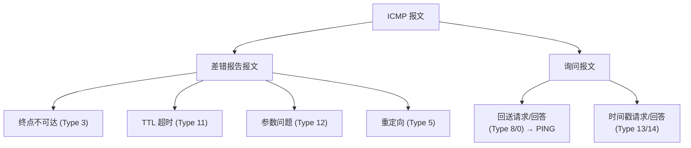
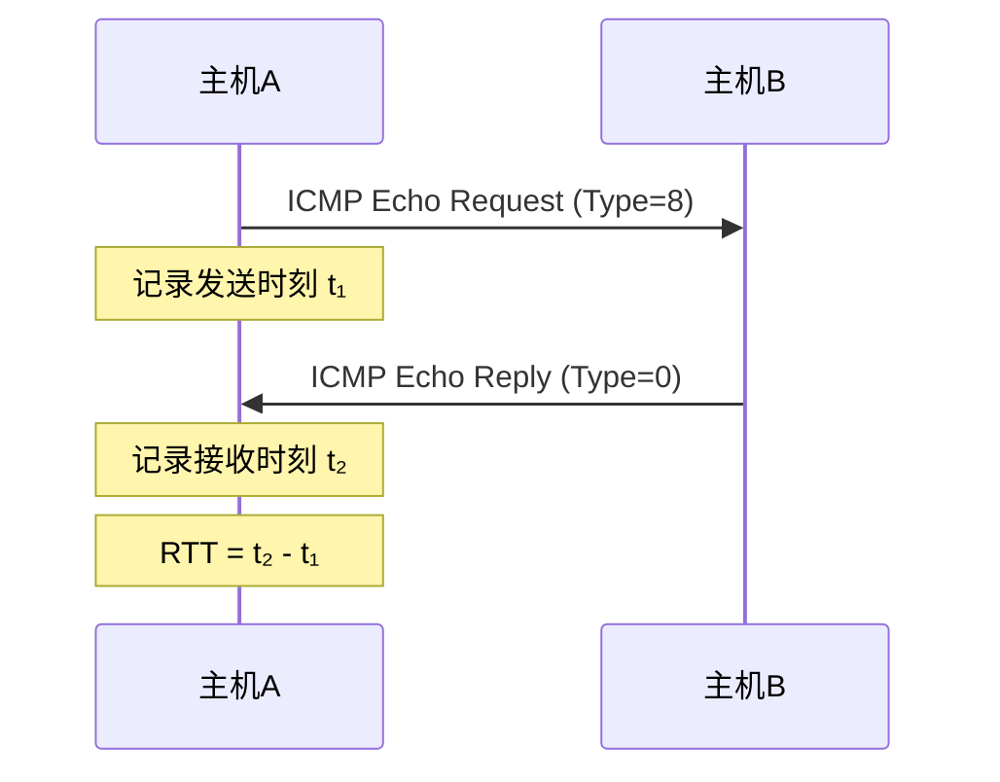

# ICMP 与网络诊断

## 定义

**ICMP（Internet Control Message Protocol）** 是 IP 的辅助协议——让网络中的路由器和主机能**报告错误**和**交换控制信息**。ICMP 报文封装在 IP 数据报中（协议号 = 1），但其本身不被看作高层协议（它是网络层的一部分）。

---

## 一、ICMP 报文分类



### 常用差错报告报文

| 类型 | 关键代码 | 含义 | 触发场景 |
|------|---------|------|---------|
| **3** | 0 | 网络不可达 | 路由表中无匹配且无默认路由 |
| **3** | 1 | 主机不可达 | 到达目的网络但 ARP 找不到主机 |
| **3** | 3 | 端口不可达 | 主机收到但无进程监听该端口（UDP） |
| **3** | 4 | 需分片但 DF 置位 | PMTUD 发现过程 |
| **11** | 0 | TTL 超时 | TTL 减到 0 → **Traceroute 的核心机制** |
| **5** | 0 | 重定向 | 有更好的下一跳路由器 |

> ⚠️ 对以下情况**不**发送差错报告：ICMP 差错报文自身出错、多播/广播地址、分片的非首片——避免错误报告引发雪崩。

---

## 二、PING — 连通性测试

PING 使用 ICMP **回送请求（Type 8）** 和**回送回答（Type 0）**。这是最常用的网络诊断工具。



### 典型诊断流程

```
ping 8.8.8.8
  ✓ 收到 Reply → 网络通 + 目标可达
  ✗ Request timed out → 中间断或目标不可达
  ✗ Destination Host Unreachable → 最后一跳没找到目标
```

### 常见选项

| 选项 | 作用 |
|------|------|
| `-n <count>` | 发送 count 个请求（Win） / `-c <count>`（Linux） |
| `-l <size>` | 数据部分大小（Win），默认 32 字节 |
| `-f` | 设置 DF=1（禁止分片，用于 PMTUD） |
| `-i <ttl>` | 设置 TTL 值 |

---

## 三、Traceroute — 路由跟踪

Traceroute 探测从源到目的经过的**每一跳路由器**。

**原理**：利用 TTL 字段和 ICMP "TTL 超时"报文，逐跳探测。

```
依次发送 TTL=1, 2, 3, ... 的探测包:

TTL=1: 第1跳路由器收到 → TTL减为0 → 丢弃
       → 第1跳回 ICMP "TTL超时" → 源获知第1跳 IP ★

TTL=2: 第1跳转发(TTL→1) → 第2跳收到 → TTL减为0 → 丢弃
       → 第2跳回 ICMP "TTL超时" → 源获知第2跳 IP ★

TTL=3: 第1跳→第2跳→第3跳(TTL→0) → 获知第3跳 IP
  ...

TTL=N: 到达目的地 → 目的回 "端口不可达" → 探测结束 ✓
```

### 典型输出解读

```
tracert 8.8.8.8

  1    <1 ms    <1 ms    <1 ms  192.168.1.1        ← 家庭网关
  2     5 ms     4 ms     5 ms  10.0.0.1           ← ISP 接入路由器
  3    12 ms    11 ms    12 ms  203.0.113.1         ← ISP 骨干
  4    30 ms    28 ms    29 ms  8.8.8.8            ← 目的地！
```

每跳发 3 个探测包（windows），显示每次 RTT。`*` 表示该跳未在超时内回复（防火墙过滤或真实丢包）。连续出现 `*` 通常意味路径中断。

> Windows 用 `tracert`（ICMP 探测），Linux 用 `traceroute`（默认 UDP 探测，端口从 33434 开始）。

## 相关概念

- [IPv4 首部格式](/articles/cs-fundamentals/computer-networks/concepts/IPv4数据报首部格式/) — TTL 字段和协议号字段的位置
- [IP 数据报转发](/articles/cs-fundamentals/computer-networks/concepts/IP数据报的发送与转发/) — ICMP 差错报告在转发失败时的作用
- [路由选择协议](/articles/cs-fundamentals/computer-networks/concepts/路由选择协议/) — Traceroute 展示的就是路由协议决定的路径
- [第4章：网络层](/articles/cs-fundamentals/computer-networks/notes/第4章-网络层/) — 课堂笔记入口
