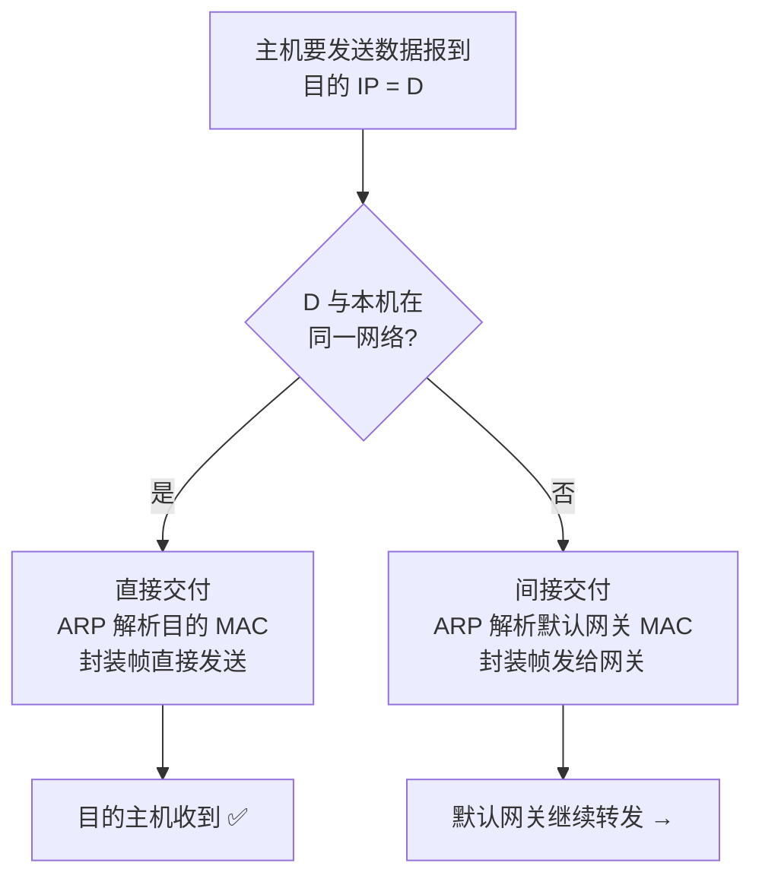

# IP 数据报的发送与转发

## 定义

网络层的核心任务是**将 IP 数据报从源主机送到目的主机**。这个过程分为两个层面：主机负责**判断走哪条路**（直接交付还是间接交付），路由器负责**逐跳查表转发**。

---

## 一、主机发送逻辑：直接交付 vs 间接交付



### 判断方法

用本机的子网掩码分别 AND 目的 IP 和本机 IP，比较网络地址是否相同：

```
本机: 192.168.1.10/24，发给 192.168.1.20:
  192.168.1.10 AND 255.255.255.0 = 192.168.1.0
  192.168.1.20 AND 255.255.255.0 = 192.168.1.0
  → 相同！直接交付（不经过路由器）

本机: 192.168.1.10/24，发给 8.8.8.8:
  192.168.1.10 AND 255.255.255.0 = 192.168.1.0
  8.8.8.8     AND 255.255.255.0 = 8.8.8.0
  → 不同！间接交付，发给默认网关
```

### 直接 vs 间接对比

| | 直接交付 | 间接交付 |
|------|---------|---------|
| 何时 | 同网段 | 不同网段 |
| 目的 MAC | 目的主机自身的 MAC | **下一跳路由器的 MAC** |
| IP 地址 | 源和目的 IP 始终不变 | 源和目的 IP 始终不变 |

> ⚠️ **关键**：IP 数据报的源 IP 和目的 IP **端到端不变**，但封装帧的 MAC 地址**每一跳都变**。网络层管"最终到哪"，链路层管"这一跳到哪"。

---

## 二、路由器转发流程

```
1. 从收到的帧中提取 IP 数据报，读目的 IP = D
2. 在路由表中逐条匹配（最长前缀匹配）
3. 若匹配到 → 从该条路由指定的接口转发
4. 若未匹配:
     有默认路由 0.0.0.0/0 → 走默认路由
     无默认路由 → 丢弃 + 向源发 ICMP "终点不可达"
```

### 典型路由表

| 目的网络 | 子网掩码 | 下一跳 | 出接口 |
|---------|---------|--------|--------|
| `192.168.1.0` | `255.255.255.0` | —（直连） | eth0 |
| `10.0.0.0` | `255.0.0.0` | `192.168.1.1` | eth0 |
| `0.0.0.0` | `0.0.0.0` | `192.168.1.254` | eth0 |

- 第一条：`192.168.1.0/24` 直连在 eth0，不需要下一跳
- 第二条：去 `10.0.0.0/8` → 发给 `192.168.1.1`
- 第三条：**默认路由** ——所有不匹配的都走 `192.168.1.254`

---

## 三、静态路由配置

**静态路由**是管理员手动配置的路由条目：

```
ip route <目的网络> <子网掩码> <下一跳IP | 出接口>
```

**三种典型配置**：

| 类型 | 命令 | 含义 |
|------|------|------|
| 普通静态 | `ip route 192.168.2.0 255.255.255.0 10.0.0.2` | 去 `192.168.2.0/24` 走 `10.0.0.2` |
| 默认路由 | `ip route 0.0.0.0 0.0.0.0 203.0.113.1` | 不知道往哪走的全发 ISP |
| 特定主机 | `ip route 10.0.0.5 255.255.255.255 192.168.1.1` | 为单台主机专配一条 |

---

## 四、路由环路问题

三种常见成因：

### 1. 配置错误环路

```
R1: 去 192.168.3.0 → 下一跳 R2
R2: 去 192.168.3.0 → 下一跳 R1
      ↑ 互相指向对方！分组反复横跳直到 TTL=0
```

### 2. 路由聚合引入环路

R1 将 `192.168.0.0/24 ~ 192.168.3.0/24` 聚合为 `192.168.0.0/22` 通告给 R2。但若 `192.168.3.0/24` 在 R1 上实际不存在：

```
R1 收到去 192.168.3.5 的分组 → 默认路由指向 R2
R2 收到去 192.168.3.5 的分组 → 匹配聚合路由 192.168.0.0/22 → 指向 R1
→ 环路！
```

### 3. 网络故障引发环路

R1 → R2 → R3 到达目标。R2↔R3 链路中断后，R2 路由表未及时更新，仍向已断链路转发。

### 避免措施

| 措施 | 原理 |
|------|------|
| **TTL 字段** | 每跳减 1，为 0 时丢弃——防止永久循环 |
| **黑洞路由** | 为聚合中不存在的子网配置 null 路由（直接丢弃） |
| **动态路由协议** | 自动感知拓扑变化，消除人工配置错误 |

## 相关概念

- [IPv4 地址与编址](/articles/cs-fundamentals/computer-networks/concepts/IPv4地址与编址/) — 转发判断的基础（网络地址计算）
- [路由选择协议](/articles/cs-fundamentals/computer-networks/concepts/路由选择协议/) — 动态路由自动维护路由表
- [IPv4 首部格式](/articles/cs-fundamentals/computer-networks/concepts/IPv4数据报首部格式/) — TTL 字段的位置与作用
- [第4章：网络层](/articles/cs-fundamentals/computer-networks/notes/第4章-网络层/) — 课堂笔记入口
