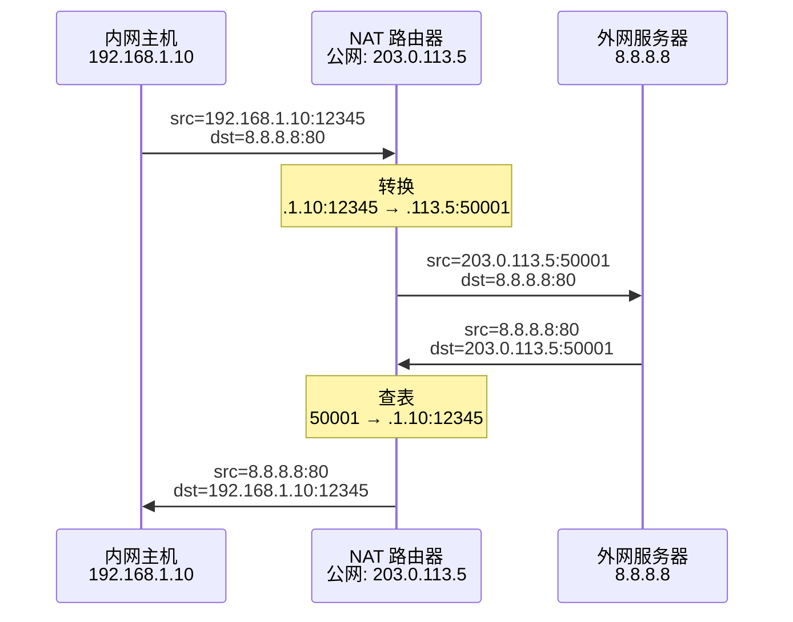

# VPN 与 NAT

## 概述

IPv4 地址枯竭催生了两种关键技术：**VPN** 利用公网建立私有安全通道，**NAT** 让多台主机共享一个公网 IP。两者都涉及对 IP 地址的"包装"——VPN 加密封装，NAT 替换转换。

---

## 一、虚拟专用网 VPN

### 隧道技术原理

VPN 将原始 IP 数据报（内层，可含私有地址）整体加密，作为**载荷**封装在外层 IP 数据报中。内层端到端不变，外层在公网上路由。

```
┌──────────────────────────────────────┐
│ 外层 IP 头: src=公网A, dst=公网B      │ ← 公网路由依据
├──────────────────────────────────────┤
│       加密载荷 = 原始 IP 数据报         │ ← 内层可能含私有地址
│       (整个原始数据报被加密)            │
└──────────────────────────────────────┘
```

### 典型部署

```
公司北京 ───────── 因特网 ───────── 公司上海
 192.168.1.0/24                   192.168.2.0/24
      │                                │
  VPN 网关 ←══ 加密隧道 ══→ VPN 网关
 (公网 IP)                     (公网 IP)
```

北京 `192.168.1.5` 发给上海 `192.168.2.10`：
- **内层**：src=`192.168.1.5`, dst=`192.168.2.10`（原始，私有地址）
- **外层**：src=北京公网 IP, dst=上海公网 IP，内层整体加密

### VPN 类型

| 类型 | 场景 | 说明 |
|------|------|------|
| **内联网 VPN** | 分支互联 | 同一机构不同办公点互联 |
| **外联网 VPN** | 合作方互联 | 公司与供应商/客户安全对接 |
| **远程接入 VPN** | 移动办公 | 员工通过 VPN 客户端接入公司内网 |

---

## 二、网络地址转换 NAT

NAT 在内网出口路由器上将**私有地址临时转换为公网地址**，使内网主机能访问公网。

### NAPT —— 端口级转换

**NAPT（网络地址与端口号转换）** 是最常用的 NAT 形式——不仅转换 IP 地址，还转换**端口号**。多台内网主机可以共享**同一个**公网 IP，通过不同端口号区分。



### NAT 转换表示例

| 内网 (IP:Port) | 公网 (IP:Port) | 外部目的 |
|---------------|---------------|---------|
| `192.168.1.10:12345` | `203.0.113.5:50001` | `8.8.8.8:80` |
| `192.168.1.11:54321` | `203.0.113.5:50002` | `8.8.8.8:443` |
| `192.168.1.10:12346` | `203.0.113.5:50003` | `1.1.1.1:80` |

> 一个公网 IP 通过 NAPT 可支持约 6.5 万个并发连接（65535 - 预留低端口）。你家路由器就这么干的——所有设备共用一个公网 IP。

### NAT 的优缺点

| 优点 | 缺点 |
|------|------|
| 极大缓解 IPv4 地址短缺 | 破坏 IP"端到端"原则——公网无法主动向内网发起连接 |
| 内网拓扑隐藏，一定安全性 | 部分应用协议（FTP、SIP）需 ALG 才能穿透 NAT |
| 内网地址可自主分配 | NAT 路由器成单点故障和性能瓶颈 |
| 换 ISP 无需重新编址 | 与 IPsec 等端到端安全协议有兼容问题 |

### NAT 穿越

P2P 应用（如视频通话、BT）需要内网主机之间直连，NAT 会阻碍这种连接。常见穿越方案包括 **STUN**（获取公网映射地址）、**TURN**（中继转发）、**ICE**（综合最优方案）、**UPnP**（自动端口映射）。

## 相关概念

- [IPv4 地址与编址](/articles/cs-fundamentals/computer-networks/concepts/IPv4地址与编址/) — 私有地址范围（RFC 1918）的定义
- [IP 数据报转发](/articles/cs-fundamentals/computer-networks/concepts/IP数据报的发送与转发/) — NAT 替换前后地址变化
- [第4章：网络层](/articles/cs-fundamentals/computer-networks/notes/第4章-网络层/) — 课堂笔记入口
