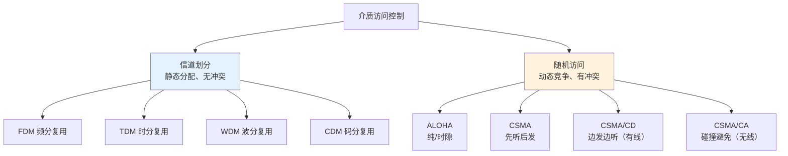
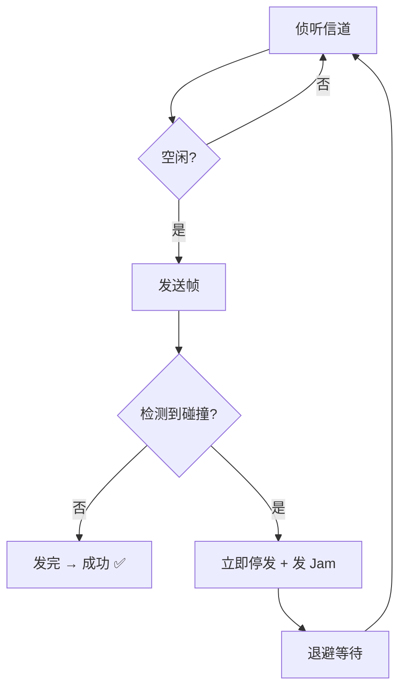
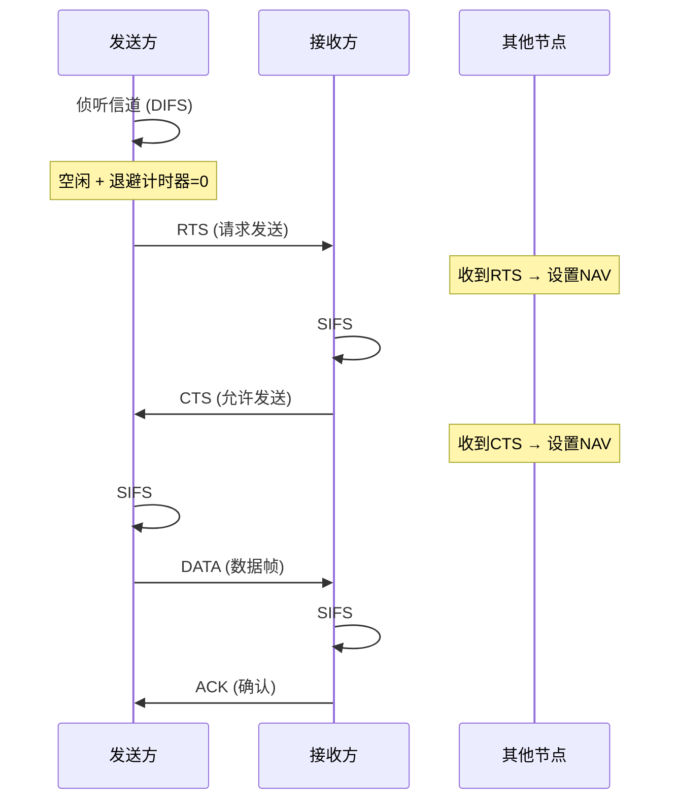

# 介质访问控制

## 定义

当多个节点**共享同一条广播信道**时，**介质访问控制（MAC, Medium Access Control）** 协调各节点对信道的使用，避免冲突。

> MAC 子层是数据链路层的下半层，仅在**广播式链路**中需要；**点对点链路**（如 PPP）不需要。

## 两大类方法



---

## 5.1 信道划分协议

信道划分的核心思路：将共享信道按**时间、频率、波长或编码**静态划分为多个互不干扰的子信道，每个用户独占一个子信道。优点是无冲突；缺点是资源分配僵化。

### 频分复用（FDM）

将信道总带宽划分为多个**互不重叠的频段**，每个用户独占一个频段同时传输。子频段之间留有**保护频带**防止串扰。

```
频率
↑
│  用户1  │  用户2  │  用户3  │  用户4  │
│  ████   │  ████   │  ████   │  ████   │
├─────────┼─────────┼─────────┼─────────┤→ 时间
```

| 优点 | 缺点 | 典型应用 |
|------|------|---------|
| 各路同时传输，无需同步 | 保护频带浪费频谱 | FM 广播（88~108 MHz） |
| 实现成熟（模拟技术即可） | 固定分配，空闲也占着 | 早期模拟电话长途干线 |

### 时分复用（TDM）

将时间划分为**固定长度的帧**，每帧分为**固定数量的时隙**，每个用户占用每帧中固定的时隙。

```
     帧 k-1           帧 k              帧 k+1
┌──┬──┬──┬──┐  ┌──┬──┬──┬──┐  ┌──┬──┬──┬──┐
│A1│B1│C1│D1│  │A2│B2│C2│D2│  │A3│B3│C3│D3│  ...
└──┴──┴──┴──┘  └──┴──┴──┴──┘  └──┴──┴──┴──┘
  A  B  C  D    A  B  C  D     A  B  C  D
```

| 优点 | 缺点 | 典型应用 |
|------|------|---------|
| 无冲突、公平、实现简单 | 空闲时隙浪费 | **T1 线路**：24 时隙/帧，1.544 Mbps |
| 适合恒定速率业务 | 需要全网时钟同步 | **E1 线路**：32 时隙/帧，2.048 Mbps |

### 统计时分复用（STDM）

TDM 的改进：**按需分配时隙**——只在用户有数据时才分配，需要额外携带**地址标识**。

```
TDM:  [A│B│ │D│A│B│ │D]   ← C 空闲, 时隙浪费
STDM: [A│B│D│A│B│D│A│B]   ← C 的时隙分给他人
            ↑
       需要地址标识
```

| 优点 | 缺点 | 典型应用 |
|------|------|---------|
| 信道利用率显著提高 | 需要地址开销 | ATM 网络 |
| 可支持比 TDM 更多的用户 | 排队时延、突发丢帧 | 现代分组交换网络 |

### 波分复用（WDM）

FDM 在光纤上的光学版本：将不同**波长（颜色）**的光复用到同一根光纤中。

```
λ1 ──→┐                              ┌──→ λ1
λ2 ──→┼──→ 合波器 ═══光纤═══ 分波器 ──┼──→ λ2
  ⋮   │                              │   ⋮
λn ──→┘                              └──→ λn
```

| 类型 | 波长间隔 | 通道数 | 适用 |
|------|---------|--------|------|
| 粗波分（CWDM） | 20 nm | 8~18 | 城域网 |
| 密集波分（DWDM） | 0.8 / 0.4 nm | 80~160 | 长途骨干 |

> 一条 DWDM 光纤承载 80 路波长，每路 100 Gbps → 单纤总容量 **8 Tbps**。全球海底光缆骨干均依赖 DWDM。

### 码分复用（CDM）

所有用户**同时使用相同频率**，通过给每个用户分配唯一的**正交码**（芯片序列）来区分。接收方用该用户的码与混合信号做**内积（相关运算）**，提取出该用户的原始数据。

```
发送端:
  用户A 数据1 → × 码A(+1-1+1-1) → 信号A
  用户B 数据0 → × 码B(+1+1-1-1) → 信号B
  ──────────────────────────────
         叠加 → 混合信号（在空中叠加传输）

接收端（用户A视角）:
  混合信号 · 码A → 恢复数据1  ← 码B的信号被"消除"了
```

**正交性要求** — 以 Walsh 码为例：

$$\text{码A: } [+1,-1,+1,-1],\quad \text{码B: } [+1,+1,-1,-1]$$

$$\text{码A}\cdot\text{码B} = (+1)(+1)+(-1)(+1)+(+1)(-1)+(-1)(-1) = 1-1-1+1 = 0\ \checkmark$$

| 优点 | 缺点 | 典型应用 |
|------|------|---------|
| 所有用户同时同频，软容量 | **远近效应**，需严格功率控制 | IS-95 / CDMA2000 / WCDMA（3G） |
| 抗窄带干扰和窃听 | 频谱效率低于 OFDM | GPS（PRN 码区分卫星） |
| 无需全网精确时钟同步 | 正交码数量有限 | — |

### 四种信道划分对比

| 维度 | FDM | TDM | WDM | CDM |
|------|-----|-----|-----|-----|
| 划分依据 | 频率 | 时间 | 波长（光频） | 编码 |
| 用户同时发送？ | 是 | 否（轮流） | 是 | 是 |
| 同步要求 | 低 | 高 | 低 | 低 |
| 空闲浪费 | 是 | 是 | 是 | 否（软容量） |
| 典型应用 | FM 广播 | T1/E1 电话干线 | 海底光缆骨干 | 3G CDMA、GPS |

---

## 5.2 随机访问协议

与信道划分静态分配不同，随机访问的核心思想：**各节点自主竞争信道，发生冲突后按规则重传**。适合突发性、低负载流量。

### ALOHA 协议

最早的随机访问协议（夏威夷大学，1970）：**想发就发**。

| | 纯 ALOHA | 时隙 ALOHA |
|------|----------|-----------|
| 发送时机 | 任何时刻 | 仅时隙起点 |
| 冲突窗口 | 2 倍帧时 | 1 倍帧时 |
| 最大吞吐率 | $\frac{1}{2e} \approx \mathbf{18.4\%}$ | $\frac{1}{e} \approx \mathbf{36.8\%}$ |
| 同步要求 | 无 | 全网时钟同步 |

```
纯ALOHA:         冲突窗口 = 2 帧时
  t0 发送帧A   |←──冲突窗口──→|
  ├────────────┼──────────────┤
               ↑ 若B在此区间发 → 碰撞!

时隙ALOHA:       冲突窗口 = 1 帧时
 槽0  槽1  槽2  槽3
  │    │    │    │
  ├────┼────┼────┤  B只能在槽边界发送
  ↑              ↑
  A发            A与B若同槽→碰撞
```

> 吞吐率极低，但**极简**——无需任何协调和载波侦听。代表早期卫星通信。

### CSMA 协议（Carrier Sense Multiple Access）

CSMA 在 ALOHA 基础上加了一条关键规则：**先听后发**——发送前先检测信道是否空闲。

**三种持续策略：**

| 策略 | 检测到信道忙时的行为 | 特点 |
|------|-------------------|------|
| **1-坚持** | 持续监听，一空闲**立即**发送 | 最贪心，碰撞概率高 |
| **非坚持** | 不等，随机退避后再监听 | 减少碰撞但增加延迟 |
| **p-坚持** | 空闲后以概率 $p$ 发送，$1-p$ 推迟 | 折中（仅用于时隙信道） |

```
1-坚持 CSMA:
  监听到忙 → 持续监听 → 一空闲立即发
  问题: 多节点同时在等 → 空闲瞬间一起发 → 碰撞!

非坚持 CSMA:
  监听到忙 → 随机退避 → 再监听
  问题: 可能信道已空却还在退避 → 浪费信道

p-坚持 CSMA:
  监听到空 → 以概率p发送, 概率1-p推迟
  减少"同时扑上去"的碰撞
```

> CSMA 仍无法完全避免碰撞——**传播时延**导致两个节点可能同时检测到信道空闲后发送。

### CSMA/CD — 碰撞检测（有线以太网）

> 载波监听 多址接入 / 碰撞检测   ：CSMA/CD协议
 
 - 多址接入MA：多个站连接在一条总线上，竞争使用总线
 - 载波监听CS：每一个站点在发送帧前都需要先检测总线上是否有其他站点发送帧
	 - 若总线空闲 96 比特时间 则发送这个帧
	 - 若总线忙：继续检测，等待总线转为空闲 96 比特时间，然后发送这个帧
 - 碰撞检测：每一个发送帧的站，边发送帧边检测碰撞
	 - 一旦总线出现碰撞，立即停止发送，随即等待一段时间后继续重传
 
在 CSMA 基础上增加**边发边听**：发送过程中持续检测碰撞，一旦检测到立即**停止发送**，发**冲突加强信号（Jam）**，然后按**截断二进制指数退避**等待重传。



### 最小帧长 — 为什么是 64 字节？

> 🍜 **吃面类比**：你和一个朋友各自用吸管从同一碗面里吸面条。你吸了一大口，放下筷子，刚想说"我吃完了"——这时候朋友那边吸上来的面条才撞到你嘴里，你才发现刚才咬断的那口其实和朋友的面条缠在一起了。可你已经宣布吃完了，这口坏面就被当成了好面。
>
> 所以规矩是：**每个人吸面的时间必须 ≥ 面从碗这边传到那边再传回来的时间**。这样在你还在吸的时候，如果朋友的面条撞过来，你能当场感觉到，立刻吐掉重吸。

CSMA/CD 的碰撞检测和吃面是一个道理：**帧必须够长，长到发送方在发完之前能听到碰撞回来的声音**。

#### 最坏情况下的碰撞

```
A ──────────── 最长 2500m ──────────── B

时刻 0:     A ████████████▌（开始发帧）
                           └→ 信号以 ~2×10⁸ m/s 向右传播

时刻 τ-ε:   信号差一丁点到 B
           B 检测信道：安静 ✅ → "我也可以发！"

时刻 τ:     B ████████▌（B 也开始发）
                     ↗ 碰撞！

时刻 2τ-ε:  碰撞信号差一丁点回到 A

时刻 2τ:    A "听到" 碰撞 ✋
           ═══════════
           从 A 开始发到检测到碰撞，正好 2τ
```

**关键洞察**：A 只在 **0 ~ 2τ** 这段窗口内能检测到碰撞。2τ 之后，碰撞信号已经到达 A，A 知道了。但在 2τ 之前，A 什么都不知道。

所以 —— **如果 A 的帧在 2τ 之前就发完了**：

```
帧太短时的悲剧:

A │████│                           ← 帧太短！发完了，CPU 说 "搞定 ✅"
        ←←← 碰撞信号还在路上 ←←←      ← 但 B 发起的碰撞还没回到 A！
        
A 永远不知道这次碰撞 → 损坏的帧被上层当作正确数据使用 → 灾难
```

#### 最小帧长公式

$$\text{发送时间} = \frac{L}{R} \ge 2\tau \quad\Longrightarrow\quad L_{\min} = 2\tau \cdot R$$

**经典计算（10 Mbps 以太网）**：

| 参数 | 数值 | 怎么来的 |
|------|------|---------|
| 最大电缆长度 | 2500 m | 10BASE5 规范 |
| 信号传播速度 | $2 \times 10^8$ m/s | 铜线中约 2/3 光速 |
| 端到端时延 $\tau$ | $2500 / (2\times 10^8) \approx 12.5$ μs | — |
| 加上中继器/收发器延迟 | +约 0.1 μs × 2 | 来回各一次 |
| **争用期 $2\tau$** | **51.2 μs** | 这是标准规定值 |
| 速率 $R$ | 10 Mbps | $10 \times 10^6$ bit/s |
| **$L_{\min}$** | $51.2 \times 10^{-6} \times 10 \times 10^6$ | **= 512 bit = 64 字节** |

这 64 字节对应的发送时间正好是 51.2 μs — 也就是 10 Mbps 以太网帧必须至少"说 51.2 微秒的话"才能保证在说完之前听到最远节点的回音。

#### 数据不够 64 字节怎么办？— Padding

IP 数据报如果很短（比如一个 ACK 报文可能只有 20 字节），加上帧头帧尾后仍不足 64 字节，就**用无意义的填充字节补足**。接收方根据 IP 头中的长度字段识别并丢弃填充，上层完全无感知。

```
短报文帧:  [帧头 18B] [IP数据 20B] [填充 22B] [帧尾 4B] = 64 字节 ✓
```

#### 速率提升后的连锁反应

| 以太网标准 | 速率 | 最小帧长 | 若保持 64B 不变，最大距离 | 实际方案 |
|-----------|------|---------|--------------------------|---------|
| 10BASE5 | 10 Mbps | 64 字节 | 2500 m | — |
| 100BASE-TX | 100 Mbps | 64 字节 | ≈ 200 m | 缩短距离 |
| 1000BASE-T | 1 Gbps | 64 字节 | ≈ 20 m（不现实！） | **载波延伸** 至 512 字节等效 |

千兆以太网的解决方案叫**载波延伸（Carrier Extension）**：帧本身还是 64 字节，但硬件在帧后自动填充一段无意义的载波信号，让物理层实际占用信道的时间达到 512 字节的传输时长。这样既保留了 64 字节的帧格式兼容性，又满足了碰撞检测的时间要求。

> **一句话总结**：最小帧长 = 速率 × 争用期。速率不变时，距离越远 → 争用期越长 → 最小帧长越大。再反过来说：距离不变时，速率越高 → 同等帧长发送时间越短 → 越容易在听到碰撞前就发完 → 必须缩短距离或用载波延伸。

### 争用期与退避

**争用期（冲突窗口）**：$2\tau$。帧的发送时间必须 $\ge$ 争用期。

**截断二进制指数退避**：第 $k$ 次重传时随机等待 $0 \sim (2^{\min(k,10)}-1)$ 个争用期。重传 16 次仍失败则丢弃帧向上层报告。

| 优点                       | 缺点                       |
| ------------------------ | ------------------------ |
| 碰撞后立刻停发（不把坏帧发完），大幅减少信道浪费 | 无线环境几乎无法做碰撞检测            |
| 以太网核心技术，数十年验证            | 现代交换式以太网已不用（全双工+交换机消除碰撞） |

> 代表：**IEEE 802.3 以太网**（10BASE5/10BASE2/10BASE-T）。

### CSMA/CA — 碰撞避免（Wi-Fi）

为无线局域网设计。无线环境中**无法做碰撞检测**（信号衰减、隐藏终端），退而求其次——**尽力避免碰撞**。



| 机制 | 作用 |
|------|------|
| **物理载波侦听** | 检测信道能量，空闲才发 |
| **虚拟载波侦听 (NAV)** | RTS/CTS 帧中携带预期占用时长，其他节点据此静默 |
| **随机退避** | 即使信道空闲也先退避（避免多节点同时扑上去） |
| **RTS/CTS 握手** | 解决**隐藏终端**问题（A 和 C 互相感知不到但都能发到 B） |
| **帧间间隔 (IFS)** | SIFS（短，ACK/CTS 优先）> DIFS（长，数据帧用） |
| **ACK 确认** | 无线链路不可靠，每帧需 ACK |

> **隐藏终端问题**：节点 A 和 C 都能与 B 通信，但 A 和 C 互相感知不到。A 向 B 发送时，C 检测到信道空闲也向 B 发送 → 在 B 处碰撞。RTS/CTS 让 B 协调：A 发 RTS → B 回 CTS（A 和 C 都收到）→ C 知道信道被占用。

| 优点 | 缺点 |
|------|------|
| 有效减少无线环境碰撞 | RTS/CTS/ACK 开销大 |
| RTS/CTS 解决隐藏终端 | 仍无法完全避免碰撞 |
| ACK 适配无线高误码 | 吞吐率低于有线 CSMA/CD |

> 代表：**IEEE 802.11 (Wi-Fi)** DCF 模式。实际中短帧通常跳过 RTS/CTS（可配置阈值）。

---

## 四种随机访问协议对比

| 维度 | ALOHA | CSMA | CSMA/CD | CSMA/CA |
|------|-------|------|---------|---------|
| 载波侦听 | 无 | 有（发前） | 有（发前+发中） | 有（物理+虚拟） |
| 碰撞处理 | 超时重传 | 超时重传 | 检测→停发→退避 | RTS/CTS 避免 |
| 冲突窗口 | 2帧时 / 1帧时 | $2\tau$ | $2\tau$ | RTS 碰撞 |
| 最大吞吐率 | 18.4% / 36.8% | 中 | 高 | 中（协议开销） |
| 适用环境 | 极低负载 | 低负载有线 | 有线总线 | 无线 |
| 代表协议 | 早期卫星通信 | 早期局域网 | 以太网 802.3 | Wi-Fi 802.11 |

## 相关概念

- [封装成帧](/articles/cs-fundamentals/computer-networks/concepts/封装成帧/) — MAC 帧的格式与定界
- [差错控制](/articles/cs-fundamentals/computer-networks/concepts/差错控制/) — 碰撞也是一种"差错"，需通过重传恢复
- [ARQ 协议](/articles/cs-fundamentals/computer-networks/concepts/ARQ协议-可靠传输与流量控制/) — 确认与重传机制
- [第3章：数据链路层](/articles/cs-fundamentals/computer-networks/notes/第3章-数据链路层/) — 课堂笔记入口
