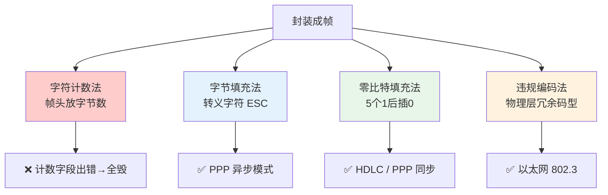

# 封装成帧

## 定义

**封装成帧（Framing）** 是数据链路层的基本功能：将网络层交下来的 IP 数据报加上**首部**和**尾部**，构成一个完整的帧（Frame），使接收方能从连续的比特流中准确识别每帧的**起始和结束**。

## 两个核心问题

| 问题 | 描述 | 解决方向 |
|------|------|---------|
| **帧定界** | 接收方如何从比特流中识别帧边界 | 定界符 / 计数字段 / 违规编码 |
| **透明传输** | 数据部分可能恰好包含与定界符相同的序列 | 转义 / 填充 / 物理层保证 |

> 帧的数据部分长度上限称为 **MTU（最大传输单元）**，超过则需要分片。

## 四种组帧方法



### 2.1 字符计数法（Character Count）

在每帧开头放置一个**计数字段**，标明本帧总字节数（含自身）。接收方读出计数值后，向后截取对应长度的内容。

```
发送序列:  5  1  2  3  4  4  5  6  7  3  8  9
          ↑              ↑           ↑
         帧1:5字节     帧2:4字节      帧3:3字节
```

**致命缺陷**：一旦计数字段在传输中出错（哪怕只错 1 bit），**后续所有帧的边界判断全部错位且无法自动恢复**。

> 正因为这种灾难性错误扩散，字符计数法在实际协议中几乎无人使用。

### 2.2 字节填充法（Byte Stuffing）

使用**特殊控制字符**作为帧定界符。若数据中出现与定界符相同的字节，则前面插入**转义字符（ESC）**。接收方遇到 ESC 就将其去掉，后面的字节按普通数据处理。

以 **PPP 协议**为例：标志字节 `0x7E`（`01111110`），转义字节 `0x7D`。

```
原始数据:   41  7E  5A  7D  3C
                   ↑       ↑
               与定界符冲突！

转义后发送:  7E  41  7D 5E  5A  7D 5D  3C  7E
             ↑                      ↑    ↑
           帧首                   帧尾定界

转义规则: 0x7E → 0x7D 0x5E     0x7D → 0x7D 0x5D
```

| 优点 | 缺点 |
|------|------|
| 逻辑直观、便于调试 | 与字符编码强绑定（依赖 8-bit ASCII） |
| 广泛用于面向字符协议 | 冲突字节越多帧越长（最差翻倍） |

### 2.3 零比特填充法（Bit Stuffing）

使用比特模式 `01111110`（6 个连续 1）作为帧定界标志。为确保数据中不会意外出现此模式：

- **发送方**：扫描数据比特流，每遇到 **5 个连续的 1** 就自动塞入一个 **0**
- **接收方**：扫描定界符之间的比特流，每遇到 **5 个连续的 1** 就删除紧跟的 **0**

```
原始数据:  101011111100101...

发送方:    1010111110100101...     ← 5个1后插入0
                   ↑
接收方:    101011111100101...      ← 5个1后删除0
                   ↑              ← 恢复原始数据 ✓
```

| 优点 | 缺点 |
|------|------|
| 与字符集无关，面向比特，通用性最强 | 比特级操作增加处理开销 |
| **最主流的组帧方式** | 连续 1 越多帧长增长越多（最差约 20%） |

> 代表协议：**HDLC** 及其衍生协议、**PPP** 的同步传输模式。

### 2.4 违规编码法（Code Violation）

利用**物理层编码**中永远不用于正常数据的冗余码型来标记帧边界，无需额外填充。

以**曼彻斯特编码**为例：每个比特用一次电平跳变表示（0 = 低→高，1 = 高→低）。**"高-高"** 和 **"低-低"** 是永远不会在数据中出现的违规码型，恰好用作帧边界信号。

```
曼彻斯特编码:
  数据 0: ──┐└──  (低→高)
  数据 1: ──┘┌──  (高→低)
  违规码: ──────  (无跳变, 永远不在数据中出现)
                    ↑ 用作帧定界
```

**IEEE 802.3 以太网**在帧前导码末尾的 SFD（帧起始定界符）使用违规编码，精确标识"数据即将开始"。

| 优点 | 缺点 |
|------|------|
| 完全不增加帧长，传输效率最高 | 强依赖物理层编码方式 |
| 定界最可靠 | 层次不够纯粹（物理层辅助链路层） |

> 代表应用：以太网（IEEE 802.3）、令牌环。

## 四种方法对比

| 方法 | 定界依据 | 透明传输策略 | 效率 | 可靠性 | 实际协议 |
|------|---------|-------------|------|--------|---------|
| 字符计数法 | 帧头计数字段 | 无需 | 高 | ★☆☆☆☆ | 几乎无 |
| 字节填充法 | 特殊控制字符 | 转义字符 ESC | 中 | ★★★★☆ | PPP（异步模式） |
| 零比特填充法 | `01111110` | 5 个 1 后插 0 | 中 | ★★★★☆ | HDLC、PPP（同步） |
| 违规编码法 | 物理层违规码型 | 无需 | 最高 | ★★★★★ | 以太网 802.3 |

> **实际趋势**：字节填充法用于面向字符的传统链路；零比特填充法是最通用的面向比特方案；违规编码法在局域网中占主导。字符计数法因错误扩散已被淘汰。

## 相关概念

- [差错控制](/articles/cs-fundamentals/computer-networks/concepts/差错控制/) — 帧传输中的比特错误检测与纠正
- [ARQ 协议](/articles/cs-fundamentals/computer-networks/concepts/ARQ协议-可靠传输与流量控制/) — 基于帧的确认与重传机制
- [介质访问控制](/articles/cs-fundamentals/computer-networks/concepts/介质访问控制/) — 广播信道中多节点如何共享信道发帧
- [第3章：数据链路层](/articles/cs-fundamentals/computer-networks/notes/第3章-数据链路层/) — 课堂笔记入口
