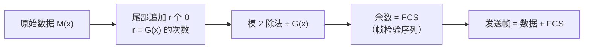

# 差错控制

## 定义

物理信道上存在噪声和干扰，传输的比特可能发生翻转（0→1 或 1→0）。**差错控制（Error Control）** 的目标是**发现并处理帧内的比特差错**。

## 两类解决思路

| 策略 | 原理 | 适用场景 | 代表 |
|------|------|---------|------|
| **检错编码** | 检测到错误后**丢弃帧**，通知发送方重传（配合 ARQ） | 误码率低的链路（有线） | 奇偶校验、CRC |
| **纠错编码** | 不仅发现错误，还**自行纠正**，无需重传 | 误码率高或重传代价大（无线、深空） | 海明码 |

> 核心权衡：检错编码开销小但需重传，纠错编码开销大但省去重传延迟。

---

## 检错编码

### 奇偶校验码（Parity Check）

在数据比特后附加一个**校验位**，使整个码字中 **1 的个数恒为偶数**（偶校验）或**奇数**（奇校验）。

```
偶校验示例（数据 7 bit + 校验位 1 bit）:

数据:    1 0 1 1 0 0 1      (4个1，已是偶数)
校验位:   0                  (补0，保持偶数)
发送:    1 0 1 1 0 0 1 0

若第3位翻转 (1→0):  1 0 0 1 0 0 1 0  (3个1，奇数)
接收方检测: 奇数 ≠ 约定的偶数 → 判定出错！
```

| 优点 | 缺点 |
|------|------|
| 实现极其简单、开销极小（仅 1 bit） | 只能检测**奇数个比特错误** |
| 适合内存校验等短距离场景 | 偶数个比特同时翻转则失效 |

### 循环冗余校验码（CRC）

CRC 是目前应用最广泛的检错编码。核心思想：将比特串视为**多项式系数**，通过模 2 除法生成校验码。

#### 编码原理



#### 模 2 除法的核心规则

**按位异或代替减法**，当前剩余最高位为 1 时商 1 并异或除数，为 0 时商 0 并跳过。

#### 完整计算示例

数据 `101001`，生成多项式 $G(x) = x^3 + x^2 + 1$（即 `1101`，$r = 3$）：

```
增强消息: 101001000（原始数据 + 3 个 0）
除数:     1101

(1) 101001000      bit8=1, 除数左移5位异或
  ⊕ 110100000
  ───────────
    011101000  →  去前导零: 11101000

(2) 11101000       bit7=1, 除数左移4位异或
  ⊕ 11010000
  ──────────
    00111000   →  去前导零: 111000

(3) 111000         bit5=1, 除数左移2位异或
  ⊕ 110100
  ────────
    001100     →  去前导零: 1100

(4) 1100           bit3=1, 除数左移0位异或
  ⊕ 1101
  ──────
    0001       →  余数 = 1

FCS = 001（不足 r=3 位前面补 0）
发送帧 = 101001 001
        数据    FCS
```

#### 校验步骤

接收方将收到的**整个帧**用同一个 $G(x)$ 做模 2 除法，余数为 0 则无差错，非 0 则有错。

#### CRC 检错能力

取决于生成多项式 $G(x)$ 的选择：

| $G(x)$ 满足条件 | 能检出的错误 |
|----------------|------------|
| 含有 $x+1$ 因子 | 所有奇数个比特错误 |
| 最低位为 1 | 所有单个比特错误 |
| $r$ 次多项式 | 所有长度 $\le r$ 的突发错误 |

#### 常用生成多项式

| 名称 | $G(x)$ | 应用 |
|------|--------|------|
| CRC-16 | $x^{16}+x^{15}+x^2+1$ | HDLC、PPP |
| CRC-CCITT | $x^{16}+x^{12}+x^5+1$ | X.25、蓝牙 |
| CRC-32 | $x^{32}+x^{26}+...+x^2+x+1$（15 项） | 以太网、ZIP、PNG |

> CRC 只能检错不能纠错，但其检错能力极强、硬件实现效率高，是数据链路层**事实标准**的检错机制。

---

## 纠错编码 — 海明校验码（Hamming Code）

海明码（Richard Hamming, 1950）不仅能检测错误，还能**精确定位并纠正单个比特错误**。

### 核心思想

在数据比特中按特定位置插入多个**校验位**，每个校验位覆盖一组不同的数据比特。接收方重新计算各校验位，通过**故障校验位的编号之和**直接定位出错比特的位置。

### 编码规则（以 (7,4) 海明码为例）

(7,4) 海明码：4 位数据 → 7 位码字，能纠 1 bit 错、检 2 bit 错。

#### 第一步：确定校验位数量

设数据位 $m = 4$，校验位 $k$ 需满足：$2^k \ge m + k + 1$。$k = 3$ 时 $2^3=8 \ge 4+3+1=8$ ✓。

#### 第二步：放置校验位

校验位放在**2 的幂次位置**（位号 1, 2, 4），数据位填入其余位置：

```
位号:  1   2   3   4   5   6   7
内容: P1  P2  D3  P4  D5  D6  D7
```

#### 第三步：确定每个校验位负责的位

每个校验位 $P_i$ 覆盖"位号二进制表示中第 $i-1$ 位为 1"的所有位置：

```
P1 (位1): 位号 bit0 = 1 → 1, 3, 5, 7    (001,011,101,111)
P2 (位2): 位号 bit1 = 1 → 2, 3, 6, 7    (010,011,110,111)
P4 (位4): 位号 bit2 = 1 → 4, 5, 6, 7    (100,101,110,111)
```

#### 第四步：计算校验位值（偶校验）

```
示例：数据 D7D6D5D3 = 1 0 1 0

位号:  1   2   3   4   5   6   7
初始:  ?   ?   0   ?   1   0   1

P1: 覆盖(1,3,5,7) = (?, 0, 1, 1) → 已有2个1(偶数) → P1 = 0
P2: 覆盖(2,3,6,7) = (?, 0, 0, 1) → 已有1个1(奇数) → P2 = 1
P4: 覆盖(4,5,6,7) = (?, 1, 0, 1) → 已有2个1(偶数) → P4 = 0

发送码字: 0  1  0  0  1  0  1
位号:     1  2  3  4  5  6  7
```

### 纠错过程

接收方重新计算每组校验，得到 **3 位校正子 $S_4S_2S_1$**（校验失败的组对应位为 1）：

```
假设第 5 位出错 (1→0):  接收码字 0 1 0 0 0 0 1

P1 组 (1,3,5,7): 0,0,0,1 → 1个1(奇数) → S₁ = 1  ✗
P2 组 (2,3,6,7): 1,0,0,1 → 2个1(偶数) → S₂ = 0  ✓
P4 组 (4,5,6,7): 0,0,0,1 → 1个1(奇数) → S₄ = 1  ✗

校正子 = S₄S₂S₁ = 101₂ = 5 → 第 5 位出错！翻转即可纠正 ✓
```

> **校正子指向的位置就是出错位** — 若全 0 则无错；若 ≠ 0 但指向校验位自身，说明该校验位出错，数据无错。

### 局限与扩展

| 能力 | (7,4) 海明码（码距 3） | 扩展海明码（码距 4，加全局校验位） |
|------|----------------------|----------------------------------|
| 纠错 | 1 bit | 1 bit |
| 检错 | 2 bit | 2 bit |
| 同时纠检 | 不能 | **能**（同时纠 1 + 检 2） |

对于**突发错误**（连续多 bit 错），海明码无能为力——此时 CRC + 重传更有优势。

---

## 检错 vs 纠错 对比

| 维度 | 检错编码（CRC） | 纠错编码（海明码） |
|------|----------------|-------------------|
| 能力 | 发现错误 | 发现并纠正错误 |
| 冗余开销 | 小（CRC-32: 32 bit） | 较大（(7,4) 码: 75% 开销） |
| 是否需要重传 | 是 | 否 |
| 适用场景 | 有线网、以太网 | 无线网、深空通信、ECC 内存 |
| 处理速度 | 快（纯硬件异或） | 较慢（需定位和纠正） |
| 代表协议/标准 | Ethernet (CRC-32)、HDLC (CRC-16) | ECC RAM、卫星通信、5G 控制信道 |

## 相关概念

- [封装成帧](/articles/cs-fundamentals/computer-networks/concepts/封装成帧/) — CRC 的 FCS 附加在帧尾部
- [ARQ 协议](/articles/cs-fundamentals/computer-networks/concepts/ARQ协议-可靠传输与流量控制/) — 检错后通过重传修复（停等/GBN/SR）
- [第3章：数据链路层](/articles/cs-fundamentals/computer-networks/notes/第3章-数据链路层/) — 课堂笔记入口
