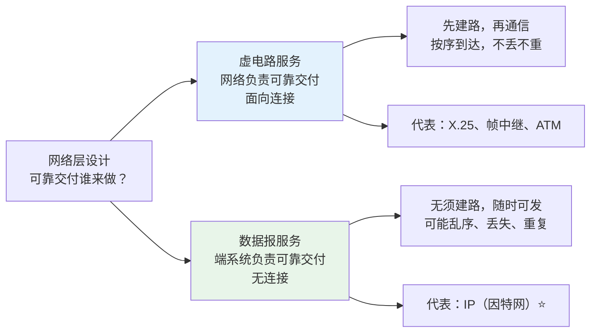
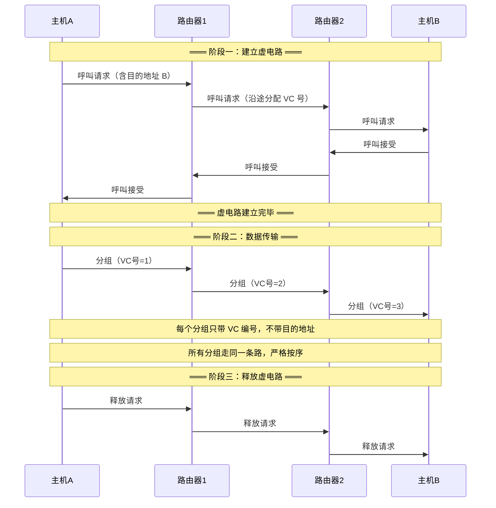
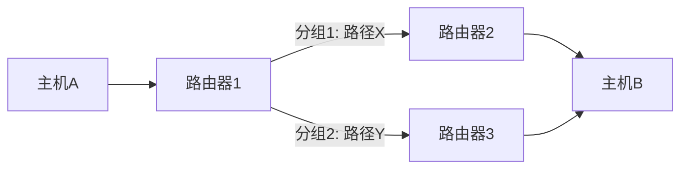

# 网络层两种服务模型

## 定义

网络层设计面临一个根本选择：**可靠交付应该由网络负责还是由端系统负责？** 这导致了两种截然不同的服务模型——面向连接的**虚电路服务**和无连接的**数据报服务**。因特网选择了后者，这个决定深刻影响了整个互联网的架构。

---

## 一、虚电路服务（面向连接）

虚电路的思想来自电信界——和打电话一样：先拨号建立连接，通话过程中线路固定，通话结束挂断释放。

### 工作原理

### 核心特征

| 特征 | 说明 |
|------|------|
| **三阶段** | 建立连接 → 数据传输 → 释放连接 |
| **可靠由网络保证** | 分组无差错、按序到达、不丢失、不重复 |
| **目的地址仅建路时用** | 建路后每个分组首部**只带 VC 编号**，不携带完整目的地址 |
| **路径固定** | 所有分组沿同一虚电路传送，严格按序 |
| **每段链路独立编号** | VC 号只在本段链路上有意义，路由器负责 VC 号转换（入→出映射） |
| **路由器有状态** | 每个路由器为每条虚电路维护状态表（入接口+入VC号 → 出接口+出VC号） |

> 🍜 **类比**：虚电路像**铁路**——铺设铁轨是一次性工程（建路），火车沿固定的铁轨行驶（路径固定），每一站的调度员只需要知道"从 3 号轨道进来的车应该转到 7 号轨道出去"（VC 号转换）。

### 代表技术

| 技术 | 全称 | 年代 | 现状 |
|------|------|------|------|
| **X.25** | — | 1970s | 已淘汰（早期分组交换网标准） |
| **帧中继（Frame Relay）** | — | 1990s | 逐渐过时（被 MPLS/IP 替代） |
| **ATM** | 异步传输模式 | 1990s~2000s | 逐渐过时（电信网曾广泛应用） |

> 这些技术在历史上都曾辉煌，但最终被 IP + 数据报模型取代——不是因为虚电路不好，而是**因特网的规模**使得每台核心路由器维护数百万条虚电路状态不现实。

---

## 二、数据报服务（无连接）

数据报的思想来自计算机科学界——**把复杂性推到边缘，让核心网络保持简单**。

### 工作原理

> 分组 1 和分组 2 从同一个源到同一个目的，但在路由器 R1 处走了不同的路径——每个分组独立选路，无需事先建立连接。

### 核心特征

| 特征 | 说明 |
|------|------|
| **无须建立连接** | 随时可发，首分组即数据 |
| **可靠由端系统保证** | 网络只尽力而为（Best-Effort），丢包/重复/乱序由上层 TCP 处理 |
| **每个分组携带完整目的地址** | 每个 IP 数据报首部包含 32 位源 IP + 32 位目的 IP |
| **独立选路** | 每个分组独立查路由表，可能走不同路径，到达顺序不确定 |
| **路由器无连接状态** | 路由器不保存"连接"信息，只靠路由表转发（无状态 = 高容错） |

> 🚗 **类比**：数据报像**公路网**——每辆车自己决定走哪条路（独立选路），不需要提前"建立路线"。如果路上堵了可以绕行。收费站（路由器）只管指路，不关心这辆车是哪来的。

---

## 三、两种服务模型对比

| 维度 | 虚电路服务 | 数据报服务 |
|------|-----------|-----------|
| **连接建立** | 需要（三阶段） | 不需要 |
| **目的地址** | 仅建路时使用，后续用 VC 号 | **每个分组都携带完整目的地址** |
| **路由决策** | 建路时一次确定，全程不变 | 每个分组独立查路由表 |
| **分组顺序** | 严格按序到达 | 可能乱序（需上层重排） |
| **可靠性责任** | **网络**保证（不丢不重不错序） | **端系统**保证（TCP 在传输层兜底） |
| **路由器状态** | 每条虚电路都有状态表 | **无状态**（仅路由表） |
| **路由器复杂度** | 高（维护每条 VC 的状态） | 低（只转发，不记"连接"） |
| **容错能力** | 差——路由器崩溃→途经 VC 全断 | 强——路由器崩溃→可绕行 |
| **计费方式** | 按时长/流量（类似电话） | 通常按带宽峰值或流量 |
| **代表技术** | X.25、帧中继、ATM | **IP（因特网）** |

---

## 四、因特网为什么选择数据报？

这是网络设计史上最重要的决策之一，原因有三：

### 1. 端到端原则

> "把复杂功能放在网络边缘（主机），让核心网络尽可能简单。"

核心路由器不需要维护连接状态，不需要保证可靠交付——这些都由主机上的传输层（TCP）来做。路由器的唯一任务就是把每个分组尽力转发出去。

### 2. 异构网络互连

因特网要连接各种物理网络（以太网、Wi-Fi、PPP、卫星链路……），不同网络的可靠性差异极大。如果网络层统一要求"可靠"，在本来就是高可靠的以太网上是浪费，在本来就是高误码的卫星链路上又不够。不如**一刀切不做可靠**，让端系统根据实际需要自己决定要不要加 TCP。

### 3. 冷战思维下的生存能力

ARPANET（因特网前身）的设计目标之一：**部分网络被摧毁后，剩余节点仍能通信**。无状态路由器最容易实现这一点——路由器坏了，分组自动绕路。如果每条虚电路都依赖特定路由器，路由器一毁，途经虚电路全断。

> **"尽力而为服务"（Best-Effort Service）** 是 IP 的设计哲学：网络尽最大努力传送每一个分组，但不做任何保证。用因特网先驱 David D. Clark 的话说："We reject: kings, presidents, and voting. We believe in: rough consensus and running code." 数据报模型本身就是这种"不需要中央权威"理念的技术体现。

---

## 五、现代视角：融合还是分化？

纯粹的虚电路网络（X.25/ATM）已经边缘化，但虚电路的思想并未消失：

- **MPLS（多协议标签交换）**：在 IP 网络上叠加面向连接的标签交换——兼具 IP 的灵活性和虚电路的效率
- **SD-WAN**：在因特网上用软件定义的方式建立逻辑的"虚电路"，结合了两者的优点

> 历史大趋势：**物理层/链路层是虚电路的天下（电路交换→光传输），网络层是数据报的天下（IP），传输层提供"逻辑上的可靠"（TCP）**。各层各司其职。

## 相关概念

- [IPv4 地址与编址](/articles/cs-fundamentals/computer-networks/concepts/IPv4地址与编址/) — 数据报模型中每个分组携带的 32 位目的地址
- [IP 数据报的发送与转发](/articles/cs-fundamentals/computer-networks/concepts/IP数据报的发送与转发/) — 数据报逐跳独立转发的具体过程
- [路由选择协议](/articles/cs-fundamentals/computer-networks/concepts/路由选择协议/) — 数据报模型中路由表的构建机制
- [ARQ 协议（链路层）](/articles/cs-fundamentals/computer-networks/concepts/ARQ协议-可靠传输与流量控制/) — 链路层的可靠传输 vs 网络层的尽力而为
- [第4章：网络层](/articles/cs-fundamentals/computer-networks/notes/第4章-网络层/) — 课堂笔记入口
