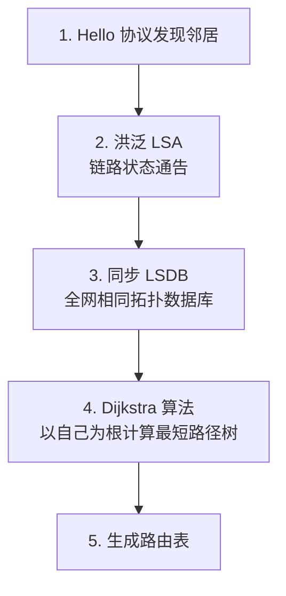

# 路由选择协议

## 定义

路由选择协议让路由器**自动发现和维护路由表**，替代人工配置的静态路由。核心任务：告诉每台路由器"去某个网络应该把分组交给哪个邻居"。

## 自治系统与协议分类

**自治系统（AS）**：由单一机构管理的一组路由器。AS 内部用 **IGP**（内部网关协议），AS 之间用 **EGP**（外部网关协议）。

```mermaid
graph LR
    subgraph "AS1"
        R1 --- R2 --- R3
    end
    subgraph "AS2"
        R4 --- R5
    end
    R3 <==="BGP (EGP)"===> R4
    R1 -.- "OSPF/RIP (IGP)" -.- R3
    R5 -.- "OSPF/RIP (IGP)" -.- R4
```

| 类别 | 协议 | 算法 | 范围 | 规模 |
|------|------|------|------|------|
| **IGP** | RIP | 距离向量 | AS 内部 | ≤15 跳 |
| **IGP** | OSPF | 链路状态 | AS 内部 | 大型（区域划分） |
| **EGP** | BGP | 路径向量 | AS 之间 | 全球因特网 |

---

## 一、RIP — 距离向量路由协议

RIP（Routing Information Protocol）是最简单的动态路由协议，基于 **Bellman-Ford 距离向量算法**。

### 核心规则

- **距离 = 跳数**（每过一路由器 +1），最大 15，16 = 不可达
- 每 **30 秒**向邻居广播**完整路由表**

### 更新算法

收到邻居 R 的路由表后：

```
对 R 表中的每条路由 (目的N, 距离d):
  新距离 = d + 1
  如果 N 不在我表中 → 添加 (N, 新距离, 下一跳=R)
  如果 N 在我表中:
    若下一跳==R → 强制更新（R 说的，无条件信）
    若下一跳≠R → 仅当新距离 < 当前距离才更新
```

### 实例

```
初始:
  R1: [192.168.1.0/24, 1, 直连] [10.0.0.0/8, 1, 直连]
  R2: [10.0.0.0/8, 1, 直连] [192.168.2.0/24, 1, 直连]

R1 收到 R2 的路由表后:
  → 192.168.2.0: 不在我表 → 添加 (距离=1+1=2, 下一跳=R2)
  → 10.0.0.0: 在我表, 距离=1 < R2距离+1=2 → 不更新

R1 更新后:
  [192.168.1.0/24, 1, 直连] [10.0.0.0/8, 1, 直连] [192.168.2.0/24, 2, R2]
```

### "坏消息传播慢" — 计数到无穷

当某网络不可达时，RIP 可能需要**几分钟**才能收敛。原因：每个路由器只告诉邻居"我能到"，不告诉"怎么到"。

```
场景: R1 ── R2 ── 网络N

N 断开后:
  R2: N不可达 (打算通告距离16)
  同时 R1 通告: 我能到N距离2
  R2 收到 → "R1能到N距离2, 那我到N就是3!" ← 被误导！
  R2 通告 → R1 收到 → "R2到N距离3, 我改成4"
  → 往返递增, 直到16才认定不可达
```

### 解决措施

| 技术 | 原理 |
|------|------|
| **水平分割** | 从某接口学到的路由，不再从该接口通告回去 |
| **毒性逆转** | 从某接口学到的路由，从该接口通告时**距离设为 16** |
| **触发更新** | 路由变化时立即通告，不等 30 秒 |

---

## 二、OSPF — 链路状态路由协议

OSPF（Open Shortest Path First）基于 **Dijkstra 算法**，每台路由器拥有**全网拓扑的完整地图**。



### 与 RIP 关键区别

| 维度 | RIP | OSPF |
|------|-----|------|
| 算法 | 距离向量（Bellman-Ford） | 链路状态（Dijkstra） |
| 知道什么 | 仅知道"方向和距离" | 知道**全网完整拓扑** |
| 更新方式 | 每 30 秒广播整张表 | 触发式洪泛（变化时才传） |
| 度量值 | 仅跳数 | **链路代价**（带宽可配） |
| 收敛速度 | 慢（分钟级） | 快（秒级） |
| 网络规模 | ≤15 跳 | 大型（通过区域划分扩展） |

### OSPF 区域划分

主干区域（Area 0）连接所有其他区域。区域内洪泛 LSA，区域间只传摘要路由——限制洪泛范围。

```
         Area 0 (主干)
    ┌──────┐      ┌──────┐
    │ ABR  ├──────┤ ABR  │
    └──┬───┘      └──┬───┘
       │             │
  ┌────┴────┐   ┌────┴────┐
  │ Area 1  │   │ Area 2  │
  └─────────┘   └─────────┘
```

### 五种分组类型

| 类型 | 名称 | 作用 |
|------|------|------|
| Type 1 | **Hello** | 发现邻居、建立邻接 |
| Type 2 | **DBD**（数据库描述） | 交换 LSDB 摘要 |
| Type 3 | **LSR**（链路状态请求） | 请求完整 LSA |
| Type 4 | **LSU**（链路状态更新） | 携带完整 LSA |
| Type 5 | **LSAck** | 确认收到 LSU |

### Dijkstra 算法概要

```
初始: 自己距离=0, 其余=∞
重复:
  1. 从未处理节点中选距离最小的 X
  2. 标记 X 为已处理
  3. 对 X 的每个邻居 Y:
      若 (到X距离 + X→Y代价) < Y当前距离:
        更新 Y 距离
```

> OSPF 不要求邻接路由器定时对整张表——只在新信息出现时洪泛，平时发送小型 Hello 维持关系。

---

## 三、BGP — 边界网关协议

BGP 是唯一的 EGP，负责 **AS 之间的路由**。与 IGP 追求"最短路径"不同，BGP 追求**策略路由**——路径选择由商业关系和政策决定。

### 核心创新：路径向量（AS_PATH）

BGP 通告路由时附带**经过的 AS 序列**（AS_PATH）：

```
通告: 「能到 8.8.8.0/24, 路径: AS100 → AS200 → AS300」
                                   └───── AS_PATH ─────┘
```

两个关键作用：
1. **环路检测**：收到通告后检查 AS_PATH 有没有自己的 AS 号 → 有就丢弃（比 RIP 的计数到无穷强太多）
2. **策略决策**：AS_PATH 越短越优先；也可以基于 AS_PATH 做策略过滤

### 四种报文

| 类型 | 作用 |
|------|------|
| **OPEN** | 建立 BGP 会话，协商参数 |
| **UPDATE** | 通告新路由或撤销已有路由 |
| **KEEPALIVE** | 周期性确认连接存活 |
| **NOTIFICATION** | 错误时关闭会话 |

### BGP 选路优先级

BGP 不选"最短"，选"最符合策略"：

1. **最高本地优先级（Local Preference）** ——运营商自定义偏好
2. **最短 AS_PATH** ——经过的 AS 越少越优先
3. **最低 MED** ——相邻 AS 建议的入口偏好

> **为什么 BGP 不追求最短？** 因为 AS 之间是商业关系：电信不一定会让流量走联通（竞争对手），哪怕联通路"更短"。BGP 是互联网的**政治层**。

## 三种协议对比总结

| 维度 | RIP | OSPF | BGP |
|------|-----|------|-----|
| 算法 | 距离向量 | 链路状态 | 路径向量 |
| 范围 | AS 内部 | AS 内部 | AS 之间 |
| 度量 | 跳数 | 链路代价 | 策略（AS_PATH 等） |
| 收敛 | 慢（分钟） | 快（秒） | 慢（策略优先） |
| 最大规模 | 15 跳 | 数千路由器（分区） | 全球 ~10 万+ 路由 |
| 防环机制 | 水平分割等 | LSDB 一致性 | AS_PATH |

## 相关概念

- [IPv4 地址与编址](/articles/cs-fundamentals/computer-networks/concepts/IPv4地址与编址/) — CIDR 路由聚合与路由表的关系
- [IP 数据报转发](/articles/cs-fundamentals/computer-networks/concepts/IP数据报的发送与转发/) — 路由表在转发中的实际使用
- [第4章：网络层](/articles/cs-fundamentals/computer-networks/notes/第4章-网络层/) — 课堂笔记入口
