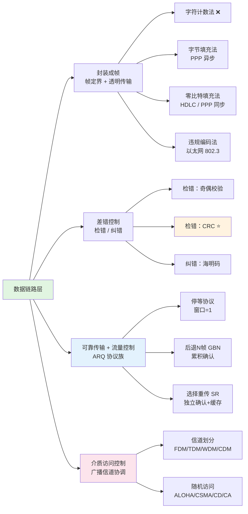

# 第3章：数据链路层

## 本章概要

本章位于物理层之上、网络层之下，讲解数据链路层的五大核心功能：**封装成帧**（从比特流中提取帧）、**差错控制**（CRC 检错 / 海明码纠错）、**可靠传输**（ARQ：停等 / GBN / SR）、**流量控制**（滑动窗口协调速率）、**介质访问控制**（广播信道中的信道划分与随机竞争）。本章是理解以太网、Wi-Fi、PPP、HDLC 等链路层协议的必要基础。

## 知识结构

## 知识点

### Part 1：数据链路层功能概览

数据链路层在物理层提供的比特传输服务之上，为网络层提供**相邻节点之间逻辑上无差错的数据传输服务**。

- **物理链路** vs **数据链路**：前者是物理连接，后者是在其上的逻辑无差错通道
- **五大功能的关系**：封装成帧是基础 → 差错控制发现错误 → 可靠传输修复错误 → 流量控制协调速率 → MAC 仅广播信道需要
  → [封装成帧](/articles/cs-fundamentals/computer-networks/concepts/封装成帧/)

### Part 2：封装成帧 — 四种方法

- **字符计数法**：帧头放字节数，计数字段一错全毁 → 已淘汰
- **字节填充法**：特殊控制字符定界 + ESC 转义 → PPP 异步模式
- **零比特填充法**：`01111110` 定界 + 5 个 1 插 0 → **最主流**（HDLC、PPP 同步）
- **违规编码法**：物理层冗余码型定界，零开销 → 以太网 802.3
  → [封装成帧](/articles/cs-fundamentals/computer-networks/concepts/封装成帧/)

### Part 3：差错控制

- **奇偶校验**：简单但只能检奇数个错
- **CRC** ⭐：模 2 除法生成 FCS，检错能力极强，数据链路层事实标准。CRC-32 用于以太网、ZIP、PNG
- **海明码**：能定位并纠正单个比特错。校正子 $S_4S_2S_1$ 直接给出出错位号
  → [差错控制](/articles/cs-fundamentals/computer-networks/concepts/差错控制/)

### Part 4：ARQ 协议 — 可靠传输与流量控制

三个经典协议在不同场景平衡信道利用率和实现复杂度：

- **停等**：窗口=1，实现极简但利用率极低（光纤上仅约 2.4%）
- **后退 N 帧（GBN）**：累积确认，出错回退 N 帧重传。适合**低误码链路**（光纤）
- **选择重传（SR）**：独立确认 + 缓存乱序帧，仅重传出错帧。适合**高误码链路**（Wi-Fi/4G/5G）
  → [ARQ 协议](/articles/cs-fundamentals/computer-networks/concepts/ARQ协议-可靠传输与流量控制/)

### Part 5：介质访问控制

- **信道划分**（无冲突）：FDM（频率）、TDM（时间）、WDM（波长，光纤）、CDM（编码，3G/GPS）
- **随机访问**（竞争）：ALOHA → CSMA → CSMA/CD（有线以太网，边发边听）→ CSMA/CA（Wi-Fi，RTS/CTS 避免碰撞）
  → [介质访问控制](/articles/cs-fundamentals/computer-networks/concepts/介质访问控制/)

## 核心对比表

### 四种组帧方法

| 方法 | 定界依据 | 透明传输策略 | 可靠性 | 代表协议 |
|------|---------|-------------|--------|---------|
| 字符计数法 | 帧头计数字段 | 无需 | ★☆☆☆☆ | 几乎无 |
| 字节填充法 | 特殊控制字符 | ESC 转义 | ★★★★☆ | PPP（异步） |
| 零比特填充法 | `01111110` | 5个1插0 | ★★★★☆ | HDLC、PPP（同步） |
| 违规编码法 | 物理层违规码型 | 无需 | ★★★★★ | 以太网 802.3 |

### 三种 ARQ 协议

| 维度 | 停等 | GBN | SR |
|------|------|-----|-----|
| 发送窗口 | 1 | $\le 2^n-1$ | $\le 2^{n-1}$ |
| 接收窗口 | 1 | 1 | = 发送窗口 |
| 确认方式 | 单帧 ACK | 累积 ACK | 独立 ACK / NAK |
| 重传范围 | 1 帧 | 出错及之后全部 | 仅出错帧 |
| 适用场景 | 极小 RTT | 光纤（低误码） | Wi-Fi/4G/5G（高误码） |

### 四种随机访问协议

| 维度 | ALOHA | CSMA | CSMA/CD | CSMA/CA |
|------|-------|------|---------|---------|
| 载波侦听 | 无 | 发前 | 发前+发中 | 物理+虚拟 |
| 碰撞处理 | 超时重传 | 超时重传 | 停发+退避 | RTS/CTS 避免 |
| 最大吞吐 | 18%/37% | 中 | 高 | 中（有开销） |
| 代表协议 | 早期卫星 | 早期 LAN | 以太网 802.3 | Wi-Fi 802.11 |

## 关键公式速查

| 公式 | 说明 |
|------|------|
| $U_{\text{sw}} = \dfrac{1-P}{1+2a}$ | 停等协议信道利用率 |
| $U_{\text{gbn}} = \dfrac{1-P}{1+2aP}$ | GBN 利用率（窗口够大） |
| $U_{\text{sr}} = 1-P$ | SR 利用率（窗口够大） |
| $a = t_p / t_f$ | 归一化时延（$t_p$ 传播时延，$t_f$ 帧传输时间） |
| 管道填满条件：$N \ge 1 + 2a$ | 窗口至少多大才能不让信道空闲 |
| $2^k \ge m + k + 1$ | 海明码校验位数公式 |
| $\text{FCS} = M(x) \cdot x^r \bmod G(x)$ | CRC 校验码计算 |

## 疑问

- [ ] CRC 的生成多项式 $G(x)$ 为何选择那些特定多项式（如 CRC-32 的 15 项）？是否有数学上"最优"的 $G(x)$？
- [ ] GBN 窗口 $= 2^n-1$ 与 SR 窗口 $= 2^{n-1}$ 的推导能否用更直观的序号空间图示来说明？
- [ ] CSMA/CA 的 RTS/CTS 握手具体如何解决隐藏终端问题？能否画一个带有距离标注的场景图？
- [ ] 以太网从共享总线（CSMA/CD）演进到全双工交换式（无碰撞），CSMA/CD 在现代网络中还有哪些实际应用场景？
- [ ] CDMA 的正交码（Walsh 码）与 OFDM 的正交子载波有何本质区别？

## 关联笔记

- [封装成帧](/articles/cs-fundamentals/computer-networks/concepts/封装成帧/) — 四种组帧方法详解
- [差错控制](/articles/cs-fundamentals/computer-networks/concepts/差错控制/) — 奇偶校验、CRC 模 2 除法手算、海明码编码与纠错
- [ARQ 协议](/articles/cs-fundamentals/computer-networks/concepts/ARQ协议-可靠传输与流量控制/) — 停等/GBN/SR 完整对比 + 信道利用率分析
- [介质访问控制](/articles/cs-fundamentals/computer-networks/concepts/介质访问控制/) — 信道划分（FDM/TDM/WDM/CDM）+ 随机访问（ALOHA→CSMA/CD→CSMA/CA）
