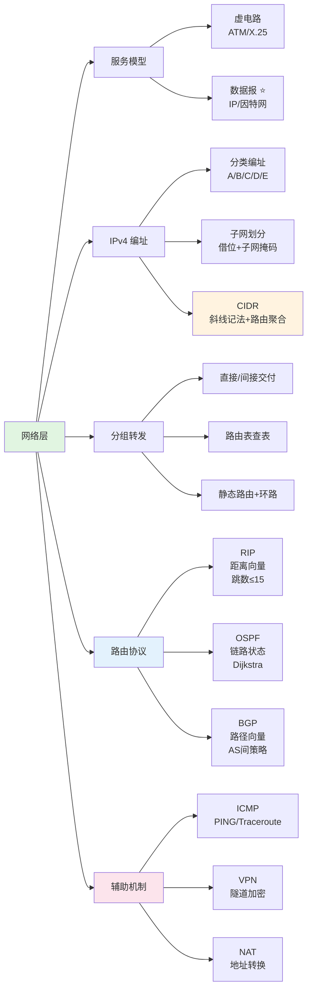

# 第4章：网络层

## 本章概要

本章是计算机网络的核心章节。网络层实现**主机到主机（端到端）** 的数据传输，以 **IP 协议**为核心。主要内容：网络层的两种服务模型（虚电路 vs 数据报）、**IPv4 地址体系**（从分类→子网划分→CIDR 的演进）、IP 数据报的发送与转发、**路由选择协议**（RIP 距离向量 / OSPF 链路状态 / BGP 路径向量）、IPv4 首部格式与分片机制、ICMP 网络诊断（PING / Traceroute）、VPN 隧道技术与 NAT 地址转换。

## 知识结构

## 知识点

### Part 1：网络层定位与两种服务

- **网络层 vs 数据链路层 vs 传输层**：物理层传比特 → 链路层传帧（相邻节点）→ **网络层传分组（端到端）** → 传输层传报文段（进程到进程）
- **虚电路 vs 数据报**：前者网络保证可靠（类似电话），后者网络尽力而为（因特网选择）。因特网选择数据报是为了**核心简单、边缘智能**——路由器不维护状态，崩溃后影响极小
  → [网络层两种服务模型](/articles/cs-fundamentals/computer-networks/concepts/网络层两种服务模型/)
- **因特网网络层协议**：IP（转发）+ ICMP（差错）+ RIP/OSPF/BGP（路由）= 控制面 + 数据面

### Part 2：IPv4 地址 — 从分类到无分类

三种编址的演进反映了从"僵化"到"灵活"的过程：

- **分类编址**：A/B/C/D/E，简单但浪费（A 类 1677 万台太大，C 类 254 台太小）
- **子网划分**：借主机位→子网号，三级结构。子网掩码 AND 运算提取网络地址。注意划分子网本身消耗地址
- **CIDR**：抛弃分类，斜线记法（`/24`）。**路由聚合**将多条路由合并为一条。**最长前缀匹配**保证选最具体的路由
  → [IPv4 地址与编址](/articles/cs-fundamentals/computer-networks/concepts/IPv4地址与编址/)

### Part 3：IP 数据报的发送与转发

- **主机判断**：AND 子网掩码比较网络地址 → 同网直交 / 异网间交
- **关键理解**：源 IP 和目的 IP **端到端不变**，但 MAC 地址**每一跳都变**
- **路由表**：目的网络 + 掩码 + 下一跳 + 出接口。默认路由 `0.0.0.0/0` 兜底
- **三种路由环**：配置错误（互相指）、聚合不对齐（黑洞子网被默认路由弹回）、故障未收敛
  → [IP 数据报的发送与转发](/articles/cs-fundamentals/computer-networks/concepts/IP数据报的发送与转发/)

### Part 4：路由选择协议 ⭐

| | RIP | OSPF | BGP |
|------|-----|------|-----|
| 算法 | 距离向量 | 链路状态 | 路径向量 |
| 知道什么 | 方向+距离 | **全网拓扑** | AS_PATH |
| 收敛 | 慢（分钟） | 快（秒） | 慢（策略优先） |
| 防环 | 水平分割/毒性逆转 | LSDB 一致性 | AS_PATH 去重 |
| 场景 | 小型网（≤15跳） | 中大型/ISP 内部 | AS 之间（全球） |

- **RIP 的核心缺陷**："坏消息传播慢"（计数到无穷），因为只传距离不传路径
- **OSPF 的核心优势**：每台路由器有全网地图，Dijkstra 独立算最优
- **BGP 的核心差异**：不追求最短路径，追求**策略**（商业关系决定路径）
  → [路由选择协议](/articles/cs-fundamentals/computer-networks/concepts/路由选择协议/)

### Part 5：IPv4 首部格式

- **20 字节固定部分**：版本、首部长度、总长度、TTL、协议号、首部校验和、源/目 IP
- **分片三件套**：标识（同数据报同 ID）、标志（DF 禁止分片 / MF 还有后续）、片偏移（÷8 单位）
- **TTL**：每跳减 1 → 0 丢弃，防止环路；同时是 Traceroute 的关键机制
- **首部校验和仅校验首部**：每跳重算（TTL 变了），降低路由器负担
  → [IPv4 数据报首部格式](/articles/cs-fundamentals/computer-networks/concepts/IPv4数据报首部格式/)

### Part 6：ICMP 与网络诊断工具

- **PING**：ICMP Echo Request (8) / Reply (0) → 测连通性和 RTT
- **Traceroute**：逐跳 TTL=1,2,3... → 每跳回 TTL 超时 → 画出路径
- **差错报告**：终点不可达、TTL 超时、需分片 DF 置位等
  → [ICMP 与网络诊断](/articles/cs-fundamentals/computer-networks/concepts/ICMP与网络诊断/)

### Part 7：VPN 与 NAT

- **VPN 隧道**：内层 IP（含私有地址）加密后封装在外层 IP 中 → 公网透明传输
- **NAPT**：不仅转 IP 还转端口——多台内网主机共享一个公网 IP，靠端口号区分
- **NAT 的代价**：破坏端到端原则、公网无法主动向内网发起连接
  → [VPN 与 NAT](/articles/cs-fundamentals/computer-networks/concepts/VPN与NAT/)

## 核心对比表

### 虚电路 vs 数据报

| 维度 | 虚电路 | 数据报（IP） |
|------|--------|-------------|
| 连接建立 | 需要 | 不需要 |
| 分组顺序 | 严格按序 | 可能乱序 |
| 可靠责任 | 网络 | 端系统 |
| 路由器状态 | 每条虚电路都维护 | 无状态 |
| 容错 | 路由器崩溃→全断 | 可绕行 |

### 三种 IP 编址方式

| | 分类编址 | 子网划分 | CIDR |
|------|---------|---------|------|
| 结构 | 网络号+主机号 | 网络号+子网号+主机号 | 网络前缀+主机号 |
| 灵活性 | 极低（固定三类） | 中（网内灵活） | 高（任意前缀长度） |
| 路由表 | 膨胀 | 仍膨胀 | **大幅缩小**（聚合） |
| 现状 | 已淘汰 | 仍在使用 | **当前标准** |

### 三种路由协议

| 维度 | RIP | OSPF | BGP |
|------|-----|------|-----|
| 算法 | 距离向量 | 链路状态 | 路径向量 |
| 度量 | 跳数 | 链路代价 | 策略 |
| 范围 | AS 内部 | AS 内部 | AS 之间 |
| 防环 | 水平分割+毒性逆转 | LSDB 全局一致 | AS_PATH 去重 |
| 代表场景 | 小型网 | ISP 内部 | 全球因特网 |

## 关键公式与速查

| 项 | 内容 |
|------|------|
| 子网可用主机数 | $2^k - 2$（$k$ = 主机位数，减全网地址和广播地址） |
| CIDR 地址块大小 | $2^{32-n}$（$/n$ 前缀） |
| 片偏移 | 数据偏移量 ÷ 8（单位 8 字节） |
| 分片最大载荷 | MTU − 首部长度（且须能被 8 整除） |
| RIP 最大跳数 | 15（16 = 不可达） |
| ICMP 协议号 | 1；TCP = 6；UDP = 17 |
| 私有地址范围 | `10.0.0.0/8`、`172.16.0.0/12`、`192.168.0.0/16` |

## 疑问

- [ ] 子网划分中，为什么全 0 和全 1 子网号在早期协议中不可用？现在为什么可用了（CIDR）？
- [ ] RIP 的水平分割和毒性逆转如何同时生效？两者有没有冲突？
- [ ] OSPF 中 DR（指定路由器）和 BDR 的选举过程——为什么广播网络需要它们而点对点链路不需要？
- [ ] BGP 的路由抖动（Route Flapping）和路由衰减（Route Damping）机制
- [ ] IPv4 和 IPv6 共存的过渡技术（双协议栈、隧道、NAT64）
- [ ] NAT 穿越中 STUN/TURN/ICE 的具体交互流程

## 关联笔记

- [网络层两种服务模型](/articles/cs-fundamentals/computer-networks/concepts/网络层两种服务模型/) — 虚电路（三阶段）vs 数据报（无状态）、因特网的设计选择
- [IPv4 地址与编址](/articles/cs-fundamentals/computer-networks/concepts/IPv4地址与编址/) — 分类→子网→CIDR 完整演变 + 子网划分实例
- [IP 数据报的发送与转发](/articles/cs-fundamentals/computer-networks/concepts/IP数据报的发送与转发/) — 直交/间交判断、路由表查表、静态路由与环路
- [路由选择协议](/articles/cs-fundamentals/computer-networks/concepts/路由选择协议/) — RIP/OSPF/BGP 三协议详解：算法原理、对比、选型
- [IPv4 数据报首部格式](/articles/cs-fundamentals/computer-networks/concepts/IPv4数据报首部格式/) — 20 字节逐字段 + 分片计算实例
- [ICMP 与网络诊断](/articles/cs-fundamentals/computer-networks/concepts/ICMP与网络诊断/) — PING/Traceroute 原理与使用
- [VPN 与 NAT](/articles/cs-fundamentals/computer-networks/concepts/VPN与NAT/) — 隧道封装 + NAPT 端口转换

## 跨章节链接

- [封装成帧（链路层）](/articles/cs-fundamentals/computer-networks/concepts/封装成帧/) — IP 数据报封装到帧的数据部分中
- [ARQ 协议（链路层）](/articles/cs-fundamentals/computer-networks/concepts/ARQ协议-可靠传输与流量控制/) — 链路层可靠传输 vs 网络层尽力而为的设计取舍
