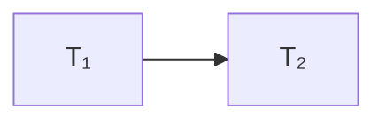
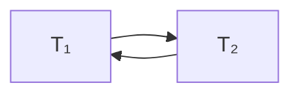
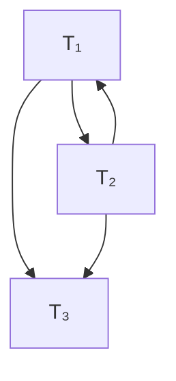

# 数据库恢复技术

## 1. 事务的概念

事务是用户定义的一个数据库操作序列，这些操作要么全做、要么全不做，是一个不可分割的工作单位。事务是数据库操作的**逻辑单位**。

## 2. ACID 特性

| 特性                      | 含义                                                      |
| ----------------------- | ------------------------------------------------------- |
| **A** 原子性 (Atomicity)   | 事务中包括的诸操作要么都做，要么都不做。                                    |
| **C** 一致性 (Consistency) | 事务执行的结果必须是使数据库从一个一致性状态变到另一个一致性状态。                       |
| **I** 隔离性 (Isolation)   | 一个事务的执行不能被其他事务干扰。并发执行的各个事务之间不能互相干扰。                     |
| **D** 持久性 (Durability)  | 一个事务一旦提交，它对数据库中数据的改变就应该是永久性的。接下来的其他操作或故障不应该对其执行结果有任何影响。 |

> 故障恢复可以保证事务的**原子性**与**持久性**。

## 3. 事务调度的准则

### 3.1 基本要求

一组事务的调度必须保证：
- 包含所有事务的全部操作指令
- **每个事务内部的指令顺序不变**

### 3.2 可串行化

并行执行的结果等于**某个串行执行**的结果 → 该调度是**可串行化**的。

### 3.3 冲突可串行化

#### 背景：为什么需要这个概念

数据库要支持**多个用户同时操作**。看一个例子：

```
账户 A = 1000 元

T₁：从 A 转出 200    T₂：向 A 存入 300
```

如果串行执行（一个一个来），无论谁先谁后，A 最终都是 1100。但并行执行可能出问题：

```
T₁: Read(A) → 1000         T₂: Read(A) → 1000    ← 都读到旧值
T₁: A = 1000-200, Write    T₂: A = 1000+300, Write  ← T₂ 覆盖了 T₁
```

结果 A = 1300，T₁ 转走的 200 **凭空消失**了（丢失修改）。

但数据库**不能禁止并行**——太慢了。所以需要一个标准来判断：**这个并行调度是否正确？**

> **「可串行化」**：并行调度的结果 = 某个串行执行的结果 → 就是正确的。因为串行执行天然正确。

但「可串行化」没法直接检验——你需要穷举所有串行顺序逐个比对结果，不现实。**冲突可串行化**就是一种可操作的判定方法。

---

#### 第一层：什么是「冲突」

两个操作**冲突** = 它们**不能交换顺序**。必须同时满足三个条件：

1. 来自**不同事务**（同一事务内部顺序是写死的）
2. 操作**同一个数据项**（不同数据互不影响）
3. 至少有一个是**写操作**

|  | R | W |
|--|---|---|
| **R** | ❌ 不冲突 | ✅ 冲突 |
| **W** | ✅ 冲突 | ✅ 冲突 |

> 口诀：**R-W 冲突，W-W 冲突，只有 R-R 不冲突。**

为什么 R-W 冲突？
- 先 R 后 W → 读到旧值
- 先 W 后 R → 读到新值
- **交换后结果不同 → 不能交换**

---

#### 第二层：冲突可串行化是什么意思

给定一个交错的并行调度，**不断交换相邻的「不冲突」操作**。如果最终能变成串行调度（所有事务的操作各自聚在一起），就是冲突可串行化。

换句话说：冲突操作把某些操作的相对顺序「锁死」了。只要这些锁不矛盾，就能排出全局先后。

---

#### 第三层：前驱图——把「锁死」的关系画出来

手工交换效率太低，实际判断用**前驱图**：

1. 每个事务 → 一个节点
2. 找所有冲突操作对，谁先执行就画一条**有向边**（先 → 后）
3. 箭头 = 「必须排在前面」

核心结论：

> **无环 = 冲突可串行化（所有「必须在前」的关系不矛盾）**
> **有环 = 不可串行化（自相矛盾：T₁ 既要在 T₂ 前，又要在 T₂ 后）**

**做题流程**：

```
1. 列出调度中所有操作（按执行顺序）
2. 按数据项分组，找出每个数据项上的冲突操作对
3. 每对冲突操作 → 画 T_先 → T_后
4. 检查有向图是否有环
   - 无环 → ✅ 冲突可串行化，拓扑排序 = 等价串行顺序
   - 有环 → ❌ 不可串行化
```

---

#### 三层理解总结

| 层次 | 问题 | 答案 |
|------|------|------|
| 第一层 | 什么操作能交换？ | 不冲突的才能交换（R-R 或不同数据） |
| 第二层 | 什么叫可串行化？ | 通过交换不冲突操作，能变成串行 |
| 第三层 | 怎么快速判断？ | 画前驱图，无环 = 可串行化 |

### 例题 1（两事务，无环）

> T₁: R(A), W(A), R(B), W(B)  
> T₂: R(A), W(A)  
> 调度 S: R₁(A), W₁(A), R₂(A), W₂(A), R₁(B), W₁(B)

**解**：按数据项分析冲突。

数据项 **A** 上：

| 先 | 后 | 冲突类型 | 偏序 |
|----|----|---------|------|
| W₁(A) | R₂(A) | W→R | T₁ → T₂ |
| W₁(A) | W₂(A) | W→W | T₁ → T₂ |

数据项 **B** 上：只有 T₁ 在操作，无冲突。

前驱图：T₁ → T₂，无环 ✅



**答案**：冲突可串行化，等价串行顺序为 T₁ → T₂。

---

### 例题 2（两事务，有环）

> T₁: R(A), W(A)  
> T₂: R(A), W(A)  
> 调度 S: R₁(A), R₂(A), W₁(A), W₂(A)

**解**：

| 先 | 后 | 冲突类型 | 偏序 |
|----|----|---------|------|
| R₁(A) | W₂(A) | R→W | T₁ → T₂ |
| R₂(A) | W₁(A) | R→W | T₂ → T₁ |
| W₁(A) | W₂(A) | W→W | T₁ → T₂ |

前驱图：T₁ → T₂ 且 T₂ → T₁ → **有环** ❌



**答案**：不是冲突可串行化。

> **直观理解**：两个事务都读了 A 的旧值，然后各自修改——互相不知道对方的存在。无论谁先谁后，串行执行都不会产生这个结果。

---

### 例题 3（三事务，无共享数据）

> T₁: R(A), W(A)  
> T₂: R(B), W(B)  
> T₃: R(C), W(C)  
> 调度 S: R₁(A), R₂(B), R₃(C), W₁(A), W₂(B), W₃(C)

**解**：T₁ 只碰 A，T₂ 只碰 B，T₃ 只碰 C。三个事务操作的数据完全不同 → **没有冲突操作**。

前驱图：三个孤立节点，无环 ✅

**答案**：天然冲突可串行化。任意串行顺序都等价（T₁→T₂→T₃、T₂→T₃→T₁、…）。

---

### 例题 4（三事务，有环 — 综合场景）

> T₁: R(A), W(A), W(B)  
> T₂: R(B), W(A), W(C)  
> T₃: R(C), W(B)  
> 调度 S: R₁(A), W₁(A), R₂(B), W₁(B), W₂(A), R₃(C), W₂(C), W₃(B)

**解**：按数据项逐对分析。

**数据项 A**：

| 先 | 后 | 类型 | 偏序 |
|----|----|------|------|
| W₁(A) | W₂(A) | W→W | T₁ → T₂ |

**数据项 B**：

| 先 | 后 | 类型 | 偏序 |
|----|----|------|------|
| R₂(B) | W₁(B) | R→W | T₂ → T₁ |
| W₁(B) | W₃(B) | W→W | T₁ → T₃ |
| R₂(B) | W₃(B) | R→W | T₂ → T₃ |

**数据项 C**：

| 先 | 后 | 类型 | 偏序 |
|----|----|------|------|
| W₂(C) | R₃(C) | W→R | T₂ → T₃ |

**合并偏序**：T₁→T₂（A）, T₂→T₁（B）, T₁→T₃（B）, T₂→T₃（B+C）

前驱图：**T₁ → T₂ → T₁ 成环** ❌



**答案**：不是冲突可串行化。

---

### 四道题对比总结

| 例题 | 事务数 | 共享数据 | 有环？ | 结论 |
|------|--------|---------|--------|------|
| 1 | 2 | A | 无 | ✅ 冲突可串行化 |
| 2 | 2 | A | **有** | ❌ 不可串行化 |
| 3 | 3 | 无 | 无 | ✅ 天然可串行化 |
| 4 | 3 | A, B, C | **有** | ❌ 不可串行化 |

> **核心考点**：前驱图无环 = 冲突可串行化；一旦出现「互相等待」的环，就是不可串行化。

## 相关概念

- [并发控制](/articles/cs-fundamentals/data-base-system/concepts/concurrency-control/)
- [数据库完整性](/articles/cs-fundamentals/data-base-system/concepts/database-integrity/)
