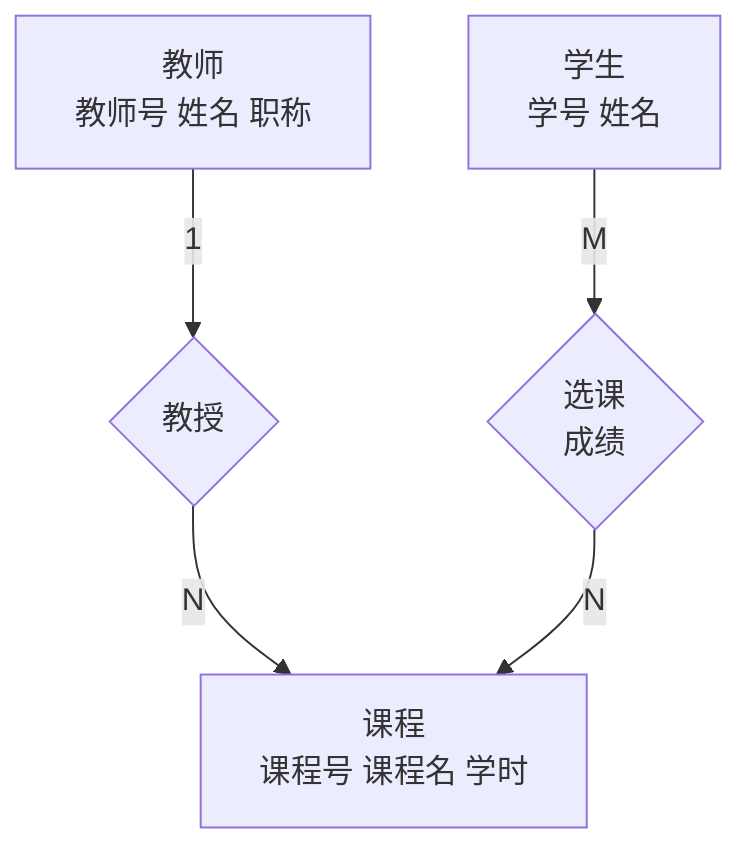
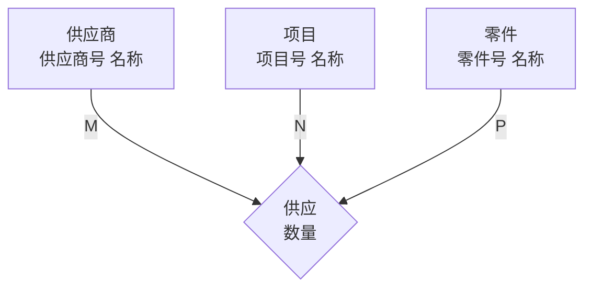
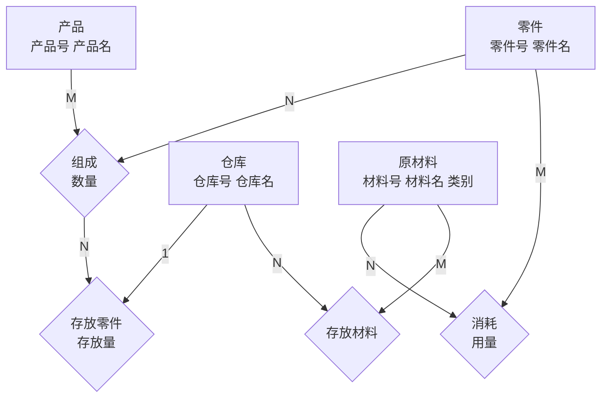

# E-R 图概念设计

## 1. 什么是 E-R 图

E-R 图（Entity-Relationship Diagram）是数据库**概念设计**的工具——把现实世界画成图，再转成建表语句。

**三要素**：

| 要素 | 符号 | 含义 | 例子 |
|------|------|------|------|
| 实体型 | 矩形 | 可区分的事物 | 学生、课程 |
| 属性 | 椭圆 | 实体的特征 | 学号、姓名、成绩 |
| 联系 | 菱形 | 实体之间的关联 | 选课、属于 |

## 2. 转换规则（核心三条）

### 规则一：实体 → 表

每个实体型直接变一张表。属性 → 列，码 → 主键。

### 规则二：联系 → 外键或新表

| 联系类型 | 怎么做 | 主键 |
|---------|--------|------|
| **1:1** | 任一端加对方主键作为外键 | 不变 |
| **1:N** | N 端（多端）加 1 端主键作为外键 | 不变 |
| **M:N** | 必须**新建一张表** | 两端主键的组合 |

### 规则三：联系的属性跟着联系走

- 联系变成外键的（1:1、1:N）→ 属性加在外键所在表
- 联系变成新表的（M:N）→ 属性加在新表里

## 3. 完整转换步骤

1. 每个实体 → 一张表（属性抄过来，码设为主键）
2. 每个联系 → 按 1:1 / 1:N / M:N 加外键或建新表，联系属性跟着走
3. 检查主键完全相同的表 → 合并

## 4. 例题

### 例题 1：1:N 联系

> 每个**班级**有多个**学生**，每个学生只属于一个班级。
> 班级：班级号、班级名。学生：学号、姓名、年龄。

**E-R 图**：

**转换结果**（1:N → 学生表加外键）：

- 班级（**班级号**，班级名）
- 学生（**学号**，姓名，年龄，*班级号*）

---

### 例题 2：M:N 联系（带属性）

> **学生**选修**课程**，一个学生可选多门课，一门课可被多个学生选。选修有属性：成绩。
> 学生：学号、姓名。课程：课程号、课程名。

**E-R 图**：

**转换结果**（M:N → 新建选课表）：

- 学生（**学号**，姓名）
- 课程（**课程号**，课程名）
- 选课（***学号***，***课程号***，成绩） ← 主键 =（学号, 课程号）

---

### 例题 3：综合（两个联系）

> 教务系统：**教师**（教师号、姓名、职称）教**课程**（课程号、课程名、学时），一门课只有一个教师教，一个教师可教多门课。**学生**（学号、姓名）选课，选课有成绩。

**E-R 图**：

**转换结果**：

- 教师（**教师号**，姓名，职称）
- 课程（**课程号**，课程名，学时，*教师号*） ← 1:N，N 端加外键
- 学生（**学号**，姓名）
- 选课（***学号***，***课程号***，成绩） ← M:N，新建表

---

### 例题 4：1:1 联系

> **公民**和**身份证**一一对应。公民：身份证号、姓名、性别。身份证：签发机关、有效期。

**E-R 图**：

**转换结果**（1:1 + 主键相同 → 合并）：

- 公民（**身份证号**，姓名，性别，签发机关，有效期）

> 也可保留两张表：公民（**身份证号**，姓名，性别），身份证（**身份证号**，签发机关，有效期），身份证号同时是主键和外键。

---

### 例题 5：多元联系

> **供应商**（供应商号、名称）为**项目**（项目号、名称）供应**零件**（零件号、名称），供应有属性：供应数量。

**E-R 图**：

**转换结果**（三元联系 → 按 M:N 处理）：

- 供应商（**供应商号**，名称）
- 项目（**项目号**，名称）
- 零件（**零件号**，名称）
- 供应（***供应商号***，***项目号***，***零件号***，数量） ← 三方主键组合为码

---

### 例题 6：工厂产品-零件-材料-仓库（含聚合）

> 某工厂生产若干**产品**，每种产品由不同的**零件**组成（有的零件可用在不同产品中）。
> 零件由不同的**原材料**制成（不同零件所用材料可以相同）。
> 零件按照所属的不同产品分别放在**仓库**中；原材料按类别放在若干仓库中。
> 画出 E-R 图并转为关系模式。

**实体及属性**：

| 实体 | 属性 |
|------|------|
| 产品 | 产品号, 产品名 |
| 零件 | 零件号, 零件名 |
| 原材料 | 材料号, 材料名, 类别 |
| 仓库 | 仓库号, 仓库名 |

**联系分析**：

| 联系 | 参与实体 | 类型 | 说明 |
|------|---------|------|------|
| 组成 | 产品 ↔ 零件 | **M:N** | 一种产品由多种零件组成，一种零件可用在多种产品中。属性：数量 |
| 消耗 | 零件 ↔ 材料 | **M:N** | 一种零件消耗多种材料，一种材料用于多种零件。属性：用量 |
| 存放（零件）| 组成 ↔ 仓库 | **1:N** | 同一零件用于不同产品 → 放在不同仓库（聚合：仓库由"哪个产品+哪个零件"决定）。属性：存放量 |
| 存放（材料）| 材料 ↔ 仓库 | **M:N** | 一种材料放在多个仓库，一个仓库存多种材料 |

> ⚠️ **聚合**：零件存放仓库不是单由零件决定的——同一零件用在产品 A 时放仓库 X，用在产品 B 时放仓库 Y。所以"仓库"关联的是**产品-零件的组合（即"组成"联系）**，而非零件本身。E-R 图中用聚合表示：把"组成"联系看作一个实体参与与仓库的联系。

**E-R 图**：

> 图中菱形**组成**同时作为实体参与了**存放零件**联系——这就是聚合。

**转换结果**：

1. 实体 → 表：
   - 产品（**产品号**，产品名）
   - 零件（**零件号**，零件名）
   - 原材料（**材料号**，材料名，类别）
   - 仓库（**仓库号**，仓库名）

2. M:N 联系 → 新表：
   - 组成（***产品号***，***零件号***，数量） ← 聚合：此表还参与以下联系
   - 消耗（***零件号***，***材料号***，用量）
   - 存放材料（***材料号***，***仓库号***）

3. 聚合 → 将"组成"表的码作为外键：
   - 存放零件（***产品号***，***零件号***，***仓库号***，存放量）
   - 外键：(产品号, 零件号) → 组成表，(仓库号) → 仓库表

> 注意：存放零件的主键是 (产品号, 零件号)，因为同一零件+产品的组合只放在一个仓库。

## 5. 速查表

| 联系 | 操作 | 外键在哪 | 主键 |
|------|------|---------|------|
| 1:1 | 加外键 | 任一端 | 不变 |
| 1:N | 加外键 | N 端 | 不变 |
| M:N | 新建表 | — | 两端主键组合 |
| 多元 | 新建表 | — | 各方主键组合 |
| 聚合 | 用聚合实体的码作外键 | 关联表中 | 视具体情况 |
| 同主键表 | 合并 | — | 不变 |

## 相关概念

- [关系数据库理论](/articles/cs-fundamentals/data-base-system/concepts/relational-database-theory/) — 范式分解与 E-R 转化配合
- [SQL 语法](/articles/cs-fundamentals/data-base-system/concepts/sql-syntax/) — E-R 转化为建表语句
