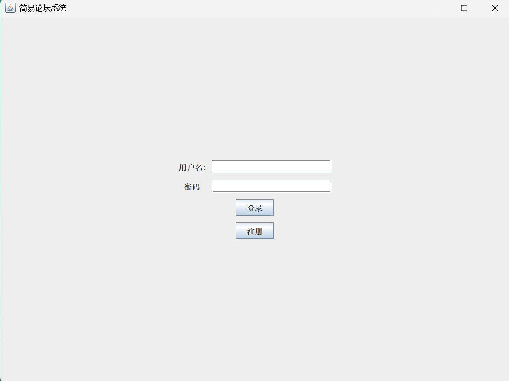
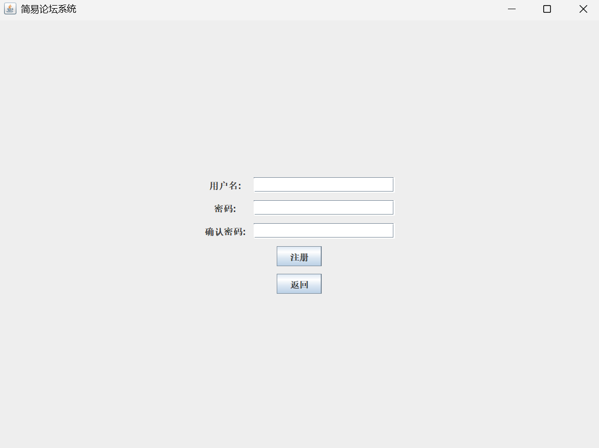
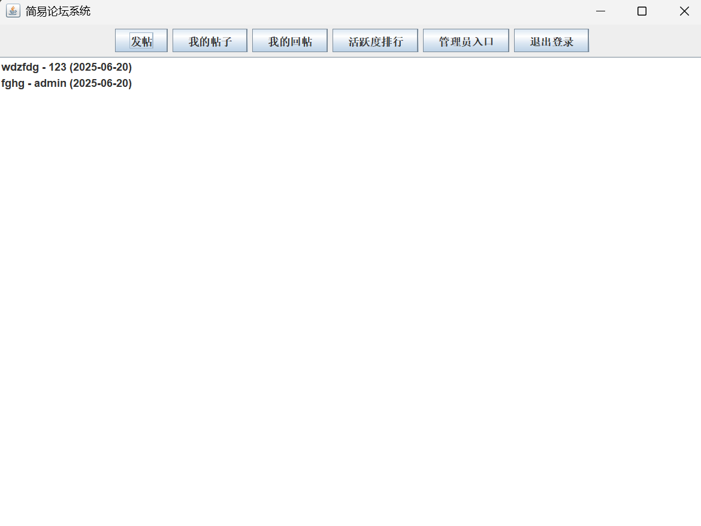
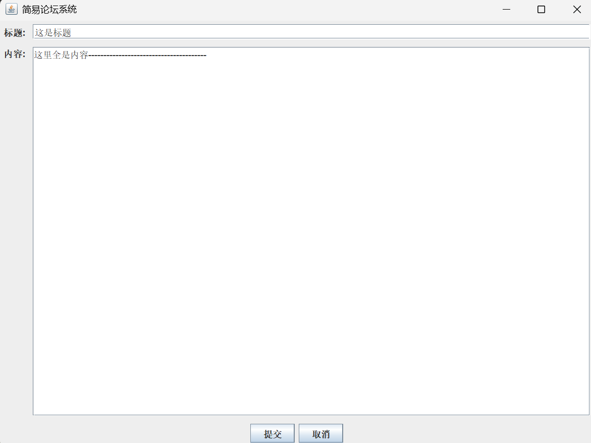
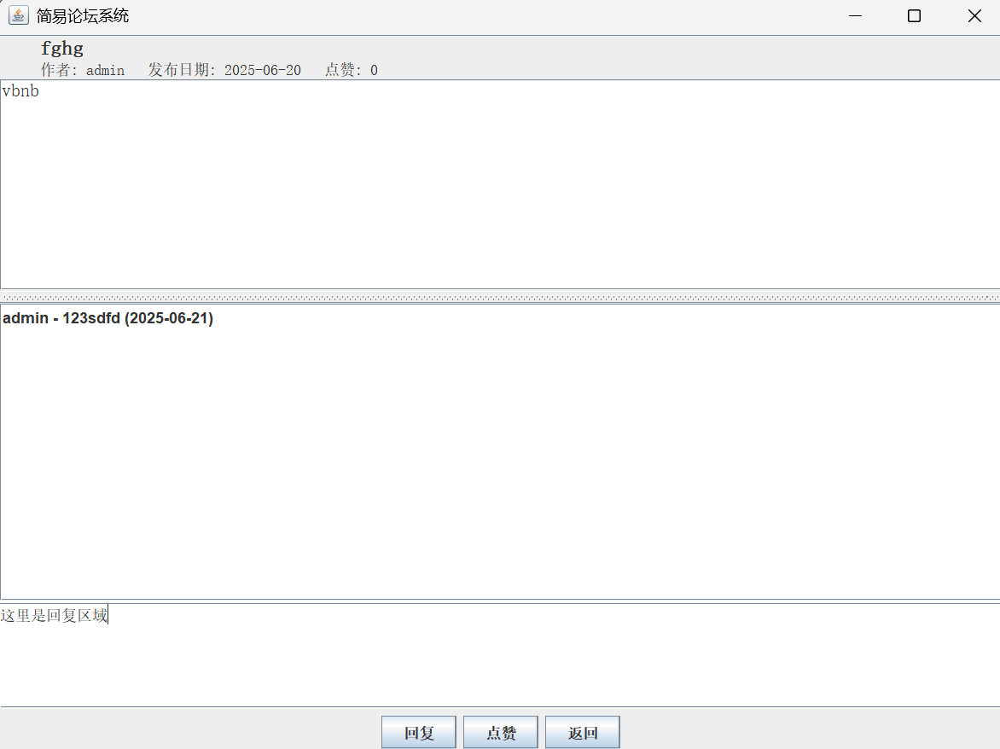
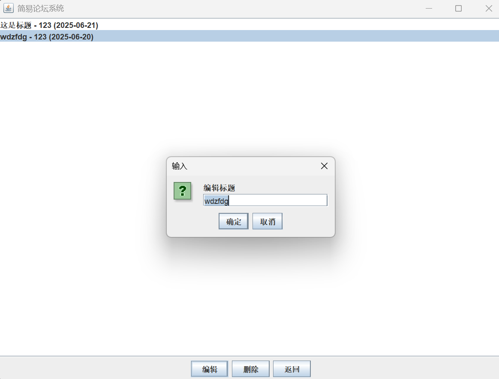
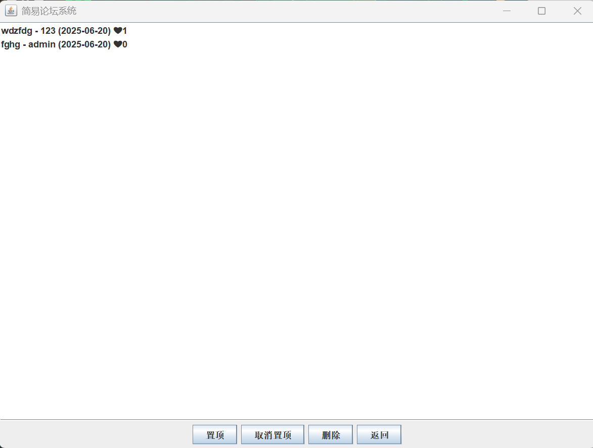
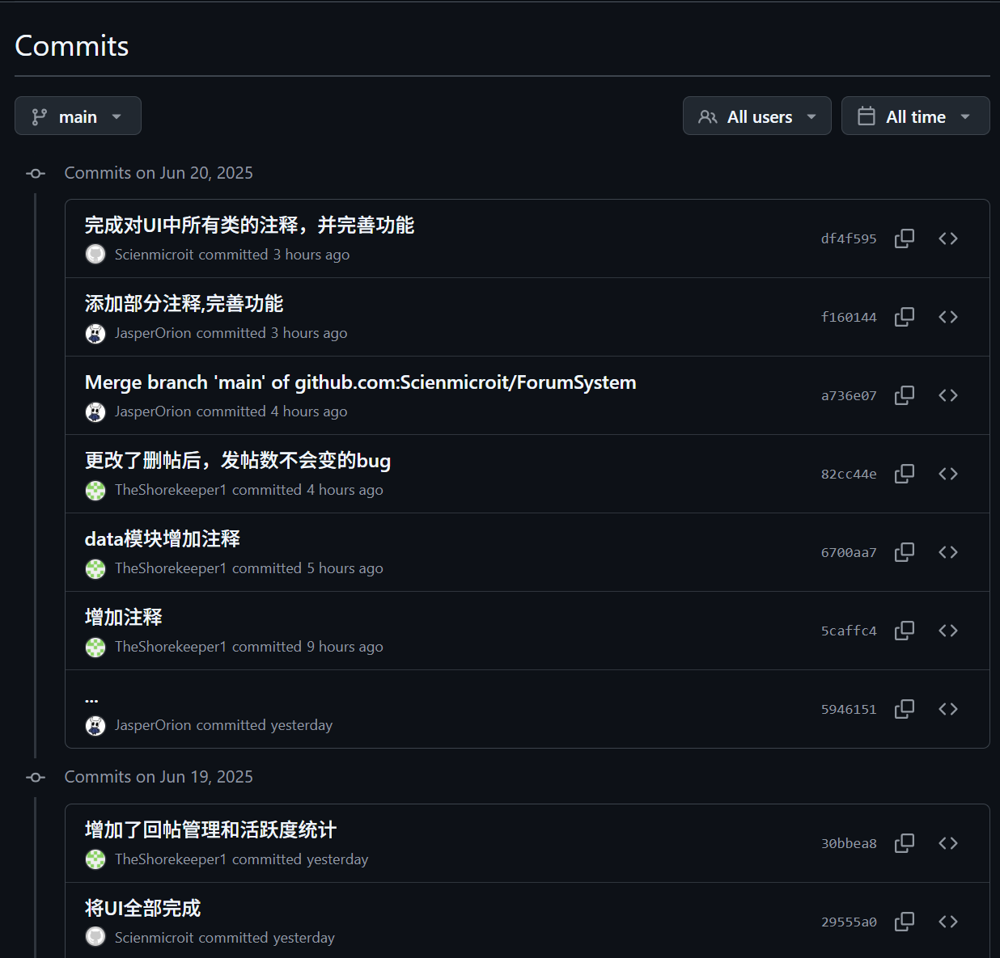
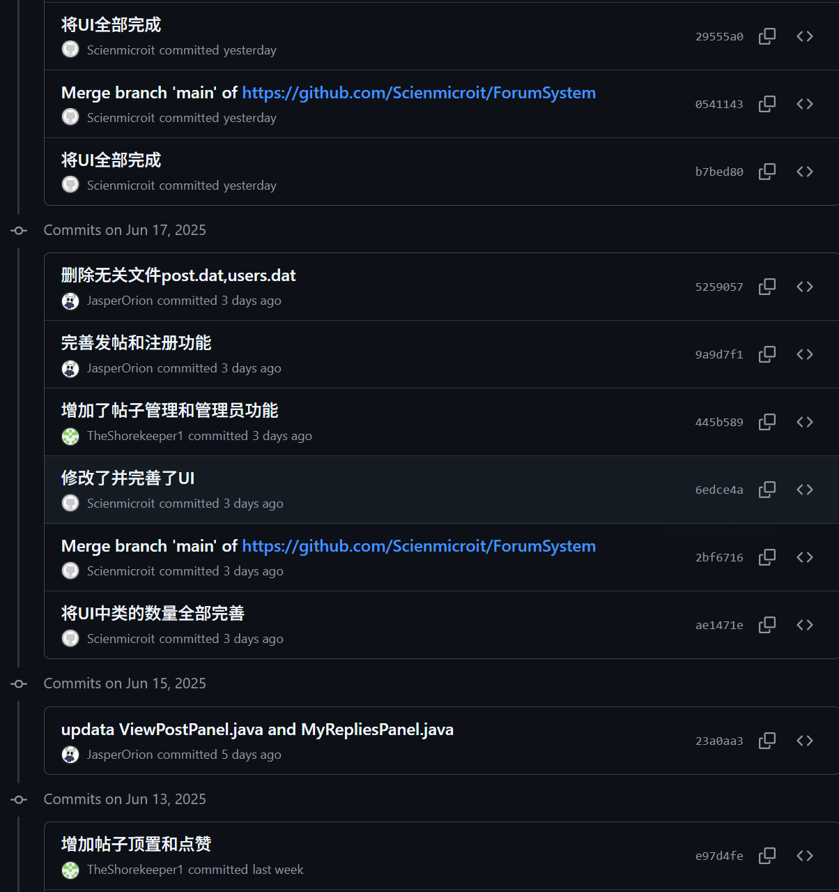

# 基于Java Swing的简易论坛系统

---

注:本项目由三人协作开发

---

## 一、项目简介

​	本项目是一个基于 Java 语言开发的桌面应用程序，借助 Swing 库实现了图形用户界(GUI)。该系统为用户提供了一个交流的平台，用户能够在上面进行**注册、登录、发帖、回帖、查看帖子**等操作，同时管理员还具备**管理帖子（置顶、取消置顶、删除**）等功能。系统使用文件(user.bat;post.bat)进行数据的持久化存储，确保数据在程序关闭后依然能够保存。

## 二、技术架构

### 2.1 核心技术栈

- **开发语言**：Java 17（支持新特性但保持向后兼容）
- **界面框架**：Java Swing（利用 JPane、JTable 等组件构建界面）
- **数据存储**：Java 对象序列化（通过 ObjectInputStream/ObjectOutputStream 实现文件持久化）
- **版本控制**：Git（采用分支开发模式，主分支保持稳定）

### 2.2架构设计

采用三层架构设计,确保代码的可维护性

`````
ForumSystem/
├── src/
│   ├── data/         // 数据层，实体类和数据管理
│   │   ├── User.java
│   │   ├── Post.java
│   │   ├── Reply.java
│   │   └── ForumDataManager.java
│   ├── main/         // 主程序入口,协调界面切换,实现用户操作相应
│   │   └── ForumSystem.java
│   └── ui/           // 界面层，所有 Swing 面板
│       ├── ForumPanel.java
│       ├── LoginPanel.java
│       ├── RegisterPanel.java
│       ├── ViewPostPanel.java
│       ├── MyRepliesPanel.java
│       ├── ActivityRankingPanel.java
│       ├── AdminPanel.java
│       ├── ViewPostPanel.java
│       └── NewPostPanel.java
├── README.md
└── .gitignore
`````

## 三、功能模块详解：从用户到管理员

### 3.1 功能需求分析

| 功能模块       | 具体描述                                        |
| -------------- | ---------------------------------------------------- |
| 用户注册与登录 | 用户可注册新账号，登录后进入论坛主界面，支持身份验证         |
| 帖子管理       | 用户可浏览所有帖子，点击查看帖子详情，支持发帖             |
| 回帖管理       | 用户可对任意帖子进行回帖，回帖内容与时间自动记录            |
| 我的回帖       | 用户可查看自己所有回帖，双击可跳转到对应帖子详情            |

### 3.2 典型功能流程

#### 3.2.1 发帖流程

1. 用户点击 "发帖" 按钮进入 NewPostPanel
2. 输入标题与内容后点击 "发布"
3. 系统自动记录作者与时间，更新 ForumDataManager 中的帖子列表
4. 刷新 ForumPanel 显示新帖子，并更新用户发帖数统计

#### 3.2.2 管理员置顶操作

1. 在 AdminPanel 中选中目标帖子
2. 点击 "置顶" 按钮触发事件
3. 系统修改 Post 的 isSticky 属性，调用 dataManager 更新数据
4. 同时刷新管理员界面与论坛主界面，确保置顶帖显示在列表顶部

## 四、项目亮点

1. **模块化设计**：项目采用模块化设计，将不同的功能模块分离到不同的类和包中，如 `data` 包负责数据的管理和持久化，`ui` 包负责界面的设计和交互，`main` 包负责主程序的启动和流程控制。这种设计使得代码结构清晰，易于维护和扩展。
2. **数据持久化**：使用文件进行数据的持久化存储，确保数据在程序关闭后依然能够保存。即使程序重新启动，用户和帖子数据也不会丢失。
3. **用户交互友好**：使用 Swing 库创建了直观的图形用户界面，用户可以方便地进行各种操作。同时，系统在操作过程中会给出相应的提示信息，如登录失败、注册成功等，提高了用户体验。
4. **权限管理**：系统区分了普通用户和管理员的权限，管理员拥有较高的权限，可以对帖子进行管理，确保论坛的正常运行。

## 五、系统演示操作视频或者主要功能截图

1. **登录/注册界面**





1. **论坛主界面**



1. **发帖界面**



1. **帖子详情与回帖界面**



1. **我的帖子界面**



1. **管理员界面**



## 六、团队成员负责模块

| 团队成员 | 负责模块                                                     |
| -------- | :----------------------------------------------------------- |
| 沈顺涛   | `data` 目录下的文件，包括 ForumDataManager.java、User.java、Post.java 等，主要负责数据的管理和持久化。 |
| 李斌     | `main` 目录下的文件和 `ui` 包的前四个文件，包括 ForumSystem.java、LoginPanel.java 等，主要负责主程序的启动和部分界面的设计与交互。 |
| 孙睿剀   | ViewPostPanel.java、MyPostsPanel.java、MyRepliesPanel.java、ActivityRankingPanel.java、AdminPanel.java 等，主要负责剩余界面的设计与交互。 |

## 部分核心代码演示

1. **数据管理器**

`````java
private static final String USERS_FILE = "users.dat";
    private static final String POSTS_FILE = "posts.dat";
    private List<User> users;
    private List<Post> posts;

    public ForumDataManager() {
        loadUsers();
        loadPosts();

    }
private void loadUsers() {
        // 创建用户信息文件对象
        File file = new File(USERS_FILE);
        // 检查文件是否存在
        if (file.exists()) {
            try (ObjectInputStream ois = new ObjectInputStream(new FileInputStream(file))) {
                users = (List<User>) ois.readObject();
            } catch (IOException | ClassNotFoundException e) {
                // 如果读取过程中发生IO错误或类找不到异常，则创建新的用户列表
                users = new ArrayList<>();
                e.printStackTrace();
            }
        } else {
            users = new ArrayList<>();
            // 添加默认管理员
            addUser(new User("admin", "admin123", true));
        }
    }
private void loadPosts() {
        File file = new File(POSTS_FILE);
        if (file.exists()) {
            try (ObjectInputStream ois = new ObjectInputStream(new FileInputStream(file))) {
                posts = (List<Post>) ois.readObject();
            } catch (IOException | ClassNotFoundException e) {
                posts = new ArrayList<>();
                e.printStackTrace();
            }
        } else {
            posts = new ArrayList<>();
        }
    }
`````

2. **支持双击进入帖子详情**


`````java
postList.addMouseListener(new MouseAdapter() {
            @Override
            public void mouseClicked(MouseEvent e) {
                if (e.getClickCount() == 2) {
                    Post selectedPost = postList.getSelectedValue();
                    if (selectedPost != null) {
                        mainFrame.getViewPostPanel().setPost(selectedPost);
                        mainFrame.showViewPostPanel();
                    }
                }
            }
        });
`````


3. **登录功能核心代码片段**

`````java
loginButton.addActionListener(e -> {
    String username = usernameField.getText();
    String password = new String(passwordField.getPassword());
    if (dataManager.validateUser(username, password)) {
        mainFrame.setCurrentUser(dataManager.getUser(username));
        mainFrame.showForumPanel();
    } else {
        JOptionPane.showMessageDialog(this, "用户名或密码错误！");
    }
});
`````
4. **注册功能核心代码片段**

`````java
private void register() {
        String username = usernameField.getText();
        String password = new String(passwordField.getPassword());
        String confirmPassword = new String(confirmPasswordField.getPassword());

        if (username.isEmpty() || password.isEmpty()) {
            JOptionPane.showMessageDialog(this, "用户名和密码不能为空！", "注册失败", JOptionPane.ERROR_MESSAGE);
            return;
        }

        if (!password.equals(confirmPassword)) {
            JOptionPane.showMessageDialog(this, "两次输入的密码不一致！", "注册失败", JOptionPane.ERROR_MESSAGE);
            return;
        }

        if (dataManager.getUser(username) != null) {
            JOptionPane.showMessageDialog(this, "用户名已存在！", "注册失败", JOptionPane.ERROR_MESSAGE);
            return;
        }

        dataManager.addUser(new User(username, password, false));
        JOptionPane.showMessageDialog(this, "注册成功！请登录");
        mainFrame.showLoginPanel();
    }
`````


5. **我的回帖功能核心代码**

`````java
loginButton.addActionListener(e -> {
    String username = usernameField.getText();
    String password = new String(passwordField.getPassword());
    if (dataManager.validateUser(username, password)) {
        mainFrame.setCurrentUser(dataManager.getUser(username));
        mainFrame.showForumPanel();
    } else {
        JOptionPane.showMessageDialog(this, "用户名或密码错误！");
    }
});
`````

6. **活跃度排行功能核心代码**

`````java
/**
    * 获取用户活跃度排名
    * 
    * 本方法通过计算用户发帖和回帖数量之和来衡量用户的活跃度，并返回按照活跃度降序排列的用户排名
    * 使用了HashMap来存储用户及其活跃度，然后通过Stream API进行排序和重新收集，以确保最终结果是按照活跃度降序排列的
    * 
    * 返回一个映射，键是用户名，值是用户的活跃度（发帖数加回帖数），按照活跃度降序排列
    */
    public Map<String, Integer> getActivityRanking() {
        // 初始化一个HashMap来存储用户及其活跃度
        Map<String, Integer> ranking = new HashMap<>();
        // 遍历用户列表，计算每个用户的活跃度，并存入Map中
        for (User user : users) {
            int activity = user.getPostCount() + user.getReplyCount();
            ranking.put(user.getUsername(), activity);
        }
        // 使用Stream API对Map中的用户活跃度进行降序排序，并收集到一个新的LinkedHashMap中，以保持顺序
        return ranking.entrySet().stream()
                .sorted(Map.Entry.<String, Integer>comparingByValue().reversed())
                .collect(Collectors.toMap(
                        Map.Entry::getKey,
                        Map.Entry::getValue,
                        (e1, e2) -> e1,
                        LinkedHashMap::new));
    }
`````


## 七、项目 git 地址

项目的 Git 仓库地址为：https://github.com/Scienmicroit/ForumSystem


## 八、部署与运行指南

### 8.1 环境要求

- JDK 11+（推荐 JDK 17，项目开发环境）
- IDE：IntelliJ IDEA 或 Eclipse
- 操作系统：Windows/macOS/Linux（Swing 跨平台支持）

### 8.2 运行步骤

1. 克隆项目：`git clone https://github.com/Scienmicroit/ForumSystem.git`
2. 导入 IDE，配置 JDK 环境
3. 运行主类：`src.main.ForumSystem`
4. 初始账号：`admin` / `admin123`（管理员权限）

### 8.3 常见问题

1. **启动报错**：确认 JDK 版本匹配，检查`src`目录结构是否正确
2. **数据丢失**：确保项目根目录有读写权限，程序会自动生成`users.dat`和`posts.dat`
3. **界面卡顿**：若帖子数量过多，可修改`ForumDataManager`的加载逻辑，实现分批加载

## 九、总结与改进

### 收获与不足

#### 收获

- **Swing高级应用**：掌握了CardLayout布局管理、JTable数据绑定等高级GUI技术

- **文件I/O操作**：实践了对象序列化和反序列化技术

- **OOP设计原则**：深入理解了单一职责、开闭原则等面向对象设计理念

- **团队协作开发**：熟练使用Git进行版本控制和团队协作

#### 不足

- 未使用数据库存储文件,数据量大时使用操作受限
- 未使用网络功能,用户只能在本地进行发帖回帖
- 登录注册安全机制简单,没有对密码进行加密

#### 优化方向

-  数据库存储升级,网络功能实现,安全机制强化 
-  及时通知功能:新回复桌面通知,点赞实时更新
-  高级搜素功能:帖子标题/内容关键词搜索,作者帖子检索

## 十、团队成员 git 提交记录截图




